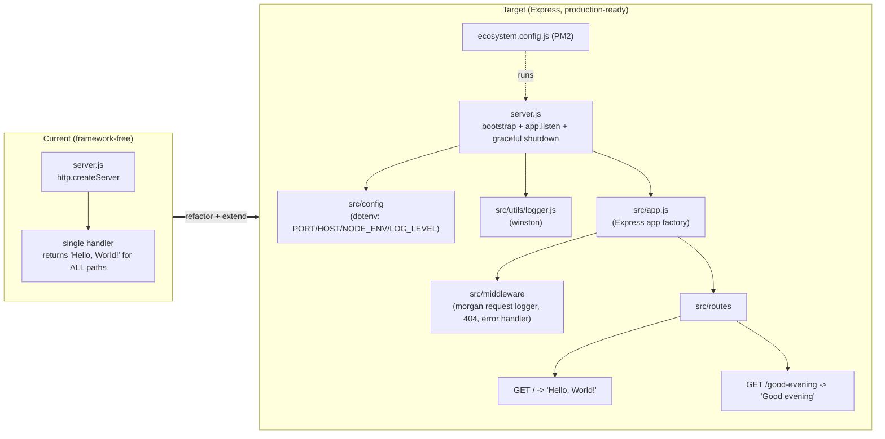
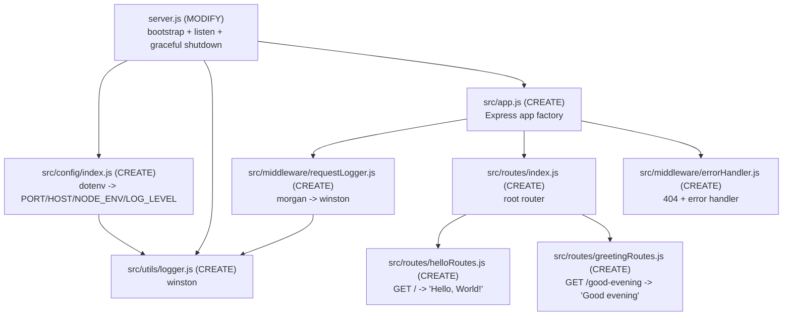

# Technical Specification

# 0. Agent Action Plan

## 0.1 Intent Clarification

This Agent Action Plan serves as the definitive interpretation layer between the user's request and the technical implementation that the Blitzy platform will execute against the existing repository. It captures the literal feature request, the production-readiness mandate imposed by the project rule, and the precise file-level changes required to satisfy both without regression.

### 0.1.1 Core Feature Objective

Based on the prompt, the Blitzy platform understands that the new feature requirement is to **introduce the Express.js framework into the existing single-endpoint Node.js HTTP server and add a second endpoint that returns the text "Good evening", while preserving the original "Hello world" response**.

The user's request is preserved exactly as provided:

- **User Prompt (verbatim):** "this is a tutorial of node js server hosting one endpoint that returns the response 'Hello world'. Could you add expressjs into the project and add another endpoint that return the response of 'Good evening'?"

The existing repository currently implements this server with the Node.js built-in `http` module only, with no framework, no routing, and no dependencies. The single inline request handler returns the literal body `Hello, World!\n` (HTTP 200, `text/plain`) for **every** path and method, confirming there is no routing layer today [server.js:L6-L10]. The manifest declares zero dependencies [package.json:L1-L11], and the lockfile records only the root package with no dependency tree [package-lock.json:L4-L11].

The project rule **QA-20-may-custom-rules** materially expands this objective from a minimal tutorial change into a full production-ready enhancement. Per the Blitzy rule-driven scope policy, every artifact mandated by this rule is treated as in-scope:

- **Project Rule (verbatim):** "Enhance this basic HTTP server with Express.js framework, add routing, middleware, environment config, logging, and prepare for production deployment with PM2."

Combining the prompt and the rule, the Blitzy platform interprets the complete set of feature requirements as follows:

| ID | Feature Requirement (enhanced clarity) | Source | Evidence |
|----|----------------------------------------|--------|----------|
| FR-1 | Add Express.js as a runtime dependency to the project | Prompt + Rule | No dependencies declared today [package.json:L1-L11] |
| FR-2 | Preserve the existing root endpoint: `GET /` returns `Hello, World!\n` (HTTP 200, `text/plain`), byte-for-byte | Prompt | [server.js:L6-L10] |
| FR-3 | Add a new endpoint that returns the response `Good evening` | Prompt | New |
| FR-4 | Introduce modular **routing** via dedicated router modules | Rule | New |
| FR-5 | Introduce a **middleware** layer (request logging, 404, centralized error handling) | Rule | New |
| FR-6 | Introduce **environment configuration** (`dotenv` + central config) | Rule | New |
| FR-7 | Introduce structured **logging** (application logger + HTTP access logging) | Rule | New |
| FR-8 | Prepare for **production deployment with PM2** (ecosystem config + scripts) | Rule | New |

**Implicit requirements and prerequisites surfaced by the Blitzy platform:**

- Installing Express necessarily mutates `package.json` (adding a `dependencies` block) and regenerates `package-lock.json`, which today carries `lockfileVersion` 3 with the root package only [package-lock.json:L4-L11].
- The raw `http.createServer` flow [server.js:L1-L14] must be refactored into an Express application; the application object should be exported separately from the listening bootstrap so it can be exercised by automated tests.
- The manifest `main` field currently points to a non-existent `index.js` while the actual runtime file is `server.js` [package.json:L5]; this documented entry-point inconsistency (§1.4.2) is corrected as part of the change.
- The `scripts.test` entry is the default placeholder that exits with code 1 [package.json:L6-L8]; "prepare for production deployment" implies a non-broken `npm test`, so this placeholder (documented in §1.4.3) is replaced.
- A `.gitignore` does not exist; introducing `node_modules/`, a `.env` file, and log output makes version-control hygiene a prerequisite.
- Express 5 requires Node.js 18 or newer; the verified runtime is Node.js v22.22.2, which satisfies this constraint.

### 0.1.2 Special Instructions and Constraints

The following directives and constraints govern the implementation and must be honored exactly:

- **Preserve existing behavior (backward compatibility):** The original endpoint must continue to return the exact byte string `Hello, World!\n` with HTTP 200 and `Content-Type: text/plain` [server.js:L6-L10]. The new feature integrates with — and never replaces — the original response. *Note on wording:* the user describes the existing response as "Hello world", but the actual server body is `Hello, World!\n`; the verified existing behavior is authoritative and is preserved verbatim.
- **Add the new endpoint with the exact response text:** The new route returns exactly `Good evening` (User Example: 'Good evening').
- **Follow conventional, modular Express structure (rule-mandated):** Routing, middleware, environment configuration, and logging are implemented as separate, clearly delineated concerns rather than inline within a single file, satisfying the rule's explicit enumeration of "routing, middleware, environment config, logging."
- **Production deployment via PM2 (rule-mandated):** A PM2 ecosystem configuration and corresponding npm scripts are provided so the application can be launched and managed as a production process.
- **Respect existing language and module conventions:** The codebase uses CommonJS (`require`/`module.exports`) with 2-space indentation in JavaScript and 4-space indentation in JSON [server.js:L1][package.json:L1-L11]; new files follow the same conventions. No migration to TypeScript or ES modules is introduced.
- **Repository identity note:** `README.md` contains the warning "test project for backprop integration. Do not touch!" [README.md:L2]. The user's prompt and project rule constitute explicit, direct authorization to enhance this repository, which takes precedence; the enhancement therefore proceeds, and `README.md` is updated to document the new capability.
- **Web search requirements:** Research into current Express 5 project-structure conventions and PM2 ecosystem configuration was attempted; the network search tool returned no results in this environment, so dependency versions were instead confirmed directly against the npm registry (authoritative) and implementation patterns were grounded in the stable, well-established conventions of these mature libraries (see §0.2.2).

### 0.1.3 Technical Interpretation

These feature requirements translate to the following technical implementation strategy. The central transformation converts the framework-free server into a layered Express application while holding the externally observable contract of the root endpoint constant.

- To **add Express (FR-1)**, we will add `express` to `package.json` `dependencies` and regenerate `package-lock.json` via `npm install`.
- To **preserve the root endpoint (FR-2)**, we will create a router handler for `GET /` that emits `Hello, World!\n` with `text/plain` at HTTP 200, reproducing the current behavior [server.js:L6-L10].
- To **add the "Good evening" endpoint (FR-3)**, we will create a router handler for `GET /good-evening` that returns `Good evening`.
- To **introduce routing (FR-4)**, we will create `express.Router()` modules under `src/routes/` and mount them through a root router into the Express application.
- To **introduce middleware (FR-5)**, we will create request-logging middleware and a centralized 404/error-handling pair, registered in the application factory.
- To **introduce environment configuration (FR-6)**, we will create a `src/config/` module that loads `.env` via `dotenv` and exposes defaulted values (`PORT`, `HOST`, `NODE_ENV`, `LOG_LEVEL`), plus a committed `.env.example`.
- To **introduce logging (FR-7)**, we will create a `winston` application logger and stream `morgan` HTTP access logs through it.
- To **prepare PM2 deployment (FR-8)**, we will create `ecosystem.config.js` and add `start`, `dev`, `test`, and `pm2:*` scripts to `package.json`, while correcting `main` to `server.js`.

The following diagram contrasts the current and target architectures:




## 0.2 Repository Scope Discovery

An exhaustive recursive inspection of the repository (excluding `.git` and `node_modules`, including hidden files) confirms the project consists of exactly **four files and zero subdirectories**: `README.md`, `package.json`, `package-lock.json`, and `server.js`. There are no hidden source files, no existing `src/` tree, no tests, no configuration, and no middleware. This greenfield, framework-free baseline is corroborated by the technical specification, which records the project as a target fixture with a single capability and zero third-party dependencies (§1.2.2, §3.3.1).

### 0.2.1 Comprehensive File Analysis

The complete current-state inventory and the change disposition for each existing artifact are as follows:

| Existing File | Current State | Evidence | Disposition |
|---------------|---------------|----------|-------------|
| `server.js` | Raw `http.createServer`; binds `127.0.0.1:3000`; single handler returns `Hello, World!\n` (HTTP 200, `text/plain`) for all requests; logs startup | [server.js:L1-L14] | **MODIFY** — convert to Express bootstrap |
| `package.json` | name `hello_world`, version `1.0.0`, `main` = `index.js`, placeholder `test` script, no dependencies | [package.json:L1-L11] | **MODIFY** — add deps + scripts, fix `main` |
| `package-lock.json` | `lockfileVersion` 3, root package only, no dependency tree | [package-lock.json:L4-L11] | **MODIFY** — regenerate via `npm install` |
| `README.md` | Two-line doc: `# hao-backprop-test` and "Do not touch!" warning | [README.md:L1-L2] | **MODIFY** — document endpoints, config, deploy |

**Integration point discovery.** Because the baseline is framework-free, the integration surface is small and well-defined. The following touchpoints connect the new feature to existing code:

- **API endpoints connecting to the feature:** The single inline handler that answers every path [server.js:L6-L10] becomes the router-mounted `GET /` handler; the new `GET /good-evening` route is added alongside it.
- **Process entry / bootstrap:** `server.js` is the sole runtime file and the central integration seam; its `http.createServer` flow is replaced by an Express application plus `app.listen` [server.js:L1-L14].
- **Listen contract:** `server.listen(port, hostname, callback)` [server.js:L12-L14] is preserved as `app.listen(PORT, HOST, callback)`, with `127.0.0.1` and `3000` becoming environment-configurable defaults [§1.2.2].
- **Database models / migrations:** None — the system has no database, persistence, or migrations, and none are introduced.
- **Service classes / controllers / handlers:** None exist today; new route handlers and middleware are introduced as the first such components.
- **Middleware / interceptors:** None exist today; request logging and error handling are introduced as the first middleware.
- **Manifest wiring:** `package.json` requires new `dependencies`, new `scripts`, and a corrected `main` field [package.json:L5-L8]; `npm install` then regenerates `package-lock.json` [package-lock.json:L4-L11].

### 0.2.2 Web Search Research Conducted

Research was directed at confirming current dependency versions and validating the target structure. The web search tool returned no results in this environment, so version facts were established directly against the **npm registry** (authoritative) and a local feasibility install, while implementation patterns were grounded in the stable conventions of these mature libraries. The findings applied to this plan are:

- **Best practices for implementing an Express application:** Separate the Express application factory (a `src/app.js` that builds and exports the configured `app`) from a thin bootstrap entry (`server.js` that calls `app.listen`). Group endpoints into `express.Router()` modules and register cross-cutting concerns — body parsing, request logging, a 404 handler, and a centralized error handler with the `(err, req, res, next)` signature — as middleware. Express 5 requires Node.js 18+, satisfied by the verified Node.js v22.22.2 runtime.
- **Library recommendations for logging:** Use `morgan` for HTTP access logging piped into a `winston` application logger configured with a level sourced from the environment (the common `stream.write` bridge pattern).
- **Common patterns for environment configuration:** Load `.env` with `dotenv` at process start, before other modules read `process.env`, and centralize defaulted values (`PORT`, `HOST`, `NODE_ENV`, `LOG_LEVEL`) in a single config module.
- **Patterns for PM2 production deployment:** Define `ecosystem.config.js` with an `apps[]` entry (`name`, `script: 'server.js'`, `instances`, `exec_mode`, `env`, and `env_production`), launched via `pm2 start ecosystem.config.js --env production`; PM2 manages restarts and log aggregation.
- **Security considerations:** Optional production hardening via `helmet` (secure HTTP headers) and `compression` (gzip) is recommended but not mandated by the rule; these are documented as optional and excluded from the mandatory deliverables (see §0.6.2).

A local feasibility install verified that `express`, `dotenv`, `morgan`, `winston`, and `pm2` install cleanly and that a minimal two-endpoint Express application correctly serves `Hello, World!\n` at `/` and `Good evening` at `/good-evening`.

### 0.2.3 New File Requirements

The following new files will be created. Each has a single, clear purpose mapped to a feature requirement.

- **Core application and routing (FR-1 through FR-4):**
  - `src/app.js` — Express application factory; registers middleware, mounts routers, attaches 404/error handlers, and exports the `app`.
  - `src/routes/index.js` — aggregates route modules onto a root router mounted by the application.
  - `src/routes/helloRoutes.js` — defines `GET /` returning `Hello, World!\n` (preserves existing behavior [server.js:L6-L10]).
  - `src/routes/greetingRoutes.js` — defines `GET /good-evening` returning `Good evening` (new endpoint).
- **Middleware (FR-5):**
  - `src/middleware/requestLogger.js` — `morgan` instance streaming HTTP access logs into the `winston` logger.
  - `src/middleware/errorHandler.js` — exports a 404 `notFound` handler and a centralized `errorHandler(err, req, res, next)`.
- **Configuration (FR-6):**
  - `src/config/index.js` — loads `.env` via `dotenv` and exposes `PORT`, `HOST`, `NODE_ENV`, `LOG_LEVEL` with defaults.
  - `.env.example` — committed template documenting the supported environment variables.
- **Logging (FR-7):**
  - `src/utils/logger.js` — `winston` logger instance whose level derives from configuration.
- **Production deployment (FR-8):**
  - `ecosystem.config.js` — PM2 process definition (`name`, `script: server.js`, `env`, `env_production`).
- **Version-control hygiene and tests:**
  - `.gitignore` — ignores `node_modules/`, `.env`, and log output.
  - `tests/endpoints.test.js` — `supertest` smoke tests (via the Node.js built-in `node:test` runner) asserting both endpoints and a 404; also remediates the broken placeholder test script (§1.4.3).


## 0.3 Dependency Inventory

This feature introduces the project's first third-party dependencies. The repository currently declares **none** [package.json:L1-L11], and the lockfile records only the root package [package-lock.json:L4-L11]; therefore every package listed below is a net-new addition. All versions were verified directly against the npm registry — no placeholder versions are used.

### 0.3.1 Package Registry

| Package | Registry | Version | Type | Purpose |
|---------|----------|---------|------|---------|
| `express` | npm | `^5.2.1` | dependency | Web framework providing routing and the middleware pipeline (FR-1/FR-4) |
| `dotenv` | npm | `^17.4.2` | dependency | Loads `.env` into `process.env` for environment configuration (FR-6) |
| `morgan` | npm | `^1.10.1` | dependency | HTTP request access-logging middleware (FR-7) |
| `winston` | npm | `^3.19.0` | dependency | Structured application logger with configurable level (FR-7) |
| `supertest` | npm | `^7.2.2` | devDependency | HTTP assertions for endpoint smoke tests |
| `nodemon` | npm | `^3.1.14` | devDependency | Development auto-reload for the `dev` script |
| `pm2` | npm | `^7.0.1` | tooling / process manager | Production process management via `ecosystem.config.js` (FR-8) |

Notes on version selection:

- `express ^5.2.1` is the current stable major. A conservative alternative is `express ^4.22.2` (the latest 4.x); the implementation targets 5.x, which requires Node.js 18+ and is satisfied by the verified Node.js v22.22.2 runtime.
- `pm2` is the requested production process manager. It is referenced by the `pm2:*` npm scripts and `ecosystem.config.js`; teams typically install it globally on the host, and it may additionally be recorded as a `devDependency` for reproducible local invocation.
- **Optional, recommended-only (not mandated by the rule, excluded from mandatory scope):** `helmet ^8.2.0` (secure HTTP headers) and `compression ^1.8.1` (gzip responses). These are documented for completeness and discussed in §0.6.2.

### 0.3.2 Dependency and Import Updates

**Import updates.** The existing codebase has no internal module graph to rewrite — `server.js` imports only the Node.js built-in `http` module [server.js:L1] — so there are **no wildcard import migrations** across pre-existing files. The new files introduce the following import relationships:

| File | New Imports | Rationale |
|------|-------------|-----------|
| `server.js` (MODIFY) | `require('./src/config')`, `require('./src/utils/logger')`, `require('./src/app')` | Replaces `require('http')`; bootstraps config, logger, and the Express app |
| `src/app.js` | `require('express')`, request-logger and error-handler middleware, `require('./routes')` | Builds the application and pipeline |
| `src/config/index.js` | `require('dotenv')` | Loads environment variables |
| `src/utils/logger.js` | `require('winston')` | Constructs the application logger |
| `src/middleware/requestLogger.js` | `require('morgan')`, the `winston` logger | Bridges HTTP access logs into the application logger |

An illustrative bootstrap transformation (existing `http` import to Express composition):

```js
// Before: const http = require('http');           // [server.js:L1]
// After:  const app = require('./src/app');        // Express app factory
//         app.listen(config.PORT, config.HOST, cb);
```

**External reference updates.** Beyond source imports, the following non-source files are updated or created to reflect the new dependency surface:

- Manifests: `package.json` (add `dependencies`, `devDependencies`, `scripts`; fix `main`) and `package-lock.json` (regenerated by `npm install`).
- Configuration: `.env.example` (new), `ecosystem.config.js` (new).
- Version-control: `.gitignore` (new).
- Documentation: `README.md` (endpoints, environment variables, run/deploy instructions).


## 0.4 Integration Analysis

Because the baseline is a single self-contained file with no framework, database, dependency-injection container, or pre-existing middleware (§3.3.1), integration is confined to the four existing files plus the new `src/` tree. There are no cross-module ripple effects beyond the entry point and the manifest.

### 0.4.1 Existing Code Touchpoints

**Direct modifications required:**

- `server.js` [L1-L14] — Replace the raw `http.createServer` request listener and direct `http` import [server.js:L1] with a bootstrap that loads configuration, initializes the logger, imports the Express `app` from `src/app.js`, and calls `app.listen(PORT, HOST, callback)` (preserving the existing `listen(port, hostname, callback)` contract [server.js:L12-L14]). Add `SIGINT`/`SIGTERM` graceful-shutdown handling.
- `package.json` [L1-L11] — Add the `dependencies` and `devDependencies` blocks; add `start`, `dev`, `test`, and `pm2:*` scripts; correct `main` from `index.js` to `server.js` [package.json:L5] (resolving §1.4.2); and replace the placeholder `test` script that currently exits with code 1 [package.json:L6-L8] (resolving §1.4.3).
- `package-lock.json` [L4-L11] — Regenerated by `npm install` to capture the full resolved dependency tree.
- `README.md` [L1-L2] — Updated to document the two endpoints, the environment variables, and the run/test/PM2 deployment workflow.

**Route registration (new wiring):**

- `src/app.js` mounts the root router from `src/routes/index.js`, which in turn mounts `helloRoutes.js` (`GET /`) and `greetingRoutes.js` (`GET /good-evening`). This replaces the single inline handler that previously answered all paths [server.js:L6-L10].

**Middleware registration (new wiring):**

- `src/app.js` registers, in order: body parsing (`express.json()`), the `morgan`-based request logger (`src/middleware/requestLogger.js`), the mounted routers, then the `notFound` (404) and centralized `errorHandler` from `src/middleware/errorHandler.js`.

**Configuration and logging wiring (new):**

- `src/config/index.js` invokes `dotenv` and exposes `PORT`/`HOST`/`NODE_ENV`/`LOG_LEVEL`; `src/utils/logger.js` constructs the `winston` logger using `LOG_LEVEL`. Both are consumed by `server.js` at bootstrap and by the middleware layer.

**Items deliberately not present (no integration needed):**

- Database, migrations, schema, ORM — none exist and none are introduced.
- Dependency-injection container or service registry — none exists; the small module graph is wired by direct `require`.
- API gateway, reverse proxy, or external service integrations — none exist; PM2 is the only process-management addition.

The integration map below summarizes the wiring of the new module graph around the existing entry point:




## 0.5 Technical Implementation

This subsection enumerates every file that will be created or modified, the mode of change, and the concrete implementation approach for each. Every file listed here must be created or modified.

### 0.5.1 File-by-File Execution Plan

**Group 1 — Core Feature (Express application and routes):**

| Mode | File | Action |
|------|------|--------|
| CREATE | `src/app.js` | Express application factory; registers middleware, mounts routers, attaches 404/error handlers; exports `app` |
| CREATE | `src/routes/index.js` | Root `express.Router()`; mounts `helloRoutes` and `greetingRoutes` |
| CREATE | `src/routes/helloRoutes.js` | `GET /` -> `Hello, World!\n` (preserves [server.js:L6-L10]) |
| CREATE | `src/routes/greetingRoutes.js` | `GET /good-evening` -> `Good evening` (new endpoint) |
| MODIFY | `server.js` | Replace raw `http` server with config/logger/app bootstrap + `app.listen` + graceful shutdown [server.js:L1-L14] |

**Group 2 — Supporting Infrastructure (config, logging, middleware):**

| Mode | File | Action |
|------|------|--------|
| CREATE | `src/config/index.js` | `dotenv`-backed config exposing `PORT`/`HOST`/`NODE_ENV`/`LOG_LEVEL` with defaults |
| CREATE | `src/utils/logger.js` | `winston` logger; level from `config.LOG_LEVEL` |
| CREATE | `src/middleware/requestLogger.js` | `morgan` instance streaming to the `winston` logger |
| CREATE | `src/middleware/errorHandler.js` | `notFound` (404) handler + centralized `errorHandler(err, req, res, next)` |

**Group 3 — Deployment and Configuration:**

| Mode | File | Action |
|------|------|--------|
| CREATE | `ecosystem.config.js` | PM2 process config (`name`, `script: server.js`, `env`, `env_production`) |
| CREATE | `.env.example` | Documents `PORT`, `HOST`, `NODE_ENV`, `LOG_LEVEL` |
| CREATE | `.gitignore` | Ignores `node_modules/`, `.env`, `logs/`, `*.log` |
| MODIFY | `package.json` | Add deps/devDeps, add `start`/`dev`/`test`/`pm2:*` scripts, fix `main` [package.json:L5-L8] |
| MODIFY | `package-lock.json` | Regenerated by `npm install` [package-lock.json:L4-L11] |

**Group 4 — Tests and Documentation:**

| Mode | File | Action |
|------|------|--------|
| CREATE | `tests/endpoints.test.js` | `supertest` + `node:test` smoke tests for `/`, `/good-evening`, and 404 |
| MODIFY | `README.md` | Document endpoints, env vars, scripts, and PM2 deployment [README.md:L1-L2] |

**Reference inputs (read-only, not modified):** the original `server.js` behavior contract [server.js:L1-L14], the baseline manifests [package.json:L1-L11][package-lock.json:L4-L11], and technical-specification context (§1.2, §1.4, §3.3). No external Figma or style-guide references apply.

### 0.5.2 Implementation Approach per File

The implementation proceeds by establishing the application foundation, integrating it at the existing entry point, then layering deployment, tests, and documentation:

- `src/app.js` — Instantiate Express, register `express.json()`, the request logger, the mounted root router, then the `notFound` and `errorHandler` middleware last; export the configured `app` without calling `listen` so it is independently testable.
- `src/routes/helloRoutes.js` — Define `GET /` that sends `Hello, World!\n` at HTTP 200 with `Content-Type: text/plain`, reproducing the existing response byte-for-byte [server.js:L6-L10].
- `src/routes/greetingRoutes.js` — Define `GET /good-evening` that sends `Good evening` at HTTP 200.
- `src/routes/index.js` — Create a root router, attach the two route modules, and export it for mounting in `src/app.js`.
- `server.js` — Load `src/config` (which triggers `dotenv`), initialize `src/utils/logger`, import the Express `app`, and call `app.listen(config.PORT, config.HOST, …)` logging startup via `winston`; register `SIGINT`/`SIGTERM` handlers for graceful shutdown. A representative shape:

```js
const app = require('./src/app');
const server = app.listen(config.PORT, config.HOST, () => logger.info('listening'));
process.on('SIGTERM', () => server.close());
```

- `src/config/index.js` — Call `require('dotenv').config()` and export defaulted values (`PORT` -> 3000, `HOST` -> `127.0.0.1`, `NODE_ENV` -> `development`, `LOG_LEVEL` -> `info`), preserving the current bind defaults [§1.2.2] while making them overridable.
- `src/utils/logger.js` — Construct a `winston` logger using `config.LOG_LEVEL`, with console transport and JSON/structured formatting suitable for PM2 log capture.
- `src/middleware/requestLogger.js` — Export a `morgan` middleware whose `stream.write` forwards each formatted line into the `winston` logger.
- `src/middleware/errorHandler.js` — Export `notFound` (responds 404 for unmatched routes) and `errorHandler` (logs via `winston`, responds 500); Express 5 forwards rejected promises to the error handler automatically.
- `ecosystem.config.js` — Define `apps: [{ name: 'hello-world', script: 'server.js', instances: 1, exec_mode: 'fork', env: {...}, env_production: {...} }]` for `pm2 start ecosystem.config.js --env production`.
- `.env.example` — List `PORT=3000`, `HOST=127.0.0.1`, `NODE_ENV=development`, `LOG_LEVEL=info`.
- `.gitignore` — Ignore `node_modules/`, `.env`, `logs/`, and `*.log`.
- `package.json` — Add the dependency blocks; add scripts (`start`: `node server.js`, `dev`: `nodemon server.js`, `test`: `node --test`, plus `pm2:start`/`pm2:stop`/`pm2:reload`); set `main` to `server.js`.
- `tests/endpoints.test.js` — Import `app` from `src/app.js` and assert with `supertest` that `GET /` returns `Hello, World!\n`, `GET /good-evening` returns `Good evening`, and an unknown path returns 404.
- `README.md` — Document the two endpoints, the environment variables, the npm scripts, and the PM2 deployment commands.

### 0.5.3 User Interface Design

Not applicable. This feature is a backend HTTP service that returns plain-text responses; there is no front-end, no component library, no design system, and no Figma artifact associated with the request. Accordingly, the Design System Alignment protocol does not apply, and no UI mapping, token mapping, or component catalog is produced.


## 0.6 Scope Boundaries

All eight feature requirements (FR-1 through FR-8 in §0.1.1) are accounted for by the files below; no requirement is left unaddressed.

### 0.6.1 Exhaustively In Scope

The following files and patterns are in scope for this change (trailing wildcards denote whole groups):

- **Entry / bootstrap:** `server.js`
- **Express application and routing:** `src/app.js`, `src/routes/**/*.js` (`index.js`, `helloRoutes.js`, `greetingRoutes.js`)
- **Middleware:** `src/middleware/**/*.js` (`requestLogger.js`, `errorHandler.js`)
- **Configuration:** `src/config/**/*.js` (`index.js`), `.env.example`
- **Logging:** `src/utils/logger.js`
- **Process management / deployment:** `ecosystem.config.js`
- **Manifests:** `package.json`, `package-lock.json`
- **Version-control hygiene:** `.gitignore`
- **Tests:** `tests/**/*.test.js` (`endpoints.test.js`)
- **Documentation:** `README.md`

Requirement-to-scope coverage:

| Requirement | In-Scope Artifacts |
|-------------|--------------------|
| FR-1 Express dependency | `package.json`, `package-lock.json` |
| FR-2 Preserve `GET /` | `src/routes/helloRoutes.js` |
| FR-3 `GET /good-evening` | `src/routes/greetingRoutes.js` |
| FR-4 Routing | `src/routes/**/*.js`, `src/app.js` |
| FR-5 Middleware | `src/middleware/**/*.js`, `src/app.js` |
| FR-6 Environment config | `src/config/**/*.js`, `.env.example` |
| FR-7 Logging | `src/utils/logger.js`, `src/middleware/requestLogger.js` |
| FR-8 PM2 deployment | `ecosystem.config.js`, `package.json` (`pm2:*` scripts) |

### 0.6.2 Explicitly Out of Scope

The following are deliberately excluded to prevent scope creep:

- **Project identity reconciliation** — the mismatch between `README.md` (`hao-backprop-test`) [README.md:L1] and the `package.json` name (`hello_world`) [package.json:L2] (§1.4.1) is not resolved; the package name remains `hello_world`, and only the README content is updated.
- **Transport security and access control** — TLS/HTTPS, authentication, authorization, and rate limiting are not introduced (none requested, none exist).
- **Data persistence** — databases, ORMs, migrations, and any storage layer are excluded (none exist).
- **Containerization and CI/CD** — Docker, Kubernetes, and pipeline definitions are excluded; PM2 is the only requested deployment mechanism.
- **Front-end / UI** — no templating, static assets, or client application.
- **Language/module migration** — no TypeScript conversion and no switch to ES modules; the project remains CommonJS JavaScript.
- **Default network behavior changes** — the `127.0.0.1:3000` defaults are preserved (made overridable via env), not changed [§1.2.2].
- **Optional hardening middleware** — `helmet` and `compression` are documented as recommendations only (§0.3.1) and are not mandatory deliverables.
- **Additional endpoints or features** beyond the two specified routes.


## 0.7 Rules for Feature Addition

The following rules and requirements — emphasized by the user via the prompt and the project rule **QA-20-may-custom-rules** — govern this feature addition and constrain every downstream implementation decision:

- **Production-readiness mandate (rule-driven scope).** The project rule states verbatim: "Enhance this basic HTTP server with Express.js framework, add routing, middleware, environment config, logging, and prepare for production deployment with PM2." Each enumerated capability — routing, middleware, environment config, logging, and PM2 deployment — is a mandatory deliverable, not an optional enhancement.
- **Backward compatibility is non-negotiable.** The existing `GET /` response must remain exactly `Hello, World!\n` (HTTP 200, `text/plain`) after the migration to Express [server.js:L6-L10]. The new behavior is additive.
- **Exact response text for the new endpoint.** The new route must return precisely `Good evening` (User Example: 'Good evening'), with no additional formatting.
- **Follow existing repository conventions.** New code uses CommonJS modules, matching the existing `require`/`module.exports` style and indentation conventions [server.js:L1][package.json:L1-L11]; no language or module-system migration is performed.
- **Modular separation of concerns.** Routing, middleware, configuration, and logging are implemented as distinct modules under `src/` rather than inlined, directly satisfying the rule's enumeration and aligning with conventional Express structure.
- **Environment-driven configuration.** Network binding and log verbosity are sourced from environment variables (`PORT`, `HOST`, `NODE_ENV`, `LOG_LEVEL`) with the current defaults preserved (`127.0.0.1:3000`) [§1.2.2], enabling production overrides without code changes.
- **PM2 deployment readiness.** A committed `ecosystem.config.js` plus `pm2:*` npm scripts must allow the service to be started and managed as a production process.
- **Remediate documented inconsistencies encountered in scope.** Correct the manifest `main` field (`index.js` -> `server.js`, §1.4.2) and replace the placeholder `test` script that exits with code 1 (§1.4.3) so the application starts and tests run cleanly in production pipelines.
- **Authorization to modify the repository.** Although `README.md` warns "Do not touch!" [README.md:L2], the user's prompt and project rule are explicit authorization to enhance this repository; the enhancement proceeds and the documentation is updated accordingly.


## 0.8 Attachments

No attachments were provided with this request.

- **File attachments:** None. The `review_attachments` check returned no project attachments.
- **Figma screens:** None. No Figma frames or URLs were supplied; consequently no design-to-system mapping, token manifest, or component catalog applies to this backend-only feature (see §0.5.3).

All requirements for this Agent Action Plan are derived from the user's prompt and the project rule **QA-20-may-custom-rules**, corroborated by direct inspection of the repository's four source files and the existing technical-specification sections (§1.2, §1.4, §3.3).


