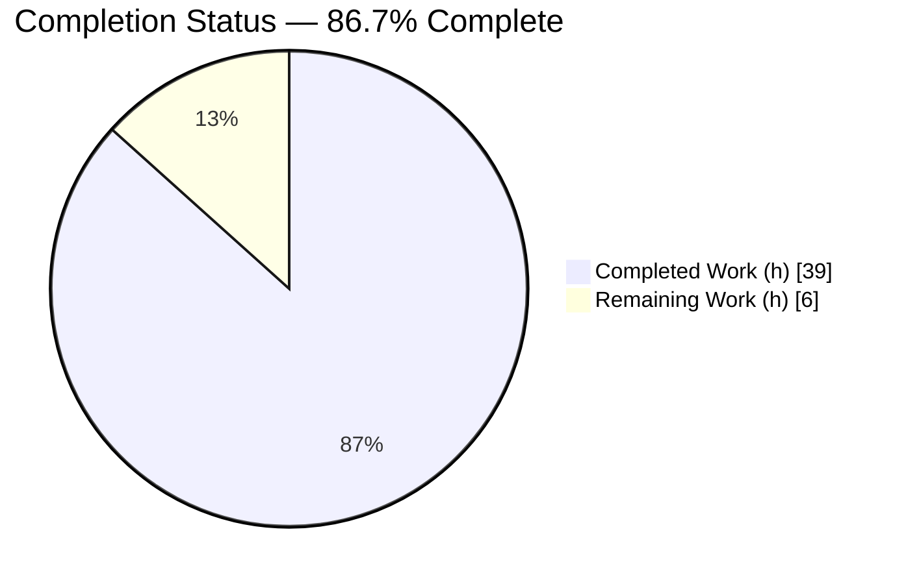
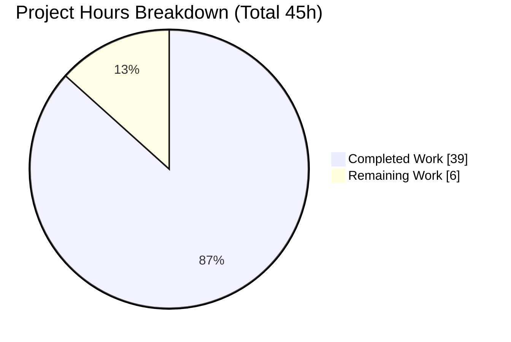
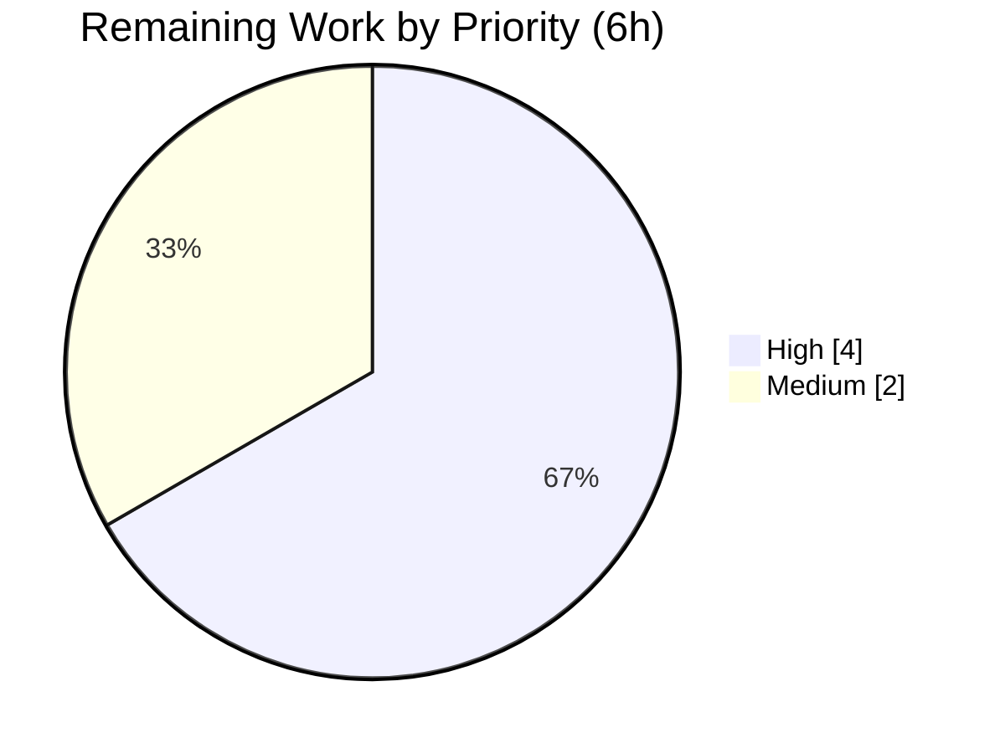

# Blitzy Project Guide — hello_world (Express.js Enhancement)

> **Brand Color Legend:** Completed / AI Work = Dark Blue `#5B39F3` · Remaining / Not Completed = White `#FFFFFF` (outlined `#B23AF2`) · Headings / Accents = Violet-Black `#B23AF2` · Highlight = Mint `#A8FDD9`

---

## 1. Executive Summary

### 1.1 Project Overview

This project enhances a minimal, framework-free Node.js HTTP server (`hello_world`) by introducing the **Express.js** framework and a production-ready, layered architecture. The original single endpoint (`GET /` → `Hello, World!\n`) is preserved byte-for-byte, while a new `GET /good-evening` endpoint (→ `Good evening`) is added. Per project rule **QA-20-may-custom-rules**, the work additionally delivers modular routing, a middleware pipeline, environment-driven configuration, structured logging, and PM2 deployment readiness. The target users are developers and operators of this tutorial-grade service; the business impact is a maintainable, deployable foundation. Technical scope is backend-only — no UI, database, or external integrations.

### 1.2 Completion Status



> Pie colors — **Completed = `#5B39F3`**, **Remaining = `#FFFFFF`**. Center reads **86.7% Complete**.

| Metric | Hours |
|--------|-------|
| **Total Hours** | **45** |
| Completed Hours (AI + Manual) | 39 |
| Remaining Hours | 6 |
| **Percent Complete** | **86.7%** |

**Calculation:** `39 ÷ (39 + 6) = 39 ÷ 45 = 86.7%`. Completion measures only AAP-scoped deliverables plus path-to-production work (PA1 methodology).

### 1.3 Key Accomplishments

- ✅ **FR-1** — Express.js (`^5.2.1`) added as a runtime dependency; `package-lock.json` regenerated; manifest `main` corrected to `server.js`; placeholder `test` script replaced.
- ✅ **FR-2** — Original `GET /` preserved exactly (`Hello, World!\n`, HTTP 200, `text/plain`), verified byte-for-byte.
- ✅ **FR-3** — New `GET /good-evening` endpoint returns `Good evening` (HTTP 200).
- ✅ **FR-4** — Modular routing via `express.Router()` modules mounted through a root router.
- ✅ **FR-5** — Middleware pipeline: body parsing (100 KB limit), request logging, GET-only method guard, 404 handler, and centralized arity-4 error handler with 5xx sanitization.
- ✅ **FR-6** — `dotenv`-backed config exposing `PORT`/`HOST`/`NODE_ENV`/`LOG_LEVEL`; `.env.example` committed.
- ✅ **FR-7** — `winston` structured JSON logging with a morgan→winston bridge and sensitive query-string redaction.
- ✅ **FR-8** — PM2 `ecosystem.config.js` plus `pm2:start`/`pm2:stop`/`pm2:reload` scripts.
- ✅ **Hardening** — Graceful shutdown, crash-safety handlers, `.gitignore`, comprehensive README, and a `ws` security override (0 audit vulnerabilities).
- ✅ **Validation** — 3/3 automated tests passing; clean compilation across all 11 JS files; runtime verified end-to-end over a live socket.

### 1.4 Critical Unresolved Issues

| Issue | Impact | Owner | ETA |
|-------|--------|-------|-----|
| _None_ — no in-scope code defects identified. All AAP deliverables implemented and validated. | None | — | — |

### 1.5 Access Issues

| System/Resource | Type of Access | Issue Description | Resolution Status | Owner |
|-----------------|----------------|-------------------|-------------------|-------|
| PM2 CLI (sandboxed Windows container) | Local process management | The PM2 CLI hangs in **this** Windows sandbox: the daemon spawns (v7.0.1) but the CLI→daemon IPC keeps the shell pipe open, so `pm2 start`/`pm2 jlist` time out. This is a known PM2-on-Windows sandbox interaction, **not** a repo defect. FR-8 is validated by other means (config passes `node --check` + require-load; `server.js` runs standalone; scripts are correct). | Open — requires real host | Human (DevOps) |

### 1.6 Recommended Next Steps

1. **[High]** Verify PM2 production deployment on a real host: `npm run pm2:start`, confirm process list/logs, restart-on-crash, `pm2:reload`/`pm2:stop`, and boot persistence.
2. **[High]** Configure production environment & secrets: set `.env` (`PORT`/`HOST`/`NODE_ENV=production`/`LOG_LEVEL`); decide network bind and front with TLS/reverse-proxy.
3. **[Medium]** Conduct final human code review of the 16-file PR and merge/sign-off.
4. **[Low]** _(Optional, out-of-scope)_ Consider `helmet` + `compression` hardening and a `/health` endpoint for production observability.

---

## 2. Project Hours Breakdown

### 2.1 Completed Work Detail

| Component | Hours | Description |
|-----------|-------|-------------|
| Dependency surface + manifest fixes (FR-1) | 3 | Add `express`, `dotenv`, `morgan`, `winston`, `supertest`, `nodemon`, `pm2` at exact versions; regenerate lockfile; fix `main`; replace `test` script; add `ws` override. |
| Environment configuration (FR-6) | 2 | `src/config/index.js` with `dotenv` load and defaulted `PORT`/`HOST`/`NODE_ENV`/`LOG_LEVEL`; `.env.example`. |
| Winston application logger (FR-7) | 3 | `src/utils/logger.js` — JSON + timestamp, console transport, level from config. |
| Morgan→winston request logging + redaction (FR-7) | 4 | `src/middleware/requestLogger.js` — morgan `combined` bridged via `stream.write`; sensitive query-string redaction. |
| Routing layer (FR-2/FR-3/FR-4) | 4 | `src/routes/{index,helloRoutes,greetingRoutes}.js` — `GET /` preserved; `GET /good-evening` added. |
| App factory + middleware pipeline (FR-4/FR-5) | 4 | `src/app.js` — ordered pipeline, GET-only method guard, exported without `listen()` for testability. |
| Error-handling middleware (FR-5) | 3 | `src/middleware/errorHandler.js` — 404 `notFound` + arity-4 `errorHandler` with 5xx sanitization. |
| `server.js` refactor + graceful shutdown (IMP-3) | 4 | Thin bootstrap; `app.listen`; SIGTERM/SIGINT handling, crash safety, winston flush. |
| PM2 configuration (FR-8) | 3 | `ecosystem.config.js` (fork mode, env/env_production) + `pm2:*` scripts. |
| Automated smoke tests (IMP-6) | 3 | `tests/endpoints.test.js` — `node:test` + `supertest` for `/`, `/good-evening`, 404. |
| `.gitignore` / VCS hygiene (IMP-4) | 1 | Ignore `node_modules/`, `.env`, `logs/`, `*.log`, `.pm2/`, coverage. |
| README documentation (IMP-5) | 2 | Endpoints, env vars, scripts, and PM2 deployment workflow. |
| Autonomous validation + QA (P2P-1/P2P-2) | 3 | Dependency/security validation, compilation, test runs, runtime verification across endpoints and lifecycle. |
| **Total Completed** | **39** | |

### 2.2 Remaining Work Detail

| Category | Hours | Priority |
|----------|-------|----------|
| PM2 production deployment verification on a real host (P2P-3) | 2 | High |
| Production environment & secrets configuration — `.env`, network bind, TLS/reverse-proxy (P2P-4) | 2 | High |
| Final human code review of 16-file PR + merge/sign-off (P2P-5) | 2 | Medium |
| **Total Remaining** | **6** | |

### 2.3 Hours Reconciliation

| Bucket | Hours |
|--------|-------|
| Section 2.1 Completed | 39 |
| Section 2.2 Remaining | 6 |
| **Total Project Hours** | **45** |
| **Completion** | **39 ÷ 45 = 86.7%** |

> Integrity: 2.1 (39) + 2.2 (6) = 45 (Section 1.2 Total). Remaining (6) is identical across Sections 1.2, 2.2, and 7.

---

## 3. Test Results

All tests originate from Blitzy's autonomous validation logs (`npm test` → `node --test`).

| Test Category | Framework | Total Tests | Passed | Failed | Coverage % | Notes |
|---------------|-----------|-------------|--------|--------|-----------|-------|
| Endpoint / Integration smoke | `node:test` + `supertest` | 3 | 3 | 0 | Endpoints: 100% (3/3 routes incl. 404) | `GET /` → `Hello, World!\n`; `GET /good-evening` → `Good evening`; unknown path → 404 |
| **Total** | | **3** | **3** | **0** | | **100% pass rate** |

**Supporting validation evidence (from autonomous logs):**
- `npm install` → exit 0; `npm audit` (prod + full) → **0 vulnerabilities**; `npm ls --depth=0` → all 7 deps at exact AAP versions.
- `node --check` on all 11 in-scope JS files → **0 failures**; JSON manifests parse valid.
- Runtime (live socket via curl): `GET /` → 200/`text/plain`/14 bytes; `GET /good-evening` → 200/12 bytes; `GET /does-not-exist` → 404 JSON; POST/HEAD/OPTIONS → 404 (GET-only guard); graceful SIGTERM shutdown → exit 0.

---

## 4. Runtime Validation & UI Verification

**UI:** Not applicable — this is a backend HTTP service returning plain-text responses (no front-end, per AAP §0.5.3).

**Runtime health:**
- ✅ **Operational** — Server boots via `node server.js` and `npm start` (winston JSON startup log; binds `127.0.0.1:3000`; no stderr).
- ✅ **Operational** — `GET /` → 200, `text/plain; charset=utf-8`, body exactly `Hello, World!\n` (14 bytes).
- ✅ **Operational** — `GET /good-evening` → 200, body exactly `Good evening` (12 bytes).
- ✅ **Operational** — `GET /does-not-exist` → 404 JSON `{"error":"Not Found"}`.
- ✅ **Operational** — Method guard: POST/HEAD/OPTIONS on both routes → 404.
- ✅ **Operational** — Centralized error handler: malformed-JSON POST → sanitized 400 + full stack logged server-side; valid-JSON POST → 404 fall-through.
- ✅ **Operational** — Env config: `PORT=4500` bound custom port; `LOG_LEVEL=warn` suppressed the info startup line (env→config→winston wiring confirmed).
- ✅ **Operational** — Logging pipeline: morgan→winston structured JSON access logs; sensitive query-string redaction verified (`token`/`password` → `[REDACTED]`).
- ✅ **Operational** — Graceful shutdown: SIGTERM → `server.close` → exit 0, with shutdown lines flushed by winston.
- ⚠ **Partial (environment-limited)** — PM2 runtime: CLI hangs in this Windows sandbox; validated indirectly (config require-load + standalone `server.js` run). Requires real-host verification (see §1.5, HT-1).

---

## 5. Compliance & Quality Review

| AAP Deliverable | Benchmark | Status | Evidence / Fixes Applied |
|-----------------|-----------|--------|--------------------------|
| FR-1 Express dependency | Dependency present, locked, audited | ✅ Pass | `express@5.2.1`; lockfile regenerated; 0 vulnerabilities |
| FR-2 Preserve `GET /` | Byte-for-byte identical response | ✅ Pass | 200/`text/plain`/`Hello, World!\n` (14 bytes) |
| FR-3 `GET /good-evening` | Exact response text | ✅ Pass | 200/`Good evening` (12 bytes) |
| FR-4 Modular routing | Separate router modules | ✅ Pass | `src/routes/{index,helloRoutes,greetingRoutes}.js` |
| FR-5 Middleware | Logging, 404, centralized error handler | ✅ Pass | Ordered pipeline; arity-4 handler; 5xx sanitization |
| FR-6 Environment config | `dotenv` + central config | ✅ Pass | `src/config`; `.env.example`; verified via `PORT`/`LOG_LEVEL` override |
| FR-7 Structured logging | App logger + HTTP access logging | ✅ Pass | winston JSON + morgan bridge + redaction |
| FR-8 PM2 deployment | Ecosystem config + scripts | ⚠ Partial | Config + scripts correct & require-loadable; real-host run pending (env limitation) |
| IMP-2 Fix `main` field | Points to runtime file | ✅ Pass | `main` = `server.js` |
| IMP-3 Graceful shutdown | SIGTERM/SIGINT, crash safety | ✅ Pass | Re-entry guard, winston flush, safety timer |
| IMP-5 Documentation | README documents capability | ✅ Pass | Endpoints, env, scripts, PM2 |
| IMP-6 Tests | Non-broken `npm test` | ✅ Pass | 3/3 passing |
| Code quality | Lint/compile clean | ✅ Pass | `node --check` 0 failures (no ESLint/Prettier configured) |
| Security posture | No known vulns | ✅ Pass | 0 audit vulns; `ws` CVE override applied |

**Outstanding compliance item:** FR-8 PM2 requires real-host runtime verification (sandbox limitation only).

---

## 6. Risk Assessment

| Risk | Category | Severity | Probability | Mitigation | Status |
|------|----------|----------|-------------|------------|--------|
| T1 — PM2 not runtime-verified in sandbox | Technical | Low | Low | Config require-loads correctly; `server.js` runs standalone; verify on real host (HT-1) | Open |
| T2 — Express 5 maturity / breaking changes | Technical | Low | Low | Node v22 satisfies engine; pinned `^5.2.1`; tests green | Mitigated |
| T3 — Minimal automated test coverage (3 smoke tests) | Technical | Low–Med | Med | Endpoints fully covered; expand suite as features grow | Accepted (enhancement) |
| S1 — No TLS/HTTPS | Security | Medium | Med | Out of scope per AAP §0.6.2; front with reverse-proxy/TLS in prod (HT-2) | Accepted |
| S2 — No authN/authZ | Security | Low | Low | Public tutorial endpoints by design; out of scope | Accepted |
| S3 — No `helmet`/`compression` | Security | Low | Low | Documented optional hardening (AAP §0.3.1) | Accepted |
| O1 — Console-only logging | Operational | Low | Low | winston JSON suitable for PM2 capture; add file/transport in prod if needed | By design |
| O2 — No `/health` endpoint | Operational | Low | Low | Add for prod observability (optional) | Accepted |
| O3 — PM2 boot persistence unconfigured | Operational | Low | Med | `pm2 startup`/`pm2 save` on real host (HT-1) | Open |
| I1 — `pm2` must be on host PATH | Integration | Low | Low | Install globally on host; `pm2:*` scripts ready | Open (HT-1) |
| I2 — Production bind/secrets wiring | Integration | Medium | Med | Env-driven config ready; set values in prod (HT-2) | Open |

**Overall:** No High-severity **open** risks. Positive security posture: 0 audit vulnerabilities, `ws` CVE override (GHSA-58qx-3vcg-4xpx), 5xx response sanitization, query-string redaction, 100 KB body limit.

---

## 7. Visual Project Status



> Colors — **Completed Work = `#5B39F3`**, **Remaining Work = `#FFFFFF`**. "Remaining Work" (6h) equals Section 1.2 Remaining Hours and the Section 2.2 Hours total.

**Remaining hours by priority (Section 2.2):**



> High = PM2 verification (2h) + Prod env/secrets (2h) = 4h; Medium = Final review (2h).

---

## 8. Summary & Recommendations

The Express.js enhancement is **86.7% complete (39h of 45h)**. **All AAP code deliverables are fully implemented and validated** — all eight Feature Requirements (FR-1 through FR-8) plus the implicit remediations (manifest `main` fix, non-broken `npm test`, `.gitignore`, README, graceful shutdown) are present and working. Independent re-validation confirmed clean dependency installation (0 vulnerabilities), clean compilation (11/11 JS files), a 100% test pass rate (3/3), and correct end-to-end runtime behavior across all endpoints, the method guard, environment overrides, the logging pipeline, and graceful shutdown.

The remaining **13.3% (6h)** is exclusively **path-to-production human work**, not code: (1) verifying PM2 on a real host — the PM2 CLI cannot be exercised in this Windows sandbox, a known environment limitation rather than a repo defect; (2) configuring production environment values, secrets, and TLS/reverse-proxy fronting; and (3) a final human code review and merge of the 16-file PR.

**Critical path to production:** real-host PM2 verification → production env/secrets → human review/merge.

**Success metrics achieved:** byte-for-byte backward compatibility, exact new-endpoint response, modular architecture, 0 vulnerabilities, 3/3 tests green, pristine git tree.

**Production-readiness assessment:** Code is production-grade and deployable. Remaining steps are operational verification and human sign-off — no further development is required to satisfy the AAP. Recommended to proceed with the three path-to-production tasks, then merge.

---

## 9. Development Guide

### 9.1 System Prerequisites

- **Node.js ≥ 18** (verified on **v22.22.2**); npm (verified **10.9.7**). Express 5 requires Node 18+.
- **Git** (with Git LFS available on this host).
- **PM2** (for production deployment) — install globally on the target host: `npm install -g pm2`.
- OS: cross-platform. Commands below are shown for both POSIX shells and Windows PowerShell where they differ.

### 9.2 Environment Setup

```bash
# From the repository root
cp .env.example .env        # optional; defaults work out of the box
# .env supports: PORT=3000  HOST=127.0.0.1  NODE_ENV=development  LOG_LEVEL=info
```

> On Windows PowerShell, if `node` is not on PATH in a fresh shell:
> `$env:PATH = "C:\node22\node-v22.22.2-win-x64;$env:PATH"`

### 9.3 Dependency Installation

```bash
npm install
# Expected: exit 0; on a clean checkout reports "up to date" against the committed lockfile.
# npm audit -> 0 vulnerabilities; npm ls --depth=0 -> all 7 deps at exact versions.
```

### 9.4 Application Startup

```bash
# Production/standard start
npm start                 # => node server.js
# Expected (winston JSON): {"level":"info","message":"Server running at http://127.0.0.1:3000/", ...}

# Development (auto-reload)
npm run dev               # => nodemon server.js

# Custom port / log level (env overrides)
PORT=4500 LOG_LEVEL=warn node server.js     # binds :4500; suppresses the info startup line
```

> **Windows note:** `npm`/`npx` are `.cmd` shims. When launching via PowerShell `Start-Process`, wrap with `cmd /c "npm start"` to avoid "%1 is not a valid Win32 application".

### 9.5 Verification Steps

```bash
# Health-by-endpoint (server must be running)
curl -i http://127.0.0.1:3000/                 # 200, text/plain, "Hello, World!\n" (14 bytes)
curl -i http://127.0.0.1:3000/good-evening     # 200, text/plain, "Good evening"  (12 bytes)
curl -i http://127.0.0.1:3000/does-not-exist   # 404, application/json {"error":"Not Found"}

# Automated tests
npm test                                       # => node --test ; expect: tests 3, pass 3, fail 0
```

### 9.6 PM2 Production Deployment

```bash
npm install -g pm2                 # on the target host
npm run pm2:start                  # => pm2 start ecosystem.config.js --env production
pm2 list                           # confirm "hello-world" is online
pm2 logs hello-world               # tail aggregated logs
npm run pm2:reload                 # zero-downtime reload
npm run pm2:stop                   # stop the app
pm2 startup && pm2 save            # (optional) enable boot persistence
```

> The PM2 CLI cannot be exercised inside this sandboxed Windows container (CLI→daemon IPC keeps the shell pipe open). Run these on a real host. The artifact PM2 wraps (`server.js`) is independently verified.

### 9.7 Troubleshooting

- **`EADDRINUSE` on :3000** — another process holds the port. Use `PORT=<n> npm start`, or stop the conflicting process.
- **`node` not found (Windows)** — prepend Node to PATH (see §9.1) for the current shell.
- **`%1 is not a valid Win32 application`** — launching `npm` via `Start-Process`; wrap with `cmd /c "npm ..."`.
- **No startup log line** — `LOG_LEVEL` is above `info` (e.g., `warn`/`error`); this is expected, not a failure.
- **PM2 CLI hangs** — known Windows-sandbox interaction; verify on a real host (see §9.6).
- **Malformed JSON on POST** — returns a sanitized `400`; the full error is logged server-side only (by design).

---

## 10. Appendices

### A. Command Reference

| Command | Purpose |
|---------|---------|
| `npm install` | Install dependencies (deterministic against lockfile) |
| `npm start` | Start server (`node server.js`) |
| `npm run dev` | Start with auto-reload (`nodemon server.js`) |
| `npm test` | Run smoke tests (`node --test`) — 3/3 |
| `npm run pm2:start` | `pm2 start ecosystem.config.js --env production` |
| `npm run pm2:stop` | Stop the PM2-managed app |
| `npm run pm2:reload` | Zero-downtime reload |
| `npm audit` | Security audit (0 vulnerabilities) |
| `node --check <file>` | Syntax-check a JS file |

### B. Port Reference

| Port | Service | Source |
|------|---------|--------|
| 3000 | HTTP server (default) | `PORT` (default `3000`) |
| Custom | Override via env | `PORT=<n>` |

### C. Key File Locations

| Path | Role |
|------|------|
| `server.js` | Bootstrap: config + logger + `app.listen` + graceful shutdown |
| `src/app.js` | Express app factory + middleware pipeline (exported, not listening) |
| `src/config/index.js` | `dotenv` load + defaulted config |
| `src/utils/logger.js` | winston logger |
| `src/middleware/requestLogger.js` | morgan→winston bridge + query redaction |
| `src/middleware/errorHandler.js` | 404 `notFound` + arity-4 `errorHandler` |
| `src/routes/index.js` | Root router aggregator |
| `src/routes/helloRoutes.js` | `GET /` → `Hello, World!\n` |
| `src/routes/greetingRoutes.js` | `GET /good-evening` → `Good evening` |
| `ecosystem.config.js` | PM2 process definition |
| `tests/endpoints.test.js` | `node:test` + `supertest` smoke tests |
| `.env.example` | Env var template |
| `.gitignore` | VCS hygiene |
| `README.md` | Project documentation |

### D. Technology Versions

| Package | Version | Type |
|---------|---------|------|
| express | 5.2.1 | dependency |
| dotenv | 17.4.2 | dependency |
| morgan | 1.10.1 | dependency |
| winston | 3.19.0 | dependency |
| supertest | 7.2.2 | devDependency |
| nodemon | 3.1.14 | devDependency |
| pm2 | 7.0.1 | tooling |
| Node.js | 22.22.2 | runtime |
| npm | 10.9.7 | runtime |

> Security override: `ws@8.21.0` (resolves GHSA-58qx-3vcg-4xpx).

### E. Environment Variable Reference

| Variable | Default | Purpose |
|----------|---------|---------|
| `PORT` | `3000` | TCP port to bind |
| `HOST` | `127.0.0.1` | Bind address |
| `NODE_ENV` | `development` | Runtime mode |
| `LOG_LEVEL` | `info` | winston log level (`error`/`warn`/`info`/`debug`) |

### F. Developer Tools Guide

- **Lint/format:** None configured (no ESLint/Prettier). Applicable read-only check is `node --check` (0 violations). The `eslint-disable` comment in `errorHandler.js` is forward-compatible only.
- **Git hooks:** 4 standard Git LFS hooks (delegate to `git lfs`) — benign, non-blocking. No husky/lint-staged. No submodules.
- **Test runner:** Node's built-in `node:test` via `npm test`.

### G. Glossary

| Term | Meaning |
|------|---------|
| AAP | Agent Action Plan — the authoritative scope document |
| FR-n | Feature Requirement n (FR-1…FR-8) |
| IMP-n | Implicit remediation surfaced by the AAP |
| P2P | Path-to-production work item |
| HT-n | Human task n in the remaining-work list |
| Method guard | Middleware restricting routes to GET; non-GET → 404 |
| Arity-4 handler | Express error middleware with `(err, req, res, next)` signature |
