# Technical Specification

# 1. Introduction

## 1.1 Executive Summary

### 1.1.1 Project Overview

The repository under specification is a minimal Node.js HTTP server application that exists as a controlled test fixture for integration with an external system referred to as "backprop." The project is identified by two distinct names across its artifacts: the user-facing `README.md` labels it `hao-backprop-test`, while the npm package manifest (`package.json`) and lockfile (`package-lock.json`) declare the package name as `hello_world`. For the purposes of this document, the repository will be referenced as `hao-backprop-test` (its declared README identity), with `hello_world` noted as the npm-package-level identifier.

The codebase is intentionally minimal: a single executable JavaScript file (`server.js`) totaling 14 lines instantiates an HTTP server bound to the loopback interface on a fixed port and returns a deterministic plain-text response to every incoming request. The project carries an explicit handling directive in its `README.md` — "Do not touch!" — signaling that the artifact must remain stable and unmodified to fulfill its role as a known-good integration target.

### 1.1.2 Core Business Problem

The project addresses the need for a **predictable, deterministic, dependency-free HTTP endpoint** that can be used to validate integration behaviors of the external "backprop" system. Integration workflows commonly require a target service that produces a consistent response across all invocations, with no variability introduced by routing logic, request inspection, persistent state, or third-party libraries. This repository provides exactly that target — a smoke-test-grade HTTP server whose behavior is fully knowable from inspection of a 14-line source file.

### 1.1.3 Key Stakeholders and Users

| Stakeholder | Role | Interaction with System |
|---|---|---|
| Project Author (`hxu`) | Maintainer (per `package.json` `author` field) | Owns the codebase and ensures its stability |
| Backprop Integration System | External consumer | Issues HTTP requests against the running server |
| Integration Engineers | Operators of the backprop system | Run the server locally and observe its responses |
| Automated Tooling | Test harnesses | May programmatically invoke the endpoint |

### 1.1.4 Expected Value Proposition

The value delivered by this repository is not measured in user-facing features but in the **reliability and stability of a reference fixture**. By keeping the server's behavior trivially small and dependency-free, the project ensures that any behavioral observation from the backprop integration can be attributed solely to backprop's own logic, never to incidental complexity inside the test target. The MIT license declared in both `package.json` and `package-lock.json` further enables the artifact to be freely embedded into broader test environments.

---

## 1.2 System Overview

### 1.2.1 Project Context

#### Business Context and Positioning

The repository occupies a narrow and well-defined position in the integration test ecosystem: it is a **target fixture**, not a product, not a service, and not a reusable library. Its existence is justified solely by the operational need of the "backprop" system to integrate against something. The repository provides no further detail about the nature of "backprop" beyond the README's single-line framing, and this specification document refrains from speculation beyond that evidence.

#### Current System Limitations

This project does not replace or upgrade a prior system. It is a greenfield, single-purpose artifact. However, the repository contains several **internal inconsistencies** that should be acknowledged as part of its current-state description (these are documented further in §1.4):

| Inconsistency | Declared Location | Actual State |
|---|---|---|
| Project Name | `README.md` vs. `package.json` | `hao-backprop-test` vs. `hello_world` |
| Entry Point | `package.json` `main` field | Declares `index.js`; only `server.js` exists |
| Test Script | `package.json` `scripts.test` | Placeholder that exits with error code 1 |

#### Integration with the Enterprise Landscape

The system integrates with the enterprise landscape exclusively through a **single HTTP endpoint** exposed on the loopback interface (`127.0.0.1:3000`). The server is reachable only from processes running on the same host, which architecturally confines all integration interactions to **local execution contexts**. No remote integration is possible without explicit re-binding to an externally routable interface — a change that would constitute a modification to `server.js` and would violate the "Do not touch!" directive in the README.

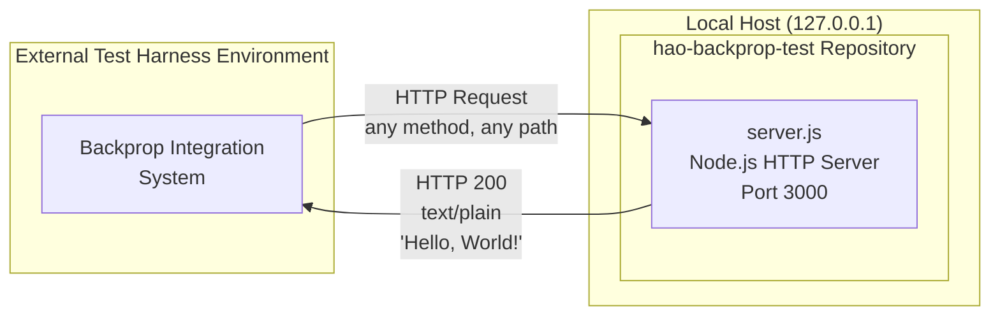
```mermaid
flowchart LR
    subgraph ExternalSide["External Test Harness Environment"]
        BackpropSys[Backprop Integration<br/>System]
    end

    subgraph LocalHost["Local Host (127.0.0.1)"]
        subgraph Repository["hao-backprop-test Repository"]
            ServerNode[server.js<br/>Node.js HTTP Server<br/>Port 3000]
        end
    end

    BackpropSys -->|HTTP Request<br/>any method, any path| ServerNode
    ServerNode -->|HTTP 200<br/>text/plain<br/>'Hello, World!'| BackpropSys
```

### 1.2.2 High-Level Description

#### Primary System Capabilities

The system provides exactly one capability: **accepting an inbound HTTP request and returning a fixed plain-text response**. The implementation in `server.js` exhibits the following observable behaviors:

| Capability | Behavior |
|---|---|
| HTTP Listener | Binds to `127.0.0.1` on port `3000` |
| Request Handling | Accepts any HTTP method, any URL path |
| Response Status | Always returns HTTP `200 OK` |
| Response Headers | Sets `Content-Type: text/plain` |
| Response Body | Returns the literal string `Hello, World!\n` |
| Startup Logging | Emits one `console.log` line announcing the listening URL |

#### Major System Components

There is effectively one component:

| Component | File | Purpose |
|---|---|---|
| HTTP Server | `server.js` | Instantiates and starts the Node.js HTTP server |
| Package Manifest | `package.json` | Declares package identity, version `1.0.0`, license `MIT`, and a placeholder test script |
| Dependency Lockfile | `package-lock.json` | Records lockfile version `3`; pins zero third-party packages |
| Project Documentation | `README.md` | Two-line description identifying the project and its handling directive |

#### Core Technical Approach

The technical approach is deliberately **framework-free and dependency-free**:

- The server relies exclusively on the Node.js built-in `http` module, imported via CommonJS `require('http')`.
- No third-party packages are declared in `package.json` (`dependencies` and `devDependencies` fields are absent).
- No application framework (such as Express, Koa, or Fastify) is used.
- No routing layer, no middleware pipeline, no request body parser, and no error-handling layer are present.
- The server is stateless: no in-memory caches, no session stores, no persistence layer, and no database connectivity exist.

### 1.2.3 Success Criteria

#### Measurable Objectives

| Objective | Measurement |
|---|---|
| Server starts successfully | Process exits 0 from `node server.js` initialization phase; startup log line is emitted |
| Endpoint responds to requests | Any HTTP request to `http://127.0.0.1:3000/` returns status `200` |
| Response payload is invariant | Body equals `Hello, World!\n` byte-for-byte on every call |
| Zero runtime dependencies | `node_modules/` remains empty after `npm install` |

#### Critical Success Factors

- **Stability of source files** — The "Do not touch!" directive elevates non-modification to a critical success factor; any change risks invalidating the fixture's role.
- **Predictability of response** — The absence of routing and request inspection guarantees identical behavior across requests.
- **Portability** — Because the project has no third-party dependencies, it runs on any host with a Node.js runtime available.

#### Key Performance Indicators (KPIs)

| KPI | Target |
|---|---|
| Cold-start time | Sub-second (Node.js process startup of a 14-line script) |
| External dependencies | Zero |
| Response determinism | 100% — identical body for every request |
| Source-file count | 1 runtime file (`server.js`) |

---

## 1.3 Scope

### 1.3.1 In-Scope Elements

#### Core Features and Functionalities

The following capabilities are explicitly within the scope of this repository, as evidenced by the contents of `server.js` and the project's stated purpose in `README.md`:

| In-Scope Item | Evidence |
|---|---|
| HTTP server creation via `http.createServer` | `server.js` lines 6–10 |
| Fixed hostname binding to `127.0.0.1` | `server.js` line 3 |
| Fixed port binding to `3000` | `server.js` line 4 |
| Response status code `200` | `server.js` line 7 |
| `Content-Type: text/plain` header on response | `server.js` line 8 |
| Plain-text body `Hello, World!\n` | `server.js` line 9 |
| Startup log message | `server.js` line 13 |
| MIT licensing | `package.json` `license` field |

#### Primary User Workflows

| Workflow | Steps |
|---|---|
| Local server startup | Run `node server.js` from the repository root |
| Integration probe by backprop | Issue any HTTP request to `http://127.0.0.1:3000/` |
| Response validation | Confirm status `200`, body `Hello, World!\n` |

#### Essential Integrations

The single essential integration is the inbound HTTP connection from the **backprop** system (or any HTTP-capable client) to the server's loopback endpoint. No outbound integrations exist; the server initiates no network calls of its own.

#### Implementation Boundaries

| Boundary Dimension | Coverage |
|---|---|
| System boundary | A single Node.js process listening on one TCP port |
| User group | Operators of the backprop integration system; the project author |
| Geographic/network coverage | Loopback interface only — strictly local-host |
| Data domain | None — no data is read, written, persisted, or processed beyond a hard-coded literal |

### 1.3.2 Out-of-Scope Elements

#### Explicitly Excluded Features and Capabilities

The repository's content and the absence of supporting files unambiguously place the following items **outside the scope** of this project:

| Category | Excluded Item | Evidence of Exclusion |
|---|---|---|
| Routing | URL-based request dispatch | No route table in `server.js`; identical response for every path |
| Request Parsing | Headers/body/query-string inspection | `req` parameter referenced but never read |
| Authentication | Identity verification, tokens, sessions | No auth code; no related dependencies in `package.json` |
| Authorization | Role-based or attribute-based access control | Not implemented |
| Persistence | Databases, file storage, caches | No persistence layer; no ORM; no client libraries |
| Configuration | Environment variables, config files | Hostname and port are hard-coded literals |
| Logging | Structured or persistent logging | Only one `console.log` startup message |
| Error Handling | Try/catch, error responses, retries | No error-handling code present |
| Graceful Shutdown | SIGTERM/SIGINT handlers | Not implemented |
| Testing | Unit, integration, or end-to-end tests | No `test/` directory; placeholder script in `package.json` |
| CI/CD | Pipelines, deployment manifests | No CI configuration files in repository |
| Containerization | `Dockerfile`, container manifests | Not present |
| Build Tooling | Webpack, Babel, TypeScript compilation | No build configuration files |
| Linting/Formatting | ESLint, Prettier, etc. | No `.eslintrc`, `.prettierrc`, or equivalent |
| Frontend/Client Code | Browser-side assets | No client directory; no static asset serving |
| Multiple Network Interfaces | Listening on `0.0.0.0` or specific NICs | Bound exclusively to `127.0.0.1` |
| Configurable Port | Reading from `process.env.PORT` | Port hardcoded to `3000` |
| Documentation | API references, design documents | Only a two-line `README.md` exists |

#### Future Phase Considerations

This specification documents only the present state of the repository. The repository itself articulates no roadmap, version history beyond `1.0.0`, or backlog. Consequently, any of the excluded items listed above would be considered candidates only if a future revision of this specification were to broaden the project's scope. The current "Do not touch!" directive in `README.md` indicates that such broadening is **not anticipated** during the project's role as a backprop integration fixture.

#### Integration Points Not Covered

The following integration points are explicitly **not covered** by this repository:

- Outbound HTTP calls to other services
- Message queue or event-bus connectivity
- Database connections (relational or non-relational)
- File-system reads or writes beyond loading the script
- Inter-process communication (IPC)
- Remote network exposure beyond the loopback interface

#### Unsupported Use Cases

The system is not designed to support:

- Production HTTP traffic of any volume
- Multi-tenant request handling
- User-driven web browsing with rendered HTML
- API contract negotiation (no JSON, no REST, no GraphQL, no RPC)
- Long-lived connections, WebSockets, or server-sent events
- Concurrent request workflows that depend on shared state

---

## 1.4 Documented Repository Inconsistencies

The repository contains three internal inconsistencies that downstream readers, integrators, and maintainers must be aware of. They are factual observations and do not reflect speculative reasoning about intent.

### 1.4.1 Project Identity Discrepancy

| Source File | Declared Name |
|---|---|
| `README.md` (line 1) | `hao-backprop-test` |
| `package.json` (`name` field) | `hello_world` |
| `package-lock.json` (`name` field) | `hello_world` |

The user-facing project identity and the npm package identity do not match. Any tooling that resolves the project by npm package name will encounter `hello_world`, while documentation references will use `hao-backprop-test`.

### 1.4.2 Entry Point Discrepancy

The `package.json` `main` field declares `index.js` as the entry point. No `index.js` file exists in the repository. The actual runtime file is `server.js`, which must be invoked explicitly (for example, by running `node server.js`). There is no `start` script defined in `package.json` to abstract this command.

### 1.4.3 Test Script Placeholder

The `scripts.test` entry in `package.json` is the default npm placeholder: it emits an error message and exits with code `1`. The repository contains no test files, no test framework, and no test directory. Any CI process that invokes `npm test` will observe a non-zero exit status.

---

## 1.5 References

#### Files Examined

- `README.md` — Source of the project's stated identity (`hao-backprop-test`), declared purpose ("test project for backprop integration"), and the explicit "Do not touch!" handling directive.
- `package.json` — Source of npm package metadata: name `hello_world`, version `1.0.0`, description "Hello world in Node.js", `main` entry `index.js`, author `hxu`, MIT license, and placeholder test script. Confirms zero declared dependencies.
- `package-lock.json` — Source of dependency lockfile state: lockfile version `3`, MIT license, only the root package recorded with zero pinned third-party modules.
- `server.js` — Complete runtime implementation: Node.js built-in `http` server bound to `127.0.0.1:3000`, returning HTTP `200` with `Content-Type: text/plain` and body `Hello, World!\n` for every request.

#### Folders Examined

- Repository root (depth 0) — Confirmed to contain exactly four files and zero subdirectories. No nested source structure, test directory, configuration directory, or documentation directory exists.

#### Cross-Section References

No other sections of the Technical Specification document were available for cross-referencing at the time this Introduction was authored (the available section heading list was empty).

# 2. Product Requirements

This section enumerates the discrete, testable features of the `hao-backprop-test` repository, derived strictly from the contents of its four files (`server.js`, `package.json`, `package-lock.json`, `README.md`) and the supporting analysis in Sections 1.1 through 1.5. Because the repository's role is that of a deliberately minimal, dependency-free test fixture (per §1.1.1) for the external **backprop** integration system, the feature set is correspondingly small, fully observable from a 14-line source file, and almost entirely classified as `Completed` — the artifact already exists in its target state and is bound by the explicit "Do not touch!" directive in `README.md`.

Each feature below is grounded in observable evidence (file paths and, where applicable, line numbers in `server.js`), is testable through inspection or runtime probing, and traces back to one or more in-scope items enumerated in §1.3.1.

---

## 2.1 FEATURE CATALOG

### 2.1.1 F-001: HTTP Server Instantiation

#### Feature Metadata

| Attribute | Value |
|---|---|
| Unique ID | F-001 |
| Feature Name | HTTP Server Instantiation |
| Feature Category | Runtime / Network Service |
| Priority Level | Critical |
| Status | Completed |

#### Description

- **Overview**: The application instantiates a Node.js HTTP server using the built-in `http` module via `http.createServer`, with a request-handler callback that sets response status, headers, and body before terminating the response (`server.js` lines 1, 6–10).
- **Business Value**: Provides the foundational server process required for the backprop system to perform integration probes; without an HTTP listener, no integration can occur (§1.2.2).
- **User Benefits**: Backprop integration engineers obtain a known-good HTTP target requiring no installation steps beyond a Node.js runtime.
- **Technical Context**: Uses the CommonJS `require('http')` import idiom; the server object is a `http.Server` instance returned by `http.createServer` (§1.2.2 "Core Technical Approach").

#### Dependencies

| Dependency Type | Specification |
|---|---|
| Prerequisite Features | None (foundational) |
| System Dependencies | Node.js runtime (any version supporting `http.createServer` and CommonJS `require`) |
| External Dependencies | Node.js built-in `http` module (no third-party packages) |
| Integration Requirements | Must remain reachable from in-host backprop client processes |

---

### 2.1.2 F-002: Loopback Network Binding

#### Feature Metadata

| Attribute | Value |
|---|---|
| Unique ID | F-002 |
| Feature Name | Loopback Network Binding |
| Feature Category | Runtime / Network Configuration |
| Priority Level | Critical |
| Status | Completed |

#### Description

- **Overview**: The server binds exclusively to the loopback interface `127.0.0.1` on TCP port `3000` via `server.listen(port, hostname, callback)` (`server.js` lines 3, 4, 12).
- **Business Value**: Architecturally confines all integration interactions to the local host, providing network-level isolation and a stable, predictable endpoint URL (§1.2.1 "Integration with the Enterprise Landscape").
- **User Benefits**: Integration engineers are assured that the fixture cannot be inadvertently exposed to remote networks, minimizing security surface area.
- **Technical Context**: Both `hostname` and `port` are declared as `const` literals at module scope. There is no configuration override path (no `process.env.PORT` lookup, no config file).

#### Dependencies

| Dependency Type | Specification |
|---|---|
| Prerequisite Features | F-001 (HTTP Server Instantiation) |
| System Dependencies | TCP/IP stack on local host; port `3000` available (not held by another process) |
| External Dependencies | None |
| Integration Requirements | Backprop client must reach the server from the same host (loopback only) |

---

### 2.1.3 F-003: Universal Request Acceptance

#### Feature Metadata

| Attribute | Value |
|---|---|
| Unique ID | F-003 |
| Feature Name | Universal Request Acceptance (No Routing or Parsing) |
| Feature Category | Runtime / Request Handling |
| Priority Level | Critical |
| Status | Completed |

#### Description

- **Overview**: The request handler accepts any HTTP method, any URL path, and any payload without inspecting them. The `req` parameter is declared in the handler signature but never referenced in the body (`server.js` lines 6–10; §1.3.2 "Request Parsing — Excluded").
- **Business Value**: Guarantees response determinism for the backprop integration — variability cannot be introduced by routing decisions, header inspection, or body parsing (§1.2.3).
- **User Benefits**: Backprop test harnesses may exercise the endpoint with arbitrary method/path/payload combinations and obtain identical results, simplifying integration test authoring.
- **Technical Context**: No route table, no middleware pipeline, no body parser, no query-string parser is present (§1.2.2 "Core Technical Approach").

#### Dependencies

| Dependency Type | Specification |
|---|---|
| Prerequisite Features | F-001 (HTTP Server Instantiation) |
| System Dependencies | None beyond F-001 |
| External Dependencies | None |
| Integration Requirements | Backprop probes may use any method/path/body without coordination |

---

### 2.1.4 F-004: Deterministic Fixed Response

#### Feature Metadata

| Attribute | Value |
|---|---|
| Unique ID | F-004 |
| Feature Name | Deterministic Fixed Response |
| Feature Category | Runtime / Response Generation |
| Priority Level | Critical |
| Status | Completed |

#### Description

- **Overview**: Every response is byte-for-byte identical: status code `200`, header `Content-Type: text/plain`, body `Hello, World!\n` (the literal string with a trailing newline) — `server.js` lines 7–9.
- **Business Value**: Embodies the project's central KPI of "Response determinism: 100% — identical body for every request" (§1.2.3); this is the primary observable contract of the fixture.
- **User Benefits**: Any backprop behavior that varies across calls can be attributed solely to backprop, never to the test target (§1.1.4).
- **Technical Context**: Response generation is synchronous and stateless. No template engine, no serialization library, and no content negotiation is involved.

#### Dependencies

| Dependency Type | Specification |
|---|---|
| Prerequisite Features | F-001, F-002, F-003 (all jointly required) |
| System Dependencies | None |
| External Dependencies | None |
| Integration Requirements | Client must be capable of receiving an HTTP/1.1 plain-text response |

---

### 2.1.5 F-005: Startup Log Emission

#### Feature Metadata

| Attribute | Value |
|---|---|
| Unique ID | F-005 |
| Feature Name | Startup Log Emission |
| Feature Category | Observability |
| Priority Level | Medium |
| Status | Completed |

#### Description

- **Overview**: After the server successfully binds, the `listen` callback emits a single `console.log` line of the form `Server running at http://127.0.0.1:3000/` (`server.js` lines 12–14).
- **Business Value**: Provides a minimal but sufficient operator-visible signal that the fixture is ready to receive traffic — a measurable component of the §1.2.3 success criterion "Server starts successfully".
- **User Benefits**: Operators starting the server interactively can confirm readiness without external tooling.
- **Technical Context**: Single line of `console.log`; no structured logger, no log file, no log level, and no log rotation (§1.3.2 "Logging — Excluded").

#### Dependencies

| Dependency Type | Specification |
|---|---|
| Prerequisite Features | F-001 (HTTP Server Instantiation), F-002 (Loopback Network Binding) |
| System Dependencies | Process `stdout` stream available |
| External Dependencies | None |
| Integration Requirements | Operator or harness must observe `stdout` to consume the signal |

---

### 2.1.6 F-006: Zero-Dependency Architecture

#### Feature Metadata

| Attribute | Value |
|---|---|
| Unique ID | F-006 |
| Feature Name | Zero-Dependency Architecture |
| Feature Category | Build / Supply Chain |
| Priority Level | Critical |
| Status | Completed |

#### Description

- **Overview**: The `package.json` manifest declares no `dependencies` and no `devDependencies` fields; the `package-lock.json` records only the root package and pins zero third-party modules; `server.js` imports only the Node.js built-in `http` module.
- **Business Value**: Directly embodies the §1.2.3 KPI "External dependencies = Zero", which underpins the fixture's portability and supply-chain-clean status.
- **User Benefits**: Engineers can run the fixture on any host with a Node.js runtime — `node_modules/` remains empty after `npm install`, eliminating dependency resolution failures.
- **Technical Context**: No application framework (Express/Koa/Fastify), no middleware libraries, no parser packages (§1.2.2 "Core Technical Approach").

#### Dependencies

| Dependency Type | Specification |
|---|---|
| Prerequisite Features | None |
| System Dependencies | Node.js runtime with the built-in `http` module |
| External Dependencies | None (this is the defining negative requirement) |
| Integration Requirements | None |

---

### 2.1.7 F-007: MIT License Declaration

#### Feature Metadata

| Attribute | Value |
|---|---|
| Unique ID | F-007 |
| Feature Name | MIT License Declaration |
| Feature Category | Legal / Metadata |
| Priority Level | High |
| Status | Completed |

#### Description

- **Overview**: Both `package.json` and `package-lock.json` carry a `license` field with the value `MIT`.
- **Business Value**: Permits the artifact to be freely embedded into broader backprop test environments without licensing friction (§1.1.4).
- **User Benefits**: Backprop operators can vendor, redistribute, or fork the fixture for internal use under permissive terms.
- **Technical Context**: License is declared at metadata level only; no `LICENSE` file is present at the repository root.

#### Dependencies

| Dependency Type | Specification |
|---|---|
| Prerequisite Features | F-008 (NPM Package Metadata) — license is recorded within the manifest |
| System Dependencies | None |
| External Dependencies | None |
| Integration Requirements | Compliance with downstream license-scanning tooling |

---

### 2.1.8 F-008: NPM Package Metadata

#### Feature Metadata

| Attribute | Value |
|---|---|
| Unique ID | F-008 |
| Feature Name | NPM Package Metadata |
| Feature Category | Build / Identity |
| Priority Level | Medium |
| Status | Completed (with documented inconsistencies — see §1.4) |

#### Description

- **Overview**: The `package.json` declares package identity (`name: hello_world`), `version: 1.0.0`, `description: "Hello world in Node.js"`, `main: index.js`, and `author: hxu`.
- **Business Value**: Enables npm tooling (`npm pack`, `npm view`, registry tooling) to recognize the artifact.
- **User Benefits**: Provides standardized package identification for downstream test harnesses.
- **Technical Context**: Two inconsistencies must be acknowledged per §1.4: (1) the README's project name `hao-backprop-test` differs from the npm `name: hello_world` (§1.4.1), and (2) the `main` field references a non-existent `index.js` while the actual entry point is `server.js` (§1.4.2). No `start` script is defined.

#### Dependencies

| Dependency Type | Specification |
|---|---|
| Prerequisite Features | None |
| System Dependencies | None |
| External Dependencies | npm CLI (only for inspection; not required at runtime) |
| Integration Requirements | Consumers must invoke `node server.js` rather than `npm start` due to the §1.4.2 inconsistency |

---

### 2.1.9 F-009: NPM Lockfile State Preservation

#### Feature Metadata

| Attribute | Value |
|---|---|
| Unique ID | F-009 |
| Feature Name | NPM Lockfile State Preservation |
| Feature Category | Build / Supply Chain |
| Priority Level | Medium |
| Status | Completed |

#### Description

- **Overview**: The `package-lock.json` uses `lockfileVersion: 3` with `requires: true`, and records only the root package (`hello_world` at version `1.0.0` with MIT license) with no nested dependency entries.
- **Business Value**: Reinforces F-006 (Zero-Dependency Architecture) at the lockfile level, ensuring that `npm install` cannot introduce drift from a known-empty dependency tree.
- **User Benefits**: Reproducible installs across hosts; deterministic supply-chain posture.
- **Technical Context**: Modern lockfile format (version 3) introduced in npm 7+; provides forward-compatible dependency-tree serialization.

#### Dependencies

| Dependency Type | Specification |
|---|---|
| Prerequisite Features | F-006 (Zero-Dependency Architecture), F-008 (NPM Package Metadata) |
| System Dependencies | npm 7+ for lockfile-v3 parity |
| External Dependencies | None |
| Integration Requirements | None |

---

### 2.1.10 F-010: Test Fixture Stability Directive

#### Feature Metadata

| Attribute | Value |
|---|---|
| Unique ID | F-010 |
| Feature Name | Test Fixture Stability Directive |
| Feature Category | Governance / Documentation |
| Priority Level | Critical |
| Status | Completed |

#### Description

- **Overview**: The `README.md` declares the project purpose as a "test project for backprop integration" and includes the explicit handling directive "Do not touch!" — elevating non-modification to a critical operational constraint (per §1.2.3 "Critical Success Factors").
- **Business Value**: Preserves the fixture's role as a known-good integration target. Any code change risks invalidating behavioral baselines observed by the backprop system.
- **User Benefits**: Backprop integration engineers can rely on byte-stable behavior across project revisions for as long as the directive is honored.
- **Technical Context**: This is a process/governance feature implemented through documentation rather than code. Enforcement relies on contributor discipline and code-review gates external to the repository.

#### Dependencies

| Dependency Type | Specification |
|---|---|
| Prerequisite Features | F-007 (MIT License — enables embedding), F-008 (NPM Package Metadata — enables identification) |
| System Dependencies | Version control system (e.g., git) for change detection |
| External Dependencies | None |
| Integration Requirements | Contributor workflows must honor the directive |

---

## 2.2 FUNCTIONAL REQUIREMENTS

The following subsections decompose each feature into individually testable functional requirements following the `F-XXX-RQ-YYY` format. Each requirement is presented in three structured tables (Requirement Details, Technical Specifications, Validation Rules) per the section prompt.

### 2.2.1 F-001 — HTTP Server Instantiation Requirements

#### Requirement Details

| Requirement ID | Description | Priority | Complexity |
|---|---|---|---|
| F-001-RQ-001 | Import the Node.js built-in `http` module via CommonJS `require('http')` (`server.js` line 1) | Must-Have | Low |
| F-001-RQ-002 | Invoke `http.createServer(handler)` to obtain a server instance (`server.js` line 6) | Must-Have | Low |

**Acceptance Criteria**

- F-001-RQ-001: Static inspection of `server.js` confirms a single `require('http')` statement; runtime confirms the `http` module loads without error.
- F-001-RQ-002: Static inspection confirms one `http.createServer` call; runtime confirms a `http.Server` instance is returned and exposed for subsequent `listen` invocation.

#### Technical Specifications

| Aspect | Specification |
|---|---|
| Input Parameters | None (module load-time) |
| Output / Response | An `http.Server` instance bound to a request-handler callback |
| Performance Criteria | Module load and server-instance construction complete within the §1.2.3 sub-second cold-start budget |
| Data Requirements | None — no persistent or in-memory data is initialized |

#### Validation Rules

| Validation Type | Rule |
|---|---|
| Business Rules | The server instance must be created exactly once per process |
| Data Validation | N/A — no input data is consumed |
| Security Requirements | The CommonJS `require` target must be the built-in `http` module, never a shadowing third-party package |
| Compliance Requirements | Must adhere to F-006 (Zero-Dependency Architecture) |

---

### 2.2.2 F-002 — Loopback Network Binding Requirements

#### Requirement Details

| Requirement ID | Description | Priority | Complexity |
|---|---|---|---|
| F-002-RQ-001 | The `hostname` constant must equal the literal string `127.0.0.1` (`server.js` line 3) | Must-Have | Low |
| F-002-RQ-002 | The `port` constant must equal the integer literal `3000` (`server.js` line 4) | Must-Have | Low |
| F-002-RQ-003 | `server.listen(port, hostname, callback)` must be invoked with the above constants (`server.js` line 12) | Must-Have | Low |

**Acceptance Criteria**

- F-002-RQ-001 & F-002-RQ-002: Static inspection of `server.js` confirms exact literal values; runtime confirms TCP socket is bound to `127.0.0.1:3000`.
- F-002-RQ-003: Runtime confirms the `listen` callback fires; remote network probes from off-host clients fail (no remote binding).

#### Technical Specifications

| Aspect | Specification |
|---|---|
| Input Parameters | `port = 3000`, `hostname = '127.0.0.1'`, listen callback |
| Output / Response | A bound TCP socket reachable at `http://127.0.0.1:3000/` |
| Performance Criteria | Binding must complete during the sub-second cold-start window (§1.2.3) |
| Data Requirements | None |

#### Validation Rules

| Validation Type | Rule |
|---|---|
| Business Rules | Endpoint URL must be exactly `http://127.0.0.1:3000/` (§1.3.1) |
| Data Validation | N/A |
| Security Requirements | Bind must be loopback-only; binding to `0.0.0.0` or a routable interface is explicitly out-of-scope (§1.3.2) |
| Compliance Requirements | Must preserve network-level isolation guaranteed by §1.2.1 |

---

### 2.2.3 F-003 — Universal Request Acceptance Requirements

#### Requirement Details

| Requirement ID | Description | Priority | Complexity |
|---|---|---|---|
| F-003-RQ-001 | The request-handler callback must not implement URL-based routing | Must-Have | Low |
| F-003-RQ-002 | The request-handler callback must not read or parse the `req` parameter (headers, body, method, URL, query) | Must-Have | Low |

**Acceptance Criteria**

- F-003-RQ-001: Static inspection of `server.js` lines 6–10 confirms absence of any `req.url`, `req.method`, or routing constructs (`switch`, `if`, route table).
- F-003-RQ-002: Runtime probes using `GET /`, `POST /anything`, `PUT /x?y=z` with arbitrary headers and bodies all return identical responses.

#### Technical Specifications

| Aspect | Specification |
|---|---|
| Input Parameters | `req` (Node.js `IncomingMessage`) is accepted but unread |
| Output / Response | Handler invokes only response-writing methods on `res` |
| Performance Criteria | Handler execution is synchronous; no async I/O in the request path |
| Data Requirements | None — request payload is discarded |

#### Validation Rules

| Validation Type | Rule |
|---|---|
| Business Rules | Behavior must be uniform across all HTTP methods and paths (§1.2.2) |
| Data Validation | N/A — no input data is consumed, so no validation can be applied |
| Security Requirements | No request body parsing eliminates the input-validation attack surface; loopback-only binding (F-002) mitigates trust concerns |
| Compliance Requirements | Must remain consistent with §1.3.2 exclusions for routing and request parsing |

---

### 2.2.4 F-004 — Deterministic Fixed Response Requirements

#### Requirement Details

| Requirement ID | Description | Priority | Complexity |
|---|---|---|---|
| F-004-RQ-001 | Set `res.statusCode = 200` (`server.js` line 7) | Must-Have | Low |
| F-004-RQ-002 | Set `Content-Type: text/plain` response header (`server.js` line 8) | Must-Have | Low |
| F-004-RQ-003 | Terminate the response with body literal `Hello, World!\n` (`server.js` line 9) | Must-Have | Low |

**Acceptance Criteria**

- F-004-RQ-001: All HTTP probes observe response status `200`.
- F-004-RQ-002: All HTTP probes observe a `Content-Type` response header whose value is exactly `text/plain`.
- F-004-RQ-003: All HTTP probes observe a response body that is byte-for-byte equal to `Hello, World!\n` (14 ASCII bytes including the trailing newline).

#### Technical Specifications

| Aspect | Specification |
|---|---|
| Input Parameters | `res` (Node.js `ServerResponse`) only |
| Output / Response | HTTP/1.1 200 OK, `Content-Type: text/plain`, body `Hello, World!\n` |
| Performance Criteria | Response generation must support the §1.2.3 "100% response determinism" KPI |
| Data Requirements | Response body is a compiled-in literal — no external data source |

#### Validation Rules

| Validation Type | Rule |
|---|---|
| Business Rules | Response payload must be invariant across every invocation (§1.2.3 KPI) |
| Data Validation | Body comparison is byte-level, not string-level (trailing newline is significant) |
| Security Requirements | No reflected input in the response eliminates injection vectors |
| Compliance Requirements | Must satisfy §1.2.3 measurable objective "Response payload is invariant" |

---

### 2.2.5 F-005 — Startup Log Emission Requirements

#### Requirement Details

| Requirement ID | Description | Priority | Complexity |
|---|---|---|---|
| F-005-RQ-001 | Within the `listen` callback, emit exactly one `console.log` line whose content is `Server running at http://127.0.0.1:3000/` (`server.js` line 13) | Should-Have | Low |

**Acceptance Criteria**

- F-005-RQ-001: Capturing `stdout` during `node server.js` startup yields a single line matching the literal template `Server running at http://127.0.0.1:3000/`.

#### Technical Specifications

| Aspect | Specification |
|---|---|
| Input Parameters | `hostname` and `port` constants interpolated into the message string |
| Output / Response | One line written to process `stdout` |
| Performance Criteria | Emitted immediately after successful bind (within sub-second cold-start window) |
| Data Requirements | None |

#### Validation Rules

| Validation Type | Rule |
|---|---|
| Business Rules | Exactly one log line per startup; no additional logging during request handling (§1.3.2) |
| Data Validation | N/A |
| Security Requirements | Log content contains no secrets or user input |
| Compliance Requirements | Aligns with the §1.2.3 success criterion that startup is observable |

---

### 2.2.6 F-006 — Zero-Dependency Architecture Requirements

#### Requirement Details

| Requirement ID | Description | Priority | Complexity |
|---|---|---|---|
| F-006-RQ-001 | `package.json` must not declare any `dependencies` or `devDependencies` fields | Must-Have | Low |
| F-006-RQ-002 | `package-lock.json` must record zero third-party packages (only the root package entry is permitted) | Must-Have | Low |
| F-006-RQ-003 | `server.js` must import only Node.js built-in modules | Must-Have | Low |

**Acceptance Criteria**

- F-006-RQ-001: Inspection of `package.json` confirms the absence of both `dependencies` and `devDependencies` keys.
- F-006-RQ-002: Inspection of `package-lock.json` confirms the `packages` map contains exactly one entry (the empty-string key representing the root project).
- F-006-RQ-003: Static analysis of `server.js` confirms the only `require` target is `'http'` (a Node.js built-in).

#### Technical Specifications

| Aspect | Specification |
|---|---|
| Input Parameters | N/A — manifest and source content |
| Output / Response | `npm install` produces an empty (or absent) `node_modules/` directory |
| Performance Criteria | `npm install` completes in negligible time (no packages to download) |
| Data Requirements | None |

#### Validation Rules

| Validation Type | Rule |
|---|---|
| Business Rules | KPI "External dependencies = Zero" must hold across all manifest fields (§1.2.3) |
| Data Validation | Lockfile and manifest must be mutually consistent |
| Security Requirements | Supply chain exposure is bounded to the Node.js runtime itself |
| Compliance Requirements | Must align with §1.2.2 "framework-free and dependency-free" approach |

---

### 2.2.7 F-007 — MIT License Declaration Requirements

#### Requirement Details

| Requirement ID | Description | Priority | Complexity |
|---|---|---|---|
| F-007-RQ-001 | `package.json` must declare `license: "MIT"` | Must-Have | Low |
| F-007-RQ-002 | `package-lock.json` must declare `license: "MIT"` for the root package | Must-Have | Low |

**Acceptance Criteria**

- F-007-RQ-001: The `license` field of `package.json` equals the SPDX identifier `MIT`.
- F-007-RQ-002: The root-package entry in `package-lock.json` carries `license: "MIT"`.

#### Technical Specifications

| Aspect | Specification |
|---|---|
| Input Parameters | N/A — metadata declaration |
| Output / Response | License visible to package introspection tooling |
| Performance Criteria | N/A |
| Data Requirements | License identifier must match across both manifest and lockfile |

#### Validation Rules

| Validation Type | Rule |
|---|---|
| Business Rules | License must permit embedding into broader backprop test environments (§1.1.4) |
| Data Validation | SPDX identifier consistency between manifest and lockfile |
| Security Requirements | N/A |
| Compliance Requirements | MIT terms govern downstream redistribution |

---

### 2.2.8 F-008 — NPM Package Metadata Requirements

#### Requirement Details

| Requirement ID | Description | Priority | Complexity |
|---|---|---|---|
| F-008-RQ-001 | `package.json` must declare `name: "hello_world"` | Must-Have | Low |
| F-008-RQ-002 | `package.json` must declare `version: "1.0.0"` | Must-Have | Low |
| F-008-RQ-003 | `package.json` must declare `author: "hxu"` and `description: "Hello world in Node.js"` | Should-Have | Low |
| F-008-RQ-004 | `package.json` `main` field is declared as `index.js` (note: a documented inconsistency — see §1.4.2) | Could-Have | Low |

**Acceptance Criteria**

- F-008-RQ-001 through F-008-RQ-003: Inspection of `package.json` confirms each field has the literal value specified.
- F-008-RQ-004: The `main` field equals `index.js`; this requirement is satisfied at the metadata level even though no `index.js` file exists in the repository. The §1.4.2 inconsistency is acknowledged and not remediated (consistent with the "Do not touch!" directive of F-010).

#### Technical Specifications

| Aspect | Specification |
|---|---|
| Input Parameters | N/A — manifest declaration |
| Output / Response | Metadata consumable by `npm view`, `npm pack`, and registry tools |
| Performance Criteria | N/A |
| Data Requirements | JSON validity of `package.json` |

#### Validation Rules

| Validation Type | Rule |
|---|---|
| Business Rules | Package name (`hello_world`) intentionally differs from README name (`hao-backprop-test`) per §1.4.1; this discrepancy is preserved by design |
| Data Validation | All declared fields must remain valid JSON strings |
| Security Requirements | N/A |
| Compliance Requirements | Conforms to npm manifest schema; documented inconsistencies (§1.4) must remain visible |

---

### 2.2.9 F-009 — NPM Lockfile State Preservation Requirements

#### Requirement Details

| Requirement ID | Description | Priority | Complexity |
|---|---|---|---|
| F-009-RQ-001 | `package-lock.json` must declare `lockfileVersion: 3` | Must-Have | Low |
| F-009-RQ-002 | `package-lock.json` must declare `requires: true` | Should-Have | Low |
| F-009-RQ-003 | The `packages` map must contain only the root package entry | Must-Have | Low |

**Acceptance Criteria**

- F-009-RQ-001: Inspection of `package-lock.json` confirms the integer literal `3` in the `lockfileVersion` field.
- F-009-RQ-002: Inspection confirms `requires: true`.
- F-009-RQ-003: Inspection confirms `packages` has exactly one key (empty string) describing the root package.

#### Technical Specifications

| Aspect | Specification |
|---|---|
| Input Parameters | N/A |
| Output / Response | Reproducible `npm install` semantics |
| Performance Criteria | N/A |
| Data Requirements | Lockfile JSON validity |

#### Validation Rules

| Validation Type | Rule |
|---|---|
| Business Rules | Lockfile must reflect the zero-dependency posture established by F-006 |
| Data Validation | Lockfile version 3 fields must be syntactically correct |
| Security Requirements | No third-party integrity hashes are present (none required) |
| Compliance Requirements | Compatible with npm 7+ tooling |

---

### 2.2.10 F-010 — Test Fixture Stability Directive Requirements

#### Requirement Details

| Requirement ID | Description | Priority | Complexity |
|---|---|---|---|
| F-010-RQ-001 | `README.md` must contain the directive `Do not touch!` on the same line as the project description | Must-Have | Low |
| F-010-RQ-002 | The repository must remain byte-stable against an established baseline (Git diff = ∅) for as long as it serves as a backprop fixture | Must-Have | Medium |

**Acceptance Criteria**

- F-010-RQ-001: Inspection of `README.md` line 2 confirms the literal directive `Do not touch!`.
- F-010-RQ-002: `git diff <baseline-ref> HEAD` against the established baseline returns no changes to `server.js`, `package.json`, `package-lock.json`, or `README.md`.

#### Technical Specifications

| Aspect | Specification |
|---|---|
| Input Parameters | N/A — governance constraint |
| Output / Response | A repository in its baseline state |
| Performance Criteria | N/A |
| Data Requirements | Git history available for diff comparison |

#### Validation Rules

| Validation Type | Rule |
|---|---|
| Business Rules | Stability is a §1.2.3 "Critical Success Factor"; any change invalidates fixture role |
| Data Validation | Byte-level diff (no whitespace tolerance) |
| Security Requirements | Branch-protection or code-review gating recommended (external to repository) |
| Compliance Requirements | Conforms to README "Do not touch!" directive |

---

## 2.3 FEATURE RELATIONSHIPS

This subsection documents only relationships that are directly evidenced by the four source files and the prior specification sections. No speculative relationships are introduced.

### 2.3.1 Feature Dependency Map

The diagram below shows the direct dependency arrows derived from the evidence in §2.1. An arrow `A → B` indicates that B requires A as a prerequisite or that A enables B.

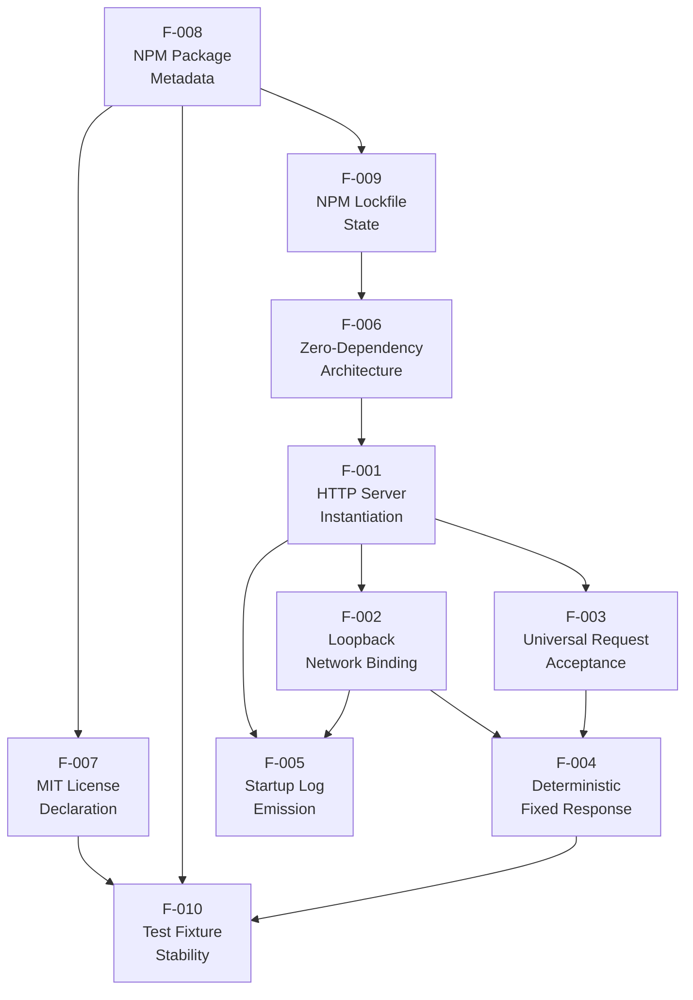
```mermaid
flowchart TD
    F006[F-006<br/>Zero-Dependency<br/>Architecture]
    F009[F-009<br/>NPM Lockfile<br/>State]
    F008[F-008<br/>NPM Package<br/>Metadata]
    F007[F-007<br/>MIT License<br/>Declaration]
    F001[F-001<br/>HTTP Server<br/>Instantiation]
    F002[F-002<br/>Loopback<br/>Network Binding]
    F003[F-003<br/>Universal Request<br/>Acceptance]
    F004[F-004<br/>Deterministic<br/>Fixed Response]
    F005[F-005<br/>Startup Log<br/>Emission]
    F010[F-010<br/>Test Fixture<br/>Stability]

    F006 --> F001
    F009 --> F006
    F008 --> F007
    F008 --> F009
    F001 --> F002
    F001 --> F003
    F001 --> F005
    F002 --> F004
    F002 --> F005
    F003 --> F004
    F007 --> F010
    F008 --> F010
    F004 --> F010
```

#### Dependency Interpretation

| Edge | Evidence |
|---|---|
| F-006 → F-001 | `require('http')` is a Node.js built-in, made viable by the zero-dependency posture |
| F-009 → F-006 | Lockfile records the empty dependency tree, locking F-006's invariant |
| F-008 → F-007 | License is declared inside the npm manifest |
| F-008 → F-009 | Lockfile mirrors and inherits manifest identity |
| F-001 → F-002 | A server instance must exist before `listen` can bind it |
| F-001 → F-003 | The handler callback is wired during `createServer` |
| F-001 → F-005 | The startup log is emitted from the `listen` callback registered on the server |
| F-002 → F-004 and F-003 → F-004 | Together with F-001 these features compose into deterministic responses |
| F-002 → F-005 | The log message embeds the bound `hostname`/`port` values |
| F-007 → F-010 and F-008 → F-010 | License and metadata enable embedding; stability is enforced atop them |
| F-004 → F-010 | Stability of the response payload is the primary observable that F-010 defends |

### 2.3.2 Integration Points

The system exposes exactly one integration point, consistent with §1.3.1 "Essential Integrations":

| Integration Point | Direction | Protocol | Endpoint |
|---|---|---|---|
| Backprop ↔ Server | Inbound only | HTTP/1.1 (plain text) | `http://127.0.0.1:3000/` |

No outbound integration points exist — the server initiates no network calls, no IPC, and no file I/O beyond loading `server.js` (per §1.3.2 "Integration Points Not Covered"). Cross-reference the architectural diagram in §1.2.1.

### 2.3.3 Shared Components

There is exactly one shared component across all features: the **Node.js built-in `http` module**. No internal modules exist to share because the entire runtime implementation resides in a single 14-line file. The following table enumerates the use of the shared component by feature:

| Feature | Use of `http` Module |
|---|---|
| F-001 | `http.createServer(...)` |
| F-002 | `server.listen(...)` — provided by the `http.Server` instance |
| F-003 | `IncomingMessage` (the `req` parameter type) — provided but unused |
| F-004 | `ServerResponse` methods `statusCode`, `setHeader`, `end` |
| F-005 | `listen` callback timing — provided by the `http.Server` |

### 2.3.4 Common Services

There are **no common internal services**. The system is a single process with no internal service boundaries, no shared utility modules, no logging service, no configuration service, and no persistence service (consistent with the exclusions in §1.3.2). The Node.js runtime itself is the only shared substrate.

---

## 2.4 IMPLEMENTATION CONSIDERATIONS

### 2.4.1 Technical Constraints

| Constraint | Affected Features | Source |
|---|---|---|
| Single 14-line runtime file (`server.js`) | F-001 through F-005 | `server.js` |
| Hard-coded hostname `127.0.0.1` and port `3000` (no env-var override) | F-002 | `server.js` lines 3–4; §1.3.2 |
| CommonJS module system (not ES Modules) | F-001 | `server.js` line 1 |
| No abstraction layer over Node.js built-in `http` | F-001, F-003, F-004 | §1.2.2 |
| `main` field in `package.json` references non-existent `index.js` | F-008 | §1.4.2 |
| `npm test` script is a placeholder that exits with code 1 | F-008, F-010 | §1.4.3 |
| Project name discrepancy: `hao-backprop-test` (README) vs. `hello_world` (manifest/lockfile) | F-008, F-010 | §1.4.1 |
| "Do not touch!" directive in `README.md` | All features | §1.2.3, F-010 |

### 2.4.2 Performance Requirements

| Performance Dimension | Requirement | Source |
|---|---|---|
| Cold-start time | Sub-second from `node server.js` invocation to bound socket | §1.2.3 KPI |
| Response latency | Synchronous handler execution; no async I/O in request path | F-003 derivation |
| Response determinism | 100% — byte-identical body on every invocation | §1.2.3 KPI |
| Resource footprint | Single Node.js process; no in-memory caches, sessions, or queues | §1.2.2 |

### 2.4.3 Scalability Considerations

The system is **explicitly not designed for scale**. The following limits are intentional and consistent with §1.3.2 "Unsupported Use Cases":

| Scalability Dimension | Position |
|---|---|
| Vertical scaling | Not pursued — single process, single port, no clustering |
| Horizontal scaling | Not applicable — fixture runs once per host as needed |
| Concurrent request handling | Limited to whatever the Node.js event loop affords; no shared state means no concurrency hazards |
| Multi-tenant operation | Explicitly out-of-scope (§1.3.2) |
| Production traffic | Explicitly out-of-scope ("Production HTTP traffic of any volume" — §1.3.2) |

### 2.4.4 Security Implications

| Security Concern | Mitigation / Posture | Source |
|---|---|---|
| Remote attack surface | Eliminated — loopback-only binding (F-002) | §1.2.1 |
| Authentication / Authorization | Absent — appropriate only because access is restricted to localhost | §1.3.2 |
| Input validation | Not required — no input is read (F-003) | §1.3.2 |
| Injection / XSS | Not possible — no reflected user input in response (F-004) | F-004 derivation |
| Supply-chain risk | Bounded to Node.js runtime — zero third-party dependencies (F-006) | §1.2.3 |
| License compatibility | MIT permits embedding into downstream environments (F-007) | §1.1.4 |
| Configuration tampering | Hard-coded values eliminate misconfiguration vectors; "Do not touch!" enforces baseline (F-010) | README, §1.2.3 |

### 2.4.5 Maintenance Requirements

| Maintenance Aspect | Treatment |
|---|---|
| Code modification | Prohibited by the §1.2.3 critical success factor and README directive (F-010) |
| Dependency updates | None required — no third-party packages exist (F-006) |
| Test maintenance | None required — no tests exist (§1.3.2, §1.4.3) |
| CI/CD pipeline maintenance | None required — no pipeline exists (§1.3.2) |
| Documentation maintenance | Limited to the two-line `README.md` |
| Inconsistency remediation | Deliberately deferred — the three §1.4 inconsistencies are preserved by design to maintain stability |
| Versioning | Repository remains at `1.0.0` per `package.json`; no version bumps anticipated |

---

## 2.5 TRACEABILITY MATRIX

### 2.5.1 Feature-to-Source-Evidence Matrix

| Feature ID | Primary Source Evidence | Specification Cross-Reference |
|---|---|---|
| F-001 | `server.js` lines 1, 6 | §1.2.2, §1.3.1 |
| F-002 | `server.js` lines 3, 4, 12 | §1.2.1, §1.3.1 |
| F-003 | `server.js` lines 6–10 (`req` parameter unused) | §1.2.2, §1.3.2 |
| F-004 | `server.js` lines 7–9 | §1.2.2, §1.2.3, §1.3.1 |
| F-005 | `server.js` lines 12–14 | §1.2.2, §1.3.1 |
| F-006 | `package.json`, `package-lock.json`, `server.js` line 1 | §1.2.2, §1.2.3 |
| F-007 | `package.json` `license` field; `package-lock.json` `license` field | §1.1.4, §1.3.1 |
| F-008 | `package.json` `name`, `version`, `description`, `main`, `author` | §1.1.1, §1.4.1, §1.4.2 |
| F-009 | `package-lock.json` `lockfileVersion`, `requires`, `packages` | §1.2.2 |
| F-010 | `README.md` line 2 ("Do not touch!") | §1.1.1, §1.2.3 |

### 2.5.2 Requirement-to-Specification Cross-Reference

| Requirement ID Range | Cross-Referenced Sections |
|---|---|
| F-001-RQ-001 through F-001-RQ-002 | §1.2.2 "Core Technical Approach", §1.3.1 |
| F-002-RQ-001 through F-002-RQ-003 | §1.2.1 "Integration with the Enterprise Landscape", §1.3.1 |
| F-003-RQ-001 through F-003-RQ-002 | §1.2.2, §1.3.2 (excluded routing/parsing) |
| F-004-RQ-001 through F-004-RQ-003 | §1.2.2 "Primary System Capabilities", §1.2.3 KPI |
| F-005-RQ-001 | §1.2.2, §1.3.1 |
| F-006-RQ-001 through F-006-RQ-003 | §1.2.2, §1.2.3 KPI "External dependencies = Zero" |
| F-007-RQ-001 through F-007-RQ-002 | §1.1.4, §1.3.1 |
| F-008-RQ-001 through F-008-RQ-004 | §1.1.1, §1.4.1, §1.4.2 |
| F-009-RQ-001 through F-009-RQ-003 | §1.2.2 |
| F-010-RQ-001 through F-010-RQ-002 | §1.1.1, §1.2.3 |

### 2.5.3 Feature-to-Workflow Mapping

The §1.3.1 "Primary User Workflows" map onto features as follows:

| Workflow | Engaged Features |
|---|---|
| Local server startup (`node server.js`) | F-001, F-002, F-005, F-006 (via empty `node_modules/`), F-008 (manifest identity) |
| Integration probe by backprop (any HTTP request to `http://127.0.0.1:3000/`) | F-001, F-002, F-003 |
| Response validation (status 200, body `Hello, World!\n`) | F-004 |
| Repository handling (no modifications) | F-007, F-008, F-010 |

The architectural flow diagram in §1.2.1 visualizes the relationship between the backprop client and the server endpoint that these features collectively realize.

---

## 2.6 ASSUMPTIONS, CONSTRAINTS, AND VERSION TRACKING

### 2.6.1 Documented Assumptions

| # | Assumption | Basis |
|---|---|---|
| A1 | A Node.js runtime is installed on the host where `node server.js` is invoked | `server.js` requires the `http` built-in |
| A2 | Port `3000` is available on the loopback interface at startup | `server.js` line 4 hard-codes the port |
| A3 | Backprop client processes run on the same host as the server | §1.2.1 — loopback-only binding |
| A4 | Operators invoke the runtime via `node server.js`, not `npm start` | §1.4.2 — no `start` script is defined |
| A5 | The repository will not be modified during its role as a backprop fixture | README directive; §1.2.3 critical success factor |
| A6 | npm 7+ is available for lockfile-v3 parity if `npm install` is run | F-009-RQ-001 |

### 2.6.2 Active Constraints

| # | Constraint | Source |
|---|---|---|
| C1 | All product behavior must be implemented in a single runtime file (`server.js`) | §1.2.2, §1.2.3 KPI "Source-file count = 1 runtime file" |
| C2 | Zero third-party packages allowed in any state (manifest, lockfile, or imported) | F-006, §1.2.3 KPI |
| C3 | Loopback-only network exposure; remote interfaces forbidden | F-002, §1.3.2 |
| C4 | No configuration mechanism (env vars, config files); values must remain hard-coded | §1.3.2 |
| C5 | No testing harness, CI/CD, containerization, build tooling, or lint configuration | §1.3.2 |
| C6 | The three §1.4 inconsistencies (project name, entry point, test script) are preserved by design | §1.4.1–§1.4.3 |
| C7 | Source-file stability per "Do not touch!" directive | F-010, README |

### 2.6.3 Version Tracking

| Artifact | Version | Source |
|---|---|---|
| Project (per `package.json`) | `1.0.0` | F-008-RQ-002 |
| Project (per `package-lock.json` root entry) | `1.0.0` | F-009 evidence |
| Lockfile schema | `lockfileVersion: 3` | F-009-RQ-001 |
| Specification revision | Current document (this Technical Specification) | n/a |
| Requirement-ID schema | `F-XXX-RQ-YYY` (zero-padded sequential within feature) | Section prompt |

Because the project is bound by the "Do not touch!" directive (F-010) and articulates no roadmap (§1.3.2 "Future Phase Considerations"), version progression is not anticipated. Any future evolution would require a new revision of this specification to reauthorize the scope.

---

## 2.7 REFERENCES

#### Files Examined

- `server.js` — Sole runtime implementation. Provided line-level evidence for features F-001 through F-005: HTTP module import (line 1), hostname literal `127.0.0.1` (line 3), port literal `3000` (line 4), `http.createServer` invocation (line 6), response status/headers/body (lines 7–9), `server.listen` call (line 12), and the startup `console.log` message (line 13).
- `package.json` — Source of npm package metadata for F-007 (license `MIT`), F-008 (name `hello_world`, version `1.0.0`, description, `main: index.js`, author `hxu`), and the absence of `dependencies`/`devDependencies` fields underpinning F-006.
- `package-lock.json` — Source of lockfile state evidence for F-006 (zero third-party packages), F-007 (MIT license at root), F-008 (matching identity), and F-009 (`lockfileVersion: 3`, `requires: true`, root-only `packages` map).
- `README.md` — Source of the project identity `hao-backprop-test` and the "Do not touch!" directive underpinning F-010.

#### Folders Examined

- Repository root (depth 0) — Confirmed to contain exactly four files and zero subdirectories, bounding the feature set to behaviors observable from those four files.

#### Technical Specification Sections Cross-Referenced

- §1.1 Executive Summary — Project identity, stakeholders (used for F-010 governance context), value proposition (basis for F-007 embedding rationale).
- §1.2 System Overview — Business context (§1.2.1), capability matrix and core technical approach (§1.2.2), success criteria and KPIs (§1.2.3) used as the basis for priority and acceptance criteria across F-001–F-006.
- §1.3 Scope — In-scope items (§1.3.1) supplying line-level evidence for F-001–F-005, F-007; out-of-scope items (§1.3.2) defining anti-features and bounding the feature catalog.
- §1.4 Documented Repository Inconsistencies — Source for the F-008 inconsistency annotations (§1.4.1 project name, §1.4.2 entry point, §1.4.3 test script).
- §1.5 References — Confirmed file and folder inventory used for coverage validation of the feature catalog.

# 3. Technology Stack

## 3.1 Technology Stack Overview

### 3.1.1 Strategic Posture: Zero-Dependency Architecture

The `hao-backprop-test` repository (npm package name `hello_world`) employs a deliberately **austere technology stack** that is itself a first-class architectural feature. Per §2.1.6, Feature F-006 ("Zero-Dependency Architecture") elevates the absence of third-party packages, frameworks, and external services to a *Critical priority* requirement that underpins the project's defining KPI of "External dependencies = Zero" (§1.2.3).

The stack consists of exactly four layers:

| Layer | Component | Purpose |
|---|---|---|
| Runtime | Node.js (any version supporting `http.createServer` and CommonJS `require`) | Executes the server process |
| Standard Library | Node.js built-in `http` module | Provides the HTTP listener primitive |
| Application | `server.js` (single 14-line CommonJS module) | Implements the entire product behavior |
| Metadata | `package.json`, `package-lock.json` (`lockfileVersion: 3`) | Declares package identity and proves zero third-party pinning |

This austerity is **not transitional immaturity** — it is the documented end-state, reinforced by the README's "Do not touch!" directive (§2.1.10, F-010) and the §2.6.2 constraints C1, C2, and C7. Any addition to the stack would directly violate these constraints and invalidate the fixture's role as a known-good integration target for the backprop system.

### 3.1.2 Technology Layering Diagram

The following diagram summarizes the stack and the inter-component relationships among its artifacts:

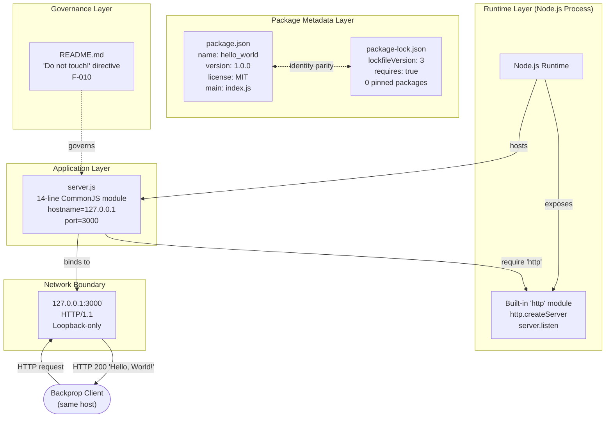
```mermaid
flowchart TB
    subgraph GovernanceLayer["Governance Layer"]
        ReadmeDoc["README.md<br/>'Do not touch!' directive<br/>F-010"]
    end

    subgraph MetadataLayer["Package Metadata Layer"]
        PkgManifest["package.json<br/>name: hello_world<br/>version: 1.0.0<br/>license: MIT<br/>main: index.js"]
        LockFile["package-lock.json<br/>lockfileVersion: 3<br/>requires: true<br/>0 pinned packages"]
    end

    subgraph ApplicationLayer["Application Layer"]
        ServerJs["server.js<br/>14-line CommonJS module<br/>hostname=127.0.0.1<br/>port=3000"]
    end

    subgraph RuntimeLayer["Runtime Layer (Node.js Process)"]
        NodeProc["Node.js Runtime"]
        HttpModule["Built-in 'http' module<br/>http.createServer<br/>server.listen"]
    end

    subgraph NetworkLayer["Network Boundary"]
        LoopbackEP["127.0.0.1:3000<br/>HTTP/1.1<br/>Loopback-only"]
    end

    BackpropClient(["Backprop Client<br/>(same host)"])

    ReadmeDoc -.governs.-> ServerJs
    PkgManifest <-.identity parity.-> LockFile
    NodeProc -->|hosts| ServerJs
    NodeProc -->|exposes| HttpModule
    ServerJs -->|require 'http'| HttpModule
    ServerJs -->|binds to| LoopbackEP
    BackpropClient -->|HTTP request| LoopbackEP
    LoopbackEP -->|HTTP 200 'Hello, World!'| BackpropClient
```

### 3.1.3 Applicability of Default Stack Components

The repository's content unambiguously places the following default-stack technologies **outside the scope** of this system, per the explicit out-of-scope catalog in §1.3.2 and the active constraints in §2.6.2:

| Default Stack Category | Default Suggestion | Applicability | Authoritative Source |
|---|---|---|---|
| Cloud Platform | AWS / GCP / Azure | **Not applicable** — loopback-only system | §1.3.2; §2.6.2 C3 |
| Containerization | Docker | **Not applicable** — no `Dockerfile` exists | §1.3.2; §2.6.2 C5 |
| Infrastructure as Code | Terraform | **Not applicable** — no deployment manifests | §1.3.2; §2.6.2 C5 |
| CI/CD | GitHub Actions | **Not applicable** — no pipeline configuration | §1.3.2; §2.6.2 C5 |
| Backend Language | Python | **Not applicable** — JavaScript/Node.js only | §1.2.2 |
| Backend Framework | Flask | **Not applicable** — no application framework used | §1.2.2; §2.1.6 F-006 |
| Authentication | Auth0 | **Not applicable** — no authentication in scope | §1.3.2; §2.4.4 |
| Database | MongoDB | **Not applicable** — system is stateless | §1.2.2; §1.3.2 |
| AI Framework | Langchain | **Not applicable** — no AI/ML functionality | §1.3.1 |
| Web Frontend | React / TypeScript / TailwindCSS | **Not applicable** — no frontend in scope | §1.3.2 |
| Mobile / Native | React-Native / Swift / Kotlin / Objective-C / ElectronJS | **Not applicable** — server-only fixture | §1.3.1 |

The sections that follow document only the technologies that are *actually present* in or *actually required* by the repository.

---

## 3.2 Programming Languages

### 3.2.1 Language Inventory

| Language | Platform / Component | Module System | Evidence |
|---|---|---|---|
| **JavaScript** (Node.js dialect) | Server-side runtime | **CommonJS** (not ES Modules) | `server.js` (entire file); `package.json` `description: "Hello world in Node.js"` |

JavaScript executed under the Node.js runtime is the **sole programming language** present in the repository. No secondary languages (Python, TypeScript, shell scripts, SQL, or compiled languages) appear in the codebase or in tooling configuration.

### 3.2.2 Selection Justification

The choice of Node.js JavaScript is uniquely well-aligned with the project's three governing KPIs (§1.2.3):

| Selection Criterion | How Node.js Satisfies It |
|---|---|
| Zero external dependencies | Node.js ships a built-in `http` module in its standard library, eliminating the need for any third-party HTTP framework (§2.1.6 F-006). |
| Single-file source minimalism | The entire product behavior is expressible in ~14 lines of CommonJS code (§2.4.1; §1.2.3 KPI "Source-file count = 1 runtime file"). |
| Sub-second cold-start | Node.js process startup of a trivial script meets the §1.2.3 KPI of "Sub-second" cold-start. |
| Portability | Any host with a Node.js runtime can execute the fixture without further installation (§1.2.3 "Critical Success Factors — Portability"). |

The use of **CommonJS** (`require('http')`) rather than ES Modules is dictated by §2.4.1 and ensures maximum backward compatibility with older Node.js releases that predate ES Module general availability.

### 3.2.3 Version Constraints and Dependencies

| Constraint Dimension | Specification |
|---|---|
| Required runtime | Node.js (per §2.6.1 Assumption A1: "A Node.js runtime is installed on the host where `node server.js` is invoked") |
| Minimum Node.js version | **Unspecified** — `package.json` declares no `engines` field |
| Effective floor | Any Node.js version supporting `http.createServer`, `server.listen(port, hostname, callback)`, and CommonJS `require` (a stable API since Node.js's earliest releases — per §2.1.1 F-001 dependencies) |
| TypeScript | **Not used** (excluded by §1.3.2: "Build Tooling: Webpack, Babel, TypeScript compilation") |
| Transpilation | **Not used** — `server.js` is executed verbatim without any build step |
| Language-level features | Restricted to features compatible with both ES5 and the CommonJS module system; no use of `import`, top-level `await`, ES Module syntax, or TypeScript-specific constructs |

The absence of an `engines` field is itself meaningful: it reflects the explicit §2.6.2 Constraint C4 prohibiting configuration mechanisms beyond hard-coded literals — and it widens the supported runtime range to maximize portability.

---

## 3.3 Frameworks & Libraries

### 3.3.1 Application Framework Posture: None

The repository uses **no application framework**. Per §1.2.2 "Core Technical Approach":

- No Express, Koa, Fastify, Hapi, or similar HTTP framework is imported, declared, or referenced.
- No routing layer, middleware pipeline, request-body parser, or error-handling layer is present.
- No templating engine, serialization library, or content-negotiation utility is loaded.

This framework-free design is enforced at three independent levels:

| Enforcement Level | Mechanism |
|---|---|
| Manifest | `package.json` declares no `dependencies` or `devDependencies` fields (§2.1.6 F-006) |
| Lockfile | `package-lock.json` `packages` map contains only the root package (§2.1.9 F-009) |
| Code | `server.js` imports only the Node.js built-in `http` module (F-006-RQ-003) |

### 3.3.2 Runtime Library: Node.js `http` Module

The single library used by `server.js` is the **Node.js built-in `http` module**, which is part of the Node.js standard library and is *not* a third-party package.

| Attribute | Value |
|---|---|
| Module name | `http` |
| Source | Node.js standard library (built-in) |
| Version | Bundled with the host Node.js runtime; no independent version |
| Import idiom | `const http = require('http');` (CommonJS) — `server.js` line 1 |
| API surface used | `http.createServer(requestListener)`, `server.listen(port, hostname, callback)`, `res.statusCode`, `res.setHeader`, `res.end(body)` |
| Justification | Provides HTTP listener primitives natively, removing the need for any framework while preserving full HTTP/1.1 compliance for backprop integration probes |

### 3.3.3 Compatibility Requirements

| Requirement | Specification | Source |
|---|---|---|
| HTTP protocol | HTTP/1.1 (Node.js `http` module default) | §2.4.4; F-004 |
| Callback contract | `server.listen` accepts `(port, hostname, callback)` signature | §2.1.2 F-002 |
| Status-line API | `res.statusCode` writable property | F-004 derivation |
| Header API | `res.setHeader(name, value)` | F-004 derivation |
| Body-write API | `res.end(string)` accepting a string literal | F-004 derivation |

All of these are stable APIs present in every actively maintained Node.js LTS release, ensuring forward compatibility without imposing a specific version floor.

---

## 3.4 Open Source Dependencies

### 3.4.1 Dependency Inventory: Zero

The repository contains **zero open-source third-party dependencies**. This is not a transient state to be remediated — it is the documented and enforced architectural outcome per §2.1.6 F-006 ("Zero-Dependency Architecture") and §2.6.2 Constraint C2.

| Dependency Class | Count | Verification Path |
|---|---|---|
| Runtime `dependencies` in `package.json` | **0** | `dependencies` field absent from manifest |
| Development `devDependencies` in `package.json` | **0** | `devDependencies` field absent from manifest |
| `peerDependencies` | **0** | Field absent |
| `optionalDependencies` | **0** | Field absent |
| Pinned packages in `package-lock.json` | **0** | `packages` map contains only the empty-string root key |
| Third-party `require()` targets in `server.js` | **0** | Only `require('http')` (Node.js built-in) is invoked |

### 3.4.2 Package Manifest Evidence

The complete `package.json` declares only baseline metadata fields (per §2.1.8 F-008):

| Field | Declared Value | Notability |
|---|---|---|
| `name` | `hello_world` | Diverges from README's `hao-backprop-test` (documented §1.4.1 inconsistency) |
| `version` | `1.0.0` | Anchors all version references (§2.6.3) |
| `description` | `Hello world in Node.js` | Confirms language and project nature |
| `main` | `index.js` | Documented §1.4.2 inconsistency — `index.js` does not exist; actual entry is `server.js` |
| `scripts.test` | `echo "Error: no test specified" && exit 1` | Documented §1.4.3 inconsistency — placeholder that exits non-zero |
| `author` | `hxu` | Identity metadata only |
| `license` | `MIT` | Enables embedding into backprop test environments (§2.1.7 F-007) |

**Notable absences** (each a deliberate enforcement of zero-dependency posture): `dependencies`, `devDependencies`, `peerDependencies`, `optionalDependencies`, `engines`, `repository`, and `scripts.start`.

### 3.4.3 Lockfile Evidence

The `package-lock.json` directly mirrors and reinforces the zero-dependency state per §2.1.9 F-009:

| Lockfile Attribute | Value | Significance |
|---|---|---|
| `name` | `hello_world` | Matches `package.json` (identity parity) |
| `version` | `1.0.0` | Matches `package.json` (version parity) |
| `lockfileVersion` | `3` | Modern lockfile format introduced in npm 7+ (§2.6.1 A6) |
| `requires` | `true` | Modern semantics — required when `lockfileVersion ≥ 2` |
| `packages` map | Contains only the root package (empty-string key) | Proves zero nested dependency entries |
| `license` (root entry) | `MIT` | Matches manifest license |

### 3.4.4 Package Registry and Supply-Chain Posture

| Aspect | Position |
|---|---|
| Package registry | npm public registry (`registry.npmjs.org`) is implied by the `package.json` / `package-lock.json` format, **but no packages are actually fetched** — the lockfile pins zero modules. |
| Lockfile schema authority | npm 7+ (per §2.6.1 Assumption A6: "npm 7+ is available for lockfile-v3 parity if `npm install` is run") |
| Supply-chain risk | "Bounded to Node.js runtime — zero third-party dependencies" (per §2.4.4 Security Implications) |
| `node_modules/` post-install state | Empty — verified by §1.2.3 KPI: "`node_modules/` remains empty after `npm install`" |
| License compatibility | MIT permits embedding into downstream test harnesses without licensing friction (§2.1.7 F-007) |

The following diagram visualizes the dependency-tree evidence chain:

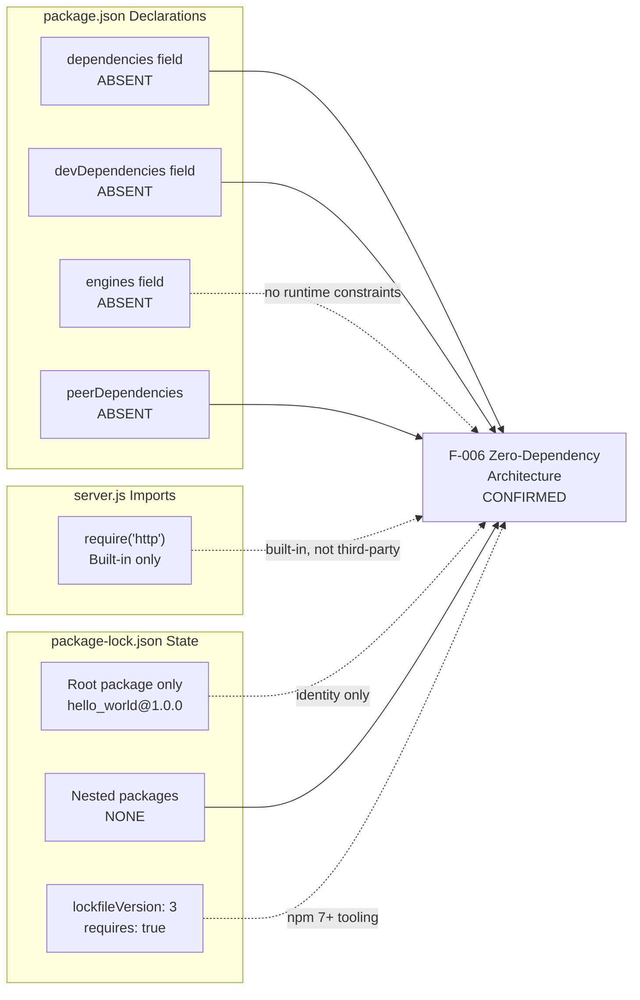
```mermaid
flowchart LR
    subgraph ManifestEvidence["package.json Declarations"]
        DepsField["dependencies field<br/>ABSENT"]
        DevDepsField["devDependencies field<br/>ABSENT"]
        EnginesField["engines field<br/>ABSENT"]
        PeerDepsField["peerDependencies<br/>ABSENT"]
    end

    subgraph LockfileEvidence["package-lock.json State"]
        RootEntry["Root package only<br/>hello_world@1.0.0"]
        NestedEntries["Nested packages<br/>NONE"]
        LockVer["lockfileVersion: 3<br/>requires: true"]
    end

    subgraph CodeEvidence["server.js Imports"]
        HttpImport["require('http')<br/>Built-in only"]
    end

    ZeroDepResult["F-006 Zero-Dependency<br/>Architecture<br/>CONFIRMED"]

    DepsField --> ZeroDepResult
    DevDepsField --> ZeroDepResult
    PeerDepsField --> ZeroDepResult
    NestedEntries --> ZeroDepResult
    HttpImport -.built-in, not third-party.-> ZeroDepResult
    LockVer -.npm 7+ tooling.-> ZeroDepResult
    EnginesField -.no runtime constraints.-> ZeroDepResult
    RootEntry -.identity only.-> ZeroDepResult
```

---

## 3.5 Third-Party Services

### 3.5.1 External Service Inventory: None

The repository invokes **zero third-party external services** across every category enumerated by the prompt's default stack. Per §1.2.1 ("No outbound integrations exist; the server initiates no network calls of its own") and §1.3.2 (Integration Points Not Covered):

| Service Category | Status | Authoritative Source |
|---|---|---|
| External REST/GraphQL APIs | **None** — no outbound HTTP calls | §1.3.2 "Integration Points Not Covered: Outbound HTTP calls to other services" |
| Authentication services (Auth0, Okta, Cognito, etc.) | **None** — no auth in scope | §1.3.2 "Authentication — Excluded: No auth code; no related dependencies" |
| Authorization services / IAM | **None** — no authz in scope | §1.3.2 "Authorization — Excluded" |
| APM / Observability platforms (Datadog, New Relic, etc.) | **None** — only a single `console.log` startup line | §1.3.2 "Logging — Excluded"; §2.1.5 F-005 |
| Metrics / Tracing backends (Prometheus, Jaeger, etc.) | **None** | §1.3.2 |
| Log aggregation services (Splunk, ELK, etc.) | **None** | §1.3.2 |
| Cloud platforms (AWS, GCP, Azure) | **None** | §1.3.2 excludes all deployment manifests |
| CDN / Edge services | **None** — loopback-only | §2.6.2 C3 |
| Message brokers / Event buses (Kafka, RabbitMQ, SNS/SQS) | **None** | §1.3.2 "Message queue or event-bus connectivity" excluded |
| Email / SMS / Notification services | **None** | §1.3.1 Data Domain "None" |
| Payment / Billing APIs | **None** | §1.3.1 Data Domain "None" |
| AI/ML inference APIs | **None** | §1.3.1 Data Domain "None" |

### 3.5.2 Sole Inbound Integration

The only integration surface that exists is the **inbound HTTP endpoint** consumed by the backprop integration system from the same host:

| Integration Attribute | Specification |
|---|---|
| Direction | Inbound only (server initiates no outbound traffic) |
| Endpoint | `http://127.0.0.1:3000/` |
| Protocol | HTTP/1.1 |
| Network scope | Loopback interface only (per §2.6.2 Constraint C3) |
| Authentication | None (appropriate because access is restricted to localhost — §2.4.4) |
| Contract | Any method, any path → HTTP 200, `text/plain`, body `Hello, World!\n` (F-003, F-004) |

### 3.5.3 Configuration of External Service Connections

Not applicable — per §2.6.2 Constraint C4: "No configuration mechanism (env vars, config files); values must remain hard-coded." There are no service endpoints, API keys, secrets, or credentials to configure because there are no external services to connect to.

---

## 3.6 Databases & Storage

### 3.6.1 Persistence Inventory: None

The system is **fully stateless** and uses **no databases, no caching, no object storage, and no file-system persistence** of any kind. Per §1.2.2: "The server is stateless: no in-memory caches, no session stores, no persistence layer, and no database connectivity exist."

| Storage Category | Status | Source |
|---|---|---|
| Primary relational database (PostgreSQL, MySQL, SQL Server, Oracle) | **None** | §1.3.2 "Persistence — Excluded" |
| Primary document/NoSQL database (MongoDB, DynamoDB, Couchbase) | **None** | §1.3.2 |
| Key-value store (Redis, etcd) | **None** | §1.3.2 |
| Search engine (Elasticsearch, OpenSearch, Solr) | **None** | §1.3.2 |
| Graph database (Neo4j, Neptune) | **None** | §1.3.2 |
| Time-series database (InfluxDB, TimescaleDB) | **None** | §1.3.2 |
| Object/blob storage (S3, GCS, Azure Blob) | **None** | §1.3.2 |
| In-process caching (Memcached, in-memory LRU) | **None** | §1.2.2 |
| Session storage | **None** | §1.2.2 |
| File-system writes | **None** | §1.3.2 "File-system reads or writes beyond loading the script" excluded |

### 3.6.2 Data Persistence Strategy: Compiled-In Literal

Rather than a persistence strategy, the system uses a **compiled-in response literal**. Per §2.2.4 F-004-RQ-003: "Response body is a compiled-in literal — no external data source."

| Data Attribute | Specification |
|---|---|
| Response body | `Hello, World!\n` (literal string declared in `server.js` line 9) |
| Source of truth | Source code itself; no database, no config file, no template |
| Mutability at runtime | None — value is set in a `const`-equivalent literal position |
| Data domain | "None — no data is read, written, persisted, or processed beyond a hard-coded literal" (per §1.3.1) |

### 3.6.3 Statelessness Rationale

Statelessness is foundational to the §1.2.3 KPI of "Response determinism: 100% — identical body for every request." The §2.4.3 scalability table confirms: "no shared state means no concurrency hazards" — a property that allows arbitrary concurrent backprop probes without race conditions or data corruption.

---

## 3.7 Development & Deployment

### 3.7.1 Development Toolchain

The development surface is intentionally minimal. The §1.3.2 exclusions and §2.6.2 Constraint C5 ("No testing harness, CI/CD, containerization, build tooling, or lint configuration") rule out virtually every conventional development tool.

| Tool Category | Status | Source |
|---|---|---|
| Version control | **Git** (repository present with GitHub remote) | Repository observation; standard `.git/` directory |
| Editor configuration | **None enforced** — no `.editorconfig`, `.vscode/`, or equivalent | §1.3.2 |
| Linter | **None** — no `.eslintrc`, `eslint.config.js`, or equivalent | §1.3.2 "Linting/Formatting — Excluded" |
| Formatter | **None** — no `.prettierrc` or equivalent | §1.3.2 |
| Type checker | **None** — no TypeScript, no JSDoc typing | §1.3.2 |
| Test framework | **None** — no `test/` directory; `npm test` is a placeholder that exits with code 1 | §1.3.2; §1.4.3 |
| Package manager | **npm 7+** (required for lockfile-v3 parity per §2.6.1 A6) | §2.1.9 F-009 |
| Documentation generator | **None** — only a two-line `README.md` | §1.3.2 |

### 3.7.2 Build System

**No build system is used.** Per §1.3.2: "Build Tooling: Webpack, Babel, TypeScript compilation — No build configuration files."

| Build Concern | Treatment |
|---|---|
| Bundling | Not required — single file, no module graph beyond `require('http')` |
| Transpilation | Not required — source executes verbatim on Node.js |
| Minification | Not applicable — no client-side delivery |
| Asset pipeline | Not applicable — no static assets |
| Code generation | None |
| Build command | None — runtime invocation is `node server.js` directly |

### 3.7.3 Containerization & Infrastructure as Code

| Concern | Status | Source |
|---|---|---|
| Docker / OCI containers | **None** — no `Dockerfile` exists in the repository | §1.3.2 "Containerization: Dockerfile, container manifests — Not present" |
| `docker-compose.yml` | **None** | §1.3.2 |
| Kubernetes manifests (Helm charts, raw YAML) | **None** | §1.3.2 |
| Terraform / Pulumi / CDK / CloudFormation | **None** — no IaC of any kind | §1.3.2 |
| Cloud-native deployment descriptors | **None** | §1.3.2 |

### 3.7.4 CI/CD Posture

| Aspect | Position | Source |
|---|---|---|
| In-repository CI configuration | **None** — no `.github/workflows/`, no `.gitlab-ci.yml`, no `Jenkinsfile`, no `.circleci/`, no equivalent | §1.3.2 "CI/CD: Pipelines, deployment manifests — No CI configuration files in repository" |
| Pipeline maintenance burden | "None required — no pipeline exists" (per §2.4.5) | §2.4.5 |
| Hosting platform | The repository is hosted on GitHub, but contains no tracked CI/CD workflow files | Repository observation |
| Implication for `npm test`-based pipelines | "Any CI process that invokes `npm test` will observe a non-zero exit status" because the script is a placeholder that exits with code 1 (§1.4.3) | §1.4.3 |

### 3.7.5 Deployment Model

The deployment model is **manual local invocation**.

| Deployment Aspect | Specification | Source |
|---|---|---|
| Invocation command | `node server.js` (executed from the repository root) | §2.6.1 A4 |
| Alternative `npm start` | **Not supported** — no `start` script exists in `package.json` (§1.4.2) | §1.4.2; §2.6.1 A4 |
| Process supervisor | None bundled (no PM2, no systemd unit, no launchd plist) | §1.3.2 |
| Service discovery | None — fixed loopback endpoint at `127.0.0.1:3000` | §2.1.2 F-002 |
| Graceful shutdown | Not implemented — "No SIGTERM/SIGINT handlers" (per §1.3.2) | §1.3.2 |
| Deployment automation | None — manually invoked | §2.4.5 |
| Network exposure | Loopback only; remote interfaces forbidden by §2.6.2 Constraint C3 | §2.6.2 C3 |

### 3.7.6 Development & Deployment Workflow Diagram

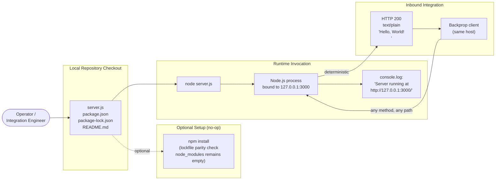
```mermaid
flowchart LR
    Developer(["Operator /<br/>Integration Engineer"])

    subgraph LocalRepo["Local Repository Checkout"]
        Files["server.js<br/>package.json<br/>package-lock.json<br/>README.md"]
    end

    subgraph OptionalInstall["Optional Setup (no-op)"]
        NpmInstall["npm install<br/>(lockfile parity check<br/>node_modules remains empty)"]
    end

    subgraph RuntimeInvocation["Runtime Invocation"]
        NodeCmd["node server.js"]
        ServerProc["Node.js process<br/>bound to 127.0.0.1:3000"]
        StartupLog["console.log:<br/>'Server running at<br/>http://127.0.0.1:3000/'"]
    end

    subgraph IntegrationPath["Inbound Integration"]
        BackpropProbe["Backprop client<br/>(same host)"]
        FixedResponse["HTTP 200<br/>text/plain<br/>'Hello, World!\n'"]
    end

    Developer --> Files
    Files -.optional.-> NpmInstall
    Files --> NodeCmd
    NodeCmd --> ServerProc
    ServerProc --> StartupLog
    BackpropProbe -->|any method, any path| ServerProc
    ServerProc -->|deterministic| FixedResponse
    FixedResponse --> BackpropProbe
```

---

## 3.8 Component Integration and Version Summary

### 3.8.1 Inter-Component Integration Map

Because the system is a single-file implementation with no internal module boundaries, integration concerns reduce to relationships among the four repository artifacts and the Node.js runtime (per §2.3 Feature Relationships):

| Component A | Component B | Relationship | Notes |
|---|---|---|---|
| `server.js` | Node.js built-in `http` module | CommonJS `require('http')` | Sole runtime linkage |
| `package.json` | `package-lock.json` | Mutual identity reference (`name`, `version`, `license`) | Required for npm install determinism |
| `package.json` `main: index.js` | Repository file system | **Documented inconsistency** — `index.js` does not exist; actual entry is `server.js` | §1.4.2 |
| `README.md` project name | `package.json` `name` | **Documented inconsistency** — `hao-backprop-test` vs. `hello_world` | §1.4.1 |
| Backprop client | `server.js` HTTP listener | HTTP/1.1 over loopback at `http://127.0.0.1:3000/` | Sole runtime integration surface |

### 3.8.2 Consolidated Version Summary

Per §2.6.3, the following version anchors apply across the technology stack:

| Artifact | Version | Source |
|---|---|---|
| Project (per `package.json`) | `1.0.0` | F-008 evidence |
| Project (per `package-lock.json` root entry) | `1.0.0` | F-009 evidence |
| Lockfile schema | `lockfileVersion: 3` | F-009-RQ-001 |
| Node.js runtime | Unspecified (no `engines` field); any version supporting CommonJS `require` and `http.createServer` | §2.1.1 F-001 |
| npm CLI tooling expectation | **npm 7+** (for lockfile-v3 parity) | §2.6.1 A6 |
| License (manifest and lockfile) | `MIT` | F-007 |
| Module system | CommonJS (not ES Modules) | §2.4.1 |
| HTTP protocol | HTTP/1.1 (Node.js `http` default) | §2.4.4; F-004 |

Because the project is bound by the "Do not touch!" directive (F-010) and articulates no roadmap (per §2.6.3), version progression of any stack component is not anticipated. Any future evolution would require a new revision of this specification.

### 3.8.3 Security Posture of the Stack

The stack's minimalism is itself a security strategy. Per §2.4.4 ("Security Implications"), the following posture is achieved with no security tooling added:

| Security Concern | Mitigation via Stack Choice |
|---|---|
| Remote attack surface | Eliminated by loopback-only binding (F-002) — no public network exposure |
| Authentication / Authorization absence | Acceptable because access is restricted to localhost (§2.4.4) |
| Input validation | Not required — request input is never read (F-003) |
| Injection / XSS | Not possible — no reflected user input in response (F-004) |
| Supply-chain risk | Bounded to the Node.js runtime; zero third-party packages means zero transitive supply-chain exposure (F-006) |
| License compatibility | MIT permits embedding into downstream environments (F-007) |
| Configuration tampering | Mitigated — hard-coded values eliminate misconfiguration vectors; "Do not touch!" enforces baseline (F-010) |
| Secrets management | Not applicable — no secrets exist because no external services are called |

---

## 3.9 References

#### Repository Files Examined

- `server.js` — Sole runtime artifact; established JavaScript/Node.js as the only language, CommonJS as the module system, and the `http` built-in module as the only library dependency.
- `package.json` — Established the zero-dependency posture (absence of `dependencies`, `devDependencies`, `engines`, `peerDependencies`), the `1.0.0` version anchor, MIT licensing, and the §1.4.2 entry-point inconsistency.
- `package-lock.json` — Confirmed `lockfileVersion: 3`, zero pinned packages, and version/license parity with the manifest (basis for F-009 and the npm 7+ tooling requirement).
- `README.md` — Established the "Do not touch!" governance directive, the `hao-backprop-test` project name (§1.4.1 inconsistency), and the project's role as a backprop integration fixture.

#### Repository Folders Explored

- Repository root `/` — Confirmed to contain exactly four files and no subdirectories beyond `.git/`, bounding the technology stack inventory to artifacts observable from these four files.

#### Technical Specification Sections Cross-Referenced

- §1.2 System Overview — Core technical approach ("framework-free and dependency-free"); KPIs anchoring the zero-dependency posture.
- §1.3 Scope — Authoritative source for the in-scope inventory and the extensive out-of-scope catalog used to justify omissions from the prompt's default stack.
- §1.4 Documented Repository Inconsistencies — Project identity (§1.4.1), entry-point (§1.4.2), and test-script (§1.4.3) inconsistencies referenced throughout the stack documentation.
- §2.1 Feature Catalog — Feature F-001 (HTTP Server Instantiation), F-002 (Loopback Network Binding), F-005 (Startup Log Emission), F-006 (Zero-Dependency Architecture), F-007 (MIT License), F-008 (NPM Package Metadata), F-009 (NPM Lockfile State Preservation), and F-010 (Test Fixture Stability Directive) — all directly grounding stack decisions.
- §2.4 Implementation Considerations — Technical constraints (§2.4.1), performance requirements (§2.4.2), scalability posture (§2.4.3), security implications (§2.4.4), and maintenance requirements (§2.4.5).
- §2.6 Assumptions, Constraints, and Version Tracking — Assumptions A1–A6, Constraints C1–C7, and the consolidated version anchors used in §3.8.2.

# 4. Process Flowchart

This section documents the runtime workflows of the `hao-backprop-test` repository: how the Node.js process starts, how inbound HTTP requests are serviced, how data flows across the loopback boundary to the backprop integration system, and how state — to the extent that state exists at all — transitions throughout the process lifecycle.

Because the repository is a **deliberately minimal test fixture** governed by a "Do not touch!" stability directive, several workflow categories that would ordinarily populate this section (multi-step business processes, branching decision logic, error recovery, retry loops, batch sequences, event-driven flows) are either trivialized or explicitly absent. Per the design captured in §1.3.2 and §2.4, this section documents both **what is present** and **what is explicitly absent**, since acknowledging the absences is itself architecturally significant.

All flowchart content is grounded in the 14-line `server.js` runtime, the manifest pair (`package.json` / `package-lock.json`), the `README.md` directive, and the cross-referenced specification sections cited inline.

---

## 4.1 SYSTEM WORKFLOW OVERVIEW

### 4.1.1 Workflow Catalog

The Traceability Matrix in §2.5.3 enumerates the project's primary workflows. They are reproduced and expanded here as the spine of this section:

| Workflow ID | Name | Trigger | Engaged Features | Cross-Reference |
|---|---|---|---|---|
| **W1** | Local Server Startup | Operator executes `node server.js` from the repository root | F-001, F-002, F-005, F-006, F-008 | §1.3.1, §2.5.3 |
| **W2** | Integration Probe by Backprop | Any HTTP request issued to `http://127.0.0.1:3000/` | F-001, F-002, F-003 | §1.3.1, §2.5.3 |
| **W3** | Response Validation | Backprop client inspects returned status and body | F-004 | §1.3.1, §2.5.3 |
| **W4** | Repository Handling (no modifications) | Continuous (governance constraint) | F-007, F-008, F-010 | §2.5.3, §2.6.2 C7 |

Workflows W2 and W3 are tightly coupled — W3 is performed by the same caller that initiates W2, immediately upon receipt of the response. Workflow W4 is a non-runtime governance workflow enforced through human discipline and the "Do not touch!" directive of `README.md`.

### 4.1.2 High-Level System Workflow Diagram

The following diagram unifies the four workflows into a single end-to-end view, aligning with the system context already established in §1.2.1 and the deployment view in §3.7.6:

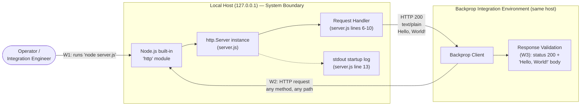
```mermaid
flowchart LR
    Operator(["Operator /<br/>Integration Engineer"])

    subgraph LocalHost["Local Host (127.0.0.1) — System Boundary"]
        HttpModule["Node.js built-in<br/>'http' module"]
        ServerInstance["http.Server instance<br/>(server.js)"]
        Handler["Request Handler<br/>(server.js lines 6-10)"]
        StartupLog["stdout startup log<br/>(server.js line 13)"]
        HttpModule --> ServerInstance
        ServerInstance --> Handler
    end

    subgraph Backprop["Backprop Integration Environment (same host)"]
        BackpropClient["Backprop Client"]
        Validation["Response Validation<br/>(W3): status 200 +<br/>'Hello, World!' body"]
        BackpropClient --> Validation
    end

    Operator -->|"W1: runs 'node server.js'"| HttpModule
    ServerInstance -.-> StartupLog
    BackpropClient -->|"W2: HTTP request<br/>any method, any path"| HttpModule
    Handler -->|"HTTP 200<br/>text/plain<br/>Hello, World!"| BackpropClient
```

### 4.1.3 Actors, System Boundaries, and Touchpoints

| Actor / System | Role | Touchpoint | Source |
|---|---|---|---|
| **Operator / Integration Engineer** | Invokes the runtime; observes startup log | Shell invocation `node server.js`; stdout | §2.6.1 A4; F-005 |
| **Node.js Runtime** | Hosts the process, the event loop, and the `http` built-in | Native Node.js APIs | §3.2, §3.3 |
| **`server.js` Application Code** | Defines server instance, handler, and bind parameters | In-process module | `server.js` |
| **Backprop Client** | Issues inbound HTTP requests; validates responses | TCP connection to `127.0.0.1:3000` | §1.2.1, §2.3.2 |

The **system boundary** is the Node.js process running on the loopback interface. The sole boundary-crossing protocol is HTTP/1.1 over TCP, restricted to the `127.0.0.1` interface per §2.6.2 Constraint C3. There are no other ingress or egress channels: no outbound HTTP calls, no message-queue connections, no database links, no file I/O beyond initial script load (per §3.5.1 and §3.6.1).

---

## 4.2 CORE BUSINESS PROCESS FLOWS

### 4.2.1 W1 — Server Startup Process Flow

The startup workflow is the only multi-step process in the system. It executes linearly through `server.js` lines 1–14 with no conditional branches.

#### Step-by-Step Process

| Step | Source Line | Operation | Requirement |
|---|---|---|---|
| 1 | `server.js` line 1 | Load Node.js built-in `http` module via CommonJS `require('http')` | F-001-RQ-001 |
| 2 | `server.js` line 3 | Define `hostname` constant `'127.0.0.1'` | F-002-RQ-001 |
| 3 | `server.js` line 4 | Define `port` constant `3000` | F-002-RQ-002 |
| 4 | `server.js` line 6 | Invoke `http.createServer(handler)`; obtain `http.Server` instance | F-001-RQ-002 |
| 5 | `server.js` line 12 | Invoke `server.listen(port, hostname, callback)` | F-002-RQ-003 |
| 6 | `server.js` line 13 | Listen callback fires; emit `console.log('Server running at http://127.0.0.1:3000/')` | F-005-RQ-001 |
| 7 | (implicit) | Process enters event-loop wait state; ready to receive HTTP connections | §1.2.3 KPI |

#### Startup Flow Diagram

The diagram below shows the linear startup path. Note the single implicit decision point at step 5 (port availability), which is treated as Assumption A2 in §2.6.1 rather than a handled branch — failure here propagates as an unhandled Node.js `EADDRINUSE` error.

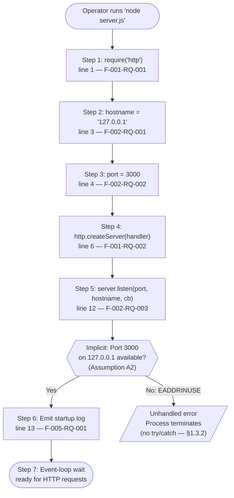
```mermaid
flowchart TD
    Start([Operator runs 'node server.js']) --> S1["Step 1: require('http')<br/>line 1 — F-001-RQ-001"]
    S1 --> S2["Step 2: hostname = '127.0.0.1'<br/>line 3 — F-002-RQ-001"]
    S2 --> S3["Step 3: port = 3000<br/>line 4 — F-002-RQ-002"]
    S3 --> S4["Step 4: http.createServer(handler)<br/>line 6 — F-001-RQ-002"]
    S4 --> S5["Step 5: server.listen(port, hostname, cb)<br/>line 12 — F-002-RQ-003"]
    S5 --> PortCheck{{"Implicit: Port 3000<br/>on 127.0.0.1 available?<br/>(Assumption A2)"}}
    PortCheck -->|Yes| S6["Step 6: Emit startup log<br/>line 13 — F-005-RQ-001"]
    PortCheck -->|"No: EADDRINUSE"| Crash[/"Unhandled error<br/>Process terminates<br/>(no try/catch — §1.3.2)"/]
    S6 --> S7([Step 7: Event-loop wait<br/>ready for HTTP requests])
```

#### Timing & SLA Considerations

Per §2.4.2 the entire seven-step sequence must complete within the **sub-second cold-start budget** mandated by §1.2.3 KPI "Cold-start time". There are no asynchronous steps in the startup path; all module loading and binding occur synchronously, with the final transition to "Listening" triggered by the `listen` callback once the TCP bind completes.

#### Business Rules and Validation at Startup

Per §2.2.1 and §2.2.2, the following business and security rules apply during startup:

| Rule | Enforcement Point | Source |
|---|---|---|
| The server instance must be created exactly once per process | Step 4 | F-001 Validation Rules |
| The `require` target must be the built-in `http` module, never a shadowing third-party package | Step 1 | F-001 Validation Rules |
| Bind must be loopback-only — binding to `0.0.0.0` or a routable interface is forbidden | Step 5 | F-002 Validation Rules; §2.6.2 C3 |
| Hostname and port must remain the hard-coded literals `'127.0.0.1'` and `3000` | Steps 2–3 | F-002-RQ-001/002; §2.6.2 C4 |
| Endpoint URL must be exactly `http://127.0.0.1:3000/` | Step 5 | F-002 Validation Rules |

### 4.2.2 W2 — Inbound HTTP Request Process Flow

The request-handling workflow has **no decision branches**. Per §2.2.3 acceptance criterion F-003-RQ-001, "Static inspection of `server.js` lines 6–10 confirms absence of any `req.url`, `req.method`, or routing constructs (`switch`, `if`, route table)." The handler is a four-statement linear path.

#### Step-by-Step Process

| Step | Source Line | Operation | Requirement |
|---|---|---|---|
| 1 | TCP layer | Inbound TCP connection from same-host client to `127.0.0.1:3000` | F-002 |
| 2 | `http` module | Node.js `http` module parses HTTP/1.1 request; constructs `req` (IncomingMessage) and `res` (ServerResponse) | §3.3 |
| 3 | `server.js` line 6 | Handler callback `(req, res) => {...}` invoked; `req` parameter **never read** | F-003-RQ-002 |
| 4 | `server.js` line 7 | `res.statusCode = 200` | F-004-RQ-001 |
| 5 | `server.js` line 8 | `res.setHeader('Content-Type', 'text/plain')` | F-004-RQ-002 |
| 6 | `server.js` line 9 | `res.end('Hello, World!\n')` — write 14 ASCII bytes, terminate response | F-004-RQ-003 |
| 7 | `http` module | Node.js `http` module writes status line, headers, body to socket | §3.3 |

#### Request Flow Diagram

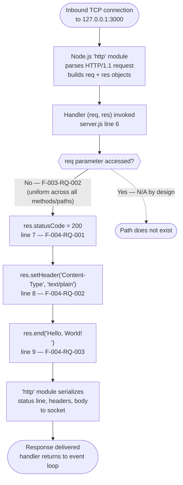
```mermaid
flowchart TD
    Req([Inbound TCP connection<br/>to 127.0.0.1:3000]) --> Parse["Node.js 'http' module<br/>parses HTTP/1.1 request<br/>builds req + res objects"]
    Parse --> Invoke["Handler (req, res) invoked<br/>server.js line 6"]
    Invoke --> ReqUnread{{"req parameter accessed?"}}
    ReqUnread -->|"No — F-003-RQ-002<br/>(uniform across all methods/paths)"| SetStatus["res.statusCode = 200<br/>line 7 — F-004-RQ-001"]
    ReqUnread -.->|"Yes — N/A by design"| Unreachable([Path does not exist])
    SetStatus --> SetHeader["res.setHeader('Content-Type', 'text/plain')<br/>line 8 — F-004-RQ-002"]
    SetHeader --> EndRes["res.end('Hello, World!\n')<br/>line 9 — F-004-RQ-003"]
    EndRes --> Serialize["'http' module serializes<br/>status line, headers, body<br/>to socket"]
    Serialize --> Done([Response delivered<br/>handler returns to event loop])
```

#### Timing & SLA Considerations

Per §2.4.2: "Synchronous handler execution; no async I/O in request path." The entire six-statement handler executes within a single event-loop tick. There are no awaited promises, no callbacks scheduled, and no I/O barriers beyond the final socket write. The §1.2.3 KPI "Response determinism = 100%" is satisfied because the response body is a compiled-in literal (per §3.6.2), eliminating all sources of variance.

### 4.2.3 W3 — Response Validation Workflow

W3 is performed externally by the backprop client and is constrained by the byte-level invariants documented in §2.2.4 F-004 Validation Rules:

| Invariant | Validation Approach | Source |
|---|---|---|
| HTTP status code equals `200` | Status-line inspection | F-004-RQ-001 |
| `Content-Type` response header equals exactly `text/plain` | Header inspection | F-004-RQ-002 |
| Response body byte-for-byte equals `Hello, World!\n` (14 ASCII bytes including trailing newline) | Byte-level comparison (whitespace-significant) | F-004-RQ-003; F-004 Validation Rules |

This validation occurs entirely in the backprop client and is opaque to `server.js`. No server-side acknowledgement or callback notifies the server that validation succeeded — once `res.end` flushes the socket, the server returns immediately to event-loop wait state.

### 4.2.4 W4 — Repository Handling Governance Workflow

W4 is a **non-runtime workflow** captured here for completeness. It governs how the repository is handled by humans rather than how it executes.

| Step | Actor | Action | Enforcement |
|---|---|---|---|
| 1 | Maintainer | Read `README.md` line 2 "Do not touch!" directive | F-010-RQ-001 |
| 2 | Maintainer | Refrain from modifying `server.js`, `package.json`, `package-lock.json`, or `README.md` | F-010-RQ-002 |
| 3 | Auditor | Periodically verify `git diff <baseline-ref> HEAD` returns empty for the four tracked files | F-010 Acceptance Criteria |
| 4 | Maintainer | Acknowledge and preserve the three §1.4 inconsistencies (project name, entry point, test script) | §2.6.2 Constraint C6 |

There are no automated guards in the repository that enforce W4; per §2.4.4 the recommendation is "Branch-protection or code-review gating recommended (external to repository)."

---

## 4.3 INTEGRATION WORKFLOWS

### 4.3.1 Integration Surface Map

The system exposes exactly **one** integration point and consumes **zero**. Per §3.5.2 the server is purely inbound.

| Attribute | Value | Source |
|---|---|---|
| Direction | Inbound only | §3.5.2 |
| Endpoint | `http://127.0.0.1:3000/` | §2.3.2 |
| Protocol | HTTP/1.1 over TCP | §3.3 |
| Network scope | Loopback (127.0.0.1) only | §2.6.2 C3 |
| Authentication | None (substituted by loopback isolation per §2.4.4) | §2.4.4; §3.5.2 |
| Contract | Any method, any path → HTTP 200, `text/plain`, `Hello, World!\n` | F-003; F-004 |
| Outbound integrations | **None** — server initiates no network calls | §1.2.1; §3.5.1 |

### 4.3.2 Inbound Integration Sequence Diagram

The following sequence diagram traces a single backprop probe end-to-end across all participants. The natural swim-lane structure of `sequenceDiagram` makes each lifeline a swim lane for one actor or system.

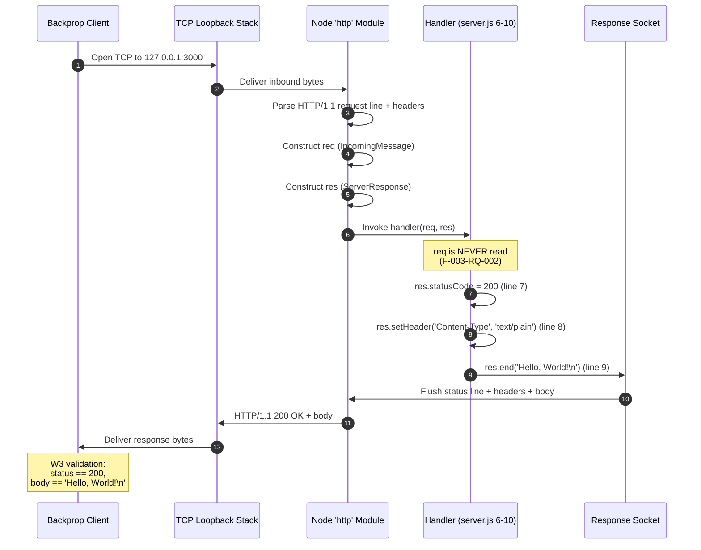
```mermaid
sequenceDiagram
    autonumber
    participant BC as Backprop Client
    participant TCP as TCP Loopback Stack
    participant HM as Node 'http' Module
    participant H as Handler (server.js 6-10)
    participant Sock as Response Socket

    BC->>TCP: Open TCP to 127.0.0.1:3000
    TCP->>HM: Deliver inbound bytes
    HM->>HM: Parse HTTP/1.1 request line + headers
    HM->>HM: Construct req (IncomingMessage)
    HM->>HM: Construct res (ServerResponse)
    HM->>H: Invoke handler(req, res)
    Note over H: req is NEVER read<br/>(F-003-RQ-002)
    H->>H: res.statusCode = 200 (line 7)
    H->>H: res.setHeader('Content-Type', 'text/plain') (line 8)
    H->>Sock: res.end('Hello, World!\n') (line 9)
    Sock->>HM: Flush status line + headers + body
    HM->>TCP: HTTP/1.1 200 OK + body
    TCP->>BC: Deliver response bytes
    Note over BC: W3 validation:<br/>status == 200,<br/>body == 'Hello, World!\n'
```

### 4.3.3 Integration Workflow with Explicit Swim Lanes

For readers preferring a swim-lane flowchart view (per the section prompt), the following diagram organizes actors as vertically separated swim lanes:

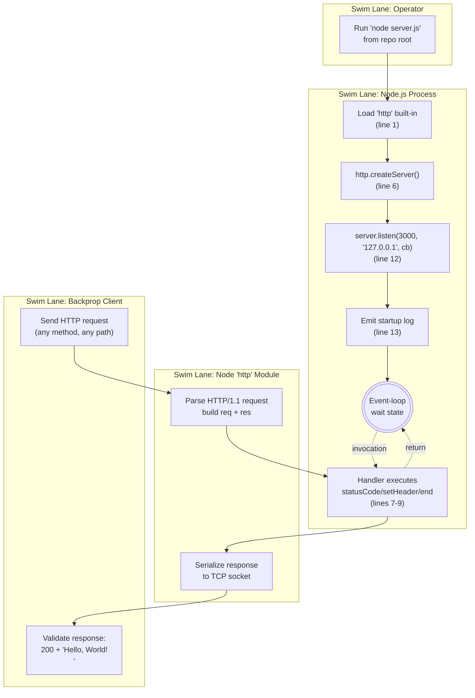
```mermaid
flowchart TB
    subgraph OperatorLane["Swim Lane: Operator"]
        OpInvoke["Run 'node server.js'<br/>from repo root"]
    end

    subgraph NodeLane["Swim Lane: Node.js Process"]
        ModLoad["Load 'http' built-in<br/>(line 1)"]
        CreateSrv["http.createServer()<br/>(line 6)"]
        DoListen["server.listen(3000, '127.0.0.1', cb)<br/>(line 12)"]
        LogLine["Emit startup log<br/>(line 13)"]
        EventLoop((("Event-loop<br/>wait state")))
        HandlerExec["Handler executes<br/>statusCode/setHeader/end<br/>(lines 7-9)"]
    end

    subgraph HttpLane["Swim Lane: Node 'http' Module"]
        ParseHttp["Parse HTTP/1.1 request<br/>build req + res"]
        WriteHttp["Serialize response<br/>to TCP socket"]
    end

    subgraph BackpropLane["Swim Lane: Backprop Client"]
        SendReq["Send HTTP request<br/>(any method, any path)"]
        ValidateRes["Validate response:<br/>200 + 'Hello, World!\n'"]
    end

    OpInvoke --> ModLoad
    ModLoad --> CreateSrv
    CreateSrv --> DoListen
    DoListen --> LogLine
    LogLine --> EventLoop
    SendReq --> ParseHttp
    ParseHttp --> HandlerExec
    HandlerExec --> WriteHttp
    WriteHttp --> ValidateRes
    EventLoop -.invocation.-> HandlerExec
    HandlerExec -.return.-> EventLoop
```

### 4.3.4 Absence of Event-Driven and Batch Workflows

Per §1.3.2 the following integration-workflow categories are **explicitly excluded** from this project and therefore have no flowcharts in this section:

| Excluded Workflow Type | Evidence of Absence | Source |
|---|---|---|
| Outbound HTTP calls to other services | "server initiates no outbound traffic" | §3.5.2; §1.2.1 |
| Message-queue / event-bus interactions | "Message queue or event-bus connectivity — Excluded" | §1.3.2 |
| Batch processing sequences | No scheduler, no queue worker, no cron — synchronous per-request handler only | §1.3.2; §2.4.3 |
| Inter-process communication (IPC) | "IPC — Excluded" | §1.3.2 |
| File-system reads/writes | Only initial script load by Node.js; no application-level I/O | §1.3.2 |
| Database connections | "no persistence layer; no ORM; no client libraries" | §1.3.2; §3.6.1 |
| Long-lived connections / WebSockets / SSE | "Long-lived connections, WebSockets, or server-sent events — Excluded" | §1.3.2 |

The absence of these workflows is itself architecturally significant: it confirms the §2.4.4 security posture that the supply-chain and remote-attack surfaces are minimized, and it confirms the §2.4.3 position that the system is "explicitly not designed for scale."

---

## 4.4 DECISION POINTS AND VALIDATION RULES

### 4.4.1 Decision Point Inventory

The system contains **one** implicit runtime decision point and **zero** application-level decision branches. This is by design (F-003).

| Decision Point | Location | Type | Handled? | Source |
|---|---|---|---|---|
| Port 3000 availability on bind | `server.listen()` at `server.js` line 12 | Implicit OS-level decision | **No** — treated as Assumption A2; failure crashes the process | §2.6.1 A2 |
| URL routing by path | (would be in handler) | Application-level | **Absent by design** | F-003-RQ-001; §1.3.2 |
| HTTP method dispatch | (would be in handler) | Application-level | **Absent by design** | F-003-RQ-001; §1.3.2 |
| Request header inspection | (would be in handler) | Application-level | **Absent by design** | F-003-RQ-002 |
| Request body parsing | (would be in handler) | Application-level | **Absent by design** | F-003-RQ-002 |
| Authentication challenge | (would be in handler) | Cross-cutting | **Absent by design** | §1.3.2; §2.4.4 |
| Authorization checkpoint | (would be in handler) | Cross-cutting | **Absent by design** | §1.3.2; §2.4.4 |
| Input validation branch | (would be in handler) | Cross-cutting | **Absent by design** | §1.3.2; §2.4.4 |
| Error catch/recover branch | (would be anywhere in `server.js`) | Cross-cutting | **Absent by design** | §1.3.2 |

The uniformity of behavior across all HTTP methods and paths is asserted as a hard business rule by F-003 Validation Rules: "Behavior must be uniform across all HTTP methods and paths."

### 4.4.2 Validation Rules at Each Workflow Step

This subsection consolidates the per-step validation rules drawn from §2.2.

#### Startup Workflow (W1) Validation Rules

| Step | Validation Category | Rule | Source |
|---|---|---|---|
| 1 | Security | `require` target must be Node.js built-in `http`; no shadowing third-party package | F-001 Validation Rules |
| 1 | Compliance | Must adhere to F-006 zero-dependency posture | F-001 Validation Rules |
| 4 | Business | Server instance must be created exactly once per process | F-001 Validation Rules |
| 5 | Business | Endpoint URL must equal `http://127.0.0.1:3000/` | F-002 Validation Rules |
| 5 | Security | Bind must be loopback-only; remote interfaces forbidden | F-002 Validation Rules; §2.6.2 C3 |
| 6 | Business | Exactly one startup log line per process; no additional logging during request handling | F-005 Validation Rules |
| 6 | Security | Log content contains no secrets or user input | F-005 Validation Rules |

#### Request Workflow (W2) Validation Rules

| Step | Validation Category | Rule | Source |
|---|---|---|---|
| 3 | Business | Behavior uniform across all HTTP methods and paths | F-003 Validation Rules |
| 3 | Data | "N/A — no input data is consumed, so no validation can be applied" | F-003 Validation Rules |
| 3 | Security | No request body parsing eliminates the input-validation attack surface; loopback-only binding mitigates trust concerns | F-003 Validation Rules |
| 4–6 | Business | Response payload must be invariant across every invocation | F-004 Validation Rules |
| 4–6 | Data | Body comparison is byte-level, not string-level (trailing newline significant) | F-004 Validation Rules |
| 4–6 | Security | No reflected input in the response eliminates injection vectors | F-004 Validation Rules |

#### Authorization and Compliance Checkpoints

Per §2.4.4 there are **no authorization checkpoints and no regulatory compliance checks** anywhere in the workflows. The mitigating posture is:

| Concern | Mitigation | Source |
|---|---|---|
| Authentication / Authorization | "Absent — appropriate only because access is restricted to localhost" | §2.4.4 |
| Input validation | "Not required — no input is read" | §2.4.4 |
| Configuration tampering | Hard-coded values eliminate misconfiguration vectors; "Do not touch!" enforces baseline | §2.4.4 |

### 4.4.3 The Single Implicit Decision Branch: Port Availability

The only runtime branch that genuinely exists is in the Node.js `http` module's `listen()` implementation. From the application's perspective this is invisible: there is no `try/catch` around `server.listen` in `server.js`. The branch is captured by §2.6.1 Assumption A2 — "Port `3000` is available on the loopback interface at startup" — and a violation of that assumption surfaces as an unhandled `EADDRINUSE` error that terminates the process.

---

## 4.5 STATE MANAGEMENT

### 4.5.1 Statelessness Posture

Per §3.6 and §2.4.3 the system is **fully stateless at the application level**:

| State Concern | Status | Source |
|---|---|---|
| Application state (per-user, per-session, per-transaction) | None — response body is a compiled-in literal | §3.6.2; F-004 |
| In-memory caches | None | §1.2.2; §3.6.1 |
| Session stores | None | §1.2.2 |
| Databases (relational or non-relational) | None | §3.6.1; §1.3.2 |
| File-system persistence | None | §3.6.1; §1.3.2 |
| Object storage | None | §3.6.1 |
| Transaction boundaries | None — no atomic operations to bracket | §3.6.1 |

The §2.4.3 scalability table observes that "no shared state means no concurrency hazards" — a property that permits arbitrary concurrent backprop probes without race conditions. This is the **only** state-related guarantee the system offers.

### 4.5.2 Process-Level State Transitions

Although there is no business-data state, the Node.js process itself transitions through a small set of well-defined runtime states inferable from `server.js` lines 1–14. The following state diagram captures those transitions:

```mermaid
stateDiagram-v2
    [*] --> NotStarted: Operator has not<br/>yet run 'node server.js'
    NotStarted --> ModuleLoaded: require('http') succeeds<br/>(line 1)
    ModuleLoaded --> ServerCreated: http.createServer() returns<br/>http.Server instance (line 6)
    ServerCreated --> Listening: server.listen() bind succeeds<br/>callback fires; startup log emitted<br/>(lines 12-13)
    Listening --> Handling: HTTP request arrives;<br/>handler invoked
    Handling --> Listening: res.end() returns;<br/>handler completes synchronously
    Listening --> [*]: Process killed externally<br/>(no SIGTERM/SIGINT handler — §3.7.5)
    ServerCreated --> [*]: EADDRINUSE on listen()<br/>unhandled — process crashes
```

#### State Transition Notes

| Transition | Trigger | Persistence Point? | Source |
|---|---|---|---|
| `NotStarted → ModuleLoaded` | Node.js evaluates `require('http')` | None — in-memory only | F-001-RQ-001 |
| `ModuleLoaded → ServerCreated` | `http.createServer(handler)` returns | None — in-memory instance | F-001-RQ-002 |
| `ServerCreated → Listening` | TCP bind to `127.0.0.1:3000` completes; callback fires | None — socket-level state held by OS | F-002-RQ-003; F-005-RQ-001 |
| `Listening → Handling` | Inbound HTTP request | None | F-003 |
| `Handling → Listening` | `res.end()` returns | None | F-004-RQ-003 |
| `Listening → [*]` (terminal) | External signal (kill) — no handler | None — abrupt | §3.7.5 |
| `ServerCreated → [*]` (terminal) | `EADDRINUSE` from `listen()` — unhandled | None — abrupt | §2.6.1 A2 |

### 4.5.3 Per-Request Mini-State Sequence

Within a single request, the `res` object cycles through a brief sub-sequence. This is a property of the Node.js `http` module's `ServerResponse` API rather than application logic, but it is documented here for completeness:

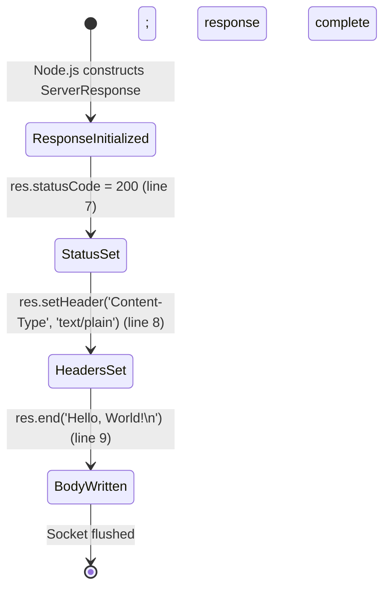
```mermaid
stateDiagram-v2
    [*] --> ResponseInitialized: Node.js constructs ServerResponse
    ResponseInitialized --> StatusSet: res.statusCode = 200 (line 7)
    StatusSet --> HeadersSet: res.setHeader('Content-Type', 'text/plain') (line 8)
    HeadersSet --> BodyWritten: res.end('Hello, World!\n') (line 9)
    BodyWritten --> [*]: Socket flushed; response complete
```

### 4.5.4 Persistence and Caching Requirements

Per §3.6.1 the system has "no databases, no caching, no object storage, and no file-system persistence." Consequently:

- **Data persistence points: none.** The response body is compiled into the source code as the literal `'Hello, World!\n'` (per §3.6.2).
- **Caching requirements: none.** The §1.2.2 capability matrix explicitly notes "no in-memory caches."
- **Transaction boundaries: none.** There are no atomic operations to bracket (§3.6.1).
- **Cache invalidation flows: not applicable.**

---

## 4.6 ERROR HANDLING

### 4.6.1 Documented Absence of Error-Handling Code

Per §1.3.2 "Error Handling: Try/catch, error responses, retries — No error-handling code present." This is reinforced by §2.4.5 ("Test maintenance: None required — no tests exist") and §3.7.5 ("Graceful shutdown: Not implemented — No SIGTERM/SIGINT handlers"). The implications for this section are:

| Error-Handling Category | Status | Source |
|---|---|---|
| Try/catch blocks | None in `server.js` | §1.3.2 |
| Error responses (4xx/5xx) | None — every request returns HTTP 200 | F-004-RQ-001 |
| Retry mechanisms | None — no error paths to retry from | §1.3.2 |
| Fallback processes | None — no alternate code paths exist | §1.3.2 |
| Error notification flows | None — only one `console.log` at startup; no error logging | §2.1 F-005; §3.5.1 |
| Recovery procedures | None — process either runs or crashes | §3.7.5 |
| Graceful shutdown handlers | None registered | §3.7.5 |
| Circuit-breaker patterns | Not applicable — no downstream services | §3.5.1 |
| Dead-letter queue / replay | Not applicable — no message queues | §1.3.2 |

### 4.6.2 Unhandled Failure Modes Flowchart

The following diagram catalogues the failure modes that exist in the runtime and traces what happens to each. Every path that involves an application-level fault terminates in process crash, because no try/catch is present:

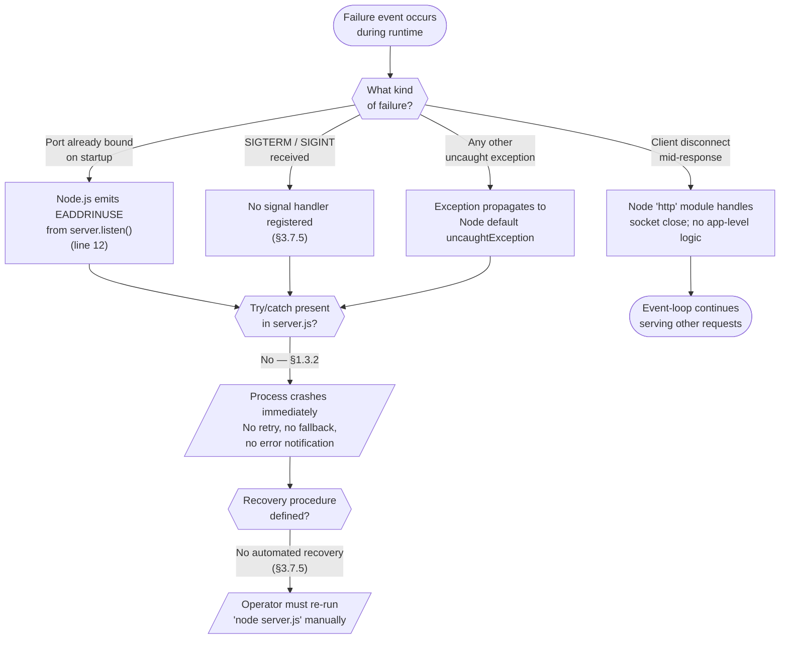
```mermaid
flowchart TD
    Failure([Failure event occurs<br/>during runtime]) --> Classify{{What kind<br/>of failure?}}

    Classify -->|"Port already bound<br/>on startup"| FailA["Node.js emits EADDRINUSE<br/>from server.listen()<br/>(line 12)"]
    Classify -->|"SIGTERM / SIGINT<br/>received"| FailB["No signal handler registered<br/>(§3.7.5)"]
    Classify -->|"Client disconnect<br/>mid-response"| FailC["Node 'http' module handles<br/>socket close; no app-level logic"]
    Classify -->|"Any other<br/>uncaught exception"| FailD["Exception propagates to<br/>Node default uncaughtException"]

    FailA --> TryCatch{{"Try/catch present<br/>in server.js?"}}
    FailB --> TryCatch
    FailD --> TryCatch
    TryCatch -->|"No — §1.3.2"| Crash[/"Process crashes immediately<br/>No retry, no fallback,<br/>no error notification"/]

    FailC --> Continue([Event-loop continues<br/>serving other requests])

    Crash --> RecoveryCheck{{"Recovery procedure<br/>defined?"}}
    RecoveryCheck -->|"No automated recovery<br/>(§3.7.5)"| ManualRestart[/"Operator must re-run<br/>'node server.js' manually"/]
```

### 4.6.3 Error-Path Editorial Note

This section deliberately documents what would otherwise be a striking omission. A typical Process Flowchart section enumerates retry policies, exponential back-off curves, dead-letter routing, error-classification taxonomies, and recovery runbooks. The `hao-backprop-test` project has none of these because it is a **single-purpose fixture, not a production system**. The §2.4.4 security posture explicitly relies on this minimalism: "Input validation: Not required — no input is read" and "Injection / XSS: Not possible — no reflected user input in response."

Any consumer of this specification who needs error-handling, retries, or graceful shutdown must understand that **adding those facilities would violate Constraint C7** ("Source-file stability per 'Do not touch!' directive") and would require a new specification revision that broadens the project's scope (per §2.6.3).

---

## 4.7 TIMING AND SLA CONSIDERATIONS

### 4.7.1 Timing Targets

| Timing Concern | Target | Workflow | Source |
|---|---|---|---|
| Cold-start time | Sub-second from `node server.js` invocation to bound socket | W1 (Startup) | §1.2.3 KPI; §2.4.2 |
| Per-request latency | Synchronous handler — no async I/O in request path | W2 (Request) | §2.4.2; F-003 |
| Response determinism | 100% — byte-identical body every call | W3 (Validation) | §1.2.3 KPI |
| Throughput | "Not designed for scale"; "explicitly not designed for scale" | All | §2.4.3 |
| Concurrent request handling | "Limited to whatever the Node.js event loop affords" | W2 | §2.4.3 |

### 4.7.2 SLA Posture

Per §2.4.3, the §1.3.2 unsupported use cases include "Production HTTP traffic of any volume." Consequently:

- **No formal SLA agreements** exist beyond the KPIs in §1.2.3.
- **No availability target** is specified; the fixture is expected to be running only when the operator explicitly invokes it.
- **No latency-percentile targets** (p50, p95, p99) are defined; the synchronous handler design makes such metrics trivially predictable but they are not formally tracked.

### 4.7.3 Concurrency Posture

Per §2.4.3: "no shared state means no concurrency hazards." Concurrent inbound requests are handled by Node.js's single-threaded event loop, with each request flowing through the same six-statement handler independently. There are no shared mutable variables, no critical sections, no locks, and no asynchronous boundaries within the handler. The application-level guarantee is that concurrent requests cannot interfere with one another at the data layer because **there is no data layer**.

---

## 4.8 SUMMARY OF WORKFLOW POSTURE

The Process Flowchart section confirms that the `hao-backprop-test` repository implements three substantive workflows (W1 Startup, W2 Request, W3 Validation) plus one governance workflow (W4 Repository Handling). All runtime workflows are **synchronous, linear, and branch-free at the application level**. There is exactly one integration point (inbound HTTP on loopback), zero outbound integrations, zero application state, and zero error-handling code. These properties are not omissions — they are **explicit design positions** captured throughout §1.3.2, §2.4, §2.6, §3.5, §3.6, and §3.7.

This section's flowcharts therefore reflect not just what the system does, but also what it has been intentionally designed not to do. Any future workflow elaboration would require lifting the §2.6.2 Constraint C7 ("Do not touch!") via a new specification revision per §2.6.3.

---

## 4.9 REFERENCES

#### Files Examined

- `server.js` — The complete 14-line runtime. Provided line-by-line evidence for all steps in workflows W1 (lines 1–13) and W2 (lines 6–10), including the hostname/port literals, `createServer`/`listen` invocations, request-handler statements, and the startup log line.
- `package.json` — Confirmed the absence of `dependencies`, `devDependencies`, and a `start` script; documented inconsistencies affecting W1 invocation (no `npm start` path, `main: index.js` pointing to a missing file).
- `package-lock.json` — Confirmed `lockfileVersion: 3` and zero pinned third-party packages, supporting the F-006 zero-dependency posture referenced throughout the workflows.
- `README.md` — Provided the project identity `hao-backprop-test`, the "test project for backprop integration" purpose statement, and the "Do not touch!" governance directive that underlies workflow W4.

#### Folders Explored

- Repository root (`/`) — Confirmed depth-0 flat structure with exactly four files and no subdirectories, which itself confirms that no additional workflow source files (such as `routes/`, `middleware/`, `handlers/`, `services/`) exist.

#### Technical Specification Sections Cross-Referenced

- §1.2 System Overview — Source for the high-level system context diagram (§1.2.1), capability matrix (§1.2.2), and KPI targets (§1.2.3) referenced throughout this section.
- §1.3 Scope — Source for the in-scope workflow enumeration (§1.3.1) and the extensive out-of-scope catalog (§1.3.2) used to document workflow absences.
- §1.4 Documented Repository Inconsistencies — Source for startup-workflow caveats (no `npm start`; `main` field anomaly; placeholder `npm test`).
- §2.2 Functional Requirements — Source for every step-level requirement ID (F-001-RQ-001 through F-010-RQ-002) cited in the workflow diagrams and validation tables.
- §2.3 Feature Relationships — Source for the single inbound integration point and shared-component identification (Node.js `http` module).
- §2.4 Implementation Considerations — Source for timing targets (§2.4.2), scalability posture (§2.4.3), security posture (§2.4.4), and maintenance posture (§2.4.5) referenced in workflow SLA and error-handling discussions.
- §2.5 Traceability Matrix — Source for the feature-to-workflow mapping (§2.5.3) underpinning the workflow catalog.
- §2.6 Assumptions, Constraints, and Version Tracking — Source for Assumption A2 (port availability), Assumption A4 (`node server.js` invocation), and Constraints C3, C4, C6, C7 cited in startup and governance workflows.
- §3.3 Frameworks & Libraries — Confirmed that workflows operate through Node.js built-in `http` module APIs only.
- §3.5 Third-Party Services — Source for the integration-direction asymmetry (inbound only, zero outbound).
- §3.6 Databases & Storage — Source for the statelessness rationale (no transactions, no persistence points, no caching).
- §3.7 Development & Deployment — Source for the deployment model (manual `node server.js` invocation), the absence of graceful shutdown, and the existing developer→runtime workflow diagram (§3.7.6) that informed the diagrams in this section.

# 5. System Architecture

## 5.1 HIGH-LEVEL ARCHITECTURE

### 5.1.1 System Overview

#### 5.1.1.1 Architecture Style and Rationale

The `hao-backprop-test` repository implements a **single-process, single-file, framework-free Node.js HTTP server architecture** — the most reduced form of a network-addressable service that the Node.js platform allows. The entire runtime is contained in `server.js` (15 lines), which instantiates the built-in `http` module, binds a TCP socket to the loopback interface, and returns a compiled-in literal response to every incoming request.

This architectural style — which can be characterized as **"micro-fixture"** rather than monolithic, microservice, or serverless — is deliberately chosen and is itself the most consequential architectural decision in the system. The rationale, as established in §1.1.4 and §2.4.3, is that the repository is a **target fixture for the external "backprop" system**, not a production service. Behavioral determinism, byte-identical responses, and absence of any logic that could introduce variance are the architecturally significant properties; throughput, fault tolerance, and feature breadth are explicitly out-of-scope per §1.3.2.

Per the README directive `Do not touch!`, the architecture is **frozen by governance**. Any architectural elaboration (frameworks, abstraction layers, additional files, environment-variable configuration) would violate Constraint C7 and the §1.2.3 critical success factor of "Stability of source files."

#### 5.1.1.2 Key Architectural Principles

The system embodies a small set of principles that, taken together, define the entire architecture:

- **Zero-Dependency Principle** — `package.json` declares no `dependencies`, `devDependencies`, `peerDependencies`, `optionalDependencies`, or `engines` field (Feature F-006). Supply-chain attack surface is bounded to the Node.js runtime itself.
- **Statelessness Principle** — No databases, file I/O during request handling, session stores, in-memory caches, or message queues exist. The response body is a string literal compiled into the handler closure (§3.6.2).
- **Deterministic Response Principle** — 100% of requests receive a byte-identical response (`Hello, World!\n` with HTTP 200 and `Content-Type: text/plain`) regardless of method, path, headers, or body (Feature F-003, F-004).
- **Framework-Free Principle** — Only Node.js built-in modules are used. No Express, Koa, Fastify, Hapi, middleware pipeline, routing layer, or request body parser is present (§3.3.1).
- **Loopback-Isolation Principle** — Binding is fixed at `127.0.0.1:3000` with no configuration override (Constraint C3, C4). The remote attack surface is architecturally eliminated, not just mitigated (§2.4.4).
- **Stability-by-Directive Principle** — The README's "Do not touch!" line is treated as a binding architectural constraint (Feature F-010).

#### 5.1.1.3 System Boundaries and Major Interfaces

| Boundary | Definition |
|---|---|
| Process boundary | A single Node.js process invoked via `node server.js`; no child processes, no workers |
| Network boundary | One bound TCP socket on `127.0.0.1:3000`; no outbound network calls of any kind |
| Trust boundary | Coincides with the loopback interface; any process on the same host is fully trusted |
| Code boundary | Exactly one runtime file (`server.js`); three governance/metadata files (`README.md`, `package.json`, `package-lock.json`) |

The sole boundary-crossing protocol is **HTTP/1.1 over TCP, loopback-only**. There are no other protocols (no gRPC, WebSockets, message queues, file-based IPC, or Unix domain sockets).

### 5.1.2 Core Components Table

The system contains four artifacts at the repository root, of which only one is runtime-executing code:

| Component Name | Primary Responsibility | Key Dependencies | Critical Considerations |
|---|---|---|---|
| HTTP Server (`server.js`) | Bind socket, accept requests, return literal response | Node.js built-in `http` module via CommonJS `require` | Sole runtime component; 15 lines; ignores `req` parameter entirely |
| Package Manifest (`package.json`) | Declare package identity, version, license, placeholder test script | npm tooling at build time | `main: index.js` references a non-existent file (documented inconsistency §1.4.2) |
| Dependency Lockfile (`package-lock.json`) | Reinforce zero-dependency posture at lockfile level | npm 7+ for lockfile-v3 parity (Assumption A6) | Records `lockfileVersion: 3` with zero pinned packages |
| Project Documentation (`README.md`) | Declare project identity and "Do not touch!" governance directive | None | Identity discrepancy with manifest (§1.4.1) preserved by design |

### 5.1.3 Data Flow Description

#### 5.1.3.1 Primary Data Flows

The system has exactly one primary data flow path — an **inbound HTTP request-response cycle** from the Backprop client to the server and back. The flow is synchronous, stateless, and unidirectional in the sense that no outbound calls are ever initiated by the server.

The flow proceeds as follows: the Backprop client opens a TCP connection to `127.0.0.1:3000`, transmits an HTTP/1.1 request, and the Node.js `http` module parses the request and constructs `IncomingMessage` (`req`) and `ServerResponse` (`res`) objects. The handler closure declared in `server.js` is invoked with these two objects. The handler **does not read `req` at all** — neither method, URL, headers, nor body are inspected (this is the architecturally significant decision point identified in §4.4 and §4.2.2). The handler then sets `res.statusCode = 200`, calls `res.setHeader('Content-Type', 'text/plain')`, and finally invokes `res.end('Hello, World!\n')`, which causes the Node.js `http` module to serialize the HTTP/1.1 response onto the socket. The connection is closed per HTTP/1.1 default semantics.

#### 5.1.3.2 Integration Patterns and Protocols

| Pattern | Application in This System |
|---|---|
| Request-Response | The sole interaction pattern; synchronous, blocking from the client's perspective |
| Publish-Subscribe | Not used — no event bus exists |
| Streaming | Not used — response body is a single short literal |
| Polling | Not implemented by server — clients may poll if they choose, but server is unaware |

The protocol is **HTTP/1.1 over TCP** for inbound only. The server initiates **no** outbound network communication, which means no service discovery, no DNS lookups beyond the local hosts file, no TLS handshakes, and no retries are present anywhere in the architecture.

#### 5.1.3.3 Data Transformation Points

There are **zero data transformation points** in the runtime. The response body is a string literal embedded in the handler closure (§3.6.2); no parsing, templating, serialization (JSON or otherwise), content negotiation, compression, or encoding conversion takes place. The compiled-in literal is the source of truth and the wire format simultaneously.

#### 5.1.3.4 Key Data Stores and Caches

| Data-Store Category | Presence | Notes |
|---|---|---|
| Relational database | None | No persistence layer (§3.6.1) |
| NoSQL / document store | None | Not applicable |
| In-memory cache (Redis, Memcached) | None | Stateless design eliminates the need |
| Process-local cache | None | Response body is a literal — caching it would be redundant |
| Session store | None | No sessions exist |
| Message broker | None | No asynchronous processing |
| File system persistence | None | No reads or writes during request handling |

### 5.1.4 External Integration Points

| System Name | Integration Type | Data Exchange Pattern | Protocol/Format |
|---|---|---|---|
| Backprop Client | Inbound HTTP only (sole integration) | Synchronous request-response | HTTP/1.1 over TCP, loopback-only, response is `text/plain` |

Per §3.5.1, the following categories of third-party integrations are **all absent** by design: external REST/GraphQL APIs, authentication providers, APM/observability platforms, metrics and tracing backends, log aggregation services, cloud platforms, CDN/edge networks, message brokers, email/SMS providers, payment APIs, and AI/ML inference endpoints. No SLA is contractually defined for the Backprop integration; the only commitments are the §1.2.3 KPIs (sub-second cold-start, 100% response determinism, zero dependencies).

---

## 5.2 COMPONENT DETAILS

### 5.2.1 HTTP Server Component (`server.js`)

#### 5.2.1.1 Purpose and Responsibilities

The HTTP Server is the **sole runtime component** in the system. Its responsibilities are to:

- Import the Node.js built-in `http` module via CommonJS `require('http')`.
- Declare two literal constants: `hostname = '127.0.0.1'` and `port = 3000`.
- Instantiate an HTTP server via `http.createServer(requestListener)`.
- Provide an anonymous closure as the request listener that sets status `200`, sets `Content-Type: text/plain`, and returns the body `Hello, World!\n`.
- Bind the server to the configured hostname and port via `server.listen()`.
- Emit one `console.log` line at startup announcing the listening URL.

#### 5.2.1.2 Technologies and Frameworks Used

The component uses **only Node.js built-in modules**. Specifically: the `http` module, the global `console` object, and CommonJS `require`. No external frameworks, no transpilation, no bundler, no TypeScript, and no ES Modules are involved.

#### 5.2.1.3 Key Interfaces and APIs

| API Surface | Direction | Description |
|---|---|---|
| `http.createServer(listener)` | Internal | Factory for the HTTP server instance |
| `server.listen(port, hostname, cb)` | Internal | Binds the listening socket |
| `res.statusCode = 200` | Internal | Sets the response status code |
| `res.setHeader('Content-Type', 'text/plain')` | Internal | Sets the response content type |
| `res.end('Hello, World!\n')` | Internal | Finalizes and flushes the response |
| TCP port `3000` on `127.0.0.1` | External | The single externally observable interface |

#### 5.2.1.4 Data Persistence Requirements

**None.** The response body is a compiled-in string literal (§3.6.2). No file reads, database calls, or external lookups occur during request handling.

#### 5.2.1.5 Scaling Considerations

Per §2.4.3, the component is **explicitly not designed for scale**. There is no clustering (no `cluster` module use), no `worker_threads`, no horizontal scaling guidance, no rate limiting, no concurrency control beyond what the Node.js single-threaded event loop natively provides. The system's intended deployment model is a single process running on a single host alongside the Backprop client.

### 5.2.2 Package Manifest Component (`package.json`)

#### 5.2.2.1 Purpose and Responsibilities

This file declares NPM-level identity metadata for the package. Per §1.2.2 and §3.4, it records `name: hello_world`, `version: 1.0.0`, `description: Hello world in Node.js`, `main: index.js`, `author: hxu`, and `license: MIT`, along with a `scripts.test` placeholder.

#### 5.2.2.2 Notable Architectural Absences

The following fields are deliberately absent from the manifest, consistent with the zero-dependency posture (Feature F-006):

- `dependencies` and `devDependencies` — no third-party packages are declared
- `peerDependencies` and `optionalDependencies` — no optional integrations
- `engines` — no Node.js version pin
- `repository` — no source-control URL
- `start` script — invocation is via `node server.js` directly (Assumption A4)

#### 5.2.2.3 Documented Inconsistencies

Per §1.4, the manifest contains three architecturally significant inconsistencies that are **preserved by design** under Constraint C6: the project name (`hello_world` vs. the README's `hao-backprop-test`), the `main` field (`index.js`, which does not exist; only `server.js` is present), and the `scripts.test` placeholder (which exits with code 1).

### 5.2.3 Dependency Lockfile Component (`package-lock.json`)

#### 5.2.3.1 Purpose and Responsibilities

The lockfile reinforces the zero-dependency posture at the npm tooling level. It declares `lockfileVersion: 3` and `requires: true`, with only the root package entry and zero nested dependencies recorded.

#### 5.2.3.2 Tooling Compatibility

Per Assumption A6, npm version 7 or newer is required to parse `lockfileVersion: 3` correctly. Older npm versions may still install (since no dependencies need resolution) but may not maintain lockfile parity.

### 5.2.4 Project Documentation Component (`README.md`)

#### 5.2.4.1 Purpose and Responsibilities

The README functions as a **governance artifact**, not a developer onboarding document. Its three lines establish two facts: the project identity (`hao-backprop-test`), the project purpose (test project for backprop integration), and the handling directive (`Do not touch!`).

#### 5.2.4.2 Architectural Significance

The "Do not touch!" directive (Feature F-010) is **elevated to an architectural constraint** in this system. It is referenced in Constraint C7, the §1.2.3 critical success factor of source-file stability, and §2.4.5 maintenance posture. Architectural elaboration is prohibited not by technical limitation but by explicit written directive.

### 5.2.5 Component Interaction Diagram

The following diagram shows how the four repository artifacts relate to one another at build time, run time, and operationally — synthesizing the component model at the architectural level (this diagram is distinct from the §1.2.1 system context diagram and the §3.1.2 technology layering diagram):

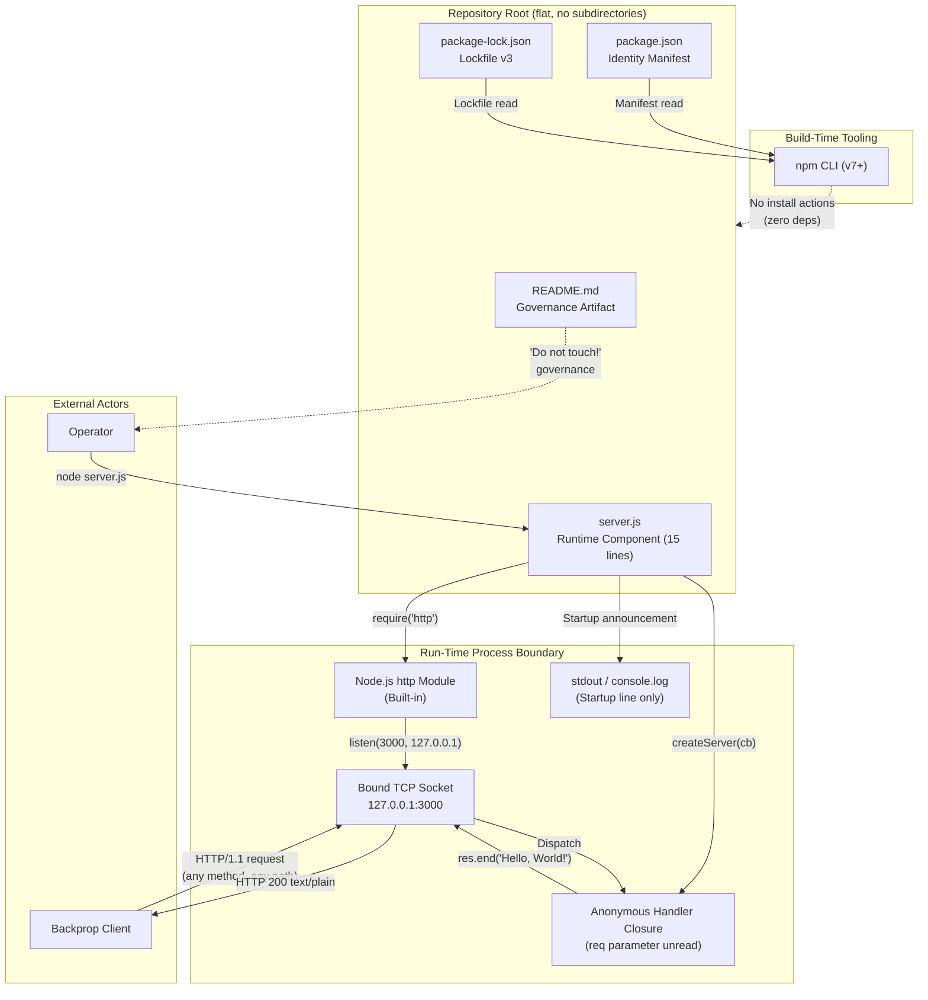
```mermaid
flowchart TB
    subgraph Repo["Repository Root (flat, no subdirectories)"]
        README["README.md<br/>Governance Artifact"]
        PKG["package.json<br/>Identity Manifest"]
        LOCK["package-lock.json<br/>Lockfile v3"]
        SRV["server.js<br/>Runtime Component (15 lines)"]
    end

    subgraph BuildTime["Build-Time Tooling"]
        NPM["npm CLI (v7+)"]
    end

    subgraph RunTime["Run-Time Process Boundary"]
        HTTP["Node.js http Module<br/>(Built-in)"]
        HANDLER["Anonymous Handler Closure<br/>(req parameter unread)"]
        SOCKET["Bound TCP Socket<br/>127.0.0.1:3000"]
        CONSOLE["stdout / console.log<br/>(Startup line only)"]
    end

    subgraph Actors["External Actors"]
        OP["Operator"]
        BP["Backprop Client"]
    end

    README -.->|"'Do not touch!'<br/>governance"| OP
    PKG -->|"Manifest read"| NPM
    LOCK -->|"Lockfile read"| NPM
    NPM -.->|"No install actions<br/>(zero deps)"| Repo

    OP -->|"node server.js"| SRV
    SRV -->|"require('http')"| HTTP
    SRV -->|"createServer(cb)"| HANDLER
    HTTP -->|"listen(3000, 127.0.0.1)"| SOCKET
    SRV -->|"Startup announcement"| CONSOLE

    BP -->|"HTTP/1.1 request<br/>(any method, any path)"| SOCKET
    SOCKET -->|"Dispatch"| HANDLER
    HANDLER -->|"res.end('Hello, World!')"| SOCKET
    SOCKET -->|"HTTP 200 text/plain"| BP
```

### 5.2.6 Component State Transitions

The HTTP Server component exhibits two state machines: a **process-level lifecycle** (running once per invocation) and a **per-request response lifecycle** (running once per inbound HTTP request). These are documented in §4.5.2 and §4.5.3 respectively. The diagram below presents an **architectural composite** showing both state machines and their relationship:

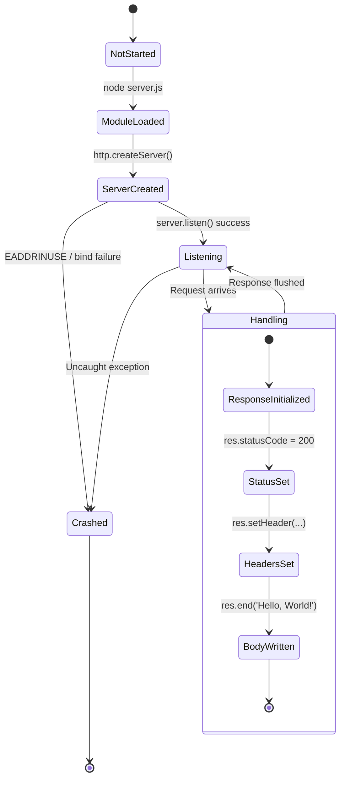
```mermaid
stateDiagram-v2
    [*] --> NotStarted
    NotStarted --> ModuleLoaded: node server.js
    ModuleLoaded --> ServerCreated: http.createServer()
    ServerCreated --> Listening: server.listen() success
    ServerCreated --> Crashed: EADDRINUSE / bind failure
    Listening --> Handling: Request arrives

    state Handling {
        [*] --> ResponseInitialized
        ResponseInitialized --> StatusSet: res.statusCode = 200
        StatusSet --> HeadersSet: res.setHeader(...)
        HeadersSet --> BodyWritten: res.end('Hello, World!')
        BodyWritten --> [*]
    }

    Handling --> Listening: Response flushed
    Listening --> Crashed: Uncaught exception
    Crashed --> [*]
```

### 5.2.7 Architectural Sequence Diagram

The following sequence diagram presents the request-response flow at the **architectural layer** (showing socket, runtime, and application layers explicitly) rather than the component-internal sequence already documented in §4.3.2:

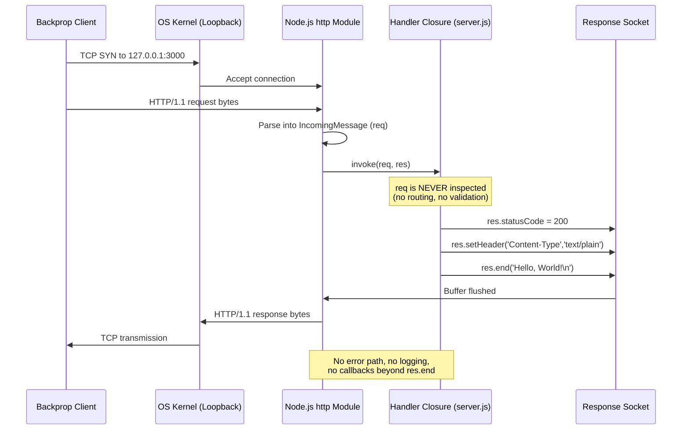
```mermaid
sequenceDiagram
    participant BP as Backprop Client
    participant K as OS Kernel (Loopback)
    participant H as Node.js http Module
    participant App as Handler Closure (server.js)
    participant Out as Response Socket

    BP->>K: TCP SYN to 127.0.0.1:3000
    K->>H: Accept connection
    BP->>H: HTTP/1.1 request bytes
    H->>H: Parse into IncomingMessage (req)
    H->>App: invoke(req, res)
    Note over App: req is NEVER inspected<br/>(no routing, no validation)
    App->>Out: res.statusCode = 200
    App->>Out: res.setHeader('Content-Type','text/plain')
    App->>Out: res.end('Hello, World!\n')
    Out->>H: Buffer flushed
    H->>K: HTTP/1.1 response bytes
    K->>BP: TCP transmission
    Note over App,H: No error path, no logging,<br/>no callbacks beyond res.end
```

---

## 5.3 TECHNICAL DECISIONS

### 5.3.1 Architecture Style Decision: Single-File, Zero-Framework

| Aspect | Decision |
|---|---|
| Decision | Use a single 15-line `server.js` file with no framework |
| Rationale | A reference fixture's value is proportional to the absence of confounding logic; any complexity could mask behavioral observation of the Backprop client (§1.1.4) |
| Tradeoff accepted | No scalability, no production readiness, no feature breadth |
| Alternative rejected | Express/Koa/Fastify — would introduce dependency chains contradicting Feature F-006 |
| Source | §3.3.1, Feature F-006, Constraint C1 |

### 5.3.2 Communication Pattern Decision: Synchronous HTTP Request-Response Only

| Aspect | Decision |
|---|---|
| Decision | Synchronous HTTP/1.1 request-response is the sole communication pattern |
| Rationale | Handler executes synchronously with no async I/O in the request path; this guarantees deterministic latency (§4.7.3) |
| Tradeoff accepted | No WebSockets, no Server-Sent Events, no long-polling, no streaming |
| Alternative rejected | Asynchronous messaging — no message broker is present (§3.5.1) |
| Source | §1.3.2, §4.7.3 |

### 5.3.3 Data Storage Decision: No Persistence Layer

| Aspect | Decision |
|---|---|
| Decision | Response body is a compiled-in string literal; no databases, files, or external data sources |
| Rationale | A fixed response makes the fixture's behavior fully deterministic and removes data-tier failure modes |
| Tradeoff accepted | No mutable data, no historical state, no user-specific responses |
| Alternative rejected | File-based response template — would introduce I/O latency variance and file-permission failure modes |
| Source | §3.6.2, Constraint C2 |

### 5.3.4 Caching Strategy Decision: No Cache

| Aspect | Decision |
|---|---|
| Decision | No caching layer of any kind |
| Rationale | Statelessness and a compiled-in literal response make caching redundant; cache invalidation concerns are eliminated entirely |
| Tradeoff accepted | None — caching would add complexity with no observable benefit |
| Alternative rejected | HTTP response cache headers — none set (no `Cache-Control`, no `ETag`) |
| Source | §1.2.2, §3.6.1 |

### 5.3.5 Security Mechanism Decision: Loopback Isolation Only

| Aspect | Decision |
|---|---|
| Decision | Network-level isolation via loopback-only binding is the sole security mechanism |
| Rationale | Eliminating the remote attack surface architecturally is stronger than implementing authentication that could be misconfigured |
| Tradeoff accepted | The system is unusable from outside the host; this is the intended outcome |
| Alternative rejected | Token-based auth, mTLS, API keys — all rejected as architecturally inappropriate for a localhost-only fixture |
| Source | §2.4.4, Feature F-002 |

### 5.3.6 Module System Decision: CommonJS

| Aspect | Decision |
|---|---|
| Decision | Use CommonJS (`require`) rather than ES Modules (`import`) |
| Rationale | Maximum backward compatibility with older Node.js releases predating ES Module general availability (§3.2.2) |
| Tradeoff accepted | No `await` at top level; no `.mjs` extension semantics |
| Alternative rejected | ES Modules — unnecessary for a single-file program with one `require` call |
| Source | §3.2.2, §3.2.3, `server.js` line 1 |

### 5.3.7 Configuration Decision: Hard-Coded Literals Only

| Aspect | Decision |
|---|---|
| Decision | Hostname and port are hard-coded; no environment variables, no config files, no CLI flags |
| Rationale | Eliminates misconfiguration as a failure mode; reinforces the "Do not touch!" governance |
| Tradeoff accepted | The fixture cannot be repointed to another interface or port without source modification |
| Source | Constraint C4, §1.3.2 |

### 5.3.8 Architecture Decision Records (ADR) Summary

The following table consolidates the architectural decisions across the system in an ADR-style format:

| ADR Topic | Decision | Source |
|---|---|---|
| Framework selection | None — Node.js built-in `http` module only | §3.3.1; F-006 |
| Module system | CommonJS | §3.2.3 |
| Network exposure | Loopback-only (`127.0.0.1:3000`) | F-002; C3 |
| Configuration mechanism | Hard-coded literals only | C4 |
| Data persistence | None — compiled-in literal | §3.6.2; C2 |
| Routing | None — universal handler ignores method/path | F-003 |
| Error handling | None — process crashes on any unhandled failure | §4.6.1 |
| Tooling (CI/CD, Docker, lint, test) | None | C5; §1.3.2 |
| Versioning | Frozen at `1.0.0` — no version bumps | C7; F-010 |
| Inconsistency remediation | Deferred by design (three §1.4 inconsistencies preserved) | C6 |

### 5.3.9 Architectural Decision Tree

The following decision tree visualizes how the system's architecture is derived from its purpose and constraints. Each branch terminates at either a decision that is incorporated into the architecture or at an "out-of-scope" leaf per §1.3.2:

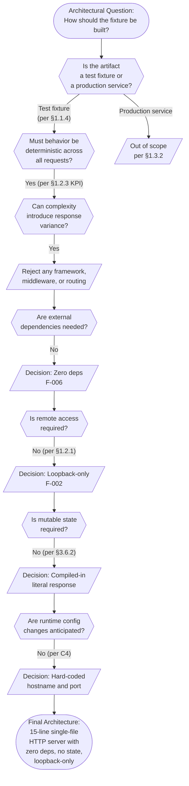
```mermaid
flowchart TD
    Start([Architectural Question:<br/>How should the fixture be built?]) --> Q1{{"Is the artifact<br/>a test fixture or<br/>a production service?"}}
    Q1 -->|"Test fixture<br/>(per §1.1.4)"| Q2{{"Must behavior be<br/>deterministic across<br/>all requests?"}}
    Q1 -->|"Production service"| OOS1[/"Out of scope<br/>per §1.3.2"/]

    Q2 -->|"Yes (per §1.2.3 KPI)"| Q3{{"Can complexity<br/>introduce response<br/>variance?"}}
    Q3 -->|"Yes"| Reject1[/"Reject any framework,<br/>middleware, or routing"/]

    Reject1 --> Q4{{"Are external<br/>dependencies needed?"}}
    Q4 -->|"No"| D1[/"Decision: Zero deps<br/>F-006"/]

    D1 --> Q5{{"Is remote access<br/>required?"}}
    Q5 -->|"No (per §1.2.1)"| D2[/"Decision: Loopback-only<br/>F-002"/]

    D2 --> Q6{{"Is mutable state<br/>required?"}}
    Q6 -->|"No (per §3.6.2)"| D3[/"Decision: Compiled-in<br/>literal response"/]

    D3 --> Q7{{"Are runtime config<br/>changes anticipated?"}}
    Q7 -->|"No (per C4)"| D4[/"Decision: Hard-coded<br/>hostname and port"/]

    D4 --> Final([Final Architecture:<br/>15-line single-file<br/>HTTP server with<br/>zero deps, no state,<br/>loopback-only])
```

---

## 5.4 CROSS-CUTTING CONCERNS

### 5.4.1 Monitoring and Observability Approach

The system implements **near-zero observability** by design. The only observable signal emitted by the running process is a single `console.log` line at startup announcing the listening URL (e.g., `Server running at http://127.0.0.1:3000/`). This line is emitted from the callback passed to `server.listen()` (per `server.js` line 13).

| Observability Capability | Status |
|---|---|
| Application Performance Monitoring (APM) | Not present (§3.5.1) |
| Metrics emission (Prometheus, StatsD, etc.) | Not present (§3.5.1) |
| Distributed tracing (OpenTelemetry, Zipkin, Jaeger) | Not present (§3.5.1) |
| Health-check endpoint | Not present — no routing; all requests return identical response (F-003) |
| Readiness/liveness probes | Not present — no orchestration layer |
| Per-request logging | Not present — no access log |
| Custom telemetry | Not present |

Observability of the fixture's behavior is necessarily performed by the **Backprop client** observing the responses it receives, not by the fixture observing itself.

### 5.4.2 Logging and Tracing Strategy

#### 5.4.2.1 Logging Implementation

The logging strategy consists of **one `console.log` invocation** in the entire codebase, fired exactly once at startup from the `server.listen()` callback. There is no structured logger (no Winston, Pino, Bunyan, or similar), no log levels, no log file rotation, no JSON formatting, no correlation IDs, and no log forwarding to an aggregator. Logs are emitted to standard output and are captured only insofar as the operator's terminal or supervising process captures them.

#### 5.4.2.2 Tracing Implementation

There is **no tracing infrastructure**. No tracing libraries are imported, no span context is propagated, no W3C Trace Context headers are read or written, and no trace identifier is logged. This is consistent with §3.5.1 (zero third-party services) and the loopback-only deployment topology.

### 5.4.3 Error Handling Patterns

Per §4.6.1, error handling is **documented as absent** by design rather than overlooked. The system does not implement try/catch blocks, error responses, retries, fallbacks, circuit breakers, dead-letter queues, recovery procedures, or graceful shutdown handlers. The implications, drawn directly from §4.6.1, are:

| Error-Handling Concern | Treatment |
|---|---|
| Try/catch blocks | Absent in `server.js` |
| Error responses (4xx, 5xx) | Never returned — every request receives HTTP 200 |
| Retry policies | None — no error paths exist from which to retry |
| Fallback processes | None — no alternate code paths |
| Circuit breakers | Not applicable — no downstream services |
| SIGTERM/SIGINT handlers | Not registered (per §3.7.5) |
| Process supervision | Not present — operator manually re-runs `node server.js` |

Any consumer of this specification who anticipates needing error-handling facilities must understand that adding them would violate Constraint C7 ("Source-file stability per 'Do not touch!' directive") and require a specification revision.

### 5.4.4 Authentication and Authorization Framework

The system implements **no authentication and no authorization**. Per §2.4.4, this is architecturally acceptable only because remote access is impossible by virtue of the loopback-only binding. No tokens are issued or validated, no sessions are maintained, no API keys are checked, no role-based access control is enforced, no OAuth/OIDC flow is implemented, and no related dependencies are declared.

| Identity & Access Capability | Status |
|---|---|
| Authentication mechanism | None — relies on loopback isolation |
| Authorization mechanism | None — all requests are equally privileged |
| Session management | None — no sessions exist |
| API key / token validation | None |
| TLS / mTLS | None — plain HTTP only |
| Audit logging | None |

### 5.4.5 Performance Requirements and SLAs

Per §2.4.2 and §4.7, the performance posture is defined by the §1.2.3 KPIs rather than by formal SLAs:

| Performance Dimension | Target / Posture |
|---|---|
| Cold-start time | Sub-second from `node server.js` invocation to bound socket |
| Per-request latency | Synchronous handler execution; no async I/O in request path |
| Response determinism | 100% — byte-identical body on every invocation |
| Throughput target | Not specified — "not designed for scale" (§2.4.3) |
| Availability target | Not specified — process either runs or crashes |
| Latency percentiles (p50/p95/p99) | Not specified |
| Resource footprint | Single Node.js process; no caches, sessions, or queues |

**No contractual SLA exists** between the fixture and the Backprop client. The only commitments are the §1.2.3 KPIs and the §1.2.2 capability matrix.

### 5.4.6 Disaster Recovery Procedures

The system has **no disaster recovery facilities** because it has nothing to recover:

| Disaster Recovery Concern | Treatment |
|---|---|
| Backup strategy | None — no data to back up |
| Restore procedure | None — operator re-runs `node server.js` |
| High availability | None — single process, single port, no clustering |
| Failover | None — no secondary instance |
| Automated recovery | None — no supervisor, no `systemd` unit, no Docker restart policy |
| RPO / RTO targets | Undefined — out-of-scope (§1.3.2) |

The recovery model is **manual restart only**: if the process crashes for any reason (port collision, uncaught exception, kill signal), an operator must observe the crash and re-invoke `node server.js`.

### 5.4.7 Security Posture Summary

| Concern | Mitigation |
|---|---|
| Remote attack surface | Eliminated via loopback-only binding (F-002) |
| Authentication absence | Acceptable because of localhost isolation |
| Input validation absence | Not required — no input is read (F-003) |
| Injection / XSS | Impossible — no reflected user input (F-004) |
| Supply-chain risk | Bounded to Node.js runtime — zero third-party packages (F-006) |
| License compatibility | MIT permits embedding (F-007) |
| Configuration tampering | Hard-coded values; "Do not touch!" enforces baseline (F-010) |
| Secrets management | Not applicable — no secrets exist (no external services) |

### 5.4.8 Architectural Error-Handling Flow

The following diagram presents error handling at the **architectural layer level** — showing where in the layered stack each class of failure originates, which layer (if any) handles it, and what the architectural outcome is. This is distinct from the runtime-step flowchart in §4.6.2:

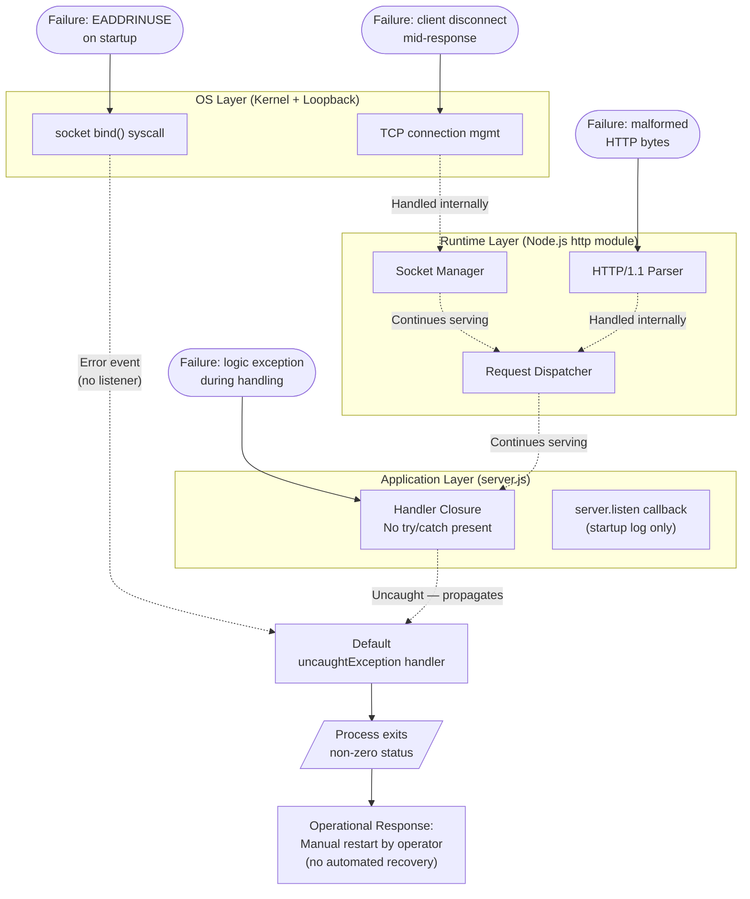
```mermaid
flowchart TD
    subgraph AppLayer["Application Layer (server.js)"]
        AppCode["Handler Closure<br/>No try/catch present"]
        ListenCb["server.listen callback<br/>(startup log only)"]
    end

    subgraph RTLayer["Runtime Layer (Node.js http module)"]
        Parser["HTTP/1.1 Parser"]
        Dispatcher["Request Dispatcher"]
        SocketMgr["Socket Manager"]
    end

    subgraph OSLayer["OS Layer (Kernel + Loopback)"]
        BindOp["socket bind() syscall"]
        ConnOp["TCP connection mgmt"]
    end

    F1([Failure: EADDRINUSE<br/>on startup]) --> BindOp
    F2([Failure: malformed<br/>HTTP bytes]) --> Parser
    F3([Failure: client disconnect<br/>mid-response]) --> ConnOp
    F4([Failure: logic exception<br/>during handling]) --> AppCode

    BindOp -.->|"Error event<br/>(no listener)"| Default["Default<br/>uncaughtException handler"]
    Parser -.->|"Handled internally"| Dispatcher
    ConnOp -.->|"Handled internally"| SocketMgr
    AppCode -.->|"Uncaught — propagates"| Default

    Default --> Terminate[/"Process exits<br/>non-zero status"/]
    Terminate --> OpsResp["Operational Response:<br/>Manual restart by operator<br/>(no automated recovery)"]

    Dispatcher -.->|"Continues serving"| AppCode
    SocketMgr -.->|"Continues serving"| Dispatcher
```

### 5.4.9 Architectural Assumptions Governing Cross-Cutting Concerns

The cross-cutting posture rests on the following assumptions established in §2.6:

| Assumption ID | Statement | Cross-Cutting Implication |
|---|---|---|
| A1 | Node.js runtime is installed | Provides the entire runtime; no other observability or error-handling support exists |
| A2 | Port `3000` is free on loopback at startup | A bound port means unhandled `EADDRINUSE` and immediate process termination |
| A3 | Backprop client runs on the same host | Loopback isolation suffices as the entire security model |
| A4 | Operators invoke via `node server.js` | No `npm start` script exists, so process supervision must be external if needed |
| A5 | Repository remains unmodified | "Do not touch!" prohibits adding any cross-cutting facilities |
| A6 | npm 7+ is available | Required for `lockfileVersion: 3` parity |

---

## 5.5 ARCHITECTURAL POSITIONING STATEMENT

The architecture of `hao-backprop-test` is best understood as a **deliberate study in minimalism**. Conventional Technical Specifications enumerate microservice boundaries, message broker topologies, cache hierarchies, authentication frameworks, observability stacks, disaster recovery runbooks, and SLA matrices. This system has none of these, and the absence of each is a documented architectural decision rather than an oversight or a future work item.

The architecturally significant properties — and the only properties that should be evaluated when judging this system — are:

- **One runtime file** (`server.js`, 15 lines)
- **Zero third-party dependencies** (Feature F-006)
- **Loopback-only network exposure** (Feature F-002)
- **100% response determinism** (§1.2.3 KPI)
- **Sub-second cold start** (§1.2.3 KPI)
- **Stability under the "Do not touch!" directive** (Feature F-010)

Any architectural elaboration beyond this baseline would broaden the project's scope (per §2.6.3) and require a new specification revision. The architecture as documented is the architecture as intended.

---

## 5.6 REFERENCES

### 5.6.1 Repository Files Examined

- `server.js` — The sole 15-line runtime component; source of all HTTP handling behavior, hostname/port literals, and startup logging
- `package.json` — NPM manifest declaring identity (`hello_world`), version (`1.0.0`), license (`MIT`), `main: index.js`, and a placeholder `scripts.test`; source of the zero-dependency posture
- `package-lock.json` — Lockfile v3 with zero pinned packages; reinforces the zero-dependency architectural decision at the tooling level
- `README.md` — Governance artifact establishing project identity (`hao-backprop-test`) and the architecturally binding "Do not touch!" directive

### 5.6.2 Repository Folders Examined

- Repository root (depth 0) — Confirmed flat structure with exactly four files and no subdirectories beyond `.git/`; basis for the "single-file runtime" architectural claim

### 5.6.3 Technical Specification Sections Cross-Referenced

- §1.1 Executive Summary — Project identity, business problem, and value proposition framing the fixture's purpose
- §1.2 System Overview — Business context, capability matrix, success criteria, and the §1.2.3 KPIs that define the architectural posture
- §1.3 Scope — In-scope/out-of-scope catalog establishing what the architecture deliberately excludes
- §1.4 Documented Repository Inconsistencies — The three preserved-by-design inconsistencies (name, `main` field, test script)
- §2.1 Feature Catalog — Features F-001 through F-010 referenced throughout this section
- §2.3 Feature Relationships — Dependency map used in component interaction discussion
- §2.4 Implementation Considerations — Constraints C1–C7, performance posture, scalability stance, and security implications
- §2.6 Assumptions, Constraints, and Version Tracking — Assumptions A1–A6 governing the architecture
- §3.1 Technology Stack Overview — Strategic posture and layering context
- §3.2 Programming Languages — CommonJS module system rationale
- §3.3 Frameworks & Libraries — Framework-free posture and `http` module justification
- §3.4 Open Source Dependencies — Zero-dependency evidence chain
- §3.5 Third-Party Services — Inventory of services explicitly not used
- §3.6 Databases & Storage — Stateless posture and compiled-in literal rationale
- §3.7 Development & Deployment — Manual local invocation model and absence of graceful shutdown
- §4.1 System Workflow Overview — Workflow W1–W4 actor and boundary definitions
- §4.2 Core Business Process Flows — Step-by-step request and startup flows
- §4.3 Integration Workflows — Integration surface map
- §4.4 Decision Points and Validation Rules — The single implicit decision point (`req` unread)
- §4.5 State Management — Process and per-response state diagrams referenced for the composite state diagram
- §4.6 Error Handling — Documented absence of error handling at the workflow level, extended here to the architectural level
- §4.7 Timing and SLA Considerations — Synchronous handler execution and KPI derivation

# 6. SYSTEM COMPONENTS DESIGN

## 6.1 Core Services Architecture

### 6.1.1 Applicability Determination

#### 6.1.1.1 Determination Statement

**Core Services Architecture is not applicable for this system.**

The `hao-backprop-test` repository does not implement, require, or accommodate microservices, distributed architecture, or distinct service components. Per §5.1.1.1, the system is a **single-process, single-file, framework-free Node.js HTTP server architecture — the most reduced form of a network-addressable service that the Node.js platform allows**. Its architectural style is explicitly characterized as **"micro-fixture" rather than monolithic, microservice, or serverless**. Per §5.2.1.1, the HTTP Server is **the sole runtime component in the system**. There are no service boundaries to define, no peer services to discover, no traffic to balance across replicas, no downstream dependencies that could fail, and no state that could be lost.

This determination is not an oversight, a "to-do," or a future-work item. Per §5.5, the absence of conventional service-architecture elements — microservice boundaries, message broker topologies, cache hierarchies, authentication frameworks, observability stacks, disaster recovery runbooks, and SLA matrices — **is a documented architectural decision** rather than an oversight or a future work item.

#### 6.1.1.2 Multi-Layered Justification

The determination rests on six independently sufficient layers of evidence drawn from direct source inspection and from multiple sections of this Technical Specification:

| Layer | Evidence | Source |
|---|---|---|
| Repository structure | Four artifacts at the repository root; exactly one is runtime-executing code (`server.js`) | §5.1.2 |
| Source code scope | Entire runtime is contained in `server.js` (15 lines) | §5.1.1.1 |
| Network topology | One bound TCP socket on `127.0.0.1:3000`; no outbound network calls of any kind | §5.1.1.3 |
| Dependency posture | Zero `dependencies`, `devDependencies`, `peerDependencies`, or `optionalDependencies` (Feature F-006) | §5.1.1.2 |
| Communication patterns | The sole boundary-crossing protocol is HTTP/1.1 over TCP, loopback-only; no gRPC, WebSockets, message queues, file-based IPC, or Unix domain sockets exist | §5.1.1.3 |
| Governance constraint | Per the README directive `Do not touch!`, the architecture is frozen by governance | §5.1.1.1, Constraint C7 |

#### 6.1.1.3 Architectural Style Reference

The "Not Applicable" determination is anchored in the system's classified architectural style. Per §5.1.1.1, this is a **"micro-fixture"** — a category positioned below "monolith" on the architectural-complexity spectrum and entirely distinct from microservices or serverless designs. The system is **a target fixture for the external "backprop" system, not a production service**, and per §5.1.1.1, **behavioral determinism, byte-identical responses, and absence of any logic that could introduce variance are the architecturally significant properties; throughput, fault tolerance, and feature breadth are explicitly out-of-scope per §1.3.2**.

#### 6.1.1.4 Governance Constraint Reference

A core-services architecture **cannot** be added to this system without violating its binding governance constraint. Per §5.1.1.1, **any architectural elaboration (frameworks, abstraction layers, additional files, environment-variable configuration) would violate Constraint C7 and the §1.2.3 critical success factor of "Stability of source files."** Per §5.4.3, **any consumer of this specification who anticipates needing error-handling facilities must understand that adding them would violate Constraint C7 ("Source-file stability per 'Do not touch!' directive") and require a specification revision**. The same logic applies to every category of service-architecture elaboration enumerated in this section.

---

### 6.1.2 Service Components Analysis

This subsection systematically addresses each Service Components topic enumerated in the section prompt, documenting the explicit, evidence-backed reason each is not applicable.

#### 6.1.2.1 Service Boundaries and Responsibilities

There is exactly **one runtime component**, so there are **zero service-to-service boundaries** to define. Per §5.1.2, the system contains four artifacts at the repository root, of which only one is runtime-executing code. The boundaries that exist are process-, network-, trust-, and code-boundaries documented in §5.1.1.3 — none of which are inter-service boundaries.

| Component | Type | Responsibility | Service Boundary |
|---|---|---|---|
| `server.js` | Runtime | Bind socket, accept requests, return literal response | None — this is the entire runtime |
| `package.json` | Manifest | Declare package identity, version, license | Not a service |
| `package-lock.json` | Lockfile | Reinforce zero-dependency posture | Not a service |
| `README.md` | Documentation | Declare identity and "Do not touch!" directive | Not a service |

#### 6.1.2.2 Inter-Service Communication Patterns

There are **no inter-service communication patterns** because there are no peer services. Per §5.1.1.3, **the sole boundary-crossing protocol is HTTP/1.1 over TCP, loopback-only**, and per §5.1.3.2, **the server initiates no outbound network communication**.

| Communication Pattern | Presence | Notes |
|---|---|---|
| Synchronous request-response (REST/RPC) | Inbound only; no service-to-service variant | Backprop client → server only (§5.1.4) |
| Asynchronous messaging (queues, brokers) | Not present | "Publish-Subscribe: Not used — no event bus exists" (§5.1.3.2) |
| Streaming (gRPC streaming, SSE, WebSockets) | Not present | "Streaming: Not used — response body is a single short literal" (§5.1.3.2) |
| File-based IPC / Unix domain sockets | Not present | Per §5.1.1.3 |

#### 6.1.2.3 Service Discovery Mechanisms

Service discovery is **not present and not necessary**. Per §3.7.5, the deployment model specifies **Service discovery: None — fixed loopback endpoint at `127.0.0.1:3000`**. Per §5.1.3.2, the absence of outbound calls means **no service discovery, no DNS lookups beyond the local hosts file, no TLS handshakes, and no retries are present anywhere in the architecture**. The hostname and port are hard-coded in `server.js` as constants, and per Constraint C4 (§2.6.2), no configuration mechanism (env vars, config files) exists; values must remain hard-coded.

#### 6.1.2.4 Load Balancing Strategy

Load balancing is **not applicable** because there is exactly one process listening on exactly one port. Per §2.4.3:

| Scalability Dimension | Position |
|---|---|
| Vertical scaling | Not pursued — single process, single port, no clustering |
| Horizontal scaling | Not applicable — fixture runs once per host as needed |
| Concurrent request handling | Limited to whatever the Node.js event loop affords; no shared state means no concurrency hazards |
| Multi-tenant operation | Explicitly out-of-scope (§1.3.2) |

Per §5.2.1.5, the component **explicitly excludes clustering (no `cluster` module use), no `worker_threads`, no horizontal scaling guidance, no rate limiting, no concurrency control beyond what the Node.js single-threaded event loop natively provides**. No reverse proxy, no DNS round-robin, no L4/L7 load balancer, no service mesh sidecar, and no orchestrator-managed replica set is present or intended.

#### 6.1.2.5 Circuit Breaker Patterns

Circuit breakers are **not applicable**. Per §5.4.3, the row for circuit breakers reads explicitly: **Circuit breakers | Not applicable — no downstream services**. A circuit breaker's purpose is to prevent cascading failure into downstream dependencies; this system has zero downstream dependencies (no databases, no external APIs, no message brokers, no inter-service calls — see §5.1.3.4 and §5.1.4), so the protective mechanism has nothing to protect against.

#### 6.1.2.6 Retry and Fallback Mechanisms

Retries and fallbacks are **not present, by design**. Per §5.4.3:

| Mechanism | Treatment | Rationale |
|---|---|---|
| Retry policies | None — no error paths exist from which to retry | No outbound calls (§5.1.3.2) |
| Fallback processes | None — no alternate code paths | Single handler closure returns single literal |
| Try/catch blocks | Absent in `server.js` | Documented design (§5.4.3) |
| Dead-letter queue / replay | Not applicable — no message queues | §5.4.3 |

Per §5.4.3, **error handling is documented as absent by design rather than overlooked**. Because the handler ignores `req` entirely, performs no I/O, has no branching, and emits a constant response, there is no error path from which a retry or fallback could originate.

#### 6.1.2.7 Service Components — Single-Component Topology Diagram

The following diagram visualizes the system's true component topology and illustrates the categorical absence of multi-service architecture concerns. Items connected by dashed "absent" edges are explicitly excluded from the architecture per the cited specification sections.

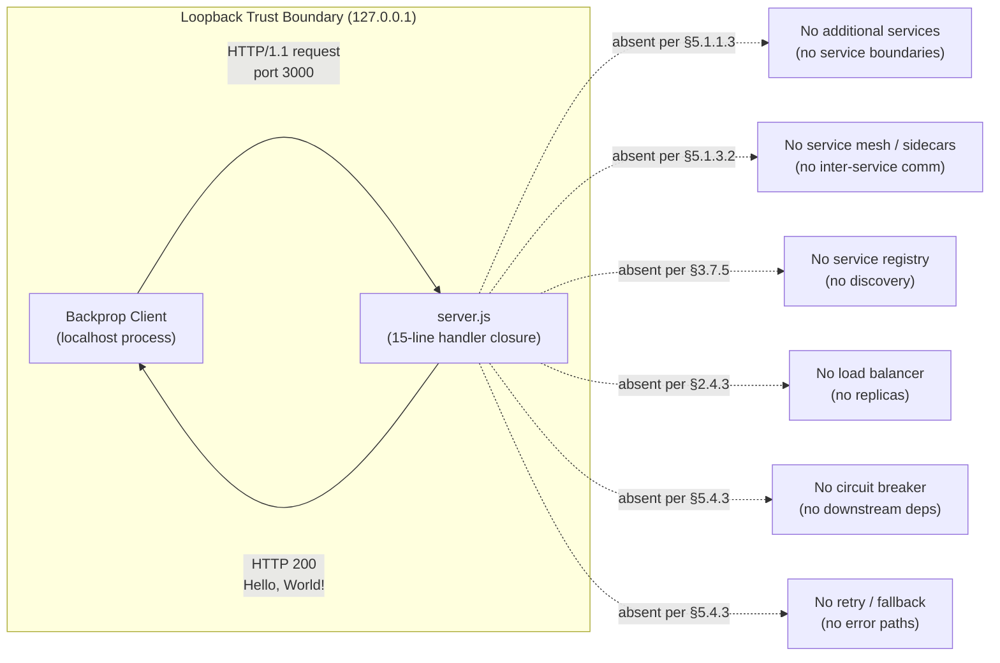
```mermaid
flowchart LR
    Client["Backprop Client<br/>(localhost process)"]
    Handler["server.js<br/>(15-line handler closure)"]

    subgraph LoopbackBoundary["Loopback Trust Boundary (127.0.0.1)"]
        Client
        Handler
    end

    Client -->|"HTTP/1.1 request<br/>port 3000"| Handler
    Handler -->|"HTTP 200<br/>Hello, World!"| Client

    NotPresent1["No additional services<br/>(no service boundaries)"]
    NotPresent2["No service mesh / sidecars<br/>(no inter-service comm)"]
    NotPresent3["No service registry<br/>(no discovery)"]
    NotPresent4["No load balancer<br/>(no replicas)"]
    NotPresent5["No circuit breaker<br/>(no downstream deps)"]
    NotPresent6["No retry / fallback<br/>(no error paths)"]

    Handler -.->|"absent per §5.1.1.3"| NotPresent1
    Handler -.->|"absent per §5.1.3.2"| NotPresent2
    Handler -.->|"absent per §3.7.5"| NotPresent3
    Handler -.->|"absent per §2.4.3"| NotPresent4
    Handler -.->|"absent per §5.4.3"| NotPresent5
    Handler -.->|"absent per §5.4.3"| NotPresent6
```

---

### 6.1.3 Scalability Design Analysis

#### 6.1.3.1 Horizontal and Vertical Scaling Approach

Neither horizontal nor vertical scaling is pursued. Per §2.4.3, the system is **explicitly not designed for scale**. The following limits are intentional and consistent with §1.3.2 "Unsupported Use Cases."

| Scaling Approach | Status | Rationale (per §2.4.3) |
|---|---|---|
| Vertical scaling (single-process resource tuning) | Not pursued | Single process, single port, no clustering |
| Horizontal scaling (multiple replicas) | Not applicable | Fixture runs once per host as needed |
| Clustering (Node.js `cluster` module) | Not used | No master/worker fork is implemented (§5.2.1.5) |
| Worker threads (`worker_threads`) | Not used | Single-threaded event loop only (§5.2.1.5) |

Adding any of these would (a) violate Constraint C7 by modifying `server.js`, (b) introduce shared-state hazards inconsistent with the §1.2.3 KPI of 100% response determinism, and (c) require multi-file architectural expansion contrary to §5.1.1.1.

#### 6.1.3.2 Auto-Scaling Triggers and Rules

Auto-scaling is **not present and not configurable**. There is no orchestration layer that could observe demand or instantiate replicas. Per §5.4.1, **Readiness/liveness probes: Not present — no orchestration layer**. No Kubernetes Horizontal Pod Autoscaler (HPA), no Vertical Pod Autoscaler (VPA), no AWS Auto Scaling Group, no Docker Swarm scaling policy, and no custom-metric-driven scaler exists in or around this system. Per §3.7.5, deployment is manual local invocation only; there is no platform that could host scaling triggers.

#### 6.1.3.3 Resource Allocation Strategy

Resource allocation is **fixed and minimal**. Per §2.4.2:

| Resource Dimension | Allocation |
|---|---|
| Process count | Single Node.js process |
| In-memory caches | None |
| Sessions | None |
| Queues | None |
| File descriptors | One listening socket plus per-connection sockets managed by the Node.js `http` module |

Per §5.1.3.4, every category of data store — relational database, NoSQL, in-memory cache, process-local cache, session store, message broker, file-system persistence — is recorded as **None**. The response body is a string literal embedded in the handler closure (§5.1.3.3), so even a process-local cache would be redundant.

#### 6.1.3.4 Performance Optimization Techniques

The system's performance posture is defined by §1.2.3 KPIs rather than by formal optimization techniques. Per §5.4.5:

| Performance Dimension | Posture |
|---|---|
| Cold-start time | Sub-second from `node server.js` invocation to bound socket |
| Per-request latency | Synchronous handler execution; no async I/O in request path |
| Response determinism | 100% — byte-identical body on every invocation |
| Throughput target | Not specified — "not designed for scale" (§2.4.3) |

The only structural optimization present is the architecturally significant decision to make the handler **synchronous** with no async I/O in the request path (§5.4.5) — which is a property of the architecture, not a deliberate optimization technique. There is no caching layer, no connection pooling, no protocol upgrade (HTTP/2, HTTP/3), no compression (gzip, Brotli), no keep-alive tuning beyond Node.js defaults, and no V8 flag tuning.

#### 6.1.3.5 Capacity Planning Guidelines

Capacity planning is **out-of-scope**. Per §1.3.2, **Production HTTP traffic of any volume** is an unsupported use case. Per §5.4.5, **No contractual SLA exists** between the fixture and the Backprop client; latency percentiles (p50/p95/p99), availability target, throughput target, and resource footprint targets are all explicitly not specified. Operators are expected to invoke the fixture on demand on a developer or test host where the Backprop client also runs (Assumption A3, §5.4.9). Concurrent request handling is **limited to whatever the Node.js event loop affords; no shared state means no concurrency hazards** (§2.4.3).

#### 6.1.3.6 Scalability Architecture Diagram

The following diagram depicts the actual scalability architecture — a single process bound to a single loopback port — and explicitly catalogs every category of scaling apparatus that is absent.

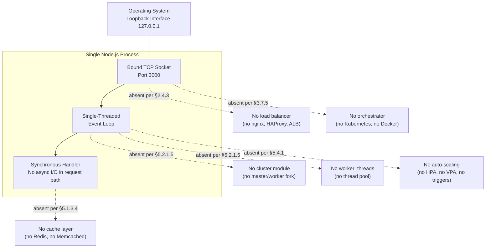
```mermaid
flowchart TB
    OS["Operating System<br/>Loopback Interface 127.0.0.1"]

    subgraph Proc["Single Node.js Process"]
        EventLoop["Single-Threaded<br/>Event Loop"]
        Socket["Bound TCP Socket<br/>Port 3000"]
        Handler["Synchronous Handler<br/>No async I/O in request path"]
    end

    OS --- Socket
    Socket --> EventLoop
    EventLoop --> Handler

    NoCluster["No cluster module<br/>(no master/worker fork)"]
    NoThreads["No worker_threads<br/>(no thread pool)"]
    NoBalancer["No load balancer<br/>(no nginx, HAProxy, ALB)"]
    NoOrchestrator["No orchestrator<br/>(no Kubernetes, no Docker)"]
    NoAutoscale["No auto-scaling<br/>(no HPA, no VPA, no triggers)"]
    NoCache["No cache layer<br/>(no Redis, no Memcached)"]

    EventLoop -.->|"absent per §5.2.1.5"| NoCluster
    EventLoop -.->|"absent per §5.2.1.5"| NoThreads
    Socket -.->|"absent per §2.4.3"| NoBalancer
    Socket -.->|"absent per §3.7.5"| NoOrchestrator
    EventLoop -.->|"absent per §5.4.1"| NoAutoscale
    Handler -.->|"absent per §5.1.3.4"| NoCache
```

---

### 6.1.4 Resilience Patterns Analysis

#### 6.1.4.1 Fault Tolerance Mechanisms

Fault tolerance is **documented as absent by design**. Per §5.4.3:

| Fault Tolerance Concern | Treatment |
|---|---|
| Try/catch blocks | Absent in `server.js` |
| Error responses (4xx, 5xx) | Never returned — every request receives HTTP 200 |
| Retry policies | None — no error paths exist from which to retry |
| Fallback processes | None — no alternate code paths |
| Circuit breakers | Not applicable — no downstream services |
| SIGTERM/SIGINT handlers | Not registered (per §3.7.5) |
| Process supervision | Not present — operator manually re-runs `node server.js` |

Per §5.4.8, the architectural error-handling flow shows that all four documented failure classes (`EADDRINUSE` on startup, malformed HTTP bytes, mid-response client disconnect, and uncaught handler exceptions) are either handled internally by the Node.js `http` module or propagate to the default uncaught-exception handler and cause process termination. The architectural response to termination is **manual restart by operator (no automated recovery)** (§5.4.8).

#### 6.1.4.2 Disaster Recovery Procedures

Per §5.4.6, **the system has no disaster recovery facilities because it has nothing to recover**:

| Disaster Recovery Concern | Treatment |
|---|---|
| Backup strategy | None — no data to back up |
| Restore procedure | None — operator re-runs `node server.js` |
| High availability | None — single process, single port, no clustering |
| Failover | None — no secondary instance |

| Disaster Recovery Concern | Treatment |
|---|---|
| Automated recovery | None — no supervisor, no `systemd` unit, no Docker restart policy |
| RPO / RTO targets | Undefined — out-of-scope (§1.3.2) |

Per §5.4.6, the recovery model is **manual restart only: if the process crashes for any reason (port collision, uncaught exception, kill signal), an operator must observe the crash and re-invoke `node server.js`**.

#### 6.1.4.3 Data Redundancy Approach

Data redundancy is **categorically inapplicable** because the system is fully stateless and stores nothing that could require redundancy. Per §5.1.3.4, every data-store category (relational database, NoSQL, in-memory cache, process-local cache, session store, message broker, file-system persistence) is recorded as **None**. Per §5.1.3.3, **the response body is a string literal embedded in the handler closure; no parsing, templating, serialization (JSON or otherwise), content negotiation, compression, or encoding conversion takes place. The compiled-in literal is the source of truth and the wire format simultaneously**.

The literal `Hello, World!\n` exists redundantly in the sense that the file `server.js` itself is the artifact under version control, but there is no runtime replication, no write-ahead log, no synchronous or asynchronous replica, no snapshot, and no point-in-time-recovery infrastructure.

#### 6.1.4.4 Failover Configurations

Failover is **not configured and not configurable** at the application level. Per §5.4.6:

| Failover Concept | Status |
|---|---|
| Secondary instance | None — no peer to fail over to |
| Active-passive cluster | Not configured — no cluster |
| Active-active cluster | Not configured — no cluster |
| Health-check-driven traffic shift | Not applicable — no health-check endpoint (§5.4.1) |

Adding a failover instance would require a second process bound to a non-loopback interface (violating Constraint C3 — loopback-only binding per F-002) or a second loopback port (violating the hard-coded `:3000` per Constraint C4) and orchestration code in additional files (violating Constraint C7).

#### 6.1.4.5 Service Degradation Policies

Service degradation policies are **not applicable** because there is no degraded state to define. Per §5.1.1.2, **100% of requests receive a byte-identical response (`Hello, World!\n` with HTTP 200 and `Content-Type: text/plain`) regardless of method, path, headers, or body**. Per §5.4.3, **Error responses (4xx, 5xx): Never returned — every request receives HTTP 200**.

| Degradation Concept | Status |
|---|---|
| Graceful degradation modes | None — no functional layers to degrade |
| Read-only / maintenance mode | Not present — no writes, no maintenance workflow |
| Feature flags | Not present — no configuration mechanism (Constraint C4) |
| Brownout / partial response | Not present — response is constant |

There are exactly two operational states observable to a client: the process is running and returns the literal, or the process is not running and the connection fails at the TCP layer. No intermediate degraded state exists or can exist within the bounds of the current architecture.

#### 6.1.4.6 Resilience Pattern Implementations Diagram

The following diagram visualizes the system's actual resilience model — operator-initiated manual restart — and explicitly catalogs every category of automated resilience apparatus that is absent.

```mermaid
flowchart TD
    Running["Node.js Process Running<br/>Listening on 127.0.0.1:3000"]
    Crash{{"Crash Event?<br/>EADDRINUSE, uncaught exception,<br/>or kill signal"}}
    Exit["Process Exits<br/>Non-Zero Status Code"]
    Detect["Manual Operator<br/>Observation Required"]
    Restart["Operator Re-runs<br/>node server.js"]

    Running --> Crash
    Crash -->|"No"| Running
    Crash -->|"Yes"| Exit
    Exit --> Detect
    Detect --> Restart
    Restart --> Running

    NoSupervisor["No process supervisor<br/>(no systemd, pm2, forever)"]
    NoRestartPolicy["No restart policy<br/>(no Docker, no Kubernetes)"]
    NoFailover["No failover instance<br/>(no peer, no replica)"]
    NoHealthCheck["No health probe<br/>(no liveness, no readiness)"]
    NoBackup["No backup / restore<br/>(no data to recover)"]
    NoDegradation["No degradation mode<br/>(response is constant)"]

    Detect -.->|"absent per §5.4.6"| NoSupervisor
    Detect -.->|"absent per §5.4.6"| NoRestartPolicy
    Detect -.->|"absent per §5.4.6"| NoFailover
    Detect -.->|"absent per §5.4.1"| NoHealthCheck
    Detect -.->|"absent per §5.4.6"| NoBackup
    Running -.->|"absent per §5.1.1.2"| NoDegradation
```

---

### 6.1.5 Out-of-Scope Confirmation and Cross-References

#### 6.1.5.1 Out-of-Scope Items Directly Relevant to This Section

The following items, explicitly enumerated as out-of-scope per §1.3.2, would each individually warrant a Core Services Architecture section if present. None are present in this system:

| Out-of-Scope Item (§1.3.2) | Relation to Core Services Architecture |
|---|---|
| Production HTTP traffic of any volume | Eliminates capacity planning, auto-scaling, load balancing |
| Multi-tenant request handling | Eliminates service-boundary tenancy concerns |
| Long-lived connections, WebSockets, server-sent events | Eliminates streaming-service patterns |
| API contract negotiation (no JSON, no REST, no GraphQL, no RPC) | Eliminates inter-service contract management |
| Concurrent request workflows that depend on shared state | Eliminates distributed-state coordination patterns |
| Containerization (Dockerfile, container manifests) | Eliminates orchestration and restart-policy patterns |
| CI/CD pipelines, deployment manifests | Eliminates progressive-delivery patterns |

#### 6.1.5.2 Architectural Decision Cross-References

The "Not Applicable" determination for this section is reinforced by the following Architecture Decision Records from §5.3:

| ADR Reference | Decision | Implication for Core Services Architecture |
|---|---|---|
| §5.3.1 | Use a single 15-line `server.js` file with no framework | Forecloses service decomposition |
| §5.3.1 (tradeoff) | Tradeoff accepted: no scalability, no production readiness, no feature breadth | Forecloses scaling and resilience design |
| §5.3.2 | Synchronous HTTP/1.1 request-response is the sole communication pattern | Forecloses asynchronous service patterns |

#### 6.1.5.3 Related Sections in This Specification

Readers seeking deeper detail on individual aspects underlying this determination should consult:

| Topic | Authoritative Section |
|---|---|
| Architectural style and principles | §5.1.1.1, §5.1.1.2 |
| Single-component runtime details | §5.2 (COMPONENT DETAILS) |
| Statelessness posture | §4.5 (STATE MANAGEMENT) |
| Error-handling absence | §4.6 (ERROR HANDLING), §5.4.3, §5.4.8 |
| Scalability posture | §2.4.3, §5.2.1.5 |
| Disaster recovery posture | §5.4.6 |
| Architectural decision records | §5.3 (TECHNICAL DECISIONS) |
| Architectural positioning summary | §5.5 (ARCHITECTURAL POSITIONING STATEMENT) |
| Governance constraints | §2.6 (Constraint C7), Feature F-010 |

---

### 6.1.6 References

#### 6.1.6.1 Repository Files Examined

- `server.js` — Confirmed 15-line single-file HTTP server; the **sole runtime component** referenced throughout this section's "Not Applicable" determination
- `package.json` — Confirmed zero `dependencies`, `devDependencies`, `peerDependencies`, and `optionalDependencies`; basis for Zero-Dependency Principle in §5.1.1.2
- `package-lock.json` — Confirmed `lockfileVersion: 3` with zero pinned third-party packages; reinforces the zero-external-services posture
- `README.md` — Confirmed two-line content with "Do not touch!" governance directive; basis for Constraint C7 and Feature F-010
- Repository root (`/`) — Confirmed flat structure with four files and no subdirectories; basis for "single-file runtime" architectural claim in §5.1.2

#### 6.1.6.2 Technical Specification Sections Referenced

- §1.2.3 — KPIs (sub-second cold start, 100% response determinism, zero dependencies)
- §1.3.2 — Unsupported Use Cases / Out-of-Scope catalog
- §2.4.2 — Performance Requirements
- §2.4.3 — Scalability Considerations ("explicitly not designed for scale")
- §2.6.2 — Constraints C1–C7, especially C3 (loopback-only), C4 (no configuration), and C7 (source-file stability)
- §3.5.1 — Third-Party Services inventory (all categories: None)
- §3.7.5 — Deployment Model ("Service discovery: None")
- §4.5 — STATE MANAGEMENT (full statelessness)
- §4.6.1 — ERROR HANDLING (documented absence of retry, fallback, circuit-breaker patterns)
- §4.7 — TIMING AND SLA CONSIDERATIONS (no formal SLA)
- §5.1.1.1 — Architecture Style and Rationale ("micro-fixture")
- §5.1.1.2 — Key Architectural Principles
- §5.1.1.3 — System Boundaries and Major Interfaces
- §5.1.2 — Core Components Table
- §5.1.3.2 — Integration Patterns and Protocols
- §5.1.3.3 — Data Transformation Points
- §5.1.3.4 — Key Data Stores and Caches (all categories: None)
- §5.1.4 — External Integration Points (Backprop client only)
- §5.2.1.1 — HTTP Server as sole runtime component
- §5.2.1.5 — Scaling Considerations (no clustering, no worker_threads)
- §5.3.1, §5.3.2 — Architectural Decision Records
- §5.4.1 — Monitoring and Observability Approach (no health/readiness probes)
- §5.4.3 — Error Handling Patterns (circuit breakers and retries explicitly N/A)
- §5.4.5 — Performance Requirements and SLAs
- §5.4.6 — Disaster Recovery Procedures ("nothing to recover")
- §5.4.8 — Architectural Error-Handling Flow
- §5.5 — Architectural Positioning Statement ("deliberate study in minimalism")

#### 6.1.6.3 Features Referenced

- F-002 — Loopback Binding (eliminates remote attack surface; constrains scaling)
- F-003 — Constant-Response Handler (eliminates error paths)
- F-004 — Compiled-in Literal Response (eliminates data redundancy concern)
- F-006 — Zero Third-Party Dependencies (eliminates supply-chain inter-service concerns)
- F-010 — "Do not touch!" Stability Directive (governance constraint preventing architectural elaboration)

## 6.2 Database Design

### 6.2.1 Applicability Determination

#### 6.2.1.1 Determination Statement

**Database Design is not applicable to this system.**

The `hao-backprop-test` repository does not implement, require, or accommodate a database, persistence layer, cache, object store, session store, or file-system persistence of any kind. Per §3.6.1, the system is **fully stateless and uses no databases, no caching, no object storage, and no file-system persistence of any kind**, and per §1.2.2, **no in-memory caches, no session stores, no persistence layer, and no database connectivity exist**. The data tier that conventional Technical Specifications describe — schemas, indices, partitions, replicas, backups, migrations, query optimizers, connection pools — simply has no referent in this system.

In place of a persistence strategy, the system uses what §3.6.2 terms a **compiled-in response literal**: the entire data payload (`Hello, World!\n`) is declared inline at `server.js` line 9 and exists only as a string constant embedded in the request handler closure. The source code itself is the source of truth, the schema, and the wire format simultaneously.

This determination is consistent with the precedent set by §6.1 (Core Services Architecture), which also concluded "Not Applicable" on multi-layered evidence. Per §5.5, conventional Technical Specifications enumerate microservice boundaries, message broker topologies, cache hierarchies, authentication frameworks, observability stacks, disaster recovery runbooks, and SLA matrices — **this system has none of these, and the absence of each is a documented architectural decision rather than an oversight or a future work item**.

#### 6.2.1.2 Multi-Layered Justification

The "Not Applicable" determination for Database Design rests on six independently sufficient layers of evidence drawn from direct source inspection and from multiple sections of this Technical Specification:

| Layer | Evidence | Source |
|---|---|---|
| Source-code imports | Only one `require()` call: the Node.js built-in `http` module. No database driver, ORM, or cache client is imported. | `server.js` line 1 |
| Source-code content | Response body is a hard-coded string literal `Hello, World!\n` at line 9 of `server.js`; `req` is never read; no I/O beyond the bound socket | §3.6.2; `server.js` |
| Dependency manifest | `package.json` declares zero `dependencies`, `devDependencies`, `peerDependencies`, and `optionalDependencies` | Feature F-006 |
| Lockfile state | `package-lock.json` (`lockfileVersion: 3`) pins exactly one entry — the root package itself; zero third-party packages | `package-lock.json` |
| Repository structure | Flat root with four files; no `migrations/`, `models/`, `schemas/`, `db/`, `data/`, `sql/`, `seeds/`, or `fixtures/` directories; no `database.yml`, `knexfile.js`, `ormconfig.json`, or `.env` | Repository root listing |
| Governance constraint | `README.md` "Do not touch!" directive freezes source files (Constraint C7 / Feature F-010) — adding a database layer is architecturally prohibited | §2.4.5; §5.1.1.1 |

#### 6.2.1.3 Governance Constraints Prohibiting a Database Layer

A database layer **cannot be added** to this system without violating multiple binding constraints. The constraint matrix below documents the architectural prohibition:

| Constraint | Statement | Implication for Database Design |
|---|---|---|
| C2 | No persistence — response body is a compiled-in literal | Adding a database directly contradicts the persistence decision documented in §5.3.3 |
| C4 | Hard-coded literals only — no environment variables, config files, or CLI flags | No mechanism exists to supply database connection strings, credentials, or pool sizing |
| C7 | Source-file stability per "Do not touch!" directive | Adding `require('mysql')`, `require('pg')`, or equivalent would modify `server.js` |
| F-006 | Zero Third-Party Dependencies | Adding any database driver package would violate the zero-dependency invariant |

Per §5.3.7, **the fixture cannot be repointed to another interface or port without source modification** — by the same logic, no persistence layer can be introduced without source modification, which is prohibited by governance.

---

### 6.2.2 Schema Design Analysis

This subsection systematically addresses each Schema Design topic enumerated in the section prompt, documenting the explicit, evidence-backed reason each is not applicable.

#### 6.2.2.1 Entity Relationships

**No entities exist in this system.** The only data object emitted at runtime is the literal string `Hello, World!\n`. Per §3.6.2, the response body is a `const`-equivalent literal declared in `server.js` and **mutability at runtime is None**. There are no rows, documents, nodes, key-value pairs, or any other granular data items that could participate in relationships. Consequently:

| Relationship Concept | Status |
|---|---|
| Primary entities | None — no `User`, `Order`, `Product`, or any domain entity exists |
| Cardinality (1-to-1, 1-to-N, N-to-M) | Not applicable — no entities to relate |
| Foreign keys / referential integrity | Not applicable — no tables |
| Junction / association tables | Not applicable — no relationships |
| Aggregate roots / bounded contexts | Not applicable — no domain model |

No Entity-Relationship Diagram (ERD) can be produced for this system because **no entities and no relationships exist** to render. Per §3.6.2, the **data domain is "None — no data is read, written, persisted, or processed beyond a hard-coded literal."**

#### 6.2.2.2 Data Models and Structures

**No data models or structures are declared anywhere in the repository.** The only literal value in the application is the response string:

| Data Model Concept | Presence in System |
|---|---|
| Schema definition (DDL, JSON Schema, Protobuf) | None — no schema files exist |
| Object-Relational Mapping (ORM) entities | None — no `mongoose`, `sequelize`, `prisma`, `typeorm` |
| Class-based domain models | None — `server.js` defines no classes |
| Type definitions (TypeScript interfaces, JSON Schema) | None — pure JavaScript with no type declarations |
| Validation schemas (Joi, Yup, Zod, Ajv) | None — no input is read or validated |
| Serialization formats (JSON, Protobuf, Avro, MessagePack) | None — response is plain text, never serialized from a model |

Per §5.1.3.3, **the compiled-in literal is the source of truth and the wire format simultaneously; no parsing, templating, serialization (JSON or otherwise), content negotiation, compression, or encoding conversion takes place.**

#### 6.2.2.3 Indexing Strategy

**Indexing is categorically inapplicable.** Indexes are accelerator structures over persisted data; this system persists no data:

| Index Type | Applicability |
|---|---|
| B-tree indexes | Not applicable — no tables |
| Hash indexes | Not applicable — no key-value store |
| Full-text indexes | Not applicable — no search engine |
| Geospatial indexes | Not applicable — no geographic data |
| Composite / covering indexes | Not applicable — no queries to satisfy |
| Unique / partial indexes | Not applicable — no constraints to enforce |

Per §6.2.2.1, with no entities to retrieve, there are no access paths to optimize through indexing.

#### 6.2.2.4 Partitioning Approach

**Partitioning is categorically inapplicable.** Partitioning subdivides large datasets across storage units to manage scale or locality; this system has no dataset:

| Partitioning Concept | Applicability |
|---|---|
| Horizontal (range, list, hash) partitioning | Not applicable — no rows to distribute |
| Vertical partitioning | Not applicable — no columns to split |
| Sharding (consistent hashing, directory-based) | Not applicable — no data, no shards |
| Tenant isolation (schema-per-tenant, row-level) | Not applicable — multi-tenancy is explicitly out-of-scope (§1.3.2) |

Per §2.4.3, the scalability table explicitly records **"Multi-tenant operation: Explicitly out-of-scope (§1.3.2)"** — eliminating the most common driver of partitioning.

#### 6.2.2.5 Replication Configuration

**Replication is categorically inapplicable.** Per §5.4.6, the disaster-recovery posture is that **the system has no disaster recovery facilities because it has nothing to recover**:

| Replication Topology | Status |
|---|---|
| Primary-replica (master-slave) | None — no primary database exists |
| Multi-primary (multi-master) | None — no instances to coordinate |
| Synchronous replication | None — no transactions to commit |
| Asynchronous / lag-based replication | None — no write stream to ship |
| Read replicas for query offload | None — no queries exist |
| Cross-region / geo-replication | None — single-process, loopback-only deployment (F-002) |

Per §5.4.6: **High availability: None — single process, single port, no clustering**; **Failover: None — no secondary instance**.

#### 6.2.2.6 Backup Architecture

**No backup architecture exists or is required.** Per §5.4.6:

| Backup Concept | Treatment |
|---|---|
| Backup strategy | None — no data to back up |
| Restore procedure | None — operator re-runs `node server.js` |
| Point-in-time recovery (PITR) | Not applicable — no write-ahead log, no snapshot store |
| Backup retention schedule | Not applicable — nothing to retain |
| Cross-region backup replication | Not applicable — no data, no regions |
| Backup encryption / integrity verification | Not applicable — no backup artifacts exist |

The "source of truth" for the system's only data — the `Hello, World!\n` literal — is the version-controlled `server.js` file itself; its preservation is a concern of the source-code repository, not of a database backup strategy.

#### 6.2.2.7 Schema Absence Diagram

The following diagram visualizes the architecture's actual data topology and explicitly catalogs the categories of schema apparatus that are absent. Dashed edges indicate facilities explicitly excluded from the architecture per the cited specification sections, following the precedent established by §6.1.2.7 and §6.1.3.6.

```mermaid
flowchart LR
    Source["server.js (line 9)<br/>const literal: 'Hello, World!\n'"]
    Handler["Handler Closure<br/>(no schema reference)"]
    Wire["HTTP Response Body<br/>(literal emitted as-is)"]

    Source --> Handler
    Handler --> Wire

    NoEntities["No entities<br/>(no User, Order, etc.)"]
    NoTables["No tables / collections<br/>(no DDL)"]
    NoIndexes["No indexes<br/>(no access paths)"]
    NoPartitions["No partitions / shards<br/>(no dataset)"]
    NoReplicas["No replicas<br/>(no primary)"]
    NoBackups["No backups<br/>(no data to back up)"]
    NoORM["No ORM / ODM<br/>(no domain model)"]

    Source -.->|"absent per §3.6.1"| NoEntities
    Source -.->|"absent per §3.6.1"| NoTables
    Source -.->|"absent per §3.6.1"| NoIndexes
    Source -.->|"absent per §2.4.3"| NoPartitions
    Source -.->|"absent per §5.4.6"| NoReplicas
    Source -.->|"absent per §5.4.6"| NoBackups
    Source -.->|"absent per §3.4"| NoORM
```

---

### 6.2.3 Data Management Analysis

This subsection addresses each Data Management topic enumerated in the section prompt.

#### 6.2.3.1 Migration Procedures

**No migration procedures exist.** Schema migrations require (a) a schema and (b) a migration framework; this system has neither:

| Migration Concept | Status |
|---|---|
| Migration framework (Knex, Flyway, Liquibase, Alembic, TypeORM migrations) | None — no such packages declared in `package.json` |
| Schema versioning table (`schema_migrations`, `flyway_schema_history`) | Not applicable — no database |
| Forward / rollback scripts | Not applicable — no DDL exists to roll forward or back |
| Zero-downtime migration patterns (expand-contract, ghost tables) | Not applicable — nothing to migrate |
| Data backfill / transformation scripts | Not applicable — no data |

Per §2.4.5, **dependency updates are none required — no third-party packages exist**, and **code modification is prohibited by the §1.2.3 critical success factor and README directive (F-010)**. A migration framework cannot be introduced without violating Constraints C7 and F-006.

#### 6.2.3.2 Versioning Strategy

**No data-versioning strategy exists.** The package itself is frozen at `1.0.0` per the §5.3.8 ADR ("Versioning: Frozen at `1.0.0` — no version bumps"):

| Versioning Concept | Status |
|---|---|
| Schema version tracking | Not applicable — no schema |
| Record-level version columns (`version`, `updated_at`) | Not applicable — no records |
| Event sourcing / append-only log | Not applicable — no event store |
| Temporal tables / system-versioned history | Not applicable — no tables |
| Optimistic / pessimistic concurrency control | Not applicable — no concurrent writers, no writes at all |
| Package semantic version | Frozen at `1.0.0` per Constraint C7 / Feature F-010 |

#### 6.2.3.3 Archival Policies

**No archival policies exist.** Archival policies move aged or cold data to lower-cost storage tiers; this system stores nothing:

| Archival Concept | Status |
|---|---|
| Hot/warm/cold tiering | Not applicable — no storage layers |
| Time-based archival (TTL, retention windows) | Not applicable — no time-series data |
| Archive media (S3 Glacier, tape, cold object storage) | Not applicable — no archive target |
| Restore-from-archive procedures | Not applicable — nothing archived |

#### 6.2.3.4 Data Storage and Retrieval Mechanisms

**The data storage mechanism is a compiled-in string literal; the data retrieval mechanism is the HTTP request handler returning that literal.** Per §3.6.2:

| Aspect | Specification |
|---|---|
| Response body | `Hello, World!\n` (literal string declared in `server.js` line 9) |
| Source of truth | Source code itself — no database, no config file, no template |
| Mutability at runtime | None — value is set in a `const`-equivalent literal position |
| Retrieval pattern | Synchronous — `res.end('Hello, World!\n')` returns the literal directly |
| Data domain | "None — no data is read, written, persisted, or processed beyond a hard-coded literal" (§1.3.1) |

Per §5.1.3.3, **the response body is a string literal embedded in the handler closure; no parsing, templating, serialization (JSON or otherwise), content negotiation, compression, or encoding conversion takes place. The compiled-in literal is the source of truth and the wire format simultaneously.**

#### 6.2.3.5 Caching Policies

**No caching policies exist.** Per the §5.3.4 Architecture Decision Record:

| Aspect | Decision (§5.3.4) |
|---|---|
| Decision | No caching layer of any kind |
| Rationale | Statelessness and a compiled-in literal response make caching redundant; cache invalidation concerns are eliminated entirely |
| Tradeoff accepted | None — caching would add complexity with no observable benefit |
| Alternative rejected | HTTP response cache headers — none set (no `Cache-Control`, no `ETag`) |

Concretely, the following caching mechanisms are all absent:

| Cache Layer | Status |
|---|---|
| Database query result cache | Not applicable — no queries |
| Distributed cache (Redis, Memcached) | None (§3.6.1) |
| In-process / application cache (LRU, LFU) | None (§3.6.1) |
| HTTP response cache headers (`Cache-Control`, `ETag`, `Last-Modified`) | None set |
| Reverse-proxy / CDN cache | Not applicable — loopback-only deployment (F-002) |
| Operating-system page cache (database files) | Not applicable — no database files exist |

#### 6.2.3.6 Data Flow Diagram — Compiled-In Literal Path

The following diagram depicts the system's actual data flow (a compiled-in literal traveling from source to wire) and explicitly enumerates the database-mediated data flows that conventional systems exhibit and that are absent here. This is the data-flow analog of the §6.1.2.7 single-component topology diagram.

```mermaid
flowchart TB
    subgraph Build["Build-Time / Source-Code Authority"]
        Literal["String Literal<br/>'Hello, World!\n'<br/>(server.js line 9)"]
    end

    subgraph Runtime["Runtime / Single Node.js Process"]
        Closure["Handler Closure<br/>(literal captured by reference)"]
        ResEnd["res.end(literal)<br/>(synchronous emission)"]
    end

    subgraph WireLayer["Wire (HTTP/1.1 over Loopback TCP)"]
        Body["Response Body Bytes<br/>(identical to source literal)"]
    end

    Literal --> Closure
    Closure --> ResEnd
    ResEnd --> Body

    NoQuery["No SELECT / find()<br/>(no query layer)"]
    NoWrite["No INSERT / UPDATE / DELETE<br/>(no mutation path)"]
    NoCacheRead["No cache read-through<br/>(no cache tier)"]
    NoCacheWrite["No cache write-back<br/>(no cache tier)"]
    NoFS["No file-system read/write<br/>(no fs module imported)"]
    NoSerialization["No serialization step<br/>(literal IS the wire format)"]

    Closure -.->|"absent per §3.6.1"| NoQuery
    Closure -.->|"absent per §3.6.1"| NoWrite
    Closure -.->|"absent per §5.3.4"| NoCacheRead
    Closure -.->|"absent per §5.3.4"| NoCacheWrite
    Closure -.->|"absent per §1.3.2"| NoFS
    Closure -.->|"absent per §5.1.3.3"| NoSerialization
```

---

### 6.2.4 Compliance Considerations Analysis

This subsection addresses each Compliance Considerations topic enumerated in the section prompt.

#### 6.2.4.1 Data Retention Rules

**No data retention rules exist because no data is retained.** Per §3.6.2, **the data domain is "None — no data is read, written, persisted, or processed beyond a hard-coded literal."** The system never creates, receives, or stores any of the following classes of data:

| Data Class | Presence | Retention Rule |
|---|---|---|
| Personally Identifiable Information (PII) | None — never collected | Not applicable |
| Payment Card Industry (PCI) data | None — no commerce | Not applicable |
| Protected Health Information (PHI) | None — no health domain | Not applicable |
| Financial transaction records | None — no transactions | Not applicable |
| Authentication credentials | None — no authentication (§5.4.4) | Not applicable |
| Audit / access logs | None — no per-request logging (§5.4.1) | Not applicable |
| Operational telemetry | None beyond a single startup `console.log` (§5.4.2.1) | Not applicable |

Because no data ever enters a retention scope, regulations that govern retention durations (GDPR, CCPA, HIPAA, PCI-DSS, SOX) do not apply to any artifact this system produces.

#### 6.2.4.2 Backup and Fault Tolerance Policies

**No backup or fault tolerance policies are required at the data tier.** Per §5.4.6, the full disaster-recovery posture is:

| Disaster Recovery Concern | Treatment |
|---|---|
| Backup strategy | None — no data to back up |
| Restore procedure | None — operator re-runs `node server.js` |
| High availability | None — single process, single port, no clustering |
| Failover | None — no secondary instance |
| Automated recovery | None — no supervisor, no `systemd` unit, no Docker restart policy |
| RPO / RTO targets | Undefined — out-of-scope (§1.3.2) |

Per §5.4.6, **the recovery model is manual restart only: if the process crashes for any reason (port collision, uncaught exception, kill signal), an operator must observe the crash and re-invoke `node server.js`.** There is no database, log, queue, or file that could be lost in such a crash because none exists.

#### 6.2.4.3 Privacy Controls

**No privacy controls are implemented because no personal data is processed.** Per §5.4.7, the security posture treats **injection / XSS** as **impossible — no reflected user input (F-004)**:

| Privacy Control | Status |
|---|---|
| Encryption at rest | Not applicable — no data at rest |
| Encryption in transit (TLS) | Not present — plain HTTP only, loopback-only (§5.4.4) |
| Data masking / tokenization | Not applicable — no sensitive fields |
| Right-to-erasure (GDPR Article 17) | Not applicable — no personal records exist |
| Data subject access request (DSAR) workflow | Not applicable — no data subjects |
| Consent management / cookie banners | Not applicable — no cookies, no user interaction model |
| Cross-border transfer controls | Not applicable — loopback-only; data never leaves the host (F-002) |

Per §5.4.4, the system implements **no authentication and no authorization** and **relies on loopback isolation**; per §5.3.5, **network-level isolation via loopback-only binding is the sole security mechanism**. Privacy is therefore secured architecturally by the fact that no remote party can submit data and no data persists to be exfiltrated.

#### 6.2.4.4 Audit Mechanisms

**No audit mechanisms for data access exist because no data store exists to audit.** Per §5.4.4:

| Audit Capability | Status |
|---|---|
| Audit logging | None |
| Per-request access log | None (§5.4.1 — "Per-request logging: Not present — no access log") |
| Database audit log (`pgaudit`, MySQL audit plugin) | Not applicable — no database |
| Change-data-capture (CDC) feed | Not applicable — no writes |
| Tamper-evident log (append-only with hash chains) | Not applicable — no log to tamper with |
| Compliance event reporting (SIEM forwarding) | Not applicable — no SIEM integration (§3.5.1) |

Per §5.4.2.1, the entire logging strategy consists of **one `console.log` invocation in the entire codebase, fired exactly once at startup**. There is no per-request log, no structured logger, no correlation ID, and no log forwarder. Auditability of data access is therefore moot — the only thing observable to an auditor is whether the process is running or not.

#### 6.2.4.5 Access Controls

**No data-tier access controls exist because no data tier exists.** Per §5.4.4:

| Access Control Concept | Status |
|---|---|
| Database user accounts / roles | Not applicable — no database |
| Row-level security (RLS) | Not applicable — no rows |
| Column-level security / data classification | Not applicable — no columns |
| Connection ACLs / `pg_hba.conf` equivalents | Not applicable — no database listener |
| IAM-integrated database auth | Not applicable — no database, no IAM (§3.5.1) |
| Encryption key management (KMS, HSM) | Not applicable — no encryption keys |
| Application-level role-based access control | None — **all requests are equally privileged** (§5.4.4) |

The sole access control in the system is the network-layer loopback isolation documented in §5.3.5: per that ADR, **network-level isolation via loopback-only binding is the sole security mechanism**, and **eliminating the remote attack surface architecturally is stronger than implementing authentication that could be misconfigured**. This is an access control over the HTTP endpoint, not over any data layer (which does not exist).

---

### 6.2.5 Performance Optimization Analysis

This subsection addresses each Performance Optimization topic enumerated in the section prompt.

#### 6.2.5.1 Query Optimization Patterns

**No query optimization patterns are applicable because no queries exist.** The handler does not execute any SQL `SELECT`, NoSQL `find()`, key-value `GET`, search-engine query, graph traversal, or any other data-retrieval operation:

| Query Optimization Technique | Applicability |
|---|---|
| Index selection / query planner hints | Not applicable — no indexes, no planner |
| Query plan caching | Not applicable — no queries |
| Materialized views | Not applicable — no base tables |
| Denormalization for read performance | Not applicable — no normalized form |
| Query rewriting / pre-aggregation | Not applicable — no queries |
| N+1 query elimination | Not applicable — zero queries per request |

Per §5.1.3.3, **the response body is a string literal embedded in the handler closure**, retrieved with the latency of a JavaScript variable reference — there is no query path to optimize.

#### 6.2.5.2 Caching Strategy

**The caching strategy is, per the §5.3.4 ADR, "No caching layer of any kind."** A repeat of the ADR summary:

| Aspect | Decision (§5.3.4) |
|---|---|
| Decision | No caching layer of any kind |
| Rationale | Statelessness and a compiled-in literal response make caching redundant; cache invalidation concerns are eliminated entirely |
| Tradeoff accepted | None — caching would add complexity with no observable benefit |

Per §5.1.3.4, every category of data store is recorded as **None** — including in-memory cache (Redis, Memcached) and process-local cache. Because the response body is a literal in the handler closure, even a process-local cache would be redundant.

#### 6.2.5.3 Connection Pooling

**Connection pooling is categorically inapplicable.** Connection pools amortize the cost of opening database connections; this system opens no database connections:

| Connection Pool Concept | Status |
|---|---|
| Database client pool (`pg-pool`, `mysql2/promise.pool`, `mongoose`) | Not applicable — no database client |
| Pool sizing (`min`, `max`, `idleTimeout`) | Not applicable — no pool to size |
| Pool exhaustion / queueing behavior | Not applicable — no pool |
| Connection validation queries (`SELECT 1`) | Not applicable — no connections to validate |
| Pool health metrics | Not applicable — no pool, no metrics (§5.4.1) |

The only network resource the system manages is the **single bound TCP socket on `127.0.0.1:3000`**, per §5.1.1.3 — and per §5.2.1.5, the component **explicitly excludes clustering (no `cluster` module use), no `worker_threads`, no horizontal scaling guidance, no rate limiting, no concurrency control beyond what the Node.js single-threaded event loop natively provides**.

#### 6.2.5.4 Read/Write Splitting

**Read/write splitting is categorically inapplicable.** Read/write splitting routes read traffic to replicas and write traffic to a primary; this system has neither reads nor writes against any data tier:

| Read/Write Splitting Concept | Status |
|---|---|
| Primary endpoint for writes | Not applicable — no writes |
| Read replica endpoints | Not applicable — no reads, no replicas |
| Driver-level read/write routing (e.g., `replication: { read, write }`) | Not applicable — no driver |
| Replica lag awareness / read-your-writes consistency | Not applicable — no replication |

Per §3.6.2, the data store and the wire format coincide in a single string literal — there is no logical separation between read and write paths because the system is fundamentally read-only at the literal level and never mutates state.

#### 6.2.5.5 Batch Processing Approach

**No batch processing approach exists.** Batch processing aggregates work to amortize overhead across many items; this system processes each request independently as a synchronous emission of a literal:

| Batch Processing Concept | Status |
|---|---|
| Bulk insert / `COPY` / `LOAD DATA` paths | Not applicable — no inserts |
| Background batch jobs (cron, scheduled workers) | Not applicable — no scheduler |
| Message-queue-driven batching | Not applicable — no broker (§3.5.1) |
| Stream processing (Kafka Streams, Flink) | Not applicable — no streams |
| ETL / ELT pipelines | Not applicable — no data sources, no warehouse |
| Request coalescing / debouncing | Not applicable — synchronous handler, no async I/O (§5.4.5) |

Per §5.4.5, the request handler is **synchronous with no async I/O in the request path** — there are no operations to coalesce or batch.

#### 6.2.5.6 Replication Architecture Absence Diagram

The following diagram depicts the system's actual data-tier topology (a single literal embedded in a single process) and catalogs every category of replication apparatus that is absent. This fulfills the "Replication architecture" diagram requirement from the section prompt by depicting what exists and what does not, following the §6.1.3.6 absence-diagram precedent.

```mermaid
flowchart TB
    OS["Operating System<br/>Loopback Interface 127.0.0.1"]

    subgraph Proc["Single Node.js Process (sole data authority)"]
        Socket["Bound TCP Socket<br/>Port 3000"]
        EventLoop["Single-Threaded<br/>Event Loop"]
        Literal["String Literal<br/>'Hello, World!\n'<br/>(source of truth)"]
    end

    OS --- Socket
    Socket --> EventLoop
    EventLoop --> Literal

    NoPrimary["No primary DB instance<br/>(no writes accepted)"]
    NoReplica["No read replica<br/>(no read scale-out)"]
    NoMultiMaster["No multi-master cluster<br/>(no peer coordination)"]
    NoWAL["No write-ahead log<br/>(no transactions)"]
    NoBackupTier["No backup tier<br/>(no snapshot store)"]
    NoCacheTier["No cache tier<br/>(per §5.3.4)"]
    NoCDC["No change-data-capture<br/>(no mutations to capture)"]
    NoGeoReplica["No cross-region replica<br/>(loopback-only per F-002)"]

    Literal -.->|"absent per §5.4.6"| NoPrimary
    Literal -.->|"absent per §5.4.6"| NoReplica
    Literal -.->|"absent per §5.4.6"| NoMultiMaster
    Literal -.->|"absent per §3.6.1"| NoWAL
    Literal -.->|"absent per §5.4.6"| NoBackupTier
    Literal -.->|"absent per §5.3.4"| NoCacheTier
    Literal -.->|"absent per §3.6.1"| NoCDC
    Literal -.->|"absent per §1.3.2"| NoGeoReplica
```

---

### 6.2.6 Out-of-Scope Confirmation and Cross-References

#### 6.2.6.1 Out-of-Scope Items Directly Relevant to Database Design

The following items, explicitly enumerated as out-of-scope per §1.3.2, would each individually warrant a Database Design section if present. None are present in this system:

| Out-of-Scope Item (§1.3.2) | Relation to Database Design |
|---|---|
| Persistence — Databases, file storage, caches | Eliminates the entire data tier |
| Database connections (relational or non-relational) | Eliminates connection management, pooling, credentials |
| File-system reads or writes beyond loading the script | Eliminates file-based persistence as an alternative |
| Multi-tenant request handling | Eliminates tenant-isolation schema patterns |
| Concurrent request workflows that depend on shared state | Eliminates distributed-state coordination patterns |

#### 6.2.6.2 Architectural Decision Cross-References

The "Not Applicable" determination for this section is reinforced by the following Architecture Decision Records from §5.3:

| ADR Reference | Decision | Implication for Database Design |
|---|---|---|
| §5.3.3 | Response body is a compiled-in string literal; no databases, files, or external data sources | Directly forecloses schema, indexes, partitions, replicas, backups |
| §5.3.4 | No caching layer of any kind | Forecloses caching policies and cache-aside patterns |
| §5.3.7 | Hostname and port hard-coded; no configuration mechanism | Forecloses runtime injection of database connection strings |
| §5.3.1 | Single 15-line `server.js` file with no framework | Forecloses ORM/ODM frameworks and schema-management tooling |
| §5.3.8 (ADR summary) | Versioning frozen at `1.0.0` — no version bumps | Forecloses schema migrations and data-versioning evolution |

#### 6.2.6.3 Related Sections in This Specification

Readers seeking deeper detail on individual aspects underlying this determination should consult:

| Topic | Authoritative Section |
|---|---|
| Persistence inventory (all "None") | §3.6.1 |
| Compiled-in literal data strategy | §3.6.2 |
| Statelessness rationale | §3.6.3, §4.5 |
| State management posture | §4.5 |
| Architectural style and principles | §5.1.1.1, §5.1.1.2 |
| Data stores and caches inventory | §5.1.3.4 |
| HTTP server data-persistence requirements | §5.2.1.4 |
| Data storage ADR | §5.3.3 |
| Caching strategy ADR | §5.3.4 |
| Disaster recovery posture | §5.4.6 |
| Security and access posture | §5.4.4, §5.4.7 |
| Architectural positioning ("absence is a decision") | §5.5 |
| Companion "Not Applicable" determination | §6.1 (Core Services Architecture) |

---

### 6.2.7 References

#### 6.2.7.1 Repository Files Examined

- `server.js` — Confirmed 15-line single-file HTTP server; the **sole runtime component**. Verified that no database client, no `fs` module, no caching client, and no ORM is imported. Line 9 holds the compiled-in literal `Hello, World!\n` that is the system's only "data."
- `package.json` — Confirmed zero `dependencies`, `devDependencies`, `peerDependencies`, and `optionalDependencies`. No database drivers (no `mysql`, `pg`, `mongodb`, `redis`, `sqlite3`), no ORMs (no `mongoose`, `sequelize`, `prisma`, `typeorm`), no migration tools, no cache clients.
- `package-lock.json` — Confirmed `lockfileVersion: 3` with exactly one entry (the root package itself) and zero pinned third-party packages. Reinforces the zero-dependency posture at the npm tooling level.
- `README.md` — Confirmed two-line content with "Do not touch!" governance directive (Constraint C7 / Feature F-010), which architecturally prohibits the introduction of any database tooling.
- Repository root (`/`) — Confirmed flat structure with four files and no subdirectories. Verified the absence of `migrations/`, `models/`, `schemas/`, `db/`, `data/`, `sql/`, `seeds/`, `fixtures/`, and any configuration file such as `database.yml`, `knexfile.js`, `ormconfig.json`, or `.env`.

#### 6.2.7.2 Technical Specification Sections Referenced

- §1.2.2 — System Overview ("no in-memory caches, no session stores, no persistence layer, and no database connectivity exist")
- §1.2.3 — KPIs (100% response determinism, sub-second cold start, zero dependencies)
- §1.3.1 — Scope: data domain ("None — no data is read, written, persisted, or processed beyond a hard-coded literal")
- §1.3.2 — Out-of-Scope catalog (persistence, databases, file storage, caches all explicitly excluded)
- §2.4.3 — Scalability Considerations (multi-tenant operation out-of-scope)
- §2.4.5 — Maintenance Requirements (no dependency updates; code modification prohibited)
- §2.6.2 — Constraints C2 (no persistence), C4 (no configuration), C7 (source-file stability)
- §3.5.1 — Third-Party Services inventory (all categories: None)
- §3.6.1 — **Primary source — Persistence Inventory: None** (exhaustive "None" table for all storage categories)
- §3.6.2 — Data Persistence Strategy: Compiled-In Literal
- §3.6.3 — Statelessness Rationale
- §4.5 — State Management (full statelessness; no transaction boundaries)
- §5.1.1.1 — Architecture style ("micro-fixture"; source-file stability constraint)
- §5.1.1.2 — Statelessness Principle and Zero-Dependency Principle
- §5.1.1.3 — System boundaries (loopback-only; no outbound calls)
- §5.1.3.3 — Data Transformation Points ("literal is source of truth and wire format simultaneously")
- §5.1.3.4 — Key Data Stores and Caches (all categories: None)
- §5.2.1.4 — Data Persistence Requirements: None
- §5.2.1.5 — Scaling Considerations (no clustering, no worker_threads)
- §5.3.1 — ADR: Single-file, zero-framework
- §5.3.3 — ADR: Data Storage Decision — No Persistence Layer
- §5.3.4 — ADR: Caching Strategy Decision — No Cache
- §5.3.5 — ADR: Security Mechanism Decision — Loopback Isolation Only
- §5.3.7 — ADR: Configuration Decision — Hard-Coded Literals Only
- §5.3.8 — ADR Summary (versioning frozen at 1.0.0)
- §5.4.1 — Monitoring (no per-request logging, no metrics)
- §5.4.2.1 — Logging (single `console.log` at startup)
- §5.4.3 — Error Handling (documented absence)
- §5.4.4 — Authentication and Authorization Framework (none; loopback isolation)
- §5.4.5 — Performance Requirements (synchronous handler, no async I/O)
- §5.4.6 — Disaster Recovery Procedures ("nothing to recover")
- §5.4.7 — Security Posture Summary
- §5.5 — Architectural Positioning Statement ("absence of each is a documented architectural decision")
- §6.1 — Core Services Architecture (companion "Not Applicable" determination providing the pattern reference for this section)

#### 6.2.7.3 Features Referenced

- F-002 — Loopback Binding (architecturally precludes cross-region or remote replication)
- F-003 — Constant-Response Handler (eliminates the read path that would otherwise exercise a database)
- F-004 — Compiled-in Literal Response (the sole "data" in the system; replaces all persistence)
- F-006 — Zero Third-Party Dependencies (architecturally precludes introducing database drivers, ORMs, or cache clients)
- F-010 — "Do not touch!" Stability Directive (governance constraint preventing addition of persistence tooling)

## 6.3 Integration Architecture

### 6.3.1 Applicability Determination

#### 6.3.1.1 Determination Statement

**Integration Architecture is largely Not Applicable for this system, with one narrow exception: the single inbound HTTP integration point consumed by the Backprop client.**

The `hao-backprop-test` repository does not implement, require, or accommodate an integration architecture in the conventional enterprise sense. Per §5.1.1.3, the sole boundary-crossing protocol is **HTTP/1.1 over TCP, loopback-only**, and per §5.1.3.2, **the server initiates no outbound network communication, which means no service discovery, no DNS lookups beyond the local hosts file, no TLS handshakes, and no retries are present anywhere in the architecture**. Per §3.5.1, every category of third-party external service — REST/GraphQL APIs, authentication providers, APM platforms, metrics backends, log aggregators, cloud platforms, CDNs, message brokers, email/SMS gateways, payment APIs, and AI/ML inference endpoints — is recorded as **None**.

The system therefore has exactly **one integration point** and **zero outbound integrations**, with no message processing, no event bus, no API gateway, and no external service contracts beyond the implicit behavioral commitment of the single endpoint. This subsection documents the one integration that exists, and — following the precedent established by §6.1 (Core Services Architecture) and §6.2 (Database Design) — documents the absence of every other integration-architecture element with evidence-backed cross-references.

Per §5.5, the absence of conventional integration apparatus is **a documented architectural decision rather than an oversight or a future work item**. This section therefore differs from §6.1 and §6.2 in that it has *partial* applicability rather than wholesale absence: the inbound integration with the Backprop client must be documented in detail.

#### 6.3.1.2 Multi-Layered Justification

The "largely Not Applicable" determination rests on six independently sufficient layers of evidence drawn from direct source inspection and from multiple sections of this Technical Specification:

| Layer | Evidence | Source |
|---|---|---|
| Source-code imports | Only one `require()` call — the Node.js built-in `http` module; no SDK, no client library, no broker driver imported | `server.js` line 1 |
| Source-code content | The handler closure (lines 6–10) sets a fixed status code, one header, and ends with a fixed literal; `req` is never read | `server.js` lines 6–10 |
| Dependency manifest | `package.json` declares zero `dependencies`, `devDependencies`, `peerDependencies`, and `optionalDependencies` | Feature F-006 |
| Lockfile state | `package-lock.json` (`lockfileVersion: 3`) pins zero third-party packages | `package-lock.json` |
| Network topology | One bound TCP socket on `127.0.0.1:3000`; no outbound calls of any kind; no listening interface beyond loopback | §5.1.1.3, Constraint C3 |
| Governance constraint | `README.md` "Do not touch!" directive freezes source files (Constraint C7 / Feature F-010); adding any integration layer is architecturally prohibited | §5.1.1.1; Feature F-010 |

#### 6.3.1.3 Sole Integration Surface Map

Per §4.3.1 and §5.1.4, the system exposes exactly one integration point and consumes zero:

| Attribute | Value | Authoritative Source |
|---|---|---|
| Direction | Inbound only | §3.5.2; §4.3.1 |
| Endpoint | `http://127.0.0.1:3000/` | `server.js` lines 3–4 |
| Protocol | HTTP/1.1 over TCP | §3.3; §5.1.1.3 |
| Network scope | Loopback (`127.0.0.1`) only | Constraint C3; F-002 |
| Authentication | None — substituted by loopback isolation | §2.4.4; §5.4.4 |
| Contract | Any method, any path → HTTP 200, `text/plain`, `Hello, World!\n` | F-003; F-004 |
| Outbound integrations | None — server initiates no network calls | §1.2.1; §3.5.1; §5.1.3.2 |

#### 6.3.1.4 Governance Constraints Prohibiting Integration Elaboration

An integration architecture layer **cannot be added** to this system without violating multiple binding constraints. The constraint matrix below documents the architectural prohibition:

| Constraint | Statement | Implication for Integration Architecture |
|---|---|---|
| C1 | All product behavior must be implemented in a single runtime file (`server.js`) | Forecloses framework-based integration patterns, middleware, multi-module architectures |
| C2 | Zero third-party packages allowed in any state | Forecloses SDKs, broker clients, OpenAPI generators, gateway libraries, auth providers |
| C3 | Loopback-only network exposure; remote interfaces forbidden | Forecloses external service connections, API gateways, public ingress, federated identity |
| C4 | No configuration mechanism (env vars, config files); values must remain hard-coded | Forecloses runtime endpoint configuration, credentials, rate-limit thresholds, broker URLs |
| C7 | Source-file stability per "Do not touch!" directive | Adding `require('express')`, `require('amqplib')`, or equivalent would modify `server.js` |

Per §5.3.5, **network-level isolation via loopback-only binding is the sole security mechanism**, and **eliminating the remote attack surface architecturally is stronger than implementing authentication that could be misconfigured**. Per §5.3.7, **the fixture cannot be repointed to another interface or port without source modification** — by the same logic, no integration apparatus can be introduced without source modification, which is prohibited by governance.

---

### 6.3.2 API Design Analysis

This subsection systematically addresses each API Design topic enumerated in the section prompt, documenting both the specifications of the single inbound endpoint and the evidence-backed absence of every other API-design facility.

#### 6.3.2.1 Protocol Specifications

The endpoint implements the simplest viable HTTP/1.1 server. Per §3.3 and `server.js`:

| Protocol Concern | Specification | Source |
|---|---|---|
| Application protocol | HTTP/1.1 (default of Node.js `http` module) | §3.3; `server.js` line 1 |
| Transport protocol | TCP over loopback only | §5.1.1.3 |
| TLS / HTTPS | Not present — plain HTTP only | §5.4.4 |
| HTTP/2, HTTP/3, QUIC | Not implemented; no protocol upgrade negotiation | §6.1.3.4 |
| Content-Type (response) | `text/plain` (hard-coded in `server.js` line 8) | F-003; F-004 |
| Response body | Fixed literal `Hello, World!\n` (server.js line 9) | F-004 |
| Status code | Always `200 OK` regardless of input | F-003; §5.4.3 |
| Request methods accepted | All — handler does not inspect `req.method` | F-003 |
| URL paths recognized | All — handler does not inspect `req.url` | F-003 |
| Request headers honored | None — handler does not inspect `req.headers` | F-003 |
| Request body consumed | Never — handler does not read or buffer the body | F-003-RQ-002 |
| Negotiated encodings | None — no `Accept-Encoding` handling, no compression | §5.1.3.3 |

Per §5.1.3.3, **no parsing, templating, serialization (JSON or otherwise), content negotiation, compression, or encoding conversion takes place. The compiled-in literal is the source of truth and the wire format simultaneously.** This makes the endpoint a degenerate REST resource: it accepts any HTTP verb against any URI and returns the same body — there is no path/method matrix to specify because every cell of the matrix collapses to the same response.

#### 6.3.2.2 Authentication Methods

Per §5.4.4, **the system implements no authentication and no authorization**. Authentication is replaced architecturally by network-layer loopback isolation per §5.3.5.

| Authentication Mechanism | Status | Rationale |
|---|---|---|
| Identity provider integration (Auth0, Okta, Cognito) | None | No third-party services (§3.5.1) |
| Token-based auth (JWT, OAuth 2.0, OIDC) | None | No tokens issued or validated (§5.4.4) |
| API keys / bearer tokens | None | No header inspection performed (F-003) |
| Session-based auth (cookies, server sessions) | None | No session store; system is stateless (§3.6.1, §4.5) |
| Basic / Digest HTTP authentication | None | `WWW-Authenticate` is never issued |
| TLS / mTLS / client certificates | None — plain HTTP only | §5.4.4 |
| Audit logging of authentication events | None | No per-request logging (§5.4.1) |

**Rationale (per §5.3.5 ADR):** Network-level isolation via loopback-only binding is the sole security mechanism. Per §5.4.7, the **remote attack surface is eliminated via loopback-only binding (F-002)**, and **authentication absence is acceptable because of localhost isolation**.

#### 6.3.2.3 Authorization Framework

Per §5.4.4, **all requests are equally privileged**. No authorization framework is implemented:

| Authorization Capability | Status |
|---|---|
| Role-Based Access Control (RBAC) | None — no roles defined |
| Attribute-Based Access Control (ABAC) | None — no attributes consulted |
| Policy engine (OPA, Cedar, Casbin) | None — no policies declared |
| Permission / scope enforcement | None — no scopes inspected |
| Resource-level access checks | None — no resources to protect |
| Tenant isolation | Not applicable — multi-tenancy out-of-scope (§1.3.2) |

Per §5.4.4, **all requests are equally privileged**, which is the architecturally complete authorization statement: there is exactly one privilege level — "any caller able to reach the loopback socket" — and it grants full access to the only response the system can produce.

#### 6.3.2.4 Rate Limiting Strategy

Per §5.2.1.5, the component **explicitly excludes... no rate limiting, no concurrency control beyond what the Node.js single-threaded event loop natively provides**:

| Rate-Limiting Concept | Status |
|---|---|
| Per-IP / per-token rate limits | None |
| Token bucket / leaky bucket algorithms | None |
| Sliding-window counters (Redis, in-process) | None — no shared state (§3.6.1) |
| Quotas / monthly request budgets | None |
| Throttle headers (`X-RateLimit-*`, `Retry-After`) | None set |
| Backpressure signaling (HTTP 429) | None — every request receives HTTP 200 (§5.4.3) |
| Concurrency limits | None beyond Node.js event-loop semantics |

The only natural rate limit is the throughput ceiling of the **single-threaded event loop** processing requests sequentially against a single bound socket — a property of the runtime, not a designed control. Adding a rate limiter would require either a third-party package (violating F-006) or hand-written rate-limit code (violating C7).

#### 6.3.2.5 Versioning Approach

Per the §5.3.8 ADR Summary, **versioning is frozen at `1.0.0` — no version bumps**. No URL versioning, no header versioning, no media-type versioning is implemented:

| Versioning Mechanism | Treatment |
|---|---|
| URL path versioning (`/v1/...`, `/v2/...`) | Not used — endpoint accepts any path including version-like paths, returning the identical response (F-003) |
| Header-based versioning (`Accept: application/vnd.example.v1+json`) | Not used — no header inspection (F-003) |
| Query-parameter versioning (`?version=1`) | Not used — no query parsing |
| Custom version header (`X-API-Version`) | Not used — no headers inspected |
| Semantic version of the package | Frozen at `1.0.0` per C7 / F-010 |
| Deprecation policy | None — no version transitions anticipated |
| Backward-compatibility guarantee | Implicit — the contract is invariant by Constraint C7 |

Because every URL path returns the same response, a request to `/v1/anything`, `/v2/anything`, or `/anything` is functionally indistinguishable. There is no version negotiation surface to design.

#### 6.3.2.6 Documentation Standards

Per §3.7.1, the documentation generator is **None — only a two-line `README.md`**:

| Documentation Standard | Presence |
|---|---|
| OpenAPI / Swagger specification | None — no `openapi.yaml`, no `swagger.json` |
| API Blueprint, RAML, or AsyncAPI | None |
| GraphQL schema / SDL | Not applicable — no GraphQL |
| gRPC / Protobuf `.proto` files | Not applicable — no gRPC |
| Generated API reference (Redoc, SwaggerUI) | None — no generator configured |
| Postman / Insomnia collections | None — no collection files |
| Inline JSDoc / TypeDoc comments | None — `server.js` contains no comments |
| Design documents | None — only the two-line `README.md` |

The API "documentation" is effectively this Technical Specification document and the 15 lines of `server.js` itself. The contract is small enough that the implementation IS the documentation.

#### 6.3.2.7 API Architecture Diagram

The following diagram visualizes the system's actual API topology — a single loopback endpoint served by a single handler closure — and explicitly catalogs every category of API apparatus that is absent from the architecture. Dashed edges indicate facilities explicitly excluded per the cited specification sections, following the §6.1.2.7 absence-diagram precedent.

```mermaid
flowchart LR
    Client["Backprop Client<br/>(localhost process)"]

    subgraph LoopbackBoundary["Loopback Trust Boundary (127.0.0.1)"]
        Socket["Bound TCP Socket<br/>Port 3000"]
        Module["Node.js 'http' Module<br/>(parse / serialize)"]
        Handler["server.js Handler<br/>(lines 6-10)<br/>statusCode=200<br/>Content-Type: text/plain<br/>body='Hello, World!\n'"]
    end

    Client -->|"HTTP/1.1 Request<br/>any method, any path"| Socket
    Socket --> Module
    Module --> Handler
    Handler -->|"HTTP 200<br/>text/plain<br/>Hello, World!"| Module
    Module --> Socket
    Socket --> Client

    NoGateway["No API Gateway<br/>(no Kong, Apigee, AWS API GW)"]
    NoAuth["No Auth Provider<br/>(no JWT, OAuth, API keys)"]
    NoRateLimit["No Rate Limiter<br/>(no throttle, no quota)"]
    NoVersioning["No Version Negotiation<br/>(URL/header/media-type)"]
    NoTLS["No TLS Termination<br/>(plain HTTP only)"]
    NoDocs["No OpenAPI / Swagger<br/>(no spec generator)"]
    NoRouting["No Router / Middleware<br/>(no Express, Koa, Fastify)"]
    NoValidation["No Request Validation<br/>(req never read)"]

    Socket -.->|"absent per §3.5.1"| NoGateway
    Handler -.->|"absent per §5.4.4"| NoAuth
    Handler -.->|"absent per §5.2.1.5"| NoRateLimit
    Handler -.->|"absent per §5.3.8"| NoVersioning
    Socket -.->|"absent per §5.4.4"| NoTLS
    Handler -.->|"absent per §3.7.1"| NoDocs
    Module -.->|"absent per §5.3.1"| NoRouting
    Handler -.->|"absent per F-003"| NoValidation
```

---

### 6.3.3 Message Processing Analysis

This subsection systematically addresses each Message Processing topic enumerated in the section prompt. Per §4.3.4, the following workflow categories are **explicitly excluded** from this project and therefore have no implementation in this section.

#### 6.3.3.1 Event Processing Patterns

**No event processing patterns exist in the application architecture.** The only interaction pattern is synchronous HTTP request-response per §5.1.3.2:

| Event Processing Pattern | Application in This System |
|---|---|
| Event sourcing (append-only event store) | Not used — no events persisted (§3.6.1) |
| Command Query Responsibility Segregation (CQRS) | Not used — no commands, no queries, no separate models |
| Saga pattern / distributed transactions | Not used — no transactions exist |
| Event-driven architecture (broker-mediated) | Not used — no broker exists (§3.5.1) |
| Domain events / integration events | Not used — no domain model (§6.2.2.2) |
| Webhooks (outbound event push) | Not used — server initiates no outbound traffic (§3.5.1) |
| Server-Sent Events (SSE) | Not used — explicitly excluded (§1.3.2) |
| WebSocket-based event streams | Not used — explicitly excluded (§1.3.2) |

The Node.js `http` module internally uses an event-driven I/O model (the libuv event loop), but this is a property of the runtime, not an application-level integration pattern. From the perspective of the architecture documented in this specification, the system exposes a synchronous request-response contract only.

#### 6.3.3.2 Message Queue Architecture

**No message queue architecture exists.** Per §1.3.2, **message queue or event-bus connectivity** is explicitly excluded:

| Message Queue Concept | Status |
|---|---|
| Broker (RabbitMQ, ActiveMQ, NATS, Kafka) | None (§3.5.1) |
| Managed queue service (AWS SQS, GCP Pub/Sub, Azure Service Bus) | None (§3.5.1) |
| Producer / consumer clients | None — no broker client library imported (`server.js` line 1) |
| Queue topology (work, fanout, routing, topic) | Not applicable — no queues |
| Dead-letter queue (DLQ) | Not applicable — no primary queue |
| Message acknowledgement / redelivery | Not applicable — no messages |
| Message ordering / exactly-once semantics | Not applicable — no message processing |
| Connection management / heartbeats | Not applicable — no broker connection |

Per §5.1.3.4, **Message broker: None — No asynchronous processing**. Adding a queue would require a broker client package (violating F-006), broker connection configuration (violating C4), and broker-handling code in `server.js` (violating C7).

#### 6.3.3.3 Stream Processing Design

**No stream processing is implemented.** Per §5.1.3.2, **Streaming: Not used — response body is a single short literal**:

| Stream Processing Concept | Status |
|---|---|
| Stream processing framework (Kafka Streams, Flink, Spark Streaming, Akka Streams) | None |
| Stream topology (sources, processors, sinks) | Not applicable — no streams |
| Windowed computations (tumbling, sliding, session) | Not applicable — no time-series data |
| Stateful stream operators (joins, aggregations) | Not applicable — system is stateless (§4.5) |
| Checkpointing / state stores | Not applicable — no state to checkpoint |
| Exactly-once / at-least-once delivery | Not applicable — no message stream |
| HTTP response streaming / chunked transfer | Not used — body is emitted via single `res.end()` call (`server.js` line 9) |

Per §5.1.3.3, the response body is a string literal and **the compiled-in literal is the source of truth and the wire format simultaneously** — there is no streaming pipeline to design.

#### 6.3.3.4 Batch Processing Flows

**No batch processing flows exist.** Per §4.3.4, batch processing sequences are excluded:

| Batch Processing Concept | Status |
|---|---|
| Scheduled jobs (cron, Quartz, Airflow, Celery beat) | None — no scheduler |
| Background workers (Sidekiq, Resque, Bull, BullMQ) | None — no worker process |
| ETL / ELT pipelines | None — no data sources, no warehouse |
| Bulk file processing (CSV, Parquet, Avro ingest) | None — no file I/O (§1.3.2) |
| Long-running async jobs (job queues, futures) | None — handler is synchronous (§5.4.5) |
| Map-reduce / distributed batch (Hadoop, Spark batch) | None |
| Request coalescing / batch APIs | None — each request handled independently |

Per §5.4.5, the request handler is **synchronous with no async I/O in the request path** — there are no operations to coalesce or batch. The handler executes a fixed three-statement sequence (set status, set header, end with body) and returns.

#### 6.3.3.5 Error Handling Strategy

**Error handling is documented as absent by design** rather than overlooked. Per §5.4.3 and §6.1.2.6:

| Error-Handling Concern | Treatment |
|---|---|
| Try/catch blocks | Absent in `server.js` |
| Error responses (4xx, 5xx) | Never returned — every request receives HTTP 200 |
| Retry policies (exponential backoff, jitter) | None — no error paths exist from which to retry |
| Fallback processes / alternative branches | None — single handler closure, single literal response |
| Circuit breakers (Hystrix, Resilience4j, opossum) | Not applicable — no downstream services |
| Dead-letter queue / replay capability | Not applicable — no message queues |
| Compensation actions / saga compensations | Not applicable — no distributed transactions |
| Idempotency keys / deduplication | Not applicable — request semantics are trivially idempotent |
| SIGTERM/SIGINT handlers / graceful shutdown | Not registered (per §3.7.5) |

Per §5.4.8, the four documented failure classes (`EADDRINUSE` on startup, malformed HTTP bytes, mid-response client disconnect, uncaught handler exception) are either handled internally by the Node.js `http` module or propagate to the default uncaught-exception handler and cause process termination. The architectural response to termination is **manual restart by operator (no automated recovery)** — there is no message-level error handling because there are no messages, and no integration-level error handling because there are no integrations beyond the inbound HTTP socket.

#### 6.3.3.6 Message Flow Diagram

The following diagram depicts the system's actual "message flow" — a single synchronous HTTP request-response cycle with no intermediate buffering, queueing, or transformation — and explicitly enumerates the broker- and stream-mediated message flows that conventional systems exhibit and that are absent here.

```mermaid
flowchart TB
    subgraph SynchronousFlow["Synchronous Request-Response (the only flow that exists)"]
        ReqIn["Inbound HTTP Request<br/>(client → loopback socket)"]
        Parse["http Module Parses<br/>req + res objects"]
        Invoke["Handler Invocation<br/>(req IGNORED per F-003-RQ-002)"]
        Emit["res.end('Hello, World!\\n')<br/>synchronous flush"]
        ResOut["Outbound HTTP Response<br/>(socket → client)"]

        ReqIn --> Parse
        Parse --> Invoke
        Invoke --> Emit
        Emit --> ResOut
    end

    NoBroker["No Message Broker<br/>(no Kafka, RabbitMQ, NATS)"]
    NoQueue["No Queue Topology<br/>(no producers, consumers)"]
    NoStream["No Stream Processor<br/>(no Flink, Kafka Streams)"]
    NoBatch["No Batch Pipeline<br/>(no scheduler, no worker)"]
    NoEvent["No Event Bus<br/>(no pub/sub, no fanout)"]
    NoWebhook["No Outbound Webhooks<br/>(server never initiates calls)"]
    NoDLQ["No Dead-Letter Queue<br/>(no message rejection path)"]
    NoRetry["No Retry / Backoff<br/>(no error paths to retry)"]

    Invoke -.->|"absent per §3.5.1"| NoBroker
    Invoke -.->|"absent per §1.3.2"| NoQueue
    Invoke -.->|"absent per §5.1.3.2"| NoStream
    Invoke -.->|"absent per §4.3.4"| NoBatch
    Invoke -.->|"absent per §1.3.2"| NoEvent
    Invoke -.->|"absent per §3.5.2"| NoWebhook
    Invoke -.->|"absent per §5.4.3"| NoDLQ
    Invoke -.->|"absent per §5.4.3"| NoRetry
```

---

### 6.3.4 External Systems Analysis

This subsection systematically addresses each External Systems topic enumerated in the section prompt.

#### 6.3.4.1 Third-Party Integration Patterns

The repository invokes **zero third-party external services** across every category enumerated in §3.5.1. The complete external-service inventory is reproduced below for completeness:

| Service Category | Status |
|---|---|
| External REST/GraphQL APIs | None — no outbound HTTP calls |
| Authentication services (Auth0, Okta, Cognito) | None — no auth in scope |
| Authorization / IAM services | None — no authz in scope |
| APM / Observability platforms (Datadog, New Relic) | None — only a single startup `console.log` |
| Metrics / Tracing backends (Prometheus, Jaeger) | None |
| Log aggregation services (Splunk, ELK, CloudWatch Logs) | None |
| Cloud platforms (AWS, GCP, Azure) | None — manual local invocation only |
| CDN / Edge services (Cloudflare, Fastly, Akamai) | None — loopback-only |
| Message brokers / Event buses (Kafka, RabbitMQ, SNS/SQS) | None |
| Email / SMS / Notification services (Twilio, SendGrid) | None |
| Payment / Billing APIs (Stripe, PayPal) | None |
| AI/ML inference APIs (OpenAI, Anthropic, Bedrock) | None |

Per §5.1.4, the only external system identified is the **Backprop client** itself, which integrates inbound only — i.e., it is a consumer of this system, not a system that this server consumes. There are therefore **no third-party integration patterns** to document in the conventional sense (no adapter pattern usage, no anti-corruption layer, no facade over external SDKs) because there are no external services with which to integrate.

#### 6.3.4.2 Legacy System Interfaces

**No legacy system interfaces exist.** Per §1.2.1, **this project does not replace or upgrade a prior system. It is a greenfield, single-purpose artifact**:

| Legacy Integration Concept | Status |
|---|---|
| Mainframe gateway (CICS, IMS, MQ Series) | None — not applicable |
| EDI (Electronic Data Interchange) | None — no EDI domain |
| SOAP / WSDL endpoints | None — not implemented or consumed |
| CORBA / ESB integration | None — no enterprise service bus |
| File-drop interfaces (SFTP, MFT, batch file exchange) | None — no file I/O (§1.3.2) |
| Database link to legacy data store | None — no database tier (§6.2) |
| Screen-scraping / RPA bridge | None — no UI to scrape |
| Anti-corruption layer over legacy API | None — no legacy API to wrap |

The system is greenfield and inhabits a brand-new namespace; no legacy commitments shape its design.

#### 6.3.4.3 API Gateway Configuration

**No API gateway exists or is configurable.** Per §6.1.2.4, **no reverse proxy, no DNS round-robin, no L4/L7 load balancer, no service mesh sidecar, and no orchestrator-managed replica set is present or intended**:

| API Gateway Concept | Status |
|---|---|
| Managed API gateway (Kong, Apigee, AWS API GW, Azure APIM) | None |
| Self-hosted reverse proxy (nginx, HAProxy, Envoy, Traefik) | None |
| Service mesh ingress (Istio, Linkerd) | None |
| Ingress controller (Kubernetes Ingress, AWS ALB Controller) | None |
| Route configuration (path, host, method-based routing) | Not applicable — no router |
| Gateway-level auth, rate limiting, transformation | Not applicable — no gateway |
| TLS termination at gateway | Not applicable — no TLS, no gateway |
| Request/response transformation policies | Not applicable — no policy engine |

Per §3.7.3, the deployment model includes **no Docker, no Kubernetes, no IaC of any kind**. There is no platform on which an API gateway could be configured, and the system is bound directly to the loopback interface from a single Node.js process — bypassing any conceptual gateway layer.

#### 6.3.4.4 External Service Contracts

The **single contract** in the system is the implicit behavioral contract between the server and the Backprop client:

| Contract Attribute | Specification |
|---|---|
| Counterparty | Backprop integration system (consumer of the inbound endpoint) |
| Direction | Inbound to the server; outbound to the Backprop client |
| Endpoint | `http://127.0.0.1:3000/` (any path) |
| Request shape | Unconstrained — any HTTP method, any path, any headers, any body |
| Response shape | HTTP 200, `Content-Type: text/plain`, body `Hello, World!\n` |
| SLA / SLO | None — no contractual SLA per §5.4.5 |
| Schema / specification document | None — no OpenAPI, no IDL, no contract test suite |
| Versioning / deprecation policy | None — frozen at `1.0.0` per §5.3.8 |
| Change management | "Do not touch!" per F-010 — contract is invariant by directive |

Per §5.4.5, **no contractual SLA exists** between the fixture and the Backprop client; the only commitments are the §1.2.3 KPIs (sub-second cold-start, 100% response determinism, zero dependencies) and the §1.2.2 capability matrix. The contract is implemented entirely by `server.js` lines 6–10 and is purely behavioral — there is no contract-testing harness, no consumer-driven contract test, and no Pact-style verification.

#### 6.3.4.5 External Systems Inventory

For completeness and to mirror the §5.1.4 table, the entire external-systems landscape of the application is:

| System Name | Integration Type | Data Exchange Pattern | Protocol / Format |
|---|---|---|---|
| Backprop Client | Inbound HTTP only (sole integration) | Synchronous request-response | HTTP/1.1 over TCP, loopback-only, `text/plain` |

There are no other external systems. The inventory does not change across application states because the application has no concept of state changes that would gain or release integration partners.

#### 6.3.4.6 Integration Flow Diagram

The following sequence diagram traces a single Backprop probe end-to-end across all participants, drawing directly from the §4.3.2 inbound integration sequence diagram. The natural swim-lane structure of `sequenceDiagram` makes each lifeline a swim lane for one actor or system.

```mermaid
sequenceDiagram
    autonumber
    participant BC as Backprop Client
    participant TCP as TCP Loopback Stack
    participant HM as Node 'http' Module
    participant H as Handler (server.js 6-10)
    participant Sock as Response Socket

    BC->>TCP: Open TCP to 127.0.0.1:3000
    TCP->>HM: Deliver inbound bytes
    HM->>HM: Parse HTTP/1.1 request line + headers
    HM->>HM: Construct req (IncomingMessage)
    HM->>HM: Construct res (ServerResponse)
    HM->>H: Invoke handler(req, res)
    Note over H: req is NEVER read<br/>(F-003-RQ-002)
    H->>H: res.statusCode = 200 (line 7)
    H->>H: res.setHeader('Content-Type', 'text/plain') (line 8)
    H->>Sock: res.end('Hello, World!\n') (line 9)
    Sock->>HM: Flush status line + headers + body
    HM->>TCP: HTTP/1.1 200 OK + body
    TCP->>BC: Deliver response bytes
    Note over BC: Validation:<br/>status == 200,<br/>body == 'Hello, World!\n'
```

This sequence is the entirety of the system's integration behavior. There is no preceding authentication round-trip, no follow-on outbound call, no asynchronous completion event, no acknowledgement step beyond the TCP/HTTP defaults, and no error-path branch — the diagram above is the complete, exhaustive integration flow.

---

### 6.3.5 Out-of-Scope Confirmation and Cross-References

#### 6.3.5.1 Out-of-Scope Items Directly Relevant to Integration Architecture

The following items, explicitly enumerated as out-of-scope per §1.3.2, would each individually warrant an Integration Architecture section if present. None are present in this system:

| Out-of-Scope Item (§1.3.2) | Relation to Integration Architecture |
|---|---|
| Outbound HTTP calls to other services | Eliminates external REST/GraphQL/RPC integration patterns |
| Message queue or event-bus connectivity | Eliminates broker topologies, producer/consumer design |
| Database connections (relational or non-relational) | Eliminates data-tier integration (see §6.2) |
| File-system reads or writes beyond loading the script | Eliminates file-drop and SFTP-style legacy interfaces |
| Inter-process communication (IPC) | Eliminates Unix-socket, named-pipe, and shared-memory integration |
| Remote network exposure beyond the loopback interface | Eliminates API gateway, ingress, CDN, edge-service integration |
| API contract negotiation (no JSON, no REST, no GraphQL, no RPC) | Eliminates content negotiation, schema versioning, IDL-driven integration |
| Long-lived connections, WebSockets, server-sent events | Eliminates streaming and push-based integration |
| Multi-tenant request handling | Eliminates tenant routing and per-tenant rate limiting |
| Authentication / Authorization | Eliminates identity-federation and authorization-server integration |
| Logging (beyond startup log) | Eliminates log-forwarding integration with SIEM / aggregator |
| CI/CD pipelines, deployment manifests | Eliminates pipeline-driven integration testing and contract verification |

#### 6.3.5.2 Architectural Decision Cross-References

The "largely Not Applicable" determination for this section is reinforced by the following Architecture Decision Records from §5.3:

| ADR Reference | Decision | Implication for Integration Architecture |
|---|---|---|
| §5.3.1 | Use a single 15-line `server.js` file with no framework | Forecloses framework-based integration (Express middleware, Fastify hooks) |
| §5.3.2 | Synchronous HTTP/1.1 request-response is the sole communication pattern | Forecloses async messaging, streaming, WebSockets, SSE, long-polling |
| §5.3.3 | Response body is a compiled-in string literal; no databases or external data sources | Forecloses data-tier integration with backing stores |
| §5.3.4 | No caching layer of any kind | Forecloses cache-tier integration with Redis/Memcached |
| §5.3.5 | Network-level isolation via loopback-only binding is sole security mechanism | Forecloses identity-provider and API-gateway integration |
| §5.3.7 | Hostname and port hard-coded; no env vars, config files, or CLI flags | Forecloses runtime endpoint configuration for external services |
| §5.3.8 | Versioning frozen at `1.0.0` — no version bumps | Forecloses API versioning evolution |

#### 6.3.5.3 Related Sections in This Specification

Readers seeking deeper detail on individual aspects underlying this determination should consult:

| Topic | Authoritative Section |
|---|---|
| Inbound integration surface map | §4.3.1 |
| Inbound integration sequence diagram | §4.3.2 |
| Integration workflow swim-lane diagram | §4.3.3 |
| Absence of event-driven and batch workflows | §4.3.4 |
| Error handling absence (try/catch, retries, fallbacks, circuit breakers) | §4.6, §5.4.3 |
| Architectural error-handling flow | §5.4.8 |
| Third-party services inventory (all "None") | §3.5.1 |
| Sole inbound integration specification | §3.5.2; §5.1.4 |
| Integration patterns and protocols | §5.1.3.2 |
| System boundaries and major interfaces | §5.1.1.3 |
| Authentication and authorization framework (none) | §5.4.4 |
| Security posture summary | §5.4.7 |
| Performance requirements and SLAs (no formal SLA) | §5.4.5; §4.7 |
| Companion "Not Applicable" determinations | §6.1 (Core Services), §6.2 (Database Design) |
| Governance constraints | §2.6.2 (especially C1, C2, C3, C4, C7) |
| Features prohibiting integration elaboration | F-002, F-003, F-004, F-006, F-010 |

---

### 6.3.6 References

#### 6.3.6.1 Repository Files Examined

- `server.js` — Confirmed 15-line single-file HTTP server; the **sole runtime component** referenced throughout this section. Verified that only `require('http')` is imported (line 1), that the handler closure (lines 6–10) never reads `req`, that the bound endpoint is `127.0.0.1:3000` (lines 3–4), and that the response is the fixed literal `Hello, World!\n` (line 9). No SDK, broker client, gateway library, auth middleware, or rate-limiter is imported.
- `package.json` — Confirmed zero `dependencies`, `devDependencies`, `peerDependencies`, and `optionalDependencies`; no integration-related packages (no `express`, `axios`, `node-fetch`, `amqplib`, `kafkajs`, `passport`, `jsonwebtoken`, `helmet`, `cors`, `express-rate-limit`, `swagger-ui-express`, or equivalents). Confirmed MIT license, version `1.0.0`, placeholder test script.
- `package-lock.json` — Confirmed `lockfileVersion: 3` with zero pinned third-party packages. Reinforces the zero-dependency posture at the npm tooling level and architecturally prohibits introduction of any integration library.
- `README.md` — Confirmed two-line content with "Do not touch!" governance directive (Constraint C7 / Feature F-010), which architecturally prohibits the introduction of any integration apparatus, including API gateways, brokers, auth providers, or rate limiters.
- Repository root (`/`) — Confirmed flat structure with four files and no subdirectories. Verified the absence of `routes/`, `controllers/`, `middleware/`, `gateway/`, `proxy/`, `integrations/`, `clients/`, `adapters/`, `brokers/`, `subscribers/`, `webhooks/`, `openapi/`, `swagger/`, or any configuration file such as `gateway.yaml`, `kong.yml`, `envoy.yaml`, or `.env` that would suggest an integration layer.

#### 6.3.6.2 Technical Specification Sections Referenced

- §1.2.1 — Project Context ("greenfield, single-purpose artifact"; "single HTTP endpoint")
- §1.2.2 — High-Level Description (stateless; no message queues; no broker connectivity)
- §1.2.3 — KPIs (sub-second cold start, 100% response determinism, zero dependencies)
- §1.3.1 — Scope: data domain ("None"); essential integrations (inbound HTTP from Backprop)
- §1.3.2 — Out-of-Scope catalog (authentication, authorization, message queues, outbound calls, WebSockets, SSE, multi-tenancy, API contract negotiation, all excluded)
- §2.4.4 — Security Implications (loopback isolation substitutes for authentication)
- §2.6.2 — Constraints C1 (single file), C2 (zero packages), C3 (loopback-only), C4 (no configuration), C7 (source-file stability)
- §3.3 — Frameworks & Libraries (framework-free; Node.js `http` module only)
- §3.5.1 — **Primary source — Third-Party Services Inventory: None** (exhaustive "None" table for all categories of external services)
- §3.5.2 — Sole Inbound Integration (the Backprop client)
- §3.5.3 — Configuration of External Service Connections (not applicable per C4)
- §3.7.1 — Documentation generator: None
- §3.7.3 — No Docker, no Kubernetes, no IaC
- §3.7.5 — Deployment Model (no service discovery; fixed loopback endpoint)
- §4.3.1 — Integration Surface Map (inbound only; one endpoint)
- §4.3.2 — Inbound Integration Sequence Diagram (basis for §6.3.4.6)
- §4.3.3 — Integration Workflow with Explicit Swim Lanes
- §4.3.4 — Absence of Event-Driven and Batch Workflows
- §4.6 — Error Handling (documented absence)
- §4.7 — Timing and SLA Considerations (no formal SLA)
- §5.1.1.1 — Architecture Style ("micro-fixture"; framework-free)
- §5.1.1.2 — Key Architectural Principles (Zero-Dependency, Statelessness, Loopback-Isolation)
- §5.1.1.3 — System Boundaries and Major Interfaces (HTTP/1.1 over TCP, loopback-only)
- §5.1.3.2 — Integration Patterns and Protocols
- §5.1.3.3 — Data Transformation Points ("literal is source of truth and wire format simultaneously")
- §5.1.3.4 — Key Data Stores and Caches (all categories: None)
- §5.1.4 — External Integration Points (Backprop client only)
- §5.2.1.5 — Scaling Considerations (no rate limiting; no concurrency control)
- §5.3.1 — ADR: Single-file, zero-framework
- §5.3.2 — ADR: Synchronous HTTP request-response only
- §5.3.5 — ADR: Loopback isolation only (sole security mechanism)
- §5.3.7 — ADR: Hard-coded literals only (no runtime configuration)
- §5.3.8 — ADR Summary (versioning frozen at `1.0.0`)
- §5.4.1 — Monitoring and Observability (no metrics, no tracing)
- §5.4.3 — Error Handling Patterns (documented absence)
- §5.4.4 — Authentication and Authorization Framework (none; loopback isolation)
- §5.4.5 — Performance Requirements and SLAs (no contractual SLA)
- §5.4.7 — Security Posture Summary
- §5.4.8 — Architectural Error-Handling Flow
- §5.5 — Architectural Positioning Statement ("absence of each is a documented architectural decision")
- §6.1 — Core Services Architecture (companion "Not Applicable" determination; template for §6.3 structure)
- §6.2 — Database Design (companion "Not Applicable" determination; template for absence-diagram patterns)

#### 6.3.6.3 Features Referenced

- F-002 — Loopback Binding (eliminates remote attack surface; architecturally precludes external service exposure)
- F-003 — Constant-Response Handler (eliminates error paths; eliminates request inspection; eliminates routing surface)
- F-004 — Compiled-in Literal Response (defines the entire wire contract)
- F-006 — Zero Third-Party Dependencies (architecturally precludes broker clients, SDKs, gateway libraries, auth middleware)
- F-010 — "Do not touch!" Stability Directive (governance constraint preventing addition of integration tooling)

## 6.4 Security Architecture

### 6.4.1 Applicability Determination

#### 6.4.1.1 Determination Statement

**Detailed Security Architecture is not applicable for this system.**

The `hao-backprop-test` repository does not implement, require, or accommodate the conventional security primitives that a Security Architecture section typically documents — identity management, multi-factor authentication, session management, token handling, password policies, role-based access control, permission management, resource authorization, policy enforcement points, audit logging, encryption at rest, encryption in transit, key management, or data masking. Per §5.4.4, the system implements **no authentication and no authorization**, and per §5.3.5 the **sole security mechanism is network-level isolation via loopback-only binding**. This is a deliberate architectural decision recorded as ADR §5.3.5, not an oversight or a future-work item.

In place of a layered security architecture, the system relies on a single architectural primitive — **binding the TCP listener exclusively to `127.0.0.1`** — which removes the remote attack surface entirely rather than mitigating it through authentication controls. Per §5.3.5, **eliminating the remote attack surface architecturally is stronger than implementing authentication that could be misconfigured**. The §5.4.7 Security Posture Summary documents that the remote attack surface is **eliminated via loopback-only binding (F-002)** and that **authentication absence is acceptable because of localhost isolation**.

This determination is consistent with the precedent established by §6.1 (Core Services Architecture), §6.2 (Database Design), and §6.3 (Integration Architecture), each of which concluded "Not Applicable" on multi-layered evidence. Per §5.5, conventional Technical Specifications enumerate authentication frameworks, observability stacks, and disaster recovery runbooks — **this system has none of these, and the absence of each is a documented architectural decision rather than an oversight or a future work item**.

#### 6.4.1.2 Multi-Layered Justification

The "Not Applicable" determination for Security Architecture rests on six independently sufficient layers of evidence drawn from direct source inspection and from multiple sections of this Technical Specification:

| Layer | Evidence | Source |
|---|---|---|
| Source-code imports | Only one `require()` call — the Node.js built-in `http` module. No security middleware, no auth library, no crypto library is imported. | `server.js` line 1 |
| Source-code content | Handler closure never reads `req` (no header inspection, no body parsing, no credential check); response is a hard-coded string literal | `server.js` lines 6–10 |
| Dependency manifest | Zero `dependencies`, `devDependencies`, `peerDependencies`, and `optionalDependencies`; no `helmet`, `cors`, `passport`, `jsonwebtoken`, `bcrypt`, or `express-rate-limit` declared | F-006; `package.json` |
| Network topology | One bound TCP socket on `127.0.0.1:3000`; no remote ingress possible | C3; §5.1.1.3 |
| Out-of-scope catalog | §1.3.2 explicitly excludes Authentication, Authorization, persistence, configuration, logging, and error handling | §1.3.2 |
| Governance constraint | `README.md` "Do not touch!" directive freezes source files (Constraint C7 / Feature F-010) — adding any security layer is architecturally prohibited | F-010 |

#### 6.4.1.3 Standard Security Practices Followed in Lieu of a Detailed Architecture

Although a formal Security Architecture is not applicable, the system inherits the following standard security practices by virtue of its architectural decisions. These practices are listed for completeness and demonstrate that "Not Applicable" does not mean "insecure" — it means the conventional security primitives are replaced by architectural choices that render those primitives unnecessary.

| Standard Practice | Implementation in This System | Authoritative Source |
|---|---|---|
| Network isolation | Loopback-only binding to `127.0.0.1` | F-002; §5.3.5 |
| Minimal attack surface | 14-line single-file codebase; no framework | §5.3.1; F-006 |
| Zero supply-chain risk | Zero third-party packages in manifest or lockfile | F-006; `package.json` |
| Immutable configuration | Hard-coded literals; no env vars, no config files | C4; §5.3.7 |
| Statelessness | No persistence, no sessions, no shared mutable state | §3.6.1; §4.5 |
| No outbound calls | Eliminates SSRF, exfiltration, and credential-leak paths | §1.2.1; §3.5.1 |
| Input non-reflection | `req` parameter never read; no user data appears in responses | F-003-RQ-002 |
| Compiled-in response | Eliminates template, serialization, and content-negotiation injection vectors | F-004; §5.1.3.3 |
| Source-file stability | "Do not touch!" governance prevents addition of risky code | F-010; C7 |
| Permissive licensing | MIT enables embedding without legal-compliance friction | F-007 |

#### 6.4.1.4 Governance Constraints Prohibiting Security Elaboration

A security architecture layer **cannot be added** to this system without violating multiple binding constraints. The constraint matrix below documents the architectural prohibition:

| Constraint | Statement | Implication for Security Architecture |
|---|---|---|
| C1 | All product behavior must be implemented in a single runtime file (`server.js`) | Forecloses framework-based security (Passport.js, middleware pipelines) |
| C2 | Zero third-party packages allowed in any state | Forecloses `jsonwebtoken`, `bcrypt`, `passport`, `helmet`, `cors`, TLS libraries |
| C3 | Loopback-only network exposure; remote interfaces forbidden | Eliminates the need for remote authentication |
| C4 | No configuration mechanism (env vars, config files) | Forecloses storing credentials, keys, secrets, certificates |
| C7 | Source-file stability per "Do not touch!" directive | Adding `require('passport')` or equivalent would modify `server.js` |

---

### 6.4.2 Sole Security Mechanism — Loopback Isolation

#### 6.4.2.1 Architecture Decision Record §5.3.5

The system's security architecture consists of exactly one decision, recorded as ADR §5.3.5 (Security Mechanism Decision: Loopback Isolation Only):

| Aspect | Decision (per §5.3.5) |
|---|---|
| Decision | Network-level isolation via loopback-only binding is the sole security mechanism |
| Rationale | Eliminating the remote attack surface architecturally is stronger than implementing authentication that could be misconfigured |
| Tradeoff accepted | The system is unusable from outside the host; this is the intended outcome |
| Alternative rejected | Token-based auth, mTLS, API keys — all rejected as architecturally inappropriate for a localhost-only fixture |

#### 6.4.2.2 Code-Level Evidence of the Sole Security Mechanism

The mechanism is implemented by a single line of code in `server.js`:

| Line | Code Element | Security Effect |
|---|---|---|
| 1 | `const http = require('http')` | Only built-in module imported; no security library |
| 3 | `const hostname = '127.0.0.1'` | **Loopback binding — sole security control** |
| 4 | `const port = 3000` | Hard-coded port; no env-var override (C4) |
| 6–10 | Handler closure | `req` never read; no input validation surface |
| 9 | `res.end('Hello, World!\n')` | Compiled-in literal; no user input reflection |
| 12 | `server.listen(port, hostname, ...)` | Binds socket exclusively to loopback |
| 13 | `console.log(...)` | Sole logging — startup only, no audit trail |

#### 6.4.2.3 Trust Model

The trust model reduces to a single equivalence:

> **Reachability of the loopback socket ≡ Full trust ≡ Full access**

Per §5.1.1.3, the **trust boundary coincides with the loopback interface; any process on the same host is fully trusted**. There is exactly one privilege level — "any caller able to reach the loopback socket" — and it grants full access to the only response the system can produce (per §6.3.2.3). The operating-system kernel enforces this trust boundary by refusing TCP connections from any source address other than `127.0.0.1`; the application performs no additional checks.

---

### 6.4.3 Authentication Framework Analysis

Per §5.4.4 and the section prompt's enumeration, this subsection systematically documents the categorical absence of each authentication concern.

#### 6.4.3.1 Identity Management

**No identity management subsystem exists.** No identity provider is integrated, no identity store is consulted, and no identity assertion is created or validated at any point during request handling. Per §3.5.1, all third-party authentication services are recorded as **None**:

| Identity Capability | Status | Authoritative Source |
|---|---|---|
| Federated identity (SAML, OIDC) | None — no IdP integration | §3.5.1; §6.3.2.2 |
| Identity provider integration (Auth0, Okta, Cognito) | None — no third-party services | §3.5.1 |
| Internal user directory (LDAP, Active Directory) | None — no directory client | §3.5.1 |
| Identity assertion in request headers | None — handler ignores `req.headers` | F-003-RQ-002 |

#### 6.4.3.2 Multi-Factor Authentication (MFA)

**No multi-factor authentication is implemented.** Because no first factor is implemented (no password, no API key, no certificate), the concept of a second factor is categorically inapplicable:

| MFA Capability | Status |
|---|---|
| TOTP (RFC 6238) — Google Authenticator, Authy | None |
| SMS / Voice OTP delivery | None — no SMS gateway (§3.5.1) |
| Push-based MFA (Duo, Okta Verify) | None |
| WebAuthn / FIDO2 hardware tokens | None |
| Backup codes / recovery flows | None |

#### 6.4.3.3 Session Management

**No session management exists.** The system is fully stateless per §4.5; no session state is created, persisted, retrieved, or destroyed. Per §6.3.2.2, session-based authentication is documented as None — **no session store; system is stateless**.

| Session Concept | Status |
|---|---|
| Server-side session store | None — stateless per §3.6.1 |
| Session cookies | None — no `Set-Cookie` headers emitted |
| Session identifiers (opaque tokens) | None — no sessions exist |
| Session timeout / sliding expiration | Not applicable — no sessions |
| Concurrent session limits | Not applicable — no sessions |

#### 6.4.3.4 Token Handling

**No token issuance, validation, refresh, or revocation occurs.** Per §6.3.2.2:

| Token Capability | Status |
|---|---|
| JWT issuance / signing (HS256, RS256, ES256) | None — no `jsonwebtoken` dependency |
| OAuth 2.0 / OIDC flows (authorization code, client credentials) | None — no OAuth server or client |
| Bearer tokens / API keys | None — no header inspection performed |
| Refresh token rotation | Not applicable — no tokens to refresh |
| Token revocation list / introspection endpoint | Not applicable — no tokens issued |
| Token storage (server-side allow-list, cache) | None — no token cache |

#### 6.4.3.5 Password Policies

**No password policies exist because no user accounts exist.** Per §5.4.4, the system maintains no credential store of any kind:

| Password Policy Concern | Status |
|---|---|
| User account store | None — no accounts |
| Password hashing (bcrypt, Argon2, scrypt) | None — no `bcrypt` dependency |
| Password complexity rules (length, character classes) | Not applicable — no passwords |
| Password rotation / expiration policy | Not applicable — no passwords |
| Account lockout / brute-force protection | Not applicable — no accounts |
| Password reset workflow (email, SMS) | Not applicable — no accounts, no email gateway (§3.5.1) |

#### 6.4.3.6 Authentication Flow Diagram

The following diagram visualizes the system's actual authentication topology — a single inbound HTTP request crossing the loopback trust boundary with no credentials required — and explicitly catalogs every category of authentication apparatus that is absent. Dashed edges indicate facilities explicitly excluded per the cited specification sections, following the §6.3.2.7 absence-diagram precedent.

```mermaid
flowchart LR
    Client["Backprop Client<br/>(localhost process)"]

    subgraph LoopbackBoundary["Loopback Trust Boundary (127.0.0.1)"]
        Socket["Bound TCP Socket<br/>Port 3000"]
        Module["Node.js 'http' Module<br/>(no auth middleware)"]
        Handler["server.js Handler<br/>req parameter IGNORED<br/>per F-003-RQ-002"]
    end

    Client -->|"HTTP/1.1 Request<br/>(no credentials transmitted)"| Socket
    Socket --> Module
    Module --> Handler
    Handler -->|"HTTP 200<br/>(no auth challenge, no WWW-Authenticate)"| Client

    NoIdentity["No Identity Provider<br/>(no Auth0, Okta, Cognito)"]
    NoMFA["No MFA<br/>(no TOTP, no WebAuthn, no SMS OTP)"]
    NoSession["No Session Management<br/>(stateless per §4.5)"]
    NoToken["No Token Handling<br/>(no JWT, no OAuth, no API keys)"]
    NoPassword["No Password Policy<br/>(no user accounts)"]
    NoBasicAuth["No Basic/Digest Auth<br/>(no WWW-Authenticate emitted)"]
    NoTLS["No TLS / mTLS<br/>(plain HTTP only)"]
    NoAuditAuth["No Authentication Audit Log<br/>(no per-request logging)"]

    Handler -.->|"absent per §6.3.2.2"| NoIdentity
    Handler -.->|"absent per §5.4.4"| NoMFA
    Handler -.->|"absent per §4.5"| NoSession
    Handler -.->|"absent per §5.4.4"| NoToken
    Handler -.->|"absent per §5.4.4"| NoPassword
    Handler -.->|"absent per §6.3.2.2"| NoBasicAuth
    Socket -.->|"absent per §5.4.4"| NoTLS
    Handler -.->|"absent per §5.4.1"| NoAuditAuth
```

---

### 6.4.4 Authorization System Analysis

Per §5.4.4 and §6.3.2.3, the system implements no authorization framework. Per §5.4.4, **all requests are equally privileged** — the architecturally complete authorization statement.

#### 6.4.4.1 Role-Based Access Control (RBAC)

**No RBAC is implemented.** No roles are defined, no role assignments are stored, and no role-based decisions are made at any point during request handling:

| RBAC Capability | Status |
|---|---|
| Role definitions (administrator, user, guest, etc.) | None — no roles defined (§6.3.2.3) |
| Role assignment store | None — no user accounts to assign roles to |
| Role hierarchy / inheritance | Not applicable — no roles |
| Role-claim mapping (JWT claims → roles) | Not applicable — no JWT, no claims |

#### 6.4.4.2 Permission Management

**No permission model exists.** Per §6.3.2.3, no permissions, scopes, or grants are inspected:

| Permission Capability | Status |
|---|---|
| Permission catalog (action × resource matrix) | None — no resources to protect |
| Scope-based access (OAuth scopes) | None — no OAuth |
| Grant management (assign / revoke / list) | None — no grants exist |
| Capability tokens / object capabilities | None |

#### 6.4.4.3 Resource Authorization

**No resource authorization is performed.** Per §6.3.2.3, the system has **no resources to protect** in the access-control sense — the only artifact emitted is the compiled-in literal `Hello, World!\n`, which is identical for every caller:

| Resource Authorization Concern | Status |
|---|---|
| Resource identifiers (URI patterns, IDs) | Not consulted — handler ignores `req.url` (F-003) |
| Owner-based access (resource.owner == caller.id) | Not applicable — no ownership model |
| ACL / row-level security | Not applicable — no rows, no records |
| Tenant isolation (per-tenant resource scoping) | Not applicable — multi-tenancy out-of-scope (§1.3.2) |

#### 6.4.4.4 Policy Enforcement Points (PEP)

**No policy enforcement points exist** because no policies are declared. Per §6.3.2.3:

| Policy Enforcement Concept | Status |
|---|---|
| Policy engine (OPA, Cedar, Casbin) | None — no policies declared |
| Policy decision point (PDP) | None |
| Policy enforcement point (PEP) middleware | None — no middleware pipeline (§5.3.1) |
| Policy administration point (PAP) | None |
| Attribute-Based Access Control (ABAC) | None — no attributes consulted |

#### 6.4.4.5 Audit Logging

**No audit logging exists.** Per §5.4.1, **Per-request logging: Not present — no access log**, and per §5.4.2.1, the entire logging strategy consists of **one `console.log` invocation in the entire codebase, fired exactly once at startup**:

| Audit Logging Capability | Status |
|---|---|
| Per-request access log | None (§5.4.1) |
| Authentication-event log (success / failure) | None — no authentication events occur |
| Authorization-decision log (allow / deny) | None — no authorization decisions occur |
| Tamper-evident log (append-only, hash-chained) | None |
| SIEM forwarding (Splunk, Elastic, Sumo Logic) | None (§3.5.1) |
| Compliance event export (GDPR, SOX, HIPAA) | Not applicable — no compliance scope |

#### 6.4.4.6 Authorization Flow Diagram

The following diagram depicts the system's actual authorization model — a single privilege level enforced by the OS kernel's loopback filter — and catalogs every category of application-level authorization apparatus that is absent. The kernel-level loopback check is the **only** authorization decision in the entire system; the application makes none.

```mermaid
flowchart TD
    Request["Inbound TCP Connection Attempt<br/>(any source address)"]
    KernelCheck{{"OS Kernel Loopback Filter<br/>Source address == 127.0.0.1 ?"}}
    Reject["TCP RST / Connection Refused<br/>(remote sources blocked)"]
    Accept["TCP SYN-ACK<br/>(loopback sources accepted)"]
    HandlerInvoke["server.js Handler Invoked<br/>(no application-level authz check)"]
    Response["HTTP 200<br/>Hello, World!\n<br/>(identical for every caller)"]

    Request --> KernelCheck
    KernelCheck -->|"No (any non-loopback)"| Reject
    KernelCheck -->|"Yes (127.0.0.1)"| Accept
    Accept --> HandlerInvoke
    HandlerInvoke --> Response

    NoRBAC["No RBAC<br/>(no roles defined)"]
    NoABAC["No ABAC<br/>(no attributes consulted)"]
    NoPermissions["No Permission Catalog<br/>(no scopes, no grants)"]
    NoResourceAuthz["No Resource Authorization<br/>(no resources to protect)"]
    NoPEP["No Policy Enforcement Point<br/>(no middleware)"]
    NoPolicyEngine["No Policy Engine<br/>(no OPA, Cedar, Casbin)"]
    NoAuditLog["No Authorization Audit Log<br/>(no per-request logging)"]
    NoTenancy["No Tenant Isolation<br/>(multi-tenancy out-of-scope)"]

    HandlerInvoke -.->|"absent per §5.4.4"| NoRBAC
    HandlerInvoke -.->|"absent per §6.3.2.3"| NoABAC
    HandlerInvoke -.->|"absent per §6.3.2.3"| NoPermissions
    HandlerInvoke -.->|"absent per §6.3.2.3"| NoResourceAuthz
    HandlerInvoke -.->|"absent per §5.3.1"| NoPEP
    HandlerInvoke -.->|"absent per §6.3.2.3"| NoPolicyEngine
    HandlerInvoke -.->|"absent per §5.4.1"| NoAuditLog
    HandlerInvoke -.->|"absent per §1.3.2"| NoTenancy
```

---

### 6.4.5 Data Protection Analysis

Per §6.2.4.3 and §5.4.4, no data protection mechanisms are implemented because the system processes no data that would require protection. Per §3.6.2, the **data domain is "None — no data is read, written, persisted, or processed beyond a hard-coded literal."**

#### 6.4.5.1 Encryption Standards

**No encryption is performed.** No data is encrypted at rest (no data exists at rest), no data is encrypted in transit (plain HTTP only over loopback), and no cryptographic operations are performed in the application code:

| Encryption Concern | Status | Source |
|---|---|---|
| Encryption at rest (AES-256, ChaCha20) | Not applicable — no data at rest | §6.2.4.3 |
| Encryption in transit (TLS 1.2, TLS 1.3) | Not present — plain HTTP only | §5.4.4; §6.3.2.2 |
| Cryptographic hashing (SHA-256, SHA-3) | None — no `crypto` module imported | `server.js` line 1 |
| Message authentication codes (HMAC) | None | §5.4.4 |
| Symmetric / asymmetric key operations | None | §5.4.4 |

#### 6.4.5.2 Key Management

**No key management is required because no keys exist.** No symmetric encryption keys, no asymmetric private keys, no TLS certificates, no API signing keys, and no JWT signing keys are generated, stored, rotated, or used:

| Key Management Concern | Status |
|---|---|
| Key Management Service (AWS KMS, GCP KMS, Azure Key Vault) | None — no cloud platform integration (§3.5.1) |
| Hardware Security Module (HSM) | None |
| Local keystore / PEM files | None — no `keys/` or `certs/` directory in repository |
| Key rotation policy | Not applicable — no keys to rotate |
| Key escrow / recovery | Not applicable — no keys to escrow |
| Envelope encryption (DEK / KEK) | Not applicable — no encryption performed |

#### 6.4.5.3 Data Masking Rules

**No data masking rules are required because no sensitive data is processed.** The response body is the compiled-in literal `Hello, World!\n`, which contains no PII, PHI, PCI, financial, or otherwise sensitive content:

| Data Masking Concern | Status |
|---|---|
| Sensitive field tokenization | Not applicable — no sensitive fields |
| Format-preserving encryption (FPE) | Not applicable — no formatted data |
| Log redaction / scrubbing | Not applicable — single startup log line contains only hostname + port |
| Dynamic data masking (per-role visibility) | Not applicable — no role model |
| Static data masking (test data anonymization) | Not applicable — no production data, no test data sets |

#### 6.4.5.4 Secure Communication

**Secure communication is achieved through network isolation rather than cryptographic protocols.** Per §5.3.5, loopback-only binding is the sole security mechanism; per §5.4.4, the system uses **plain HTTP only**:

| Secure Communication Concern | Status |
|---|---|
| HTTPS / TLS termination | Not present — no TLS at any layer |
| Mutual TLS (mTLS) — client certificates | None |
| Certificate pinning | Not applicable — no certificates |
| HTTP Strict Transport Security (HSTS) headers | None — no header set |
| Content Security Policy (CSP) headers | None — `Content-Type: text/plain` only |
| Secure cookie flags (`HttpOnly`, `Secure`, `SameSite`) | Not applicable — no cookies emitted |

The communication remains secure in practice because the loopback interface is **not routable beyond the local host**; packets carrying the request and response never traverse any physical network medium where a passive observer or active man-in-the-middle could intercept them. The kernel routes loopback packets entirely within memory.

#### 6.4.5.5 Compliance Controls

**No regulatory compliance controls are implemented because no regulatory scope is engaged.** Per §6.2.4.1, **because no data ever enters a retention scope, regulations that govern data retention (GDPR, CCPA, HIPAA, PCI-DSS, SOX) do not apply to any artifact this system produces**:

| Compliance Control | Status |
|---|---|
| Right-to-erasure workflow (GDPR Article 17) | Not applicable — no personal records exist |
| Data subject access request (DSAR) handler | Not applicable — no data subjects |
| Consent management / cookie banners | Not applicable — no cookies, no user interaction model |
| Cross-border transfer controls (Schrems II) | Not applicable — loopback-only; data never leaves the host (F-002) |
| PCI-DSS scope assessment | Not applicable — no cardholder data |
| HIPAA Business Associate Agreement | Not applicable — no PHI |
| SOX IT general controls (ITGC) | Not applicable — no financial reporting data |

---

### 6.4.6 Security Control Matrices

#### 6.4.6.1 Security Posture Summary Matrix

This matrix replicates §5.4.7 verbatim as the authoritative security posture for the system:

| Concern | Mitigation |
|---|---|
| Remote attack surface | Eliminated via loopback-only binding (F-002) |
| Authentication absence | Acceptable because of localhost isolation |
| Input validation absence | Not required — no input is read (F-003) |
| Injection / XSS | Impossible — no reflected user input (F-004) |
| Supply-chain risk | Bounded to Node.js runtime — zero third-party packages (F-006) |
| License compatibility | MIT permits embedding (F-007) |
| Configuration tampering | Hard-coded values; "Do not touch!" enforces baseline (F-010) |
| Secrets management | Not applicable — no secrets exist (no external services) |

#### 6.4.6.2 OWASP Top 10 (2021) Applicability Matrix

This matrix assesses each OWASP Top 10 risk against the system's architecture and documents the structural reason the risk does not apply:

| OWASP Risk | Applicability | Structural Reason |
|---|---|---|
| A01: Broken Access Control | Not applicable | No access control to break — all callers equally privileged (§5.4.4) |
| A02: Cryptographic Failures | Not applicable | No cryptography performed (§6.4.5.1) |
| A03: Injection | Not possible | `req` never read; no reflected input (F-003-RQ-002) |
| A04: Insecure Design | N/A (by design) | Single ADR §5.3.5 documents the design choice |
| A05: Security Misconfiguration | Eliminated | Hard-coded literals; no config surface (C4) |
| A06: Vulnerable / Outdated Components | Eliminated | Zero third-party packages (F-006) |
| A07: Identification & Authentication Failures | Not applicable | No authentication implemented (§5.4.4) |
| A08: Software & Data Integrity Failures | Eliminated | Lockfile pins zero packages; "Do not touch!" governance |
| A09: Security Logging & Monitoring Failures | Documented absence | No logging by design (§5.4.1; §5.4.2.1) |
| A10: Server-Side Request Forgery (SSRF) | Not possible | Server initiates no outbound requests (§5.1.3.2) |

#### 6.4.6.3 Threat Model Summary

| Threat Vector | Exposure | Architectural Mitigation |
|---|---|---|
| Remote network attacker | Eliminated | Loopback-only binding (§5.3.5) |
| Malicious supply-chain dependency | Eliminated | Zero third-party packages (F-006) |
| Misconfigured authentication | Eliminated | No authentication to misconfigure (§5.4.4) |
| Reflected XSS / injection | Eliminated | `req` never read; literal response (F-003, F-004) |
| Credential theft / leakage | Eliminated | No credentials, no secrets stored (§3.5.3) |
| Data exfiltration | Eliminated | No data exists; no outbound calls (§5.1.3.2) |
| Configuration tampering | Eliminated | Hard-coded literals; governance directive (F-010) |
| Local privilege escalation via this process | Limited | Process runs only with privileges granted by its launcher |

#### 6.4.6.4 Compliance Requirements Matrix

| Compliance Framework | Applicability | Justification |
|---|---|---|
| GDPR (EU General Data Protection Regulation) | Not applicable | No personal data processed (§6.2.4.1) |
| CCPA / CPRA (California Consumer Privacy Act) | Not applicable | No personal data processed (§6.2.4.1) |
| HIPAA (Health Insurance Portability and Accountability Act) | Not applicable | No Protected Health Information (§6.2.4.1) |
| PCI-DSS (Payment Card Industry Data Security Standard) | Not applicable | No cardholder data (§6.2.4.1) |
| SOX (Sarbanes-Oxley Act) | Not applicable | No financial reporting data (§6.2.4.1) |
| SOC 2 (Service Organization Control 2) | Not applicable | Test fixture, not a service offering (§1.1.4) |
| FedRAMP / FISMA | Not applicable | Not a government-facing service |
| ISO/IEC 27001 | Not applicable | Test fixture; no organizational ISMS scope |

---

### 6.4.7 Security Zone Diagram

The following diagram visualizes the system's actual security zones — a single trusted loopback zone enforced by the operating-system kernel — and depicts the categorical blockage of all external network sources. Per §5.1.1.3, **the trust boundary coincides with the loopback interface; any process on the same host is fully trusted**.

```mermaid
flowchart TB
    Internet["Remote Internet<br/>(public networks)"]
    LAN["LAN / Corporate Network<br/>(non-loopback NICs)"]
    VPN["VPN Tunnels<br/>(non-loopback NICs)"]

    subgraph LocalHost["Local Host Process Boundary (single physical/virtual machine)"]
        Kernel["OS Kernel<br/>(enforces 127.0.0.1 binding filter)"]
        OtherProcs["Other Local Processes<br/>(fully trusted per §5.1.1.3)"]

        subgraph LoopbackZone["Trusted Loopback Zone — 127.0.0.1 only"]
            Client["Backprop Client Process<br/>(localhost)"]
            Server["Node.js Process<br/>server.js on port 3000"]
        end
    end

    Internet -.->|"BLOCKED at kernel<br/>(no remote bind per F-002)"| Kernel
    LAN -.->|"BLOCKED at kernel<br/>(no remote bind per F-002)"| Kernel
    VPN -.->|"BLOCKED at kernel<br/>(no remote bind per F-002)"| Kernel

    Client -->|"HTTP/1.1 over TCP<br/>(no credentials needed)"| Server
    Server -->|"HTTP 200<br/>text/plain<br/>Hello, World!"| Client
    OtherProcs -->|"Equally privileged<br/>(same trust zone)"| Server

    NoDMZ["No DMZ / Perimeter Network<br/>(no public-facing interface)"]
    NoWAF["No Web Application Firewall<br/>(no Cloudflare, AWS WAF)"]
    NoIDS["No IDS / IPS<br/>(no Snort, Suricata, Zeek)"]
    NoSIEM["No SIEM Integration<br/>(no Splunk, Elastic SIEM)"]
    NoSegmentation["No Microsegmentation<br/>(no service mesh, no NACLs)"]

    LocalHost -.->|"absent per §6.3.4.3"| NoDMZ
    LocalHost -.->|"absent per §6.3.4.3"| NoWAF
    LocalHost -.->|"absent per §3.5.1"| NoIDS
    LocalHost -.->|"absent per §3.5.1"| NoSIEM
    LocalHost -.->|"absent per §3.5.1"| NoSegmentation
```

The diagram makes three things explicit:

1. **Exactly one trust zone exists** (the loopback zone). There is no DMZ, no internal-network zone, no privileged-admin zone, and no per-tenant zone — because none of these have purpose in a localhost-only fixture.
2. **The zone boundary is enforced by the OS kernel**, not by application code. The `127.0.0.1` argument passed to `server.listen()` (per `server.js` line 12) causes the kernel to refuse incoming TCP connections from any other source address.
3. **All processes within the loopback zone are equally privileged**, including the Backprop client and any other process running on the same host. Per §5.1.1.3, "any process on the same host is fully trusted" — the architecture has no concept of intra-host process-level authorization.

---

### 6.4.8 Out-of-Scope Confirmation and Cross-References

#### 6.4.8.1 Out-of-Scope Items Directly Relevant to Security Architecture

The following items, explicitly enumerated as out-of-scope per §1.3.2, would each individually warrant a Security Architecture section if present. None are present in this system:

| Out-of-Scope Item (§1.3.2) | Relation to Security Architecture |
|---|---|
| Authentication — Identity verification, tokens, sessions | Eliminates entire Authentication Framework subsection |
| Authorization — Role-based or attribute-based access control | Eliminates entire Authorization System subsection |
| Persistence — Databases, file storage, caches | Eliminates encryption-at-rest, key-management, data-masking concerns |
| Configuration — Environment variables, config files | Eliminates secrets-management surface |
| Logging — Structured or persistent logging | Eliminates audit-trail and SIEM integration concerns |
| Remote network exposure beyond the loopback interface | Eliminates TLS, WAF, perimeter security concerns |
| Multi-tenant request handling | Eliminates tenant-isolation and per-tenant authorization |
| API contract negotiation (no JSON, no REST, no GraphQL, no RPC) | Eliminates API-key management and OAuth-scope design |

#### 6.4.8.2 Architectural Decision Cross-References

The "Not Applicable" determination for this section is reinforced by the following Architecture Decision Records from §5.3:

| ADR Reference | Decision | Implication for Security Architecture |
|---|---|---|
| §5.3.1 | Single 15-line `server.js` file with no framework | Forecloses framework-based security middleware (Passport, helmet, cors) |
| §5.3.3 | Compiled-in literal response; no databases or external data | Forecloses data-protection mechanisms (encryption, masking, tokenization) |
| §5.3.5 | **Loopback isolation is the sole security mechanism** | Establishes the entire security model in one decision |
| §5.3.7 | Hard-coded literals; no environment variables or config files | Forecloses secrets management and credential storage |

#### 6.4.8.3 Related Sections in This Specification

Readers seeking deeper detail on individual aspects underlying this determination should consult:

| Topic | Authoritative Section |
|---|---|
| Loopback-Isolation Principle | §5.1.1.2 |
| System boundaries (loopback-only) | §5.1.1.3 |
| Third-party services inventory (all "None") | §3.5.1 |
| Persistence inventory (all "None") | §3.6.1 |
| Statelessness rationale | §3.6.3; §4.5 |
| Error handling absence | §4.6; §5.4.3 |
| Security mechanism ADR | §5.3.5 |
| Configuration ADR | §5.3.7 |
| Authentication and authorization framework | §5.4.4 |
| **Security posture summary (authoritative)** | §5.4.7 |
| Privacy controls analysis | §6.2.4.3 |
| Audit-mechanism absence | §6.2.4.4 |
| Access-control absence | §6.2.4.5 |
| Authentication methods (integration view) | §6.3.2.2 |
| Authorization framework (integration view) | §6.3.2.3 |
| Constraints C1, C2, C3, C4, C7 | §2.6.2 |
| Companion "Not Applicable" determinations | §6.1, §6.2 |
| Companion "Largely Not Applicable" determination | §6.3 |
| Architectural positioning ("absence is a decision") | §5.5 |

#### 6.4.8.4 Features Reinforcing the Determination

| Feature | Statement | Implication for Security Architecture |
|---|---|---|
| F-002 | Loopback Network Binding | Establishes the sole security mechanism |
| F-003 | Universal Request Acceptance (no routing or parsing) | Eliminates input-validation attack surface |
| F-004 | Deterministic Fixed Response | Eliminates reflected-input injection vectors |
| F-006 | Zero-Dependency Architecture | Eliminates supply-chain attack surface |
| F-010 | Test Fixture Stability Directive ("Do not touch!") | Prohibits introduction of security mechanisms that could destabilize the fixture |

---

### 6.4.9 References

#### 6.4.9.1 Repository Files Examined

- `server.js` — Confirmed 14-line single-file HTTP server. Verified that the only `require()` is the Node.js built-in `http` module (line 1); that the hostname `127.0.0.1` is hard-coded (line 3) — **the sole security control in the system**; that the handler closure (lines 6–10) never reads `req` (no header, body, method, or URL inspection); that the response is a compiled-in literal (line 9) carrying no user data; and that the only log statement (line 13) is fired exactly once at startup. No security library, no crypto operation, no auth middleware, and no input validation appears anywhere in the file.
- `package.json` — Confirmed zero `dependencies`, `devDependencies`, `peerDependencies`, and `optionalDependencies`. No security-related packages declared (no `helmet`, no `cors`, no `passport`, no `jsonwebtoken`, no `bcrypt`, no `express-rate-limit`, no `express-session`, no `csurf`, no `argon2`, no `node-forge`). MIT licensed.
- `package-lock.json` — Confirmed `lockfileVersion: 3` with zero pinned third-party packages, reinforcing the zero-supply-chain-risk posture at the lockfile level.
- `README.md` — Confirmed two-line content with the **"Do not touch!"** governance directive (Constraint C7 / Feature F-010), which architecturally prohibits introduction of any security mechanism that would require modifying `server.js`.
- Repository root (`/`) — Confirmed flat structure with four files and no subdirectories. Verified the absence of `auth/`, `security/`, `middleware/`, `certs/`, `keys/`, `secrets/`, `.env`, `policies/`, `rbac/`, or any other directory or file suggesting a security layer.

#### 6.4.9.2 Technical Specification Sections Referenced

- §1.1.4 — Project Identity ("test fixture, not a production service")
- §1.2.1 — System Overview (loopback isolation as architectural confinement)
- §1.2.3 — KPIs (zero dependencies, source-file stability)
- §1.3.1 — Scope: data domain ("None — no data is read, written, persisted, or processed beyond a hard-coded literal")
- §1.3.2 — Out-of-Scope catalog (Authentication, Authorization, Persistence, Configuration, Logging, all explicitly excluded)
- §2.1 (F-002, F-003, F-004, F-006, F-007, F-010) — Feature Catalog entries reinforcing the security posture
- §2.4.4 — Security Implications table (primary cross-reference)
- §2.6.2 — Constraints C1 (single file), C2 (zero packages), C3 (loopback-only), C4 (no configuration), C7 (source-file stability)
- §3.5.1 — Third-Party Services inventory (all categories: None, including authentication and authorization providers)
- §3.5.3 — Configuration of External Service Connections ("not applicable")
- §3.6.1 — Persistence Inventory: None (eliminates encryption-at-rest concerns)
- §3.6.2 — Data Persistence Strategy: Compiled-In Literal
- §4.5 — STATE MANAGEMENT (full statelessness; no sessions, no tokens to manage)
- §4.6 — ERROR HANDLING (documented absence)
- §5.1.1.1 — Architecture style ("micro-fixture"; "frozen by governance")
- §5.1.1.2 — **Loopback-Isolation Principle**, Zero-Dependency Principle, Statelessness Principle
- §5.1.1.3 — System boundaries ("trust boundary coincides with the loopback interface")
- §5.1.3.2 — Integration patterns (no outbound calls, no service discovery)
- §5.1.3.3 — Data transformation points (literal is source of truth and wire format simultaneously)
- §5.1.4 — External Integration Points (Backprop client only)
- §5.3.1 — ADR: Single-file, zero-framework
- §5.3.3 — ADR: No persistence layer
- §5.3.5 — **ADR: Security Mechanism Decision — Loopback Isolation Only (primary citation)**
- §5.3.7 — ADR: Configuration Decision — Hard-Coded Literals Only
- §5.3.8 — ADR Summary
- §5.4.1 — Monitoring and Observability (no per-request logging, no metrics)
- §5.4.2.1 — Logging Implementation (single startup log line)
- §5.4.3 — Error Handling Patterns (documented absence)
- §5.4.4 — **Authentication and Authorization Framework (primary citation)**
- §5.4.7 — **Security Posture Summary (primary citation)**
- §5.5 — Architectural Positioning Statement ("absence of each is a documented architectural decision")
- §6.1 — Core Services Architecture (companion "Not Applicable" determination)
- §6.2 — Database Design (companion "Not Applicable" determination, including §6.2.4 Compliance Considerations)
- §6.3 — Integration Architecture (companion "largely Not Applicable" determination, including §6.3.2.2 Authentication Methods and §6.3.2.3 Authorization Framework tables)

#### 6.4.9.3 Features Referenced

- F-002 — Loopback Network Binding (the sole security mechanism)
- F-003 — Universal Request Acceptance (eliminates input-validation attack surface)
- F-004 — Deterministic Fixed Response (eliminates reflected-input injection)
- F-006 — Zero-Dependency Architecture (eliminates supply-chain attack surface)
- F-007 — MIT License Declaration (eliminates legal-compliance friction)
- F-010 — Test Fixture Stability Directive (prohibits introducing security mechanisms that destabilize the fixture)

## 6.5 Monitoring and Observability

### 6.5.1 Applicability Determination

#### 6.5.1.1 Determination Statement

**Detailed Monitoring Architecture is not applicable for this system.**

The `hao-backprop-test` repository implements **near-zero observability by design**, as authoritatively established in §5.4.1. The system does not implement, require, or accommodate the conventional monitoring and observability infrastructure that a detailed Monitoring and Observability section typically documents — Application Performance Monitoring (APM), metrics collection pipelines (Prometheus, StatsD, OpenTelemetry), distributed tracing backends (Jaeger, Zipkin, OTel Collectors), log aggregation services (ELK, Splunk, CloudWatch Logs, Loki), alert management platforms (PagerDuty, Opsgenie, Alertmanager), or dashboard tooling (Grafana, Kibana, Datadog UI).

Per §5.4.1, the **only observable signal emitted by the running process is a single `console.log` line at startup announcing the listening URL** (e.g., `Server running at http://127.0.0.1:3000/`). This line is emitted from the callback passed to `server.listen()` at `server.js` line 13, and constitutes the entirety of the application's emitted telemetry. Per §5.4.1, **observability of the fixture's behavior is necessarily performed by the Backprop client observing the responses it receives, not by the fixture observing itself** — an architecturally significant inversion of the conventional "instrument the service" model.

This determination is consistent with the precedent established by §6.1 (Core Services Architecture), §6.2 (Database Design), §6.3 (Integration Architecture), and §6.4 (Security Architecture), each of which concluded "Not Applicable" on multi-layered evidence. Per §5.5, conventional Technical Specifications enumerate microservice boundaries, message broker topologies, cache hierarchies, authentication frameworks, **observability stacks**, disaster recovery runbooks, and SLA matrices — this system has none of these, and the absence of each is a documented architectural decision rather than an oversight or a future work item. The phrase "observability stacks" is named explicitly in §5.5 as one of the architectural elements deliberately omitted.

#### 6.5.1.2 Multi-Layered Justification

The "Not Applicable" determination for Monitoring and Observability rests on six independently sufficient layers of evidence drawn from direct source inspection and from multiple sections of this Technical Specification.

| Layer | Evidence | Source |
|---|---|---|
| Source-code imports | Only one `require()` call — the Node.js built-in `http` module. No `prom-client`, `winston`, `pino`, `bunyan`, `@opentelemetry/*`, `dd-trace`, or `newrelic` is imported. | `server.js` line 1 |
| Source-code content | Exactly **one observability primitive** exists in the entire codebase — the `console.log` call at line 13. No per-request log, no metric counter, no tracing span, no health endpoint. | `server.js` lines 1–14 |
| Dependency manifest | Zero `dependencies`, `devDependencies`, `peerDependencies`, and `optionalDependencies`; no monitoring packages declared. | F-006; `package.json` |
| Third-party service inventory | APM platforms, metrics backends, tracing backends, and log aggregation services are all recorded as **None** in §3.5.1. | §3.5.1 |
| Out-of-scope catalog | Logging, error handling, CI/CD, and containerization are all explicitly excluded per §1.3.2. | §1.3.2 |
| Governance constraint | `README.md` "Do not touch!" directive freezes source files (Constraint C7 / Feature F-010); adding any monitoring instrumentation is architecturally prohibited. | F-010; C7 |

Per §5.4.1, the system's observability capability inventory is reproduced verbatim below for authoritative reference:

| Observability Capability | Status |
|---|---|
| Application Performance Monitoring (APM) | Not present (§3.5.1) |
| Metrics emission (Prometheus, StatsD, etc.) | Not present (§3.5.1) |
| Distributed tracing (OpenTelemetry, Zipkin, Jaeger) | Not present (§3.5.1) |
| Health-check endpoint | Not present — no routing; all requests return identical response (F-003) |
| Readiness/liveness probes | Not present — no orchestration layer |
| Per-request logging | Not present — no access log |
| Custom telemetry | Not present |

#### 6.5.1.3 Basic Monitoring Practices Followed In Lieu of a Detailed Architecture

Although a detailed monitoring architecture is not applicable, the system inherits a small set of standard, minimal monitoring practices from its architectural decisions. These practices are documented for completeness and demonstrate that "Not Applicable" does not mean "unobservable" — it means the conventional observability primitives are replaced by architectural choices that render those primitives unnecessary in the fixture's localhost-only role.

| Standard Practice | Implementation in This System | Authoritative Source |
|---|---|---|
| Startup readiness signal | Single `console.log` line emitted from `server.listen()` callback | F-005-RQ-001; `server.js` line 13 |
| Process liveness detection | TCP socket bind state — connection refused = process down | §5.1.1.3; F-002 |
| External response validation | Backprop client validates HTTP 200 + body byte-equality | §1.2.3 KPI; F-004 |
| Exit-code signaling | Non-zero exit on crash (`EADDRINUSE`, uncaught exception) | §5.4.8 |
| External observation pattern | Backprop client observes responses, not fixture observing itself | §5.4.1 |
| Operator visibility | Terminal stdout capture of single startup line | F-005; §5.4.2.1 |

These six practices form a **complete inverted observability model**: instead of the fixture exporting telemetry to a centralized monitoring stack, the fixture is observed externally by:

1. The **operator** (via stdout terminal capture of the startup line)
2. The **Backprop client** (via HTTP response validation against the known-good contract)
3. The **operating system kernel** (via TCP socket state and process exit codes)

No additional telemetry, alerting, dashboarding, or observability infrastructure is required by the system's architectural role as a deterministic localhost fixture.

#### 6.5.1.4 Governance Constraints Prohibiting Monitoring Elaboration

A monitoring and observability layer **cannot be added** to this system without violating multiple binding constraints from §2.6.2. The constraint matrix below documents the architectural prohibition.

| Constraint | Statement | Implication for Monitoring |
|---|---|---|
| C1 | All product behavior must be implemented in a single runtime file (`server.js`) | Forecloses separate `metrics/`, `logging/`, `tracing/` modules |
| C2 | Zero third-party packages allowed in any state | Forecloses `prom-client`, `winston`, `pino`, `dd-trace`, OpenTelemetry SDKs |
| C3 | Loopback-only network exposure; remote interfaces forbidden | Forecloses outbound metrics/log forwarding to external collectors |
| C4 | No configuration mechanism (env vars, config files) | Forecloses runtime configuration of monitoring endpoints, API keys |
| C5 | No testing harness, CI/CD, containerization, or build tooling | Forecloses health-check-driven orchestration patterns |
| C7 | Source-file stability per "Do not touch!" directive | Adding any monitoring instrumentation modifies `server.js` |

Per §5.4.3, **any consumer of this specification who anticipates needing error-handling facilities must understand that adding them would violate Constraint C7 ("Source-file stability per 'Do not touch!' directive") and require a specification revision**. The same logic applies to every category of monitoring elaboration enumerated in this section.

---

### 6.5.2 Actual Observability Topology

This subsection documents the system's actual, minimal observability topology — the small set of signals that exist in lieu of a conventional observability stack.

#### 6.5.2.1 The Single Startup Log Signal

The system's sole emitted observability primitive is feature **F-005 (Startup Log Emission)**, classified per §2.1.5 as the **Observability** feature category at **Medium** priority and **Completed** status. Per F-005-RQ-001 (§2.2.5), the requirement is precise:

| Aspect | Specification |
|---|---|
| Trigger | After successful TCP socket bind, from the `server.listen()` callback |
| Content | Literal template: `Server running at http://${hostname}:${port}/` (interpolated to `Server running at http://127.0.0.1:3000/`) |
| Destination | Process `stdout` |
| Frequency | Exactly once per process lifetime (at startup) |
| Format | Plain text; no structured JSON, no log levels, no timestamps |

Per §5.4.2.1, the **logging strategy consists of one `console.log` invocation in the entire codebase, fired exactly once at startup from the `server.listen()` callback**. There is no structured logger (no Winston, Pino, Bunyan, or similar), no log levels, no log file rotation, no JSON formatting, no correlation IDs, and no log forwarding to an aggregator. Logs are emitted to standard output and are captured only insofar as the operator's terminal or supervising process captures them.

#### 6.5.2.2 External Observation by the Backprop Client

Per §5.4.1, **observability of the fixture's behavior is necessarily performed by the Backprop client observing the responses it receives, not by the fixture observing itself**. The Backprop client's observation surface consists of two orthogonal signals:

| Signal | Observable Property | Source |
|---|---|---|
| HTTP response receipt | Server is reachable, listener is functional | F-003; F-004 |
| HTTP 200 status + body byte-equality | Server contract is intact | §1.2.3 KPI |
| TCP connection refused | Server is not running or socket not bound | §5.1.1.3 |
| Connection reset / timeout | Process crashed mid-handling (rare; see §5.4.8) | §5.4.8 |

This arrangement constitutes a **client-side health probe pattern**: any HTTP request from the Backprop client serves simultaneously as a workload probe and a liveness probe, because the contract guarantees a deterministic response for every accepted request. There is no need for a dedicated `/health` or `/healthz` endpoint because, per F-003 (Universal Request Acceptance), every path returns the identical successful response.

#### 6.5.2.3 Process Liveness via TCP Socket State

The third observability primitive is implicit: the **state of the TCP listening socket on `127.0.0.1:3000`**. This is not application telemetry — it is an operating-system-level signal that any observer can query:

| Observation Method | Signal Interpretation |
|---|---|
| `ss -ltnp` / `netstat -an` shows listener on `127.0.0.1:3000` | Process is alive and bound |
| Successful TCP SYN → SYN-ACK on port 3000 | Process is alive and accepting connections |
| TCP RST / connection refused on port 3000 | Process is not bound; either not running or crashed |
| Process exit code captured by shell (`$?`) | Crash diagnosis: non-zero on `EADDRINUSE` or uncaught exception |

Per §5.4.8, the architectural error-handling flow documents that **all four documented failure classes (`EADDRINUSE` on startup, malformed HTTP bytes, mid-response client disconnect, uncaught handler exception)** propagate either to the Node.js `http` module (where they are handled internally) or to the default `uncaughtException` handler, resulting in process termination with a non-zero exit status — itself an externally observable signal.

#### 6.5.2.4 Monitoring Architecture Diagram

The following diagram visualizes the system's actual minimal monitoring topology — the three external observation channels described above — and explicitly catalogs every category of monitoring infrastructure that is absent. Dashed edges indicate facilities explicitly excluded per the cited specification sections, following the §6.1.2.7, §6.2.2.7, §6.3.2.7, and §6.4.4.6 absence-diagram precedent.

```mermaid
flowchart TB
    Operator["Operator Terminal<br/>(stdout capture)"]
    Client["Backprop Client<br/>(external HTTP observer)"]
    Kernel["OS Kernel<br/>(socket state + exit codes)"]

    subgraph LocalHost["Local Host"]
        Proc["Node.js Process<br/>server.js"]
        Stdout["Process stdout stream<br/>(single line at startup)"]
        Socket["TCP Socket on 127.0.0.1:3000<br/>(implicit liveness signal)"]
        ExitCode["Process exit code<br/>(non-zero on crash per §5.4.8)"]
    end

    Proc -->|"console.log line 13<br/>F-005-RQ-001"| Stdout
    Stdout -->|"sole emitted telemetry"| Operator
    Proc -->|"binds at startup"| Socket
    Socket -->|"HTTP 200 / refused"| Client
    Proc -->|"non-zero on termination"| ExitCode
    ExitCode --> Kernel

    NoMetrics["No Metrics Backend<br/>(no Prometheus, StatsD, OTel Collector)"]
    NoLogAgg["No Log Aggregator<br/>(no ELK, Splunk, CloudWatch Logs, Loki)"]
    NoTracing["No Tracing Backend<br/>(no Jaeger, Zipkin, OTel SDK)"]
    NoAPM["No APM Platform<br/>(no Datadog, New Relic, Dynatrace)"]
    NoDashboard["No Dashboard System<br/>(no Grafana, Kibana, Datadog UI)"]
    NoAlertMgr["No Alert Manager<br/>(no PagerDuty, Opsgenie, Alertmanager)"]
    NoHealthEP["No Health Endpoint<br/>(no /health, /healthz, /readyz)"]
    NoSIEM["No SIEM Integration<br/>(no Splunk ES, Elastic SIEM, Sumo Logic)"]

    Stdout -.->|"absent per §3.5.1"| NoMetrics
    Stdout -.->|"absent per §3.5.1"| NoLogAgg
    Proc -.->|"absent per §5.4.2.2"| NoTracing
    Proc -.->|"absent per §3.5.1"| NoAPM
    Operator -.->|"absent per §3.5.1"| NoDashboard
    Kernel -.->|"absent per §5.4.6"| NoAlertMgr
    Socket -.->|"absent per §5.4.1"| NoHealthEP
    Stdout -.->|"absent per §3.5.1"| NoSIEM
```

The diagram makes three architectural facts explicit:

1. **Three external observation channels exist** (operator stdout, Backprop client HTTP probe, OS kernel socket state). All three are external to the application code itself.
2. **The application emits exactly one telemetry signal** — the single `console.log` line at startup. There is no other code path through which the application observes itself or reports its state.
3. **All conventional monitoring infrastructure is categorically absent**, with each absence anchored to a specific specification section that documents the architectural decision.

---

### 6.5.3 Monitoring Infrastructure Analysis

This subsection systematically addresses each Monitoring Infrastructure topic enumerated in the section prompt, documenting the evidence-backed reason each is not applicable.

#### 6.5.3.1 Metrics Collection

**No metrics collection exists.** No counters, gauges, histograms, summaries, or distributions are recorded anywhere in the codebase, and no metrics endpoint (`/metrics`, `/stats`, `/debug/vars`) is exposed.

| Metrics Capability | Status | Authoritative Source |
|---|---|---|
| Counter metrics (request count, error count) | None — no instrumentation | §5.4.1 |
| Gauge metrics (active connections, memory) | None | §5.4.1 |
| Histogram / distribution metrics (latency) | None | §5.4.1 |
| Process metrics (CPU, memory, GC, event loop lag) | None — no `process` introspection | `server.js` |
| Metrics exposition endpoint (`/metrics` Prometheus format) | None — no routing exists (F-003) | F-003 |
| StatsD / Datadog DogStatsD client | None — no client library declared | §3.5.1 |
| OpenTelemetry metrics SDK | None — no `@opentelemetry/metrics` package | §3.5.1 |

Adding any metrics instrumentation would require either a third-party package (violating F-006) or hand-written instrumentation code (violating C7 by modifying `server.js`).

#### 6.5.3.2 Log Aggregation

**No log aggregation exists.** Per §5.4.2.1, the entire logging strategy consists of one `console.log` invocation at startup. Logs are emitted to standard output and are captured only insofar as the operator's terminal captures them.

| Log Aggregation Concern | Status |
|---|---|
| Structured logging (JSON, logfmt) | None — plain text only |
| Log forwarder agent (Fluentd, Fluent Bit, Filebeat, Vector) | None — no agent configured |
| Centralized log store (Elasticsearch, OpenSearch, Loki, ClickHouse) | None — §3.5.1 |
| Cloud log service (CloudWatch Logs, Stackdriver, Azure Monitor Logs) | None — §3.5.1 |
| Log retention / rotation policy | None — stdout only; rotation is the responsibility of whoever captures stdout |
| Log correlation IDs / trace context | None — no per-request logging exists |
| Log redaction / scrubbing rules | Not required — startup line contains only hostname + port |

Per §5.4.2.1, there is **no structured logger (no Winston, Pino, Bunyan, or similar), no log levels, no log file rotation, no JSON formatting, no correlation IDs, and no log forwarding to an aggregator**.

#### 6.5.3.3 Distributed Tracing

**No distributed tracing infrastructure exists.** Per §5.4.2.2, no tracing libraries are imported, no span context is propagated, no W3C Trace Context headers are read or written, and no trace identifier is logged.

| Tracing Capability | Status |
|---|---|
| Tracing SDK (OpenTelemetry, Zipkin, Jaeger client) | None — no SDK package declared |
| Span creation / propagation | None — no spans exist |
| W3C Trace Context (`traceparent`, `tracestate`) header handling | None — handler ignores `req.headers` (F-003) |
| B3 / Jaeger header propagation | None |
| Trace sampling policy | Not applicable — no traces |
| Trace exporter (OTLP, Jaeger, Zipkin protocol) | None |
| Trace backend (Jaeger, Tempo, Zipkin, Honeycomb) | None — §3.5.1 |

Distributed tracing is doubly inapplicable: not only is no tracing instrumentation present, but the system makes **no outbound calls** (§5.1.3.2) — there is no downstream service across which a trace context could be propagated. Per §6.3.3.1, the system has no event processing, no message queues, and no async messaging that would create the multi-component spans tracing is designed to correlate.

#### 6.5.3.4 Alert Management

**No alert management infrastructure exists.** Per §5.4.6, **the recovery model is manual restart only: if the process crashes for any reason (port collision, uncaught exception, kill signal), an operator must observe the crash and re-invoke `node server.js`**.

| Alert Management Concern | Status |
|---|---|
| Alert evaluation engine (Prometheus Alertmanager, Datadog Monitors) | None — §3.5.1 |
| Alert rule definitions (PromQL, MetricsQL, DDQL) | None — no metrics to evaluate |
| Alert routing rules (severity → channel mapping) | None — no alert source |
| On-call paging service (PagerDuty, Opsgenie, VictorOps) | None — §3.5.1 |
| Notification channels (email, SMS, Slack, Microsoft Teams, webhook) | None — §3.5.1 |
| Alert deduplication / grouping policies | Not applicable — no alerts generated |
| Alert silencing / maintenance windows | Not applicable — no alerts to silence |

Per §5.4.6, **no process supervisor (no `systemd` unit, no PM2, no Docker restart policy)** exists; per §5.4.3, **no SIGTERM/SIGINT handlers are registered**. There is no automated mechanism that could detect a fault, classify its severity, or notify a responder.

#### 6.5.3.5 Dashboard Design

**No dashboard system exists.** No dashboard tooling is integrated; the only "dashboard" that exists is the operator's terminal capturing the single startup line.

| Dashboard Concern | Status |
|---|---|
| Dashboard framework (Grafana, Kibana, Datadog, New Relic UI) | None — §3.5.1 |
| Dashboard-as-code definitions (Grafana JSON, Terraform Cloud) | None — no `dashboards/` directory |
| Real-time graph rendering (panels, tiles, sparklines) | None — no data source to visualize |
| Tabular data displays | None |
| Drill-down / filter interactions | Not applicable — no underlying data |
| Multi-tenant / team-scoped dashboards | Not applicable |
| Public status pages (Statuspage.io, Atlassian Statuspage) | None — fixture is internal-only |

The dashboard layout in §6.5.7 documents the operator-terminal arrangement that substitutes for a conventional dashboard.

---

### 6.5.4 Observability Patterns Analysis

This subsection systematically addresses each Observability Patterns topic enumerated in the section prompt.

#### 6.5.4.1 Health Checks

**No health-check endpoint exists.** Per §5.4.1, health-check endpoints are **Not present — no routing; all requests return identical response (F-003)**. The system structurally cannot have a health-check endpoint because per F-003-RQ-002, the handler never inspects `req.url`, `req.method`, or any request property; every request — including a hypothetical `GET /health` or `GET /healthz` — returns the identical fixed `Hello, World!\n` response.

| Health-Check Capability | Status | Substitute Mechanism |
|---|---|---|
| Application-level health endpoint (`/health`, `/healthz`) | Not present | Any HTTP request succeeds → server is alive |
| Liveness probe (Kubernetes-style) | Not present — no orchestration | HTTP 200 receipt |
| Readiness probe | Not present — no orchestration | TCP socket bound = ready |
| Startup probe | Not present | Single `console.log` emission |
| Deep health checks (dependency validation) | Not applicable | No dependencies to validate (§3.5.1) |
| Health-check protocol negotiation (HTTP vs. TCP vs. gRPC) | Not applicable | TCP connectability suffices |

The substitute health-check pattern is the **"any-request-is-a-health-probe"** pattern: because per F-003 every accepted request returns HTTP 200 with the identical body, any HTTP request the Backprop client issues serves simultaneously as a workload probe and a liveness probe.

#### 6.5.4.2 Performance Metrics

**No performance metrics are collected.** Per §5.4.5, performance posture is defined by §1.2.3 KPIs rather than by formal SLAs, and no measurement infrastructure exists to track those KPIs at runtime.

| Performance Metric Class | Status | Documented Posture (§5.4.5) |
|---|---|---|
| Cold-start time measurement | Not measured at runtime | Sub-second from `node server.js` to bound socket |
| Per-request latency | Not measured at runtime | Synchronous handler; no async I/O |
| Latency percentiles (p50, p95, p99) | Not specified | "Not specified" per §5.4.5 |
| Throughput (requests per second) | Not measured | "Not designed for scale" per §2.4.3 |
| Concurrent request handling | Not measured | "Limited to whatever the Node.js event loop affords" |
| Resource footprint (CPU, RSS, heap) | Not measured | Single Node.js process; no caches, sessions, queues |
| Event loop lag | Not measured | No introspection code |
| Garbage collection metrics | Not measured | No GC observation hooks registered |

The performance properties are **architectural guarantees** rather than measured outcomes: the handler is synchronous with no async I/O in the request path (§5.4.5), the response body is a compiled-in literal (§5.1.3.3), and there is no shared mutable state (§4.5). These properties make latency trivially predictable but they are **not formally tracked** (§4.7.2).

#### 6.5.4.3 Business Metrics

**No business metrics are tracked.** The system has no business domain to instrument; it is a test fixture, not a product.

| Business Metric Class | Status | Architectural Reason |
|---|---|---|
| User registrations / sign-ups | Not applicable | No user accounts (§5.4.4) |
| Active users / sessions | Not applicable | No sessions (§4.5) |
| Revenue / conversion / funnel metrics | Not applicable | No commerce; no payment APIs (§3.5.1) |
| Feature usage / engagement | Not applicable | No features beyond the single endpoint |
| Domain events (orders placed, items added) | Not applicable | No domain model (§6.2.2.1) |
| Service-level objectives (SLOs) for business KPIs | Not applicable | No business KPIs |

Per §1.1.4, this is a **test fixture, not a production service**. Per §6.4.6.4, SOC 2 and similar service-organization frameworks are not applicable because the system is not a service offering. There are no business outcomes whose measurement would inform product decisions.

#### 6.5.4.4 SLA Monitoring

**No SLA monitoring infrastructure exists because no formal SLA exists.** Per §4.7.2, **no formal SLA agreements exist beyond the KPIs in §1.2.3**, **no availability target is specified**, and **no latency-percentile targets (p50, p95, p99) are defined**. Per §5.4.5, **no contractual SLA exists between the fixture and the Backprop client; the only commitments are the §1.2.3 KPIs and the §1.2.2 capability matrix**.

| SLA Monitoring Concern | Status |
|---|---|
| SLO / SLI definitions | None — no formal SLA per §4.7.2 |
| Error budget tracking | Not applicable — no SLO to budget against |
| Burn-rate alerts | Not applicable — no SLO, no alerts |
| SLA compliance reporting | Not applicable — no SLA |
| Synthetic monitoring (Pingdom, Datadog Synthetics, k6) | None — §3.5.1 |
| Real User Monitoring (RUM) | Not applicable — no UI, no end users |
| SLA penalty calculations | Not applicable — no contractual penalty terms |

The documented performance posture (§5.4.5) is reproduced as informational reference rather than as a tracked SLA — see §6.5.6.1 for the complete posture table.

#### 6.5.4.5 Capacity Tracking

**No capacity tracking exists.** Per §6.1.3.5, capacity planning is **out-of-scope**: per §1.3.2, **production HTTP traffic of any volume** is an unsupported use case, and per §5.4.5, **latency percentiles (p50/p95/p99), availability target, throughput target, and resource footprint targets are all explicitly not specified**.

| Capacity Tracking Concern | Status |
|---|---|
| CPU utilization tracking | Not measured |
| Memory utilization (RSS, heap, external) | Not measured |
| File descriptor usage | Not measured |
| Network bandwidth / connection count | Not measured |
| Disk I/O / disk space | Not applicable — no disk usage (no fs imports) |
| Auto-scaling triggers based on capacity metrics | Not applicable — no auto-scaling (§6.1.3.2) |
| Capacity-planning forecasts | Not applicable — single-process fixture (§6.1.3.5) |

Per §6.1.3.2, **autoscaling is not present and not configurable**, and per §6.1.3.5, **operators are expected to invoke the fixture on demand on a developer or test host where the Backprop client also runs (Assumption A3, §5.4.9)**. There is no notion of "running out of capacity" because the fixture is invoked on demand for the duration of an integration test.

---

### 6.5.5 Incident Response Analysis

This subsection systematically addresses each Incident Response topic enumerated in the section prompt. The single-process, no-supervisor, no-alert-manager architecture means the incident response model reduces to **manual operator observation and manual restart**.

#### 6.5.5.1 Alert Routing

**No alert routing exists.** Per §6.5.3.4 and §5.4.6, no alert manager, no notification channel, and no on-call rotation are configured. There is no source of automated alerts to route.

| Alert Routing Concern | Status |
|---|---|
| Alert routing policies (severity / team / time-of-day) | None — no alerts generated |
| Channel-based routing (email / SMS / push / Slack) | None — no notification channel configured |
| Severity classification (critical / warning / info) | Not applicable — no alerts |
| Route-by-tag policies (env, service, team) | Not applicable |
| Time-zone-aware routing | Not applicable |

The architectural substitute for alert routing is **operator presence**: an operator who started the process via `node server.js` and is watching their terminal will observe the absence of expected output (process termination drops them back to the shell prompt).

#### 6.5.5.2 Escalation Procedures

**No escalation procedures are defined.** Per §5.4.6, **no automated recovery, no supervisor, no `systemd` unit, no Docker restart policy** exists. The recovery model is **manual restart only**, and there is no tier-1/tier-2/tier-3 escalation chain because there is no incident-management workflow.

| Escalation Concern | Status |
|---|---|
| Primary on-call rotation | None — no on-call service (§3.5.1) |
| Secondary / tertiary escalation tiers | None |
| Escalation timeout policies (acknowledge within X minutes) | Not applicable — no alert ingress |
| Subject-matter-expert paging | Not applicable |
| Incident commander assignment | Not applicable — no incidents tracked |
| Major-incident bridge / war-room procedures | Not applicable |

The only "escalation" path that exists is: **operator observes crash → operator re-runs `node server.js`**. If the operator is unavailable, the fixture remains down until the operator returns; no automated escalation triggers further action.

#### 6.5.5.3 Runbook (Minimal — Manual Restart Procedure)

The entirety of the system's runbook content is captured in the following table. Per §5.4.6 and §5.4.8, the architectural response to any failure is **manual restart by operator (no automated recovery)**.

| Symptom | Diagnostic Step | Remediation |
|---|---|---|
| Connection refused on `127.0.0.1:3000` | Check process state: `ps aux \| grep "node server.js"` | Re-run `node server.js` |
| Startup fails immediately with `EADDRINUSE` | Identify the conflicting listener: `lsof -i :3000` | Stop the conflicting process, then re-run `node server.js` |
| Backprop client receives non-200 response | Not expected per F-004; investigate environment tampering | Restore `server.js` from version control |
| Backprop client receives non-`Hello, World!\n` body | Not expected per F-004; investigate `server.js` modification | Restore `server.js`; verify §1.4 inconsistencies are intact |
| Startup log line absent | Verify stdout capture; verify `server.listen()` callback executed | Re-run `node server.js` with stdout visible |
| Process running but unreachable | Verify loopback interface state (`ip addr show lo`) | Restart OS networking or restart process |

The runbook is intentionally minimal because the system's failure modes are intentionally minimal. Per §5.4.8, the four documented failure classes are: `EADDRINUSE` on startup, malformed HTTP bytes (handled internally by Node.js `http`), mid-response client disconnect (handled internally), and uncaught handler exception (which cannot occur per F-003 because the handler executes a fixed three-statement sequence with no branching).

#### 6.5.5.4 Post-Mortem Processes

**No post-mortem process is defined.** No incident-management tooling, no document templates, no review meetings, and no blameless post-mortem culture artifacts exist within or around this repository.

| Post-Mortem Concern | Status |
|---|---|
| Post-mortem template | None — no `postmortems/`, `incidents/` directory |
| Incident-tracking system (Jira, Linear, GitHub Issues) | None integrated |
| Root-cause analysis (RCA) framework (5 Whys, Fishbone) | None documented |
| Blameless review meetings | Not applicable — no incident-management workflow |
| Action-item tracking from post-mortems | Not applicable — no incidents tracked |
| Post-mortem publication / sharing policy | Not applicable |

Per §5.4.6, the system has **no disaster recovery facilities because it has nothing to recover** — by extension, there are no post-incident artifacts to produce because the only "incident" the system can experience is a process termination that is immediately remediated by manual re-invocation.

#### 6.5.5.5 Improvement Tracking

**No improvement tracking exists.** Per §2.6.3, **because the project is bound by the "Do not touch!" directive (F-010) and articulates no roadmap (§1.3.2 "Future Phase Considerations"), version progression is not anticipated. Any future evolution would require a new revision of this specification to reauthorize the scope.**

| Improvement Tracking Concern | Status |
|---|---|
| Defect tracking system | None integrated |
| Improvement backlog (Jira epics, GitHub Projects) | None |
| Continuous improvement metrics (MTTR, MTBF, change failure rate) | Not measured — no incident data collected |
| Reliability scorecard / service-level reviews | Not applicable — no service organization |
| Capacity-trend analysis | Not applicable — single-process fixture (§6.5.4.5) |
| Engineering retrospectives | Not applicable — no ongoing engineering work |

The improvement-tracking gap is architecturally significant: per F-010, **the fixture must remain byte-stable against an established baseline** (F-010-RQ-002). Improvements that would alter behavior are categorically prohibited until a new specification revision authorizes scope expansion.

#### 6.5.5.6 Alert Flow Diagram

The following diagram visualizes the system's actual incident-response flow — operator observation followed by manual restart — and explicitly catalogs every category of automated incident-response apparatus that is absent.

```mermaid
flowchart TD
    Healthy["Process Running<br/>Listening on 127.0.0.1:3000<br/>(initial state)"]

    CrashTrigger{{"Failure Trigger?<br/>EADDRINUSE / uncaught exception /<br/>OS kill signal"}}

    Exit["Process Exits<br/>Non-Zero Status Code<br/>(per §5.4.8)"]

    Observe["Manual Operator Observation<br/>(connection refused signals down)"]

    Diagnose["Operator Consults Runbook<br/>(§6.5.5.3 manual procedure)"]

    Restart["Operator Re-invokes<br/>node server.js<br/>(no supervisor automation)"]

    StartupSignal["console.log emits<br/>'Server running at http://127.0.0.1:3000/'<br/>(F-005-RQ-001)"]

    Healthy --> CrashTrigger
    CrashTrigger -->|"No"| Healthy
    CrashTrigger -->|"Yes"| Exit
    Exit --> Observe
    Observe --> Diagnose
    Diagnose --> Restart
    Restart --> StartupSignal
    StartupSignal --> Healthy

    NoPager["No Pager Service<br/>(no PagerDuty, Opsgenie, VictorOps)"]
    NoChannel["No Notification Channel<br/>(no email, SMS, Slack, Teams, webhook)"]
    NoEscalation["No Escalation Tier<br/>(no L1/L2/L3 paging policy)"]
    NoSupervisor["No Process Supervisor<br/>(no systemd, PM2, forever, Docker restart)"]
    NoIncMgmt["No Incident Management<br/>(no Jira, Linear, ServiceNow, Statuspage)"]
    NoPostmortem["No Post-Mortem Process<br/>(no template, no RCA framework)"]
    NoSLOAlert["No SLO Burn-Rate Alert<br/>(no formal SLA per §4.7.2)"]
    NoMTTRTrack["No MTTR/MTBF Tracking<br/>(no incident data collected)"]

    Exit -.->|"absent per §5.4.6"| NoPager
    Exit -.->|"absent per §3.5.1"| NoChannel
    Observe -.->|"absent per §5.4.6"| NoEscalation
    Exit -.->|"absent per §5.4.6"| NoSupervisor
    Diagnose -.->|"absent per §3.5.1"| NoIncMgmt
    Diagnose -.->|"absent per §5.4.6"| NoPostmortem
    CrashTrigger -.->|"absent per §4.7.2"| NoSLOAlert
    Observe -.->|"absent per §2.6.3"| NoMTTRTrack
```

The diagram makes three things explicit:

1. **The incident-response loop is entirely human-driven**: operator observes, operator diagnoses, operator restarts. No automated step exists between failure and recovery.
2. **The only automated signal is the startup log line**, which serves as confirmation that the manual restart succeeded.
3. **All conventional incident-response infrastructure is categorically absent**, with each absence anchored to a specific specification section.

---

### 6.5.6 SLA Requirements and Alert Threshold Matrices

This subsection documents the (absent) SLA requirements and (absent) alert thresholds, per the section prompt's requirement to "include alert threshold matrices" and "document SLA requirements."

#### 6.5.6.1 SLA Requirements (Per §5.4.5 / §4.7.2)

The authoritative SLA posture is reproduced from §5.4.5 and §4.7.2 below. **No contractual SLA exists between the fixture and the Backprop client**; the only commitments are the §1.2.3 KPIs and the §1.2.2 capability matrix.

| Performance Dimension | Documented Posture |
|---|---|
| Cold-start time | Sub-second from `node server.js` invocation to bound socket |
| Per-request latency | Synchronous handler execution; no async I/O in request path |
| Response determinism | 100% — byte-identical body on every invocation |
| Throughput target | Not specified — "not designed for scale" (§2.4.3) |
| Availability target | Not specified — process either runs or crashes |
| Latency percentiles (p50/p95/p99) | Not specified |
| Resource footprint | Single Node.js process; no caches, sessions, or queues |

Per §4.7.2, the consequences of the SLA absence are:

- **No formal SLA agreements** exist beyond the KPIs in §1.2.3.
- **No availability target** is specified; the fixture is expected to be running only when the operator explicitly invokes it.
- **No latency-percentile targets** (p50, p95, p99) are defined; the synchronous handler design makes such metrics trivially predictable but they are not formally tracked.

#### 6.5.6.2 Alert Threshold Matrix

In conventional monitoring architectures, an alert threshold matrix defines numerical triggers and notification severities. Because this system has no metrics collection, no alert manager, and no notification channel, **every cell of the matrix is "Not Applicable."** The matrix is reproduced below for completeness and to demonstrate the systematic absence.

| Hypothetical Metric | Threshold | Severity / Status |
|---|---|---|
| Request rate (rps) | Not defined — no metric collected | N/A — no alert manager |
| Error rate (5xx percentage) | Not defined — no 5xx ever returned (F-003) | N/A — no alert manager |
| p95 latency | Not defined — no latency histogram | N/A — no alert manager |
| CPU utilization (%) | Not defined — no host metrics | N/A — no alert manager |
| Memory utilization (RSS / heap) | Not defined — no process metrics | N/A — no alert manager |
| Event loop lag | Not defined — no introspection | N/A — no alert manager |
| Open file descriptors | Not defined — no metric | N/A — no alert manager |
| Process uptime / crash count | Not measured — OS exit code only | N/A — no alert manager |
| SLO error-budget burn rate | Not defined — no SLO (§6.5.4.4) | N/A — no SLO defined |
| Disk free space | Not applicable — no disk usage | N/A — no alert manager |

Each row records the same finding: the metric is not collected, no threshold is defined, no severity is classified, and no alert routing exists. This matrix is provided as a structured restatement of §6.5.3.1, §6.5.3.4, and §6.5.4.2 in alert-matrix form.

#### 6.5.6.3 Notification Matrix

A notification matrix in conventional systems maps alert severities to notification channels and on-call responders. Because no alerts are generated, the notification matrix is structurally empty.

| Severity Tier | Notification Channel | Responder |
|---|---|---|
| Critical (P1) | Not configured — no PagerDuty | None — no on-call |
| High (P2) | Not configured — no SMS / email gateway (§3.5.1) | None — no on-call |
| Warning (P3) | Not configured — no Slack / Teams webhook | None — no on-call |
| Info | Not configured — only stdout for startup line | Operator monitors terminal |

The single substitute notification channel is the operator's terminal capturing the startup log line — and that is a positive confirmation signal, not a failure notification.

---

### 6.5.7 Dashboard Layout

This subsection documents the (absent) dashboard system and the operator-terminal arrangement that substitutes for a conventional dashboard.

#### 6.5.7.1 Operator Terminal as the Sole "Dashboard"

Per §6.5.3.5, no dashboard framework is integrated. The operator's terminal — capturing the single startup log line on stdout — is the sole visual representation of system state available to the operator.

| Dashboard Element | Conventional System | This System |
|---|---|---|
| Real-time metrics graphs | Grafana panels, sparklines | None — no metrics emitted |
| Log streams / search | Kibana Discover, Datadog Logs | None — only single startup line |
| Trace flame graphs | Jaeger UI, Honeycomb Heatmap | None — no tracing |
| Service map / topology | Datadog Service Map, Honeycomb Service Map | None — single-component system (§6.1.2.7) |
| Alert / incident list | PagerDuty incidents, Statuspage events | None — no alerts |
| Up/down indicator | Pingdom-style status, RAG board | Implicit — connection refused signals down |
| Capacity utilization tiles | CPU/memory tiles | None — no capacity tracking (§6.5.4.5) |

The operator-terminal "dashboard" displays exactly one line of information: the startup log line. Its presence indicates the process has started successfully; its absence (or the terminal returning to the shell prompt) indicates the process has terminated.

#### 6.5.7.2 Dashboard Layout Diagram

The following diagram visualizes the system's actual "dashboard" — a single line in the operator's terminal — and explicitly catalogs every category of dashboard tooling that is absent.

```mermaid
flowchart LR
    subgraph OpDashboard["Operator Terminal — The Sole 'Dashboard'"]
        TermLine["Single Line in Terminal:<br/>'Server running at<br/>http://127.0.0.1:3000/'<br/>(F-005-RQ-001)"]
    end

    Source["server.js line 13<br/>console.log call"]
    Source -->|"emit at startup"| TermLine

    NoGrafana["No Grafana Dashboard<br/>(no metric panels, no graphs)"]
    NoKibana["No Kibana Dashboard<br/>(no Discover, no Lens)"]
    NoDDDash["No Datadog Dashboard<br/>(no service map, no APM tiles)"]
    NoTraceUI["No Trace Viewer<br/>(no Jaeger UI, no Zipkin UI)"]
    NoStatusPage["No Status Page<br/>(no Statuspage.io, no Atlassian)"]
    NoAlertUI["No Alert UI<br/>(no PagerDuty incident list)"]
    NoSLODash["No SLO Dashboard<br/>(no error budget tiles)"]
    NoCapacityUI["No Capacity Dashboard<br/>(no CPU/memory/disk tiles)"]

    TermLine -.->|"absent per §3.5.1"| NoGrafana
    TermLine -.->|"absent per §3.5.1"| NoKibana
    TermLine -.->|"absent per §3.5.1"| NoDDDash
    TermLine -.->|"absent per §5.4.2.2"| NoTraceUI
    TermLine -.->|"absent per §3.5.1"| NoStatusPage
    TermLine -.->|"absent per §5.4.6"| NoAlertUI
    TermLine -.->|"absent per §4.7.2"| NoSLODash
    TermLine -.->|"absent per §6.5.4.5"| NoCapacityUI
```

The diagram makes the dashboard topology explicit: there is **one visual element** (the startup line in the operator's terminal), and there are **zero conventional dashboard tools** integrated into or referenced from the architecture.

---

### 6.5.8 Out-of-Scope Confirmation and Cross-References

#### 6.5.8.1 Out-of-Scope Items Directly Relevant to Monitoring and Observability

The following items, explicitly enumerated as out-of-scope per §1.3.2, would each individually warrant a Monitoring and Observability subsection if present. None are present in this system.

| Out-of-Scope Item (§1.3.2) | Relation to Monitoring and Observability |
|---|---|
| Logging — Structured or persistent logging | Eliminates log aggregation, log forwarding, log retention policies |
| Error Handling — Try/catch, error responses, retries | Eliminates error-rate metrics, error-condition alerts |
| CI/CD pipelines, deployment manifests | Eliminates pipeline-driven observability validation |
| Containerization (Dockerfile, container manifests) | Eliminates orchestrator-managed liveness/readiness probes |
| Remote network exposure beyond loopback | Eliminates external synthetic monitoring, edge probes, CDN telemetry |
| Authentication / Authorization | Eliminates auth-event audit logging |
| Persistence — Databases, file storage, caches | Eliminates data-tier audit logs, query telemetry, slow-query monitoring |
| Multi-tenant request handling | Eliminates per-tenant SLA tracking |
| Production HTTP traffic of any volume | Eliminates capacity-tracking and load-pattern analysis |

#### 6.5.8.2 Architectural Decision Cross-References

The "Not Applicable" determination for this section is reinforced by the following Architecture Decision Records from §5.3.

| ADR Reference | Decision | Implication for Monitoring |
|---|---|---|
| §5.3.1 | Single 15-line `server.js` file with no framework | Forecloses framework-based instrumentation (Express middleware, Fastify hooks) |
| §5.3.2 | Synchronous HTTP/1.1 request-response only | Forecloses async-tracing patterns; eliminates span propagation across hops |
| §5.3.3 | Compiled-in literal response; no databases | Forecloses data-tier observability (query latency, connection pool metrics) |
| §5.3.4 | No caching layer of any kind | Forecloses cache-hit-rate metrics, eviction-rate alerts |
| §5.3.5 | Loopback-only binding is sole security mechanism | Forecloses externally hosted observability platforms (would require outbound) |
| §5.3.7 | Hard-coded literals; no env vars or config files | Forecloses runtime configuration of monitoring endpoints or API keys |
| §5.3.8 (Summary) | Versioning frozen at `1.0.0` | Forecloses A/B observability, canary metrics, deployment-correlated alerts |

#### 6.5.8.3 Related Sections in This Specification

Readers seeking deeper detail on individual aspects underlying this determination should consult:

| Topic | Authoritative Section |
|---|---|
| Monitoring and observability approach (primary authority) | §5.4.1 |
| Logging implementation (single `console.log` only) | §5.4.2.1 |
| Tracing implementation (none) | §5.4.2.2 |
| Error handling patterns (no alert paths) | §5.4.3 |
| Performance requirements and SLAs (no formal SLA) | §5.4.5 |
| Disaster recovery procedures (manual restart only) | §5.4.6 |
| Architectural error-handling flow | §5.4.8 |
| Architectural assumptions governing cross-cutting concerns | §5.4.9 |
| Timing and SLA considerations | §4.7 |
| Error handling absence | §4.6 |
| Third-party services inventory (all "None") | §3.5.1 |
| Startup log emission feature definition | §2.1.5 (F-005) |
| Startup log requirement specification | §2.2.5 (F-005-RQ-001) |
| Architectural positioning statement (mentions "observability stacks") | §5.5 |
| Constraints prohibiting monitoring elaboration | §2.6.2 (C1–C7) |
| Documented repository inconsistencies | §1.4 |
| Companion "Not Applicable" determinations | §6.1, §6.2, §6.3, §6.4 |
| Single-component runtime details | §5.2 |
| Statelessness posture | §4.5 |

#### 6.5.8.4 Features Reinforcing the Determination

| Feature | Statement | Implication for Monitoring |
|---|---|---|
| F-002 | Loopback Network Binding | Forecloses outbound telemetry / metrics shipping |
| F-003 | Universal Request Acceptance (no routing) | Forecloses health-check endpoint differentiation |
| F-004 | Deterministic Fixed Response | Eliminates error-condition observability |
| F-005 | Startup Log Emission | Defines the entire emitted-telemetry surface |
| F-006 | Zero Third-Party Dependencies | Forecloses every monitoring library and SDK |
| F-010 | "Do not touch!" Stability Directive | Prohibits adding instrumentation code |

---

### 6.5.9 References

#### 6.5.9.1 Repository Files Examined

- `server.js` — Confirmed 14-line single-file HTTP server. Verified that the only `require()` is the Node.js built-in `http` module (line 1); that the bound endpoint is `127.0.0.1:3000` (lines 3–4); that the handler closure (lines 6–10) emits no telemetry; that the **sole observability primitive in the entire codebase is a single `console.log` call** at line 13 within the `server.listen()` callback; and that no metrics counter, no trace span, no health endpoint, and no per-request log statement appears anywhere in the file. No monitoring library, no APM agent, no OpenTelemetry SDK, and no log forwarder is imported.
- `package.json` — Confirmed zero `dependencies`, `devDependencies`, `peerDependencies`, and `optionalDependencies`. No monitoring-related packages declared (no `prom-client`, no `winston`, no `pino`, no `bunyan`, no `@opentelemetry/api`, no `@opentelemetry/sdk-node`, no `dd-trace`, no `newrelic`, no `appdynamics`, no `elastic-apm-node`). Confirmed MIT license, version `1.0.0`, placeholder test script.
- `package-lock.json` — Confirmed `lockfileVersion: 3` with zero pinned third-party packages, reinforcing the zero-monitoring-supply-chain posture at the lockfile level.
- `README.md` — Confirmed two-line content with the **"Do not touch!"** governance directive (Constraint C7 / Feature F-010), which architecturally prohibits introduction of any monitoring instrumentation that would require modifying `server.js`.
- Repository root (`/`) — Confirmed flat structure with four files and no subdirectories. Verified the absence of `monitoring/`, `metrics/`, `logs/`, `telemetry/`, `observability/`, `dashboards/`, `alerting/`, `runbooks/`, `postmortems/`, or any equivalent directory.

#### 6.5.9.2 Technical Specification Sections Referenced

- §1.1.4 — Project Identity ("test fixture, not a production service")
- §1.2.1 — Project Context (loopback isolation; no outbound integrations)
- §1.2.2 — High-Level Description (system capability matrix; "Startup Logging" identified as a capability)
- §1.2.3 — KPIs (sub-second cold start, 100% response determinism, zero dependencies)
- §1.3.2 — Out-of-Scope catalog (Logging, Error Handling, CI/CD, Containerization all explicitly excluded)
- §1.4 — Documented Repository Inconsistencies (test script exits with code 1, etc.)
- §2.1.5 — F-005 (Startup Log Emission) feature definition
- §2.2.5 — F-005-RQ-001 (exact startup log requirement)
- §2.4.2 — Performance Requirements
- §2.4.3 — Scalability Considerations ("explicitly not designed for scale")
- §2.6.2 — Constraints C1 (single file), C2 (zero packages), C3 (loopback-only), C4 (no configuration), C5 (no testing harness), C7 (source-file stability)
- §2.6.3 — Version Tracking (no roadmap; "Do not touch!" precludes evolution)
- §3.5.1 — **Primary source — Third-Party Services Inventory: None** (APM, metrics backends, tracing backends, log aggregators, cloud platforms all "None")
- §3.5.2 — Sole Inbound Integration (the Backprop client)
- §3.5.3 — Configuration of External Service Connections (not applicable per C4)
- §4.5 — STATE MANAGEMENT (full statelessness — eliminates state-tracking metrics)
- §4.6 — ERROR HANDLING (documented absence)
- §4.7 — **TIMING AND SLA CONSIDERATIONS (primary citation for SLA posture)**
- §5.1.1.1 — Architecture style ("micro-fixture"; "frozen by governance")
- §5.1.1.2 — Key Architectural Principles (Zero-Dependency, Statelessness, Loopback-Isolation)
- §5.1.1.3 — System boundaries and major interfaces
- §5.1.3.2 — Integration patterns and protocols (no outbound calls)
- §5.2.1.5 — Scaling Considerations (no clustering, no worker_threads, no rate limiting)
- §5.3.1 — ADR: Single-file, zero-framework
- §5.3.2 — ADR: Synchronous HTTP request-response only
- §5.3.3 — ADR: No persistence layer
- §5.3.4 — ADR: No caching layer
- §5.3.5 — ADR: Loopback isolation only
- §5.3.7 — ADR: Hard-coded literals only
- §5.3.8 — ADR Summary (versioning frozen at `1.0.0`)
- §5.4.1 — **Monitoring and Observability Approach (primary citation)**
- §5.4.2.1 — **Logging Implementation (primary citation — single startup `console.log`)**
- §5.4.2.2 — **Tracing Implementation (primary citation — no tracing)**
- §5.4.3 — Error Handling Patterns (documented absence)
- §5.4.5 — **Performance Requirements and SLAs (primary citation — no contractual SLA)**
- §5.4.6 — **Disaster Recovery Procedures (primary citation — manual restart only)**
- §5.4.8 — Architectural Error-Handling Flow
- §5.4.9 — Architectural Assumptions Governing Cross-Cutting Concerns
- §5.5 — **Architectural Positioning Statement (explicitly mentions "observability stacks")**
- §6.1 — Core Services Architecture (companion "Not Applicable" determination; pattern reference)
- §6.2 — Database Design (companion "Not Applicable" determination; absence-diagram pattern reference)
- §6.3 — Integration Architecture (companion "largely Not Applicable" determination)
- §6.4 — Security Architecture (companion "Not Applicable" determination)

#### 6.5.9.3 Features Referenced

- F-002 — Loopback Network Binding (forecloses outbound telemetry shipping)
- F-003 — Universal Request Acceptance (forecloses health-check endpoint routing)
- F-004 — Deterministic Fixed Response (eliminates error-condition observability)
- F-005 — **Startup Log Emission (defines the entire emitted-telemetry surface)**
- F-005-RQ-001 — The single observability requirement: "Within the `listen` callback, emit exactly one `console.log` line"
- F-006 — Zero-Dependency Architecture (forecloses every monitoring library and SDK)
- F-010 — "Do not touch!" Stability Directive (prohibits adding instrumentation code)
- F-010-RQ-002 — Byte-stability requirement (preserves the monitoring absence as architecturally invariant)

## 6.6 Testing Strategy

### 6.6.1 Applicability Determination

#### 6.6.1.1 Determination Statement

**Detailed Testing Strategy is not applicable for this system.**

The `hao-backprop-test` repository implements **no formal testing harness by design**, consistent with the deliberate architectural posture documented across §1.3.2, §1.4.3, §2.4.5, §2.6.2 (Constraint C5), and §3.7.1. Per §1.3.2, **unit, integration, and end-to-end tests are explicitly out-of-scope**, with the authoritative observation: *"No `test/` directory; placeholder script in `package.json`."* Per §3.7.1, the **test framework is None — no `test/` directory; `npm test` is a placeholder that exits with code 1**.

The system does not implement, require, or accommodate the conventional testing primitives that a Testing Strategy section typically documents — unit test frameworks (Jest, Mocha, Tape, Vitest, AVA, Jasmine), integration test harnesses (Supertest, Pactum), end-to-end automation (Cypress, Playwright, Selenium, WebdriverIO), mocking libraries (Sinon, Nock, MSW, WireMock), assertion libraries (Chai, Expect, Should), coverage tooling (nyc, c8, Istanbul), CI/CD test runners (GitHub Actions, GitLab CI, Jenkins, CircleCI), test reporters (JUnit XML, TAP, JSON reporters), or load/performance tools (k6, JMeter, Gatling, Artillery, Locust). Per §3.4.2, the **complete `devDependencies` set is `{}` (empty object) — equivalently absent** — confirming that no testing library is declared at any level of the dependency manifest.

This determination is consistent with the precedent established by §6.1 (Core Services Architecture), §6.2 (Database Design), §6.3 (Integration Architecture), §6.4 (Security Architecture), and §6.5 (Monitoring and Observability), each of which concluded "Not Applicable" on multi-layered evidence. Per §5.5, **conventional Technical Specifications enumerate microservice boundaries, message broker topologies, cache hierarchies, authentication frameworks, observability stacks, disaster recovery runbooks, and SLA matrices — this system has none of these, and the absence of each is a documented architectural decision rather than an oversight or a future work item.**

What follows in the remainder of §6.6 is therefore not a void: it documents the **basic de facto verification approach** that exists in lieu of an automated test harness — comprising static source inspection, runtime HTTP probes, stdout capture, and baseline git-diff verification — and systematically catalogs every category of testing infrastructure that is architecturally absent.

#### 6.6.1.2 Multi-Layered Justification

The "Not Applicable" determination for Testing Strategy rests on six independently sufficient layers of evidence drawn from direct source inspection and from multiple sections of this Technical Specification.

| Layer | Evidence | Source |
|---|---|---|
| Source-tree inventory | Repository root contains exactly four files (`server.js`, `package.json`, `package-lock.json`, `README.md`) and **zero subdirectories**. No `test/`, `tests/`, `__tests__/`, `spec/`, `e2e/`, `cypress/`, `playwright/`, `coverage/`, or `__snapshots__/` directory exists. | Direct repository inspection; §1.3.2 |
| Source-code content | `server.js` contains no test code, no assertions, no `describe`/`it`/`test` blocks, no `module.exports` of testable units, and no test imports. The handler is a single 14-line file with no test entry points. | `server.js` lines 1–14 |
| Dependency manifest | Zero `dependencies`, **zero `devDependencies`**, `peerDependencies`, and `optionalDependencies`. No `jest`, `mocha`, `tape`, `vitest`, `ava`, `chai`, `sinon`, `supertest`, `nock`, `nyc`, `c8`, `cypress`, `playwright` declared at any level. | F-006; `package.json` |
| Placeholder test script | The `scripts.test` entry in `package.json` is the unmodified npm default placeholder that emits `"Error: no test specified"` and exits with code `1`. | §1.4.3 |
| Out-of-scope catalog | §1.3.2 explicitly excludes "Testing — Unit, integration, or end-to-end tests" and "CI/CD — Pipelines, deployment manifests". | §1.3.2 |
| Governance constraint | `README.md` "Do not touch!" directive freezes source files (Constraint C7 / Feature F-010); per Constraint C5, **no testing harness, CI/CD, containerization, build tooling, or lint configuration** is permitted; per Constraint C6, the placeholder test script is preserved by design. | F-010; C5; C6; C7 |

Per §2.4.5, **test maintenance is "None required — no tests exist"** and **CI/CD pipeline maintenance is "None required — no pipeline exists"**. These maintenance-cost determinations were authoritatively made at the implementation-planning level and are reproduced here as binding conclusions.

#### 6.6.1.3 Basic Verification Practices Followed In Lieu of a Test Strategy

Although a formal Testing Strategy is not applicable, the system inherits a small set of standard verification practices by virtue of its architectural decisions. These practices are listed for completeness and demonstrate that "Not Applicable" does not mean "unverifiable" — it means the conventional automated-test primitives are replaced by manual verification techniques that suffice for a 14-line localhost fixture. Per §2.2, each functional requirement has documented acceptance criteria that can be verified through one of four mechanisms enumerated below.

| Standard Practice | Implementation in This System | Authoritative Source |
|---|---|---|
| Source inspection | `cat server.js`, visual review of 14-line file | §2.2 acceptance criteria for F-001, F-002, F-003 |
| Syntax validation | `node --check server.js` (validates without execution) | Node.js built-in; per §3.1 toolchain |
| Manifest inspection | `cat package.json`, `cat package-lock.json` | §2.2 acceptance criteria for F-006, F-008, F-009 |
| HTTP smoke probe | `curl http://127.0.0.1:3000/` and byte comparison | §2.2 acceptance criteria for F-004 |
| Stdout capture | Redirect `node server.js > startup.log` and inspect | §2.2 acceptance criteria for F-005 |
| TCP listener check | `ss -ltnp \| grep 3000` or `netstat -an \| grep 3000` | §6.5.2.3 |
| Dependency-count verification | `npm install && ls node_modules` (must be empty/absent) | §1.2.3 KPI |
| Baseline byte-stability verification | `git diff <baseline-ref> HEAD` (must return ∅) | F-010-RQ-002 |

These eight practices form the **complete de facto verification methodology** for this system. They exist outside the codebase (operator runs them manually) and outside the dependency manifest (they use only OS primitives and the Node.js runtime itself), and therefore do not violate any of the constraints in §2.6.2.

#### 6.6.1.4 Governance Constraints Prohibiting Test Elaboration

A testing harness **cannot be added** to this system without violating multiple binding constraints from §2.6.2. The constraint matrix below documents the architectural prohibition.

| Constraint | Statement | Implication for Testing |
|---|---|---|
| C1 | All product behavior must be implemented in a single runtime file (`server.js`) | Forecloses creating `test/server.test.js`, `__tests__/handler.spec.js`, or any test source file |
| C2 | Zero third-party packages allowed in any state | Forecloses installing Jest, Mocha, Tape, Vitest, Supertest, Sinon, Chai, nyc, c8, Cypress, Playwright |
| C5 | No testing harness, CI/CD, containerization, build tooling, or lint configuration | Direct prohibition of all categories of testing infrastructure |
| C6 | The three §1.4 inconsistencies (project name, entry point, **test script**) are preserved by design | The placeholder `npm test` script must remain unchanged |
| C7 | Source-file stability per "Do not touch!" directive | Adding `module.exports`, refactoring for testability, or introducing seams would modify `server.js` |

Per F-010-RQ-002, **the repository must remain byte-stable against an established baseline (Git diff = ∅)**. Introducing any test infrastructure would constitute a constraint violation, not a future work item. Per §2.6.3, **any future evolution would require a new revision of this specification to reauthorize the scope.**

---

### 6.6.2 De Facto Verification Methodology

This subsection documents the system's actual, minimal verification methodology — the set of manual techniques that exist in lieu of an automated test suite. The methodology mirrors the §2.2 acceptance criteria for each functional requirement.

#### 6.6.2.1 Static Inspection Verification

Static inspection is the primary verification technique for requirements that constrain source-file content. Per §2.2, these requirements are verified by direct visual or programmatic inspection of the file contents — no execution is required.

| Requirement | Verification Approach |
|---|---|
| F-001-RQ-001 (require http) | Static inspection of `server.js` confirms a single `require('http')` statement |
| F-002-RQ-001 (hostname literal) | Static inspection of `server.js` confirms `const hostname = '127.0.0.1'` |
| F-002-RQ-002 (port literal) | Static inspection of `server.js` confirms `const port = 3000` |
| F-003-RQ-001 (no routing) | Static inspection of `server.js` lines 6–10 confirms absence of `req.url`, `req.method`, or routing constructs |
| F-006-RQ-001 (no deps) | Inspection of `package.json` confirms absence of both `dependencies` and `devDependencies` keys |
| F-008-RQ-001 (manifest fields) | Inspection of `package.json` confirms each field has the literal value specified |
| F-009-RQ-001 (lockfile version) | Inspection of `package-lock.json` confirms the integer literal `3` |
| F-010-RQ-001 ("Do not touch!") | Inspection of `README.md` line 2 confirms the literal directive `Do not touch!` |

#### 6.6.2.2 Runtime Probe Verification

Runtime probes verify the system's emergent behavior under exercise. Per §2.2, these probes are executed against a running `node server.js` instance and observe TCP-, HTTP-, and process-level signals.

| Requirement | Verification Approach |
|---|---|
| F-001-RQ-001 (http loads) | Runtime confirms the `http` module loads without error |
| F-002-RQ-001 (loopback bind) | Runtime confirms TCP socket is bound to `127.0.0.1:3000` |
| F-002-RQ-003 (loopback isolation) | Listen callback fires; remote network probes from off-host clients fail |
| F-003-RQ-002 (universal acceptance) | Probes using `GET /`, `POST /anything`, `PUT /x?y=z` all return identical responses |
| F-004-RQ-001 (HTTP 200) | All HTTP probes observe response status `200` |
| F-004-RQ-002 (text/plain) | All HTTP probes observe `Content-Type: text/plain` header |
| F-004-RQ-003 (byte equality) | All HTTP probes observe response body byte-for-byte equal to `Hello, World!\n` (14 ASCII bytes including trailing newline) |

#### 6.6.2.3 Stdout Capture Verification

The single observability primitive (F-005) is verified by capturing process stdout at startup.

| Requirement | Verification Approach |
|---|---|
| F-005-RQ-001 (startup log line) | Capturing `stdout` during `node server.js` startup yields a single line matching the literal template `Server running at http://127.0.0.1:3000/` |

#### 6.6.2.4 Filesystem-State Verification

Two requirements assert post-conditions on filesystem state rather than on file contents. These are verified by inspecting the filesystem after a specified action.

| Requirement | Verification Approach |
|---|---|
| F-006-RQ-002 (no installed deps) | `npm install` produces an empty (or absent) `node_modules/` directory; also stated as a §1.2.3 KPI |
| F-010-RQ-002 (byte stability) | `git diff <baseline-ref> HEAD` against the established baseline returns no changes to `server.js`, `package.json`, `package-lock.json`, or `README.md` |

#### 6.6.2.5 Inverted Verification Model

Per §6.5.1.3 and §5.4.1, this system follows an **inverted observability model**: the application does not observe itself; instead, external parties observe it. The same inversion applies to verification. The system does not verify itself through embedded assertions; instead, **external parties verify it** through the probe mechanisms enumerated above.

| Verifying Party | Verification Role | Sources |
|---|---|---|
| Operator | Runs static inspection; captures startup log; runs HTTP probes | §6.5.2.1; F-005 |
| Backprop client | Issues HTTP probes that simultaneously serve as workload and verification | §6.5.4.1; §1.2.3 KPI |
| OS kernel | Confirms TCP listener state; reports process exit codes | §6.5.2.3 |
| Version-control system | Confirms byte-stability via `git diff` against baseline | F-010-RQ-002 |

Per §6.5.4.1, the **"any-request-is-a-health-probe" pattern** applies symmetrically to verification: because every accepted HTTP request returns the identical fixed response (per F-003 and F-004), any HTTP probe the Backprop client issues serves simultaneously as workload exercise, liveness probe, and behavioral verification. There is no need for a dedicated test endpoint, test mode, or test client because the entire contract is exercised by every single request.

#### 6.6.2.6 Test Execution Flow Diagram

The following diagram visualizes the system's actual "test execution flow" — the placeholder `npm test` path that immediately exits with a non-zero code, alongside the manual verification path that exists in its stead — and explicitly catalogs every category of test-runner infrastructure that is absent. Dashed edges indicate facilities explicitly excluded per the cited specification sections, following the §6.5.2.4 absence-diagram precedent.

```mermaid
flowchart TD
    Start["Operator Invocation Choice"]
    NpmTest["npm test<br/>(placeholder per §1.4.3)"]
    EchoErr["scripts.test runs:<br/>echo 'Error: no test specified'"]
    Exit1["Process exits with<br/>code 1 (non-zero)"]
    ManualPath["Manual Verification Path<br/>(de facto methodology per §6.6.2)"]
    Static["Static Inspection<br/>cat server.js / package.json"]
    Runtime["Runtime Probe<br/>curl http://127.0.0.1:3000/"]
    Stdout["Stdout Capture<br/>node server.js  startup.log"]
    Diff["Baseline Diff<br/>git diff baseline HEAD"]
    Verdict["Verification Verdict<br/>(operator-judged pass/fail<br/>against F-001..F-010 criteria)"]

    Start -->|"placeholder path"| NpmTest
    NpmTest --> EchoErr
    EchoErr --> Exit1
    Start -->|"actual verification path"| ManualPath
    ManualPath --> Static
    ManualPath --> Runtime
    ManualPath --> Stdout
    ManualPath --> Diff
    Static --> Verdict
    Runtime --> Verdict
    Stdout --> Verdict
    Diff --> Verdict

    NoJest["No Jest Runner<br/>(no jest.config.*, no *.test.js)"]
    NoMocha["No Mocha Runner<br/>(no .mocharc, no spec/)"]
    NoTape["No Tape Harness<br/>(no tape import)"]
    NoVitest["No Vitest Runner<br/>(no vitest.config.*)"]
    NoCoverage["No Coverage Tool<br/>(no nyc, c8, istanbul)"]
    NoReporter["No Test Reporter<br/>(no JUnit XML, no TAP, no JSON)"]
    NoCIRun["No CI Trigger<br/>(no .github/workflows/, no Jenkinsfile)"]
    NoLint["No Lint Gate<br/>(no .eslintrc, .prettierrc)"]

    Exit1 -.->|"absent per §1.3.2"| NoJest
    Exit1 -.->|"absent per §1.3.2"| NoMocha
    Exit1 -.->|"absent per §1.3.2"| NoTape
    Exit1 -.->|"absent per §1.3.2"| NoVitest
    Exit1 -.->|"absent per §3.7.1"| NoCoverage
    Exit1 -.->|"absent per §3.7.1"| NoReporter
    Exit1 -.->|"absent per §3.7.4"| NoCIRun
    Exit1 -.->|"absent per C5"| NoLint
```

The diagram makes three architectural facts explicit:

1. **Two parallel paths exist from the operator's choice point**: the npm-script path (placeholder, exits with code 1) and the manual-verification path (the de facto methodology of §6.6.2).
2. **The npm-script path emits no test-relevant signal beyond the non-zero exit code** — no assertions are evaluated, no test cases are enumerated, no coverage is measured.
3. **All conventional test-runner infrastructure is categorically absent**, with each absence anchored to a specific specification section that documents the architectural decision.

---

### 6.6.3 Testing Approach Analysis

This subsection systematically addresses each Testing Approach topic enumerated in the section prompt, documenting the evidence-backed reason each category is not applicable.

#### 6.6.3.1 Unit Testing

**No unit testing infrastructure exists.** The 14-line `server.js` file contains no `module.exports`, exposes no functions, and provides no seams through which individual units could be isolated for unit testing. All behavior is encapsulated in a closure passed to `http.createServer()` and an arrow function passed to `server.listen()`.

| Unit Testing Concern | Status | Source |
|---|---|---|
| Testing framework (Jest, Mocha, Tape, Vitest, AVA, Jasmine) | **None** — no framework declared | §3.7.1; F-006 |
| Test organization structure (`test/`, `__tests__/`, `spec/`) | **None** — no test directory exists | §1.3.2 |
| Mocking strategy (Sinon, Jest mocks, proxyquire) | **None** — no mocking library; nothing to mock (no dependencies) | F-006 |
| Code coverage tooling (nyc, c8, Istanbul) | **None** — no coverage tool declared | §3.7.1 |
| Test naming conventions (`*.test.js`, `*.spec.js`) | **None** — no test files exist | §1.3.2 |
| Test data management (fixtures, factories, builders) | **None** — no test data sets | §1.3.2 |
| Assertion library (Chai, Expect, Should, Node `assert`) | **None** — no assertions present | `server.js` |
| Snapshot testing | **None** — no `__snapshots__/` directory | direct inspection |

The structural infeasibility of unit testing this system is itself an architectural property: per Constraint C1, all behavior must reside in `server.js`, which forecloses the standard refactoring pattern of extracting handler logic into a unit-testable module. Per Constraint C7, that file cannot be modified to introduce exports, which would be required to make any unit testable.

#### 6.6.3.2 Integration Testing

**No integration testing infrastructure exists.** The system has exactly one component (a single Node.js process) and one inbound integration (the Backprop client speaking HTTP/1.1 over loopback). Per §6.3, integration architecture is "Largely Not Applicable" because the system has no databases, no message brokers, no caches, no auth providers, and no third-party services to integrate with.

| Integration Testing Concern | Status | Source |
|---|---|---|
| Service integration test approach | **None** — single-component system (§6.1) | §6.1; §6.3 |
| API testing strategy (Supertest, Postman/Newman, Pactum) | **None** — no API client library declared; manual `curl` suffices | F-006; §6.6.2.2 |
| Database integration testing | **Not applicable** — no database exists | §6.2 |
| External service mocking (WireMock, MSW, Nock, Mountebank) | **Not applicable** — no external services to mock | §3.5.1 |
| Test environment management | **None** — sole environment is operator's local host | §6.6.6 |
| Contract testing (Pact, Spring Cloud Contract) | **None** — no formal API contract documented as Pact file | §6.3.2 |
| API schema validation (OpenAPI, JSON Schema) | **Not applicable** — no JSON, no schema, no negotiated contract | §6.3.2 |
| Database fixture loading / teardown | **Not applicable** — no database (§6.2) | §6.2 |

The single integration the system does support — the Backprop client → HTTP fixture loop — is verified through the runtime-probe pattern in §6.6.2.2, not through a formal integration test harness.

#### 6.6.3.3 End-to-End Testing

**No end-to-end testing infrastructure exists.** The system has no user interface, no browser-facing surface, no multi-step workflow, and no business process that would benefit from E2E automation. Per §5.4.4 and §6.4, there is no authentication flow, no session management, and no user journey to automate.

| End-to-End Testing Concern | Status | Source |
|---|---|---|
| E2E test scenarios (user journeys, workflows) | **None** — no user-facing UI; no multi-step workflow | §1.2.2 |
| UI automation approach (Cypress, Playwright, Selenium, WebdriverIO) | **None** — no UI exists | §1.2.2; §3.7.1 |
| Test data setup/teardown (Cypress fixtures, Playwright global setup) | **Not applicable** — no test data sets | §1.3.2 |
| Performance testing tooling (k6, JMeter, Gatling, Artillery, Locust) | **None** — no performance test thresholds (§5.4.5; §4.7.2) | §5.4.5 |
| Cross-browser testing strategy (BrowserStack, Sauce Labs) | **Not applicable** — no browser surface | §1.2.2 |
| Visual regression testing (Percy, Chromatic, Applitools) | **Not applicable** — no rendered output to compare | §1.2.2 |
| Accessibility testing (axe-core, pa11y) | **Not applicable** — no UI to audit | §1.2.2 |
| Test recording / replay (Playwright Codegen, Cypress Studio) | **Not applicable** — no UI session to record | §1.2.2 |

The substitute for E2E testing is the **inverted observability model** documented in §6.6.2.5: the Backprop client's normal operation against the fixture *is* the end-to-end exercise. Because the fixture exposes one endpoint that returns one literal response, the totality of "end-to-end behavior" is exercised by any single HTTP request.

---

### 6.6.4 Test Automation Analysis

This subsection systematically addresses each Test Automation topic enumerated in the section prompt.

#### 6.6.4.1 CI/CD Integration

**No CI/CD integration exists.** Per §3.7.4, the **in-repository CI configuration** is **None — no `.github/workflows/`, no `.gitlab-ci.yml`, no `Jenkinsfile`, no `.circleci/`, no equivalent**. Per §2.4.5, **CI/CD pipeline maintenance is "None required — no pipeline exists"**.

| CI/CD Integration Concern | Status |
|---|---|
| Source-control pipeline definitions (`.github/workflows/`, `.gitlab-ci.yml`) | **None** — no workflow files |
| Hosted CI provider (GitHub Actions, GitLab CI, CircleCI, Travis, Drone) | **None** — no integration configured |
| Self-hosted CI server (Jenkins, TeamCity, Bamboo, GoCD) | **None** — no `Jenkinsfile` |
| Pre-commit / pre-push hooks (Husky, lefthook, pre-commit) | **None** — no `.husky/` directory |
| Build artifact pipeline | **None** — no build step exists |
| Deployment pipeline | **None** — no deployment manifest (§1.3.2) |

#### 6.6.4.2 Automated Test Triggers

**No automated test triggers exist** because no test suite exists to trigger. The conventional triggers are catalogued below for completeness.

| Trigger Class | Status | Reason |
|---|---|---|
| On-push triggers | **None** | No CI workflow listens for push events |
| On-pull-request triggers | **None** | No CI workflow listens for PR events |
| Scheduled (cron) triggers | **None** | No scheduled job defined |
| Manual workflow dispatch | **None** | No workflow to dispatch |
| Dependency-update triggers (Dependabot, Renovate) | **None** | Zero dependencies to update (§6.6.3.1) |

#### 6.6.4.3 Parallel Test Execution

**Not applicable** — parallel test execution presupposes the existence of multiple test cases that can be partitioned across workers. With zero tests, parallelization is structurally inapplicable.

| Parallelization Concern | Status |
|---|---|
| Worker-pool parallelism (Jest workers, Mocha parallel, Vitest threads) | **Not applicable** — no test cases to distribute |
| Test sharding across CI jobs (`--shard`, matrix builds) | **Not applicable** — no CI matrix; no shards to define |
| Cross-runner orchestration (Buildkite parallelism, GitHub matrix) | **Not applicable** — no runner |
| Isolation guarantees (test process isolation, DB-per-worker) | **Not applicable** — no shared resources |

#### 6.6.4.4 Test Reporting Requirements

**No test reporting infrastructure exists.** No test report is produced because no test execution occurs. The conventional reporting outputs are catalogued below for completeness.

| Report Type | Status |
|---|---|
| JUnit XML (`junit.xml`) | **None** — no reporter configured |
| TAP (Test Anything Protocol) output | **None** — no TAP producer |
| JSON report (custom dashboards) | **None** — no JSON reporter |
| HTML report (Mochawesome, Allure, Jest HTML Reporter) | **None** — no HTML reporter |
| Coverage report (`lcov.info`, `coverage.xml`, Cobertura) | **None** — no coverage tool (§6.6.5.1) |
| Test result aggregation (Codecov, SonarQube, Codacy) | **None** — no upload integration |
| Failure-screenshot artifacts (Cypress, Playwright) | **None** — no UI tests |
| Test-trend dashboards | **None** — no historical data captured |

The only "report" the npm-test path emits is the literal stdout line `Error: no test specified` and the process exit code `1`, both of which are documented in §1.4.3 as an inconsistency to be preserved (Constraint C6).

#### 6.6.4.5 Failed Test Handling

**Not applicable** — no test execution occurs, so no test can "fail" in the conventional sense. The placeholder `npm test` script *always* exits with code 1, but this is not a test failure; it is the documented placeholder behavior preserved by Constraint C6.

| Failed-Test Handling Concern | Status | Substitute |
|---|---|---|
| Automatic retry of failed tests | **Not applicable** — no test to retry | Operator re-runs manual verification |
| Failure-routing to ChatOps (Slack, Teams) | **None** — no notification channel (§6.5.6.3) | Operator observes exit code locally |
| Failure-triage workflow | **None** — no triage tool integrated | Operator consults runbook (§6.5.5.3) |
| Failure-mode escalation policy | **None** — no escalation tiers (§6.5.5.2) | Operator-only response |
| Bisect / blame integration | **None** — no `git bisect` automation | Manual `git diff` against baseline |

#### 6.6.4.6 Flaky Test Management

**Not applicable** — flakiness presupposes test executions that produce non-deterministic outcomes. With zero tests, there is no flakiness surface.

The system itself is **architecturally deterministic** — per §1.2.3 KPI, **response determinism is 100% (byte-identical body on every invocation)** — which means that any future verification probe would also be deterministic. The structural conditions that produce flakiness (race conditions, timing dependencies, shared mutable state, external service variability) are all absent: per §4.5 the system is fully stateless, per §5.1.3.2 no outbound calls are made, and per §5.4.5 the request handler is synchronous with no async I/O.

| Flakiness Source | Presence | Source |
|---|---|---|
| Race conditions in shared state | Not present — no shared mutable state | §4.5 |
| Async timing dependencies | Not present — synchronous handler | §5.4.5 |
| External service variability | Not present — no outbound calls | §5.1.3.2 |
| Test-order dependencies | Not applicable — no tests | §6.6.3.1 |
| Resource contention (ports, files) | Possible only at startup (`EADDRINUSE`) | §5.4.8 |

---

### 6.6.5 Quality Metrics Analysis

This subsection systematically addresses each Quality Metrics topic enumerated in the section prompt.

#### 6.6.5.1 Code Coverage Targets

**No code coverage target exists** because no coverage measurement infrastructure exists. Per §3.7.1, no coverage tool (nyc, c8, Istanbul) is declared in `devDependencies`.

| Coverage Concern | Status |
|---|---|
| Line coverage target (%) | **Not defined** — no coverage tool |
| Branch coverage target (%) | **Not defined** — `server.js` has no `if`/`else`/`switch` branches |
| Function coverage target (%) | **Not defined** — handler is a single closure |
| Statement coverage target (%) | **Not defined** |
| Coverage enforcement gate (CI fail-on-drop) | **None** — no CI exists (§3.7.4) |
| Coverage trend tracking (Codecov, Coveralls) | **None** — no upload integration |
| Per-file coverage thresholds | **Not applicable** — only one source file exists |

It is worth noting that the request-handler closure (`server.js` lines 6–10) contains **zero conditional branches**: every accepted request executes the same three statements (`res.statusCode = 200`, `res.setHeader('Content-Type', 'text/plain')`, `res.end('Hello, World!\n')`). If coverage tooling were hypothetically introduced, any single HTTP probe would achieve 100% line and branch coverage of the handler — but this is purely an architectural observation, not a measurement requirement.

#### 6.6.5.2 Test Success Rate Requirements

**Not applicable** — success rate presupposes the existence of test cases whose outcomes can be tallied. With zero tests, the success-rate metric is structurally undefined.

The substitute notion of "verification success rate" is implicit in the §1.2.3 KPI of **100% response determinism**: every verification probe issued against a correctly running fixture must observe the byte-identical response. Per §6.5.6.1, this is an **architectural guarantee**, not a measured outcome — the handler executes a fixed three-statement sequence with no branching that could produce a different result.

| Success Metric | Required Value | Source |
|---|---|---|
| HTTP probe response determinism | 100% (byte-identical body) | §1.2.3 KPI |
| Manifest-inspection match against §2.2 acceptance criteria | 100% (literal match) | §2.2 |
| Lockfile-inspection match (`lockfileVersion: 3`, zero packages) | 100% (literal match) | F-009 |
| Baseline-diff result | Empty diff (`git diff` returns ∅) | F-010-RQ-002 |

#### 6.6.5.3 Performance Test Thresholds

**No performance test thresholds exist** because no formal SLA exists. Per §4.7.2 and §5.4.5, **no contractual SLA exists between the fixture and the Backprop client; the only commitments are the §1.2.3 KPIs and the §1.2.2 capability matrix**.

| Performance Threshold | Defined? | Documented Posture |
|---|---|---|
| Cold-start latency | Not enforced | Sub-second from `node server.js` to bound socket (§5.4.5) |
| Per-request latency (p50/p95/p99) | Not specified | Synchronous handler; no async I/O (§5.4.5) |
| Throughput (rps) | Not specified | "Not designed for scale" (§2.4.3) |
| Concurrent request capacity | Not specified | "Limited to whatever the Node.js event loop affords" |
| Resource footprint (RSS, heap, CPU) | Not specified | Single Node.js process; no caches, sessions, queues |
| Availability (uptime %) | Not specified | Process either runs or crashes (§5.4.6) |

#### 6.6.5.4 Quality Gates

**No automated quality gates exist** because no CI pipeline exists to enforce them (§3.7.4). The conventional quality-gate categories are catalogued below for completeness.

| Quality Gate Class | Status |
|---|---|
| Test-pass gate (PR cannot merge if tests fail) | **None** — no test execution |
| Coverage-threshold gate | **None** — no coverage tool |
| Lint gate (ESLint, Prettier, Standard) | **None** — no lint configuration per C5 |
| Type-check gate (TypeScript, Flow) | **None** — pure JavaScript, no TS configuration |
| Security-scan gate (Snyk, npm audit fail) | **None** — zero dependencies to scan (F-006) |
| Dependency-license gate | **None** — no dependencies to check (F-006) |
| Bundle-size budget | **None** — no build / bundle step |
| Manual approval gate | **None** — no PR workflow defined |

The single de facto quality gate is the **operator's manual judgment** when invoking the verification methodology of §6.6.2 — the operator confirms each F-001 through F-010 acceptance criterion before declaring the fixture "good to use."

#### 6.6.5.5 Documentation Requirements

**Documentation requirements for tests are not applicable** because no tests exist to document. The system's complete documentation surface is the two-line `README.md` and the Technical Specification itself.

| Documentation Concern | Status |
|---|---|
| Test plan / test strategy document | This §6.6 serves as the authoritative "no-tests-by-design" record |
| Per-test descriptions (`describe`/`it` strings) | **None** — no test code |
| Test case identifiers / traceability matrix | Replaced by §2.5 Traceability Matrix (requirement → source-file evidence) |
| README testing section | **None** — README is two lines and contains the "Do not touch!" directive only |
| Test runbook / how-to-run-tests guide | **None required** — `npm test` is the placeholder; manual verification per §6.6.2 |
| Test environment setup documentation | **None required** — environment is operator's local host running Node.js (§6.6.6) |

Per §2.5, the **Traceability Matrix maps each feature (F-001 through F-010) to specific source-file evidence**, which functions as the documentation substitute for a conventional test-case ↔ requirement mapping.

---

### 6.6.6 Test Environment and Resource Requirements

This subsection documents the (minimal) test environment and the (minimal) resource requirements for executing the de facto verification methodology of §6.6.2.

#### 6.6.6.1 Resource Requirements for Verification

The de facto verification methodology runs on the operator's local host with no external infrastructure. The complete resource specification is captured below.

| Resource | Required | Notes |
|---|---|---|
| Node.js runtime | Yes | Per Assumption A1 (§2.6.1); no minimum version pinned beyond lockfile-v3 compatibility (Assumption A6) |
| Operating system | Any POSIX-like (Linux, macOS) or Windows | No OS-specific code in `server.js` |
| Network availability | Loopback interface only | Per F-002; no remote network required |
| TCP port 3000 | Must be available on `127.0.0.1` | Per Assumption A2 |
| Disk space | < 1 MB for repository + Node.js runtime | No fixtures, no build output |
| Memory | Single Node.js process baseline (~30–50 MB) | No caches, sessions, queues |
| CPU | Single core sufficient | Synchronous handler; no parallelism |
| External services | **None** | Per §3.5.1 (Third-Party Services Inventory) |
| Test database | **None** | Per §6.2 (no database exists) |
| Container runtime | **None** | Per §1.3.2 (containerization out-of-scope) |
| CI runner agent | **None** | Per §3.7.4 (no CI configuration) |
| Operator shell tools | `curl`, `cat`, `git`, `node`, `npm`, optionally `ss`/`netstat`/`lsof` | All standard POSIX or Node.js toolchain |

There is no separate "test environment" distinct from the development environment. The same host that runs `node server.js` also runs the verification probes — consistent with §5.4.9 Assumption A3, that **Backprop client processes run on the same host as the server**.

#### 6.6.6.2 Test Environment Architecture Diagram

The following diagram visualizes the system's actual "test environment architecture" — the operator's local host functioning as the sole verification environment — and explicitly catalogs every category of test-environment infrastructure that is absent.

```mermaid
flowchart TB
    Operator["Operator Terminal<br/>(sole test harness)"]
    BackpropClient["Backprop Client<br/>(sole external verifier)"]

    subgraph LocalHost["Local Host — Sole Verification Environment"]
        ServerProc["Node.js Process<br/>node server.js<br/>(System Under Verification)"]
        Socket["TCP Listener<br/>127.0.0.1:3000"]
        Stdout["Process stdout<br/>(startup log destination)"]
        Filesystem["Repository Files<br/>(static-inspection target)"]
        GitRepo["Local Git Repository<br/>(baseline-diff target)"]
    end

    Operator -->|"cat / node --check"| Filesystem
    Operator -->|"git diff baseline HEAD"| GitRepo
    Operator -->|"capture startup line"| Stdout
    Operator -->|"curl http://127.0.0.1:3000/"| Socket
    BackpropClient -->|"HTTP/1.1 probes"| Socket
    Socket -->|"HTTP 200 + Hello, World"| BackpropClient
    ServerProc --> Socket
    ServerProc --> Stdout

    NoCIRunner["No CI Runner<br/>(no GitHub Actions, GitLab, Jenkins)"]
    NoTestContainer["No Test Container<br/>(no Dockerfile, no testcontainers)"]
    NoMockServer["No Mock Server<br/>(no WireMock, MSW, Nock, Mountebank)"]
    NoTestDB["No Test Database<br/>(no DB exists per §6.2)"]
    NoFixtureLib["No Fixture Library<br/>(no fixtures/, no factories/)"]
    NoBrowserAuto["No Browser Automation<br/>(no Selenium, Cypress, Playwright)"]
    NoLoadTool["No Load Tool<br/>(no k6, JMeter, Gatling, Artillery)"]
    NoStagingEnv["No Staging Environment<br/>(no QA / UAT / preprod hosts)"]

    LocalHost -.->|"absent per §3.7.4"| NoCIRunner
    LocalHost -.->|"absent per §1.3.2"| NoTestContainer
    LocalHost -.->|"absent per §6.3"| NoMockServer
    LocalHost -.->|"absent per §6.2"| NoTestDB
    LocalHost -.->|"absent per §1.3.2"| NoFixtureLib
    LocalHost -.->|"absent per §1.3.2"| NoBrowserAuto
    LocalHost -.->|"absent per §5.4.5"| NoLoadTool
    LocalHost -.->|"absent per C5"| NoStagingEnv
```

The diagram makes three architectural facts explicit:

1. **Exactly one environment exists** (the operator's local host), and it serves simultaneously as the development environment, the runtime environment, and the verification environment.
2. **Two external verifiers act on the environment** (the operator via terminal, and the Backprop client via HTTP probes), consistent with the inverted observability model of §6.5.1.3.
3. **All conventional test-environment infrastructure is categorically absent**, with each absence anchored to a specific specification section.

---

### 6.6.7 Test Data Management

#### 6.6.7.1 Compiled-In Literal as Sole Test Datum

The system has no concept of "test data" distinct from "production data" because it has no data at all in the conventional sense. Per §3.6.2, the **data persistence strategy is "Compiled-In Literal"** — the response body `Hello, World!\n` is hard-coded into `server.js` line 9 and constitutes both the production datum and (by virtue of the byte-equality acceptance criterion in F-004-RQ-003) the verification reference datum.

| Test Data Concern | Status |
|---|---|
| Test fixture files (`fixtures/`, `__fixtures__/`) | **None** — no such directory exists |
| Test data factories (faker, fishery, factory-bot) | **None** — no factory library declared |
| Database seeders (Knex seeds, Prisma seed, TypeORM seeds) | **Not applicable** — no database (§6.2) |
| Mock data sets (JSON files, CSV files) | **None** — no `mocks/` or `__mocks__/` directory |
| Snapshot files (`__snapshots__/`) | **None** — no snapshot tool |
| Golden / expected-output files | **None** — expected output is the literal `Hello, World!\n` documented in F-004-RQ-003 |
| Environment-scoped test data (`.env.test`, `test-config.json`) | **None** — per Constraint C4, no configuration mechanism exists |
| Test data cleanup / teardown procedures | **Not applicable** — no test data to clean up |

The complete "test data lifecycle" consists of two elements:

1. **Compile-time embedding**: the literal `Hello, World!\n` is embedded into `server.js` line 9 once, at the time the source file was authored.
2. **Runtime emission**: the same literal is emitted on every accepted HTTP request, byte-identically (per F-004-RQ-003).

There is no test data setup phase, no test data teardown phase, no per-test data isolation, and no test database migration. The architectural elimination of test data management is a consequence of the **statelessness** principle (per §5.1.1.2) and the **compiled-in-literal** persistence strategy (per §3.6.2).

#### 6.6.7.2 Test Data Flow Diagram

The following diagram visualizes the system's actual "test data flow" — a compiled-in literal serving simultaneously as the runtime response and the verification reference — and explicitly catalogs every category of test data infrastructure that is absent.

```mermaid
flowchart LR
    subgraph SourceTruth["Source-File Compiled-In Literal"]
        Literal["'Hello, World!\\n'<br/>server.js line 9<br/>(14 ASCII bytes)"]
    end

    subgraph RuntimeFlow["Runtime Data Flow"]
        Probe["HTTP Probe<br/>(curl / Backprop client)"]
        Response["HTTP 200 Response<br/>Body: Hello, World!\\n"]
    end

    subgraph VerifyFlow["Verification Comparison"]
        Expected["Expected Bytes<br/>(F-004-RQ-003)"]
        Observed["Observed Bytes<br/>(captured from response)"]
        Compare{{"Byte-for-byte<br/>Equality Check"}}
        Verdict["Verdict:<br/>Match = Pass<br/>Mismatch = Architectural Violation"]
    end

    Literal -->|"compiled into runtime"| Response
    Probe --> Response
    Response --> Observed
    Literal -->|"reference value"| Expected
    Expected --> Compare
    Observed --> Compare
    Compare --> Verdict

    NoFixtures["No Fixture Files<br/>(no fixtures/, no seed/)"]
    NoFactories["No Test Factories<br/>(no faker, fishery)"]
    NoSeeders["No Database Seeders<br/>(no DB per §6.2)"]
    NoMockData["No Mock Data Sets<br/>(no JSON/CSV fixtures)"]
    NoSnapshots["No Snapshot Files<br/>(no __snapshots__/)"]
    NoGoldenFiles["No Golden Files<br/>(no expected-output/ directory)"]
    NoEnvData["No Environment-Scoped Data<br/>(no .env.test, no test config)"]
    NoMigration["No Test Migration<br/>(no schema, no migrations)"]

    Literal -.->|"absent per §1.3.2"| NoFixtures
    Literal -.->|"absent per F-006"| NoFactories
    Literal -.->|"absent per §6.2"| NoSeeders
    Literal -.->|"absent per §1.3.2"| NoMockData
    Literal -.->|"absent per §1.3.2"| NoSnapshots
    Literal -.->|"absent per §1.3.2"| NoGoldenFiles
    Literal -.->|"absent per C4"| NoEnvData
    Literal -.->|"absent per §6.2"| NoMigration
```

The diagram makes three architectural facts explicit:

1. **The literal `Hello, World!\n` plays three simultaneous roles**: the source-of-truth in the codebase, the runtime response body, and the verification reference value.
2. **No external data source contributes to the verification** — neither fixtures, factories, seeders, mocks, nor environment-scoped configurations exist.
3. **All conventional test data management infrastructure is categorically absent**, with each absence anchored to a specific specification section.

---

### 6.6.8 Security Testing Considerations

This subsection documents the (absent) security testing infrastructure and explains why each security testing category is structurally inapplicable. The reasoning mirrors §6.4.6.2 OWASP applicability matrix.

#### 6.6.8.1 OWASP Top 10 Testing Applicability Matrix

Per §6.4.6.2, each OWASP Top 10 (2021) risk is structurally inapplicable to this system. Consequently, each conventional security test category aimed at that risk is also inapplicable. The matrix below is reproduced from §6.4.6.2 with the testing implication appended.

| OWASP Risk | Conventional Test Type | Applicability |
|---|---|---|
| A01: Broken Access Control | Authorization test cases (role-based assertions) | **Not applicable** — all callers equally privileged (§5.4.4) |
| A02: Cryptographic Failures | Crypto-config audit, TLS-cert validation | **Not applicable** — no cryptography performed (§6.4.5.1) |
| A03: Injection | SQLi / NoSQLi / command-injection fuzzing | **Not possible** — `req` never read; no reflected input (F-003-RQ-002) |
| A04: Insecure Design | Threat-model review tests | **Not applicable** — single ADR §5.3.5 documents the design |
| A05: Security Misconfiguration | Config-drift tests, baseline-config audit | **Eliminated** — hard-coded literals; no config surface (C4) |
| A06: Vulnerable / Outdated Components | `npm audit`, Snyk, Dependabot scanning | **Eliminated** — zero third-party packages (F-006) |
| A07: Authentication Failures | Login-flow / MFA / brute-force tests | **Not applicable** — no authentication implemented (§5.4.4) |
| A08: Software & Data Integrity | Supply-chain integrity tests, signature verification | **Eliminated** — lockfile pins zero packages |
| A09: Logging Failures | Log-coverage / SIEM-ingestion tests | **Documented absence** — no logging by design (§5.4.1; §5.4.2.1) |
| A10: SSRF | Outbound-request whitelisting tests | **Not possible** — server initiates no outbound requests (§5.1.3.2) |

#### 6.6.8.2 Security Test Categories (Absences)

The following table catalogs each conventional security testing category, its applicability, and the architectural reason for the determination.

| Security Test Category | Applicability | Architectural Reason |
|---|---|---|
| Static Application Security Testing (SAST) — Semgrep, CodeQL, Brakeman | Optional but unnecessary | 14-line source file; trivial visual review suffices |
| Dynamic Application Security Testing (DAST) — OWASP ZAP, Burp Suite | Not applicable | No attack surface beyond loopback bind |
| Software Composition Analysis (SCA) — Snyk, npm audit, Dependabot | Not applicable | Zero third-party packages (F-006) |
| Container scanning (Trivy, Clair, Anchore) | Not applicable | No container image (§1.3.2) |
| Secrets scanning (truffleHog, git-secrets, GitGuardian) | Optional but unnecessary | No secrets exist in repository (§3.5.3) |
| Infrastructure-as-code scanning (Checkov, tfsec) | Not applicable | No IaC manifests (§1.3.2) |
| Penetration testing | Not applicable | Loopback isolation eliminates remote attack surface (§5.3.5) |
| Fuzzing (libFuzzer, AFL, jsfuzz) | Not applicable | Handler ignores all input (F-003-RQ-002); no parser to fuzz |
| Authentication bypass testing | Not applicable | No authentication to bypass (§5.4.4) |
| Injection testing (SQLi, XSS, CSRF) | Not applicable | No `req` consumption; no reflected output (F-003, F-004) |

Per §6.4.6.4, regulatory compliance frameworks (GDPR, CCPA, HIPAA, PCI-DSS, SOX, SOC 2, FedRAMP, ISO 27001) are uniformly **not applicable** to this system, which means compliance-driven security testing (PCI ASV scans, HIPAA risk assessments, SOC 2 control testing) is also categorically inapplicable.

---

### 6.6.9 Out-of-Scope Confirmation and Cross-References

#### 6.6.9.1 Out-of-Scope Items Directly Relevant to Testing

The following items, explicitly enumerated as out-of-scope per §1.3.2, would each individually warrant a Testing Strategy section if present. None are present in this system.

| Out-of-Scope Item (§1.3.2) | Relation to Testing Strategy |
|---|---|
| Testing — Unit, integration, or end-to-end tests | Directly excludes all three Testing Approach subsections |
| CI/CD — Pipelines, deployment manifests | Excludes all Test Automation subsections |
| Logging — Structured or persistent logging | Eliminates log-based test observability and SIEM-driven security tests |
| Error Handling — Try/catch, error responses, retries | Eliminates error-condition test cases and chaos-engineering scenarios |
| Persistence — Databases, file storage, caches | Eliminates database integration tests, fixture seeders, schema-migration tests |
| Configuration — Environment variables, config files | Eliminates environment-scoped test data (`.env.test`) and config-drift tests |
| Authentication — Identity verification, tokens, sessions | Eliminates auth-flow tests, MFA tests, session-timeout tests |
| Authorization — Role-based or attribute-based access control | Eliminates RBAC/ABAC test cases |
| Multi-tenant request handling | Eliminates per-tenant isolation tests |
| Production HTTP traffic of any volume | Eliminates load tests, soak tests, stress tests |
| Containerization (Dockerfile, container manifests) | Eliminates container-image scans, orchestration-level health-probe tests |
| Remote network exposure beyond loopback | Eliminates remote DAST, perimeter penetration testing |

#### 6.6.9.2 Architectural Decision Cross-References

The "Not Applicable" determination for this section is reinforced by the following Architecture Decision Records from §5.3.

| ADR Reference | Decision | Implication for Testing |
|---|---|---|
| §5.3.1 | Single 14-line `server.js` file with no framework | Forecloses framework-based test seams (Express middleware tests, Fastify hook tests) |
| §5.3.2 | Synchronous HTTP/1.1 request-response only | Forecloses async-flow testing; eliminates promise-chain assertion patterns |
| §5.3.3 | Compiled-in literal response; no persistence | Forecloses database tests, persistence-layer integration tests |
| §5.3.4 | No caching layer | Forecloses cache-hit-rate tests, eviction tests |
| §5.3.5 | Loopback isolation as sole security mechanism | Forecloses remote security tests, mTLS tests |
| §5.3.7 | Hard-coded literals; no env vars or config files | Forecloses environment-scoped test fixtures |
| §5.3.8 | Versioning frozen at `1.0.0` | Forecloses regression-test suites tied to release cadence |

#### 6.6.9.3 Related Sections in This Specification

Readers seeking deeper detail on individual aspects underlying this determination should consult:

| Topic | Authoritative Section |
|---|---|
| Out-of-scope catalog (testing explicitly excluded) | §1.3.2 |
| Test script placeholder inconsistency | §1.4.3 |
| Acceptance criteria for each functional requirement | §2.2 |
| Implementation considerations — test maintenance: "None required" | §2.4.5 |
| Traceability matrix (requirement → source evidence) | §2.5 |
| Constraint C5 (no testing harness) | §2.6.2 |
| Constraint C6 (test script placeholder preserved by design) | §2.6.2 |
| Constraint C7 (source-file stability) | §2.6.2 |
| Technology stack — test framework: None | §3.7.1 |
| CI/CD posture — no in-repository CI configuration | §3.7.4 |
| Third-party services inventory (all None) | §3.5.1 |
| Persistence inventory (all None) | §3.6.1 |
| Error handling (documented absence) | §4.6; §5.4.3 |
| Timing and SLA considerations (no formal SLA) | §4.7 |
| State management (full statelessness) | §4.5 |
| Cross-cutting concerns — observability | §5.4.1 |
| Performance requirements and SLAs (no contractual SLA) | §5.4.5 |
| Security posture summary | §5.4.7 |
| Architectural positioning statement | §5.5 |
| Companion "Not Applicable" determinations | §6.1, §6.2, §6.4, §6.5 |
| Companion "Largely Not Applicable" determination | §6.3 |
| Security architecture (informs security-testing absences) | §6.4 |
| Monitoring and observability (informs verification-as-observation pattern) | §6.5 |

#### 6.6.9.4 Features Reinforcing the Determination

| Feature | Statement | Implication for Testing |
|---|---|---|
| F-003 | Universal Request Acceptance (no routing or parsing) | Eliminates routing-test surface; any probe exercises full handler |
| F-004 | Deterministic Fixed Response | Eliminates assertion variability; byte-equality is the only check needed |
| F-005 | Startup Log Emission | Defines the entire emitted-signal surface for stdout-based verification |
| F-006 | Zero-Dependency Architecture | Forecloses every test framework, mocking library, and coverage tool |
| F-008 | NPM Manifest Definition | Defines the `npm test` placeholder script preserved by Constraint C6 |
| F-010 | Test Fixture Stability Directive ("Do not touch!") | Prohibits adding test files or refactoring `server.js` for testability |

---

### 6.6.10 References

#### 6.6.10.1 Repository Files Examined

- `server.js` — Confirmed 14-line single-file HTTP server. Verified that the only `require()` is the Node.js built-in `http` module (line 1); that the handler closure (lines 6–10) contains **no test code, no assertions, no `describe`/`it`/`test` blocks**; that no `module.exports` or other export mechanism is present (precluding unit-test isolation); and that no test framework import, no instrumentation, and no test seam exists anywhere in the file.
- `package.json` — Confirmed zero `dependencies`, **zero `devDependencies`**, `peerDependencies`, and `optionalDependencies`. No testing-related packages declared (no `jest`, `mocha`, `tape`, `vitest`, `ava`, `chai`, `sinon`, `supertest`, `nock`, `nyc`, `c8`, `cypress`, `playwright`, `webdriverio`). The `scripts.test` entry is the unmodified npm default placeholder `"echo \"Error: no test specified\" && exit 1"`. MIT licensed.
- `package-lock.json` — Confirmed `lockfileVersion: 3` with zero pinned third-party packages, reinforcing the zero-testing-supply-chain posture at the lockfile level.
- `README.md` — Confirmed two-line content with the **"Do not touch!"** governance directive (Constraint C7 / Feature F-010), which architecturally prohibits introduction of any test file or modification to `server.js` that would enable testability.
- Repository root (`/`) — Confirmed flat structure with exactly four files and no subdirectories. Verified the absence of `test/`, `tests/`, `__tests__/`, `spec/`, `e2e/`, `cypress/`, `playwright/`, `coverage/`, `__snapshots__/`, `fixtures/`, `mocks/`, `__mocks__/`, `.github/workflows/`, `.gitlab-ci.yml`, `Jenkinsfile`, `.circleci/`, `.husky/`, `.eslintrc*`, `.prettierrc*`, `jest.config.*`, `vitest.config.*`, `.mocharc*`, `karma.conf.*`, `playwright.config.*`, `cypress.config.*`, or any equivalent test- or quality-related artifact.

#### 6.6.10.2 Technical Specification Sections Referenced

- §1.1.4 — Project Identity ("test fixture, not a production service")
- §1.2.2 — High-Level Description (no UI; no user-facing surface)
- §1.2.3 — KPIs (100% response determinism; zero dependencies; sub-second cold start)
- §1.3.2 — **Out-of-Scope catalog (primary citation — Testing and CI/CD explicitly excluded)**
- §1.4.3 — **Test Script Placeholder inconsistency (primary citation)**
- §2.2 — **Functional Requirements acceptance criteria (primary citation for de facto verification methodology)**
- §2.4.3 — Scalability Considerations ("not designed for scale")
- §2.4.5 — **Maintenance Requirements (primary citation — test maintenance: "None required")**
- §2.5 — Traceability Matrix (substitute for conventional test-case ↔ requirement mapping)
- §2.6.1 — Documented Assumptions A1, A2, A3, A6
- §2.6.2 — **Constraints C1 (single file), C2 (zero packages), C5 (no testing harness), C6 (placeholder preserved by design), C7 (source-file stability)** (primary citation)
- §2.6.3 — Version Tracking (no roadmap; "Do not touch!" precludes evolution)
- §3.1 — Technology Stack Overview (zero-dependency posture)
- §3.4.2 — `devDependencies` is `{}` (empty)
- §3.5.1 — Third-Party Services inventory (all categories: None)
- §3.5.3 — Configuration of External Service Connections (no secrets)
- §3.6.1 — Persistence Inventory: None
- §3.6.2 — Data Persistence Strategy: Compiled-In Literal
- §3.7.1 — **Development Toolchain (primary citation — Test framework: None)**
- §3.7.4 — **CI/CD Posture (primary citation — no in-repository CI configuration)**
- §4.5 — STATE MANAGEMENT (full statelessness; eliminates flakiness sources)
- §4.6 — ERROR HANDLING (documented absence)
- §4.7.2 — TIMING AND SLA CONSIDERATIONS (no formal SLA; no latency-percentile targets)
- §5.1.1.2 — Statelessness, Zero-Dependency, Loopback-Isolation Principles
- §5.1.3.2 — Integration patterns (no outbound calls; eliminates external-service mocking)
- §5.3.1 — ADR: Single-file, zero-framework
- §5.3.2 — ADR: Synchronous request-response
- §5.3.3 — ADR: No persistence layer
- §5.3.5 — ADR: Loopback isolation as sole security mechanism
- §5.3.7 — ADR: Hard-coded literals only
- §5.3.8 — ADR Summary (versioning frozen at 1.0.0)
- §5.4.1 — Monitoring and Observability (inverted observability model)
- §5.4.2.1 — Logging Implementation (single startup log line)
- §5.4.3 — Error Handling Patterns (documented absence)
- §5.4.4 — Authentication and Authorization Framework (none)
- §5.4.5 — **Performance Requirements and SLAs (primary citation — no contractual SLA; no performance thresholds)**
- §5.4.6 — Disaster Recovery Procedures (manual restart only)
- §5.4.7 — Security Posture Summary
- §5.4.8 — Architectural Error-Handling Flow (four failure classes)
- §5.4.9 — Architectural Assumptions
- §5.5 — **Architectural Positioning Statement (primary citation — "absence is a decision")**
- §6.1 — Core Services Architecture (companion "Not Applicable" determination)
- §6.2 — Database Design (companion "Not Applicable" determination — eliminates DB integration tests)
- §6.3 — Integration Architecture (companion "largely Not Applicable" determination)
- §6.4 — **Security Architecture (primary citation for security testing absences)**
- §6.4.6.2 — OWASP Top 10 Applicability Matrix (foundation for §6.6.8.1)
- §6.4.6.4 — Compliance Requirements Matrix (foundation for compliance-test inapplicability)
- §6.5 — Monitoring and Observability (pattern reference; inverted observability model)
- §6.5.1.3 — Basic Monitoring Practices In Lieu of Architecture (pattern reference for §6.6.1.3)
- §6.5.2.3 — Process Liveness via TCP Socket State (foundation for §6.6.2.1 listener check)
- §6.5.4.1 — Health Checks ("any-request-is-a-health-probe" pattern)
- §6.5.5.3 — Runbook (Minimal — Manual Restart Procedure)
- §6.5.6.1 — SLA Requirements (no contractual SLA)

#### 6.6.10.3 Features Referenced

- F-001 — HTTP Module Acquisition (verified by static inspection of `require('http')`)
- F-002 — Loopback Network Binding (verified by static + runtime TCP listener check)
- F-002-RQ-003 — Loopback isolation (remote probes must fail)
- F-003 — Universal Request Acceptance (verified by varied HTTP probes)
- F-003-RQ-001 — No routing constructs (verified by static inspection)
- F-003-RQ-002 — Handler ignores `req` (verified by source inspection)
- F-004 — Deterministic Fixed Response (verified by HTTP probe + byte equality)
- F-004-RQ-001 — Status 200 (runtime probe verification)
- F-004-RQ-002 — `Content-Type: text/plain` (runtime probe verification)
- F-004-RQ-003 — Body byte-equality to `Hello, World!\n` (14 ASCII bytes; runtime probe verification)
- F-005 — Startup Log Emission (verified by stdout capture)
- F-005-RQ-001 — Exact startup log template
- F-006 — Zero-Dependency Architecture (verified by manifest + `npm install` filesystem check)
- F-006-RQ-001 — No `dependencies` or `devDependencies` keys (forecloses every testing library)
- F-006-RQ-002 — `node_modules/` empty or absent after `npm install`
- F-008 — NPM Manifest Definition (defines `scripts.test` placeholder preserved per C6)
- F-009 — Package Lockfile (`lockfileVersion: 3`; zero pinned packages)
- F-010 — **Test Fixture Stability Directive ("Do not touch!")** — primary governance constraint precluding test addition
- F-010-RQ-001 — README contains `Do not touch!` directive
- F-010-RQ-002 — Byte-stability against baseline (`git diff` must return ∅)

# 7. User Interface Design

## 7.1 Determination

**No user interface required.**

### 7.1.1 Summary Statement

The `hao-backprop-test` repository does not define, expose, render, or depend on any user interface (UI). There are no UI screens, no frontend code, no HTML markup, no client-side JavaScript, no stylesheets, no static asset directories, and no UI/UX schemas in this codebase. Consequently, this section is intentionally minimal in conformance with the documentation directive that projects without a UI shall record only the absence of one.

### 7.1.2 Authoritative Basis

This determination is grounded in three convergent lines of evidence already established elsewhere in this specification:

| Evidence Line | Cross-Reference | Effect |
|---|---|---|
| Architectural style is headless, framework-free | §5.1.1.1 "single-process, single-file, framework-free Node.js HTTP server architecture" | No view tier exists by design |
| Frontend code and browser-rendered HTML are explicitly excluded | §1.3.2 Out-of-Scope Elements | UI is contractually outside this project's scope |
| The only response payload is `text/plain` literal | §5.1.3 Data Flow Description; §1.3.1 In-Scope Elements | No markup is ever emitted for rendering |

## 7.2 Rationale and Supporting Evidence

### 7.2.1 Absence of UI Technologies

The repository contains zero artifacts associated with user interface construction. There is no template engine (no EJS, Pug, Handlebars, or equivalent), no application framework that would furnish view rendering (no Express, Koa, Fastify, or Hapi), no static asset middleware, and no client-side framework declaration (no React, Vue, Angular, or Svelte). The `package.json` manifest declares no `dependencies` and no `devDependencies` of any kind, eliminating the possibility of an implicit UI runtime. This posture is formally documented in §3.3 (Frameworks & Libraries) and §3.4 (Open Source Dependencies).

### 7.2.2 Response Surface Is Non-Renderable

The server's response surface is a fixed plain-text payload. As established in §5.1.3.1, the request handler sets `Content-Type: text/plain` and writes the literal body `Hello, World!\n`. Because the `Content-Type` is `text/plain` rather than `text/html`, `application/xhtml+xml`, or any JSON content type, no browser, mobile shell, or terminal UI will treat the response as a presentable interface. The response is intended to be consumed programmatically by the Backprop integration system (see §5.1.4) and verified for byte equality, not displayed to a human user.

### 7.2.3 Consumer Profile Is Programmatic, Not Human

The system's consumers are automated. The sole inbound integration is the **Backprop Client**, which exchanges synchronous HTTP/1.1 request-response pairs over the loopback interface. There is no end-user persona, no operator dashboard, no administrative console, and no graphical control surface. The only operator-visible signal at runtime is a single startup line written to `console.log` — terminal `stdout`, not a UI.

### 7.2.4 Repository Structure Confirms Absence

The repository's flat structure provides physical confirmation of the architectural conclusion. The root directory contains exactly four files (`server.js`, `package.json`, `package-lock.json`, `README.md`) and no subdirectories. There is no `public/`, `static/`, `views/`, `client/`, `src/`, `assets/`, `ui/`, `frontend/`, or `web/` directory in which UI artifacts could reside. The runtime source file `server.js` performs no file-system reads and serves no static content.

## 7.3 Documentation Elements Not Applicable

### 7.3.1 Items Intentionally Omitted

Because no UI exists, the standard subsections that would normally appear in a User Interface Design chapter are not applicable to this project. The following items are explicitly **not documented** here, and any future attempt to provide them would constitute fabrication rather than reflection of the codebase:

| Standard UI Documentation Item | Status in This Project |
|---|---|
| Core UI technologies | Not applicable — no UI technologies are used |
| UI use cases | Not applicable — no user-facing workflows exist |
| UI / backend interaction boundaries | Not applicable — there is no UI to delineate a boundary with |
| UI schemas (component, state, or view models) | Not applicable — no schemas exist |
| Screens required | None — the repository contains no screens, wireframes, or mockups |
| User interactions | None — interaction is machine-to-machine via HTTP only |
| Visual design considerations | Not applicable — there is no visual surface |

### 7.3.2 Governance Constraint on Future UI Introduction

The introduction of a UI to this repository would be inconsistent with the binding `README.md` directive that the project's files are not to be modified, and with the Stability-by-Directive Principle articulated in §5.1.1.2 (Feature F-010). Should a future revision of this specification choose to broaden the project's scope to include a user interface, this section would need to be authored against a future, then-existing UI implementation; the present document records only the current, UI-less state.

## 7.4 References

### 7.4.1 Files Examined

- `server.js` — Sole runtime source file (14 lines). Confirmed that the handler sets `Content-Type: text/plain`, writes a string literal body, and performs no HTML rendering, template invocation, or static-asset serving.
- `package.json` — NPM manifest. Confirmed absence of any `dependencies` or `devDependencies` block, eliminating the possibility of an implicit UI framework, template engine, bundler, or build pipeline.
- `package-lock.json` — NPM lockfile (`lockfileVersion: 3`) recording zero pinned third-party modules, reinforcing the zero-dependency posture.
- `README.md` — Two-line project description characterizing the repository as a backprop test fixture with a "Do not touch!" governance directive; contains no references to screens, views, or UI artifacts.
- Repository root (`/`) — Verified flat structure containing only the four files above and no UI-bearing subdirectories.

### 7.4.2 Technical Specification Sections Cross-Referenced

- **§1.2 System Overview** — Establishes that the only response payload is the plain-text literal `Hello, World!\n` with no HTML or interactive content.
- **§1.3.1 In-Scope Elements** — Itemizes the in-scope capabilities; none relate to presentation or user interaction.
- **§1.3.2 Out-of-Scope Elements** — Explicitly lists "Frontend/Client Code" as an excluded category with evidence "No client directory; no static asset serving," and lists "User-driven web browsing with rendered HTML" under Unsupported Use Cases.
- **§2.1 Feature Catalog** — Reviewed all ten features (F-001 through F-010); none implement, describe, or relate to UI capabilities.
- **§3.3 Frameworks & Libraries** — Confirms no templating engine, no application framework, and no UI libraries are loaded.
- **§5.1.1 System Overview** — Characterizes the architecture as a "single-process, single-file, framework-free Node.js HTTP server" with no UI tier.
- **§5.1.3 Data Flow Description** — Confirms zero data transformation points and a plain-text response surface that is never rendered as markup.
- **§5.1.4 External Integration Points** — Identifies the sole consumer as the programmatic Backprop client, not a human user.

# 8. Infrastructure

## 8.1 Applicability Determination

### 8.1.1 Determination Statement

**Detailed Infrastructure Architecture is not applicable for this system.**

The `hao-backprop-test` repository does not implement, require, or accommodate the conventional infrastructure that a detailed Infrastructure section typically documents — cloud platforms (AWS, GCP, Azure), containerization (Docker, OCI images), orchestration (Kubernetes, Docker Swarm, ECS), Infrastructure as Code (Terraform, Pulumi, CDK, CloudFormation), CI/CD pipelines (GitHub Actions, GitLab CI, Jenkins, CircleCI), reverse proxies and load balancers (nginx, HAProxy, Envoy, ALB), service meshes (Istio, Linkerd), or infrastructure-monitoring stacks (Prometheus, Grafana, Datadog, New Relic).

Per §3.7.5, the deployment model is **manual local invocation**: an operator invokes `node server.js` from the repository root, the Node.js process binds a TCP listening socket on `127.0.0.1:3000`, and the process serves requests from a co-located Backprop client until the operator terminates it. There is no deployment automation, no remote target, no container image to publish, no cluster to scale across, and no pipeline to drive a release. Per §5.1.1.1, the system's architectural style is classified as a **"micro-fixture" — the most reduced form of a network-addressable service that the Node.js platform allows** — positioned below "monolith" on the architectural-complexity spectrum and entirely distinct from microservices, serverless, or any deployment archetype that would warrant infrastructure documentation.

This determination is consistent with the precedent established by §6.1 (Core Services Architecture), §6.2 (Database Design), §6.3 (Integration Architecture), §6.4 (Security Architecture), §6.5 (Monitoring and Observability), and §7 (User Interface), each of which concluded "Not Applicable" on multi-layered evidence. Per §5.5, the absence of conventional architectural elements — including infrastructure tooling — is a **documented architectural decision rather than an oversight or a future work item**.

The remainder of this section documents (a) the multi-layered evidence supporting the "Not Applicable" determination, (b) the governance constraints that prohibit infrastructure elaboration, (c) the minimal build and distribution requirements that genuinely exist, (d) a categorical sub-section pass over each Infrastructure topic enumerated in the section prompt, (e) the cost, sizing, and dependency disclosures requested by the prompt's output format requirements, and (f) cross-references for readers seeking deeper context.

### 8.1.2 Multi-Layered Justification

The "Not Applicable" determination for Infrastructure rests on six independently sufficient layers of evidence drawn from direct source inspection and from multiple sections of this Technical Specification.

| Layer | Evidence | Source |
|---|---|---|
| Repository structure | Four files at the repository root, zero subdirectories; no `Dockerfile`, no `.github/workflows/`, no Kubernetes manifests, no Terraform | §3.7.3, §3.7.4 |
| Source-code scope | Entire runtime is `server.js` (15 lines); single `require('http')` import; no infrastructure SDK references | §5.1.1.1 |
| Network topology | One bound TCP socket on `127.0.0.1:3000`; loopback-only by Constraint C3; no outbound calls of any kind | §5.1.1.3 |
| Dependency posture | Zero `dependencies`, `devDependencies`, `peerDependencies`, `optionalDependencies` (Feature F-006); `node_modules/` remains empty after `npm install` | §3.4.4 |
| Third-party service inventory | Cloud platforms, CDN, message brokers, KMS, log aggregators all recorded as **None** | §3.5.1 |
| Governance constraint | `README.md` "Do not touch!" directive freezes source files (Constraint C7 / Feature F-010); adding any infrastructure tooling is architecturally prohibited | F-010, C7 |

Each layer is independently sufficient to foreclose conventional infrastructure documentation; the six layers together render the determination unambiguous.

### 8.1.3 Governance Constraints Prohibiting Infrastructure Elaboration

An infrastructure layer **cannot be added** to this system without violating multiple binding constraints from §2.6.2. The constraint matrix below documents the architectural prohibition.

| Constraint | Statement | Implication for Infrastructure |
|---|---|---|
| C1 | All product behavior must be implemented in a single runtime file (`server.js`) | Forecloses multi-tier deployments, sidecar containers, supervisor processes |
| C2 | Zero third-party packages allowed in any state | Forecloses cloud SDKs, container runtime SDKs, IaC provider plugins |
| C3 | Loopback-only network exposure; remote interfaces forbidden | Forecloses cloud load balancers, CDN edges, public ingress, VPC peering |
| C4 | No configuration mechanism (env vars, config files) | Forecloses environment-specific config, secret managers, parameter stores |
| C5 | No testing harness, CI/CD, containerization, build tooling, or lint configuration | Directly prohibits the entire infrastructure-tooling category |
| C6 | The three §1.4 inconsistencies preserved by design | Prohibits remediation that would alter deployment semantics |
| C7 | Source-file stability per "Do not touch!" directive | Prohibits adding deployment scripts, Dockerfiles, or pipeline definitions |

Per §6.5.1.4, **any consumer of this specification who anticipates needing additional facilities must understand that adding them would violate Constraint C7 ("Source-file stability per 'Do not touch!' directive") and require a specification revision**. The same logic applies to every category of infrastructure elaboration enumerated in this section.

---

## 8.2 Minimal Build and Distribution Requirements

Although a detailed infrastructure architecture is not applicable, the system has a small set of genuinely present build, runtime, and distribution requirements. These are documented in this subsection per the section-prompt directive that minimal build and distribution requirements be recorded for standalone systems.

### 8.2.1 Build System Posture

**No build system is used.** Per §3.7.2, the entire build concern map reduces to "not required" or "not applicable" across every dimension.

| Build Concern | Treatment |
|---|---|
| Bundling | Not required — single file, no module graph beyond `require('http')` |
| Transpilation | Not required — source executes verbatim on Node.js |
| Minification | Not applicable — no client-side delivery |
| Asset pipeline | Not applicable — no static assets |
| Code generation | None |
| Build command | None — runtime invocation is `node server.js` directly |

There is no Webpack, no Babel, no TypeScript compiler, no Rollup, no esbuild, no SWC, and no Vite configuration in the repository. The source file is executed verbatim by the Node.js interpreter.

### 8.2.2 Runtime Environment Requirements

The system requires only a Node.js runtime and an available loopback port. The requirements below derive from §2.6.1 (assumptions) and §3.2 (programming-language specifications).

| Requirement | Specification |
|---|---|
| Required runtime | Node.js (per Assumption A1) |
| Minimum Node.js version | Unspecified — `package.json` declares no `engines` field |
| Effective floor | Any Node.js version supporting `http.createServer`, `server.listen`, and CommonJS `require` |
| Required network resource | TCP port `3000` on loopback interface (Assumption A2) |
| Same-host requirement | Backprop client must run on same host (Assumption A3) |
| npm version (if installing) | npm 7+ required for lockfileVersion: 3 parity (Assumption A6) |

The runtime is invoked exclusively via `node server.js` (Assumption A4); `npm start` is unsupported because no `start` script is defined in `package.json` (§1.4.2).

### 8.2.3 Distribution Posture

The distribution posture is **non-distributed**: the project is consumed in-situ via Git clone or download. There is no package registry publication, no container image registry, no binary distribution channel, and no CDN-fronted asset.

| Aspect | Position |
|---|---|
| Package registry | npm public registry (`registry.npmjs.org`) is implied by `package.json` format, but no packages are actually fetched |
| Lockfile schema authority | npm 7+ |
| Supply-chain risk surface | Bounded to the Node.js runtime — zero third-party dependencies |
| `node_modules/` post-install state | Empty — verified by §1.2.3 KPI |
| License compatibility | MIT permits embedding into downstream test harnesses |

### 8.2.4 Development Toolchain Inventory

Per §3.7.1, the development surface is intentionally minimal. The §1.3.2 exclusions and Constraint C5 rule out virtually every conventional development tool.

| Tool Category | Status |
|---|---|
| Version control | Git (repository present with GitHub remote) |
| Editor configuration | None enforced — no `.editorconfig`, `.vscode/`, or equivalent |
| Linter | None — no `.eslintrc`, `eslint.config.js`, or equivalent |
| Formatter | None — no `.prettierrc` or equivalent |
| Type checker | None — no TypeScript, no JSDoc typing |
| Test framework | None — no `test/` directory; `npm test` is a placeholder that exits with code 1 |
| Package manager | npm 7+ (required for lockfile-v3 parity per Assumption A6) |
| Documentation generator | None — only a two-line `README.md` |

### 8.2.5 Resource Sizing Guidelines

Resource allocation is fixed and minimal, as authoritatively established in §6.1.3.3. There is one sizing dimension — the single Node.js process — and it cannot be sized smaller without ceasing to function.

| Resource Dimension | Allocation |
|---|---|
| Process count | One Node.js process |
| CPU sizing guideline | Single core sufficient; no multi-core utilization (no `cluster`, no `worker_threads`) |
| Memory sizing guideline | Default Node.js heap (V8 defaults); no caches, no sessions, no in-memory state |
| File-descriptor budget | One listening socket plus per-connection sockets managed by the Node.js `http` module |
| Disk sizing guideline | Repository footprint only (four small files totaling well under 1 KB) |
| Network sizing guideline | Loopback-only; no egress, no ingress beyond `127.0.0.1:3000` |

Per §6.1.3.4, the cold-start time is sub-second from `node server.js` invocation to bound socket, the per-request latency is bounded by synchronous handler execution with no async I/O in the request path, and response determinism is 100%. Throughput targets are explicitly not specified (§5.4.5) because the system is **"not designed for scale"** per §2.4.3.

### 8.2.6 Infrastructure Cost Estimates

The infrastructure cost is **zero**. The system has no cloud usage, no container registry storage, no managed service subscriptions, no CI/CD compute minutes, and no observability ingestion fees.

| Cost Category | Monthly Estimate (USD) | Justification |
|---|---|---|
| Cloud compute (IaaS / PaaS) | $0.00 | No cloud services — per §3.5.1 |
| Cloud storage (object / block) | $0.00 | No persistence layer — per §5.3.3 |
| Container registry storage | $0.00 | No container images — per §3.7.3 |
| CI/CD pipeline minutes | $0.00 | No CI/CD configuration — per §3.7.4 |
| Observability ingestion (logs, metrics, traces) | $0.00 | No telemetry export — per §6.5.3 |
| Managed databases / caches | $0.00 | No databases or caches — per §6.2, §5.3.4 |
| Network egress | $0.00 | Loopback-only; no egress — per F-002, C3 |
| Secrets management / KMS | $0.00 | No secrets — per §5.3.7 |
| **Total Infrastructure Cost** | **$0.00 / month** | All infrastructure categories absent |

The only "cost" associated with the system is the operating expense of whichever host machine provides the Node.js runtime — and that cost is borne by the host environment independent of this fixture's presence.

### 8.2.7 External Dependencies

The system has one and only one external dependency: the Node.js runtime itself. All other categories of external dependency are confirmed absent.

| Dependency Category | Specification |
|---|---|
| Runtime platform | Node.js (any version supporting `http.createServer`, `server.listen`, CommonJS `require`) |
| Third-party npm packages | **None** — zero `dependencies`, `devDependencies`, `peerDependencies`, `optionalDependencies` (F-006) |
| Operating-system packages | None beyond what Node.js itself requires |
| External services (HTTP APIs, message queues, KMS) | None — per §3.5.1 |
| Persistent data stores | None — per §3.6 |
| External configuration sources (env vars, parameter stores) | None — per Constraint C4 |
| Build-time dependencies | None — no build system per §3.7.2 |

---

## 8.3 Deployment Environment Analysis

This subsection systematically addresses the Deployment Environment topics enumerated in the section prompt. Because the deployment model is manual local invocation, each topic reduces to a documented minimal posture or a "Not Applicable" finding.

### 8.3.1 Target Environment Assessment

The target environment is the **single localhost** where an operator invokes `node server.js`. The environment is neither on-premises, cloud, hybrid, nor multi-cloud in the conventional sense; it is **operator-local**.

| Environment Attribute | Position |
|---|---|
| Environment type | Operator-local (developer workstation, integration host, or CI executor where Backprop runs) |
| On-premises / cloud / hybrid / multi-cloud | Not applicable — not deployed to any environment beyond the operator's host |
| Geographic distribution | None — single host, loopback only |
| Compliance / regulatory requirements | None — fixture role; no PII, no PCI, no PHI, no GDPR-relevant data (§6.4.6) |
| Multi-tenancy | Out-of-scope per §1.3.2 |
| High-availability requirement | None — process either runs or crashes (§6.1.4) |

Resource requirements derive directly from §8.2.5 — single Node.js process, default heap, one listening socket, repository disk footprint under 1 KB.

### 8.3.2 Environment Management

**Conventional environment management is not applicable.** There is no dev/staging/prod environment partition, no Infrastructure as Code (IaC) artifact, no configuration management substrate, and no backup or disaster recovery automation.

| Environment Management Concern | Treatment |
|---|---|
| Infrastructure as Code | None — no Terraform, Pulumi, CDK, CloudFormation, Ansible (§3.7.3) |
| Configuration management | None — Constraint C4 prohibits config files / env vars |
| Environment promotion (dev → staging → prod) | Not applicable — single operator-local invocation only |
| Secrets management | None — no secrets present (§5.3.7) |
| Backup strategy | None — no data to back up (§5.4.6) |
| Disaster recovery automation | None — manual restart only (§6.1.4.2) |

The "promotion" of changes is reduced to source-file replacement under version control, but per Feature F-010 ("Do not touch!"), source changes are **architecturally prohibited** during the project's fixture role.

### 8.3.3 Deployment Model

The complete deployment model is reproduced from §3.7.5 below. It consists of exactly one invocation command and a set of "None" entries for the conventional deployment dimensions.

| Deployment Aspect | Specification |
|---|---|
| Invocation command | `node server.js` (executed from repository root) |
| Alternative `npm start` | Not supported — no `start` script in `package.json` (§1.4.2) |
| Process supervisor | None bundled (no PM2, no systemd unit, no launchd plist) |
| Service discovery | None — fixed loopback endpoint at `127.0.0.1:3000` |
| Graceful shutdown | Not implemented — no SIGTERM/SIGINT handlers |
| Deployment automation | None — manually invoked |
| Network exposure | Loopback only; remote interfaces forbidden by C3 |

### 8.3.4 Deployment Workflow Diagram

The following diagram, adapted from §3.7.6, visualizes the system's complete deployment workflow. Every step is operator-driven; there is no automation between commit and runtime.

```mermaid
flowchart LR
    Developer(["Operator /<br/>Integration Engineer"])

    subgraph LocalRepo["Local Repository Checkout"]
        Files["server.js<br/>package.json<br/>package-lock.json<br/>README.md"]
    end

    subgraph OptionalInstall["Optional Setup (no-op)"]
        NpmInstall["npm install<br/>(lockfile parity check<br/>node_modules remains empty)"]
    end

    subgraph RuntimeInvocation["Runtime Invocation"]
        NodeCmd["node server.js"]
        ServerProc["Node.js process<br/>bound to 127.0.0.1:3000"]
        StartupLog["console.log:<br/>'Server running at<br/>http://127.0.0.1:3000/'"]
    end

    subgraph IntegrationPath["Inbound Integration"]
        BackpropProbe["Backprop client<br/>(same host)"]
        FixedResponse["HTTP 200<br/>text/plain<br/>'Hello, World!'"]
    end

    Developer --> Files
    Files -.optional.-> NpmInstall
    Files --> NodeCmd
    NodeCmd --> ServerProc
    ServerProc --> StartupLog
    BackpropProbe -->|"any method, any path"| ServerProc
    ServerProc -->|"deterministic"| FixedResponse
    FixedResponse --> BackpropProbe
```

---

## 8.4 Cloud Services Analysis

### 8.4.1 Cloud Services Determination

**Cloud services are not used.** No cloud provider (AWS, GCP, Azure, DigitalOcean, Linode, Hetzner, Oracle Cloud, IBM Cloud, Alibaba Cloud, or any other) is selected, integrated, or referenced anywhere in the codebase or specification. Per Constraint C3, loopback-only binding architecturally forecloses cloud deployment because cloud services require network reachability beyond the loopback interface.

### 8.4.2 Cloud Services Inventory

The complete cloud-services inventory below is reproduced from §3.5.1. Each row is "None" by deliberate architectural decision, not by oversight.

| Cloud Service Category | Status |
|---|---|
| Compute (EC2, GCE, Azure VM, Lambda, Cloud Functions) | None |
| Container compute (ECS, EKS, GKE, AKS, Cloud Run, Fargate) | None |
| Object storage (S3, GCS, Azure Blob) | None |
| Managed databases (RDS, Cloud SQL, Cosmos DB, DynamoDB) | None |
| Managed caches (ElastiCache, Memorystore, Azure Cache for Redis) | None |
| Managed message queues (SQS, Pub/Sub, Service Bus) | None |
| CDN / edge services (CloudFront, Cloud CDN, Azure Front Door) | None |
| Key Management Service (KMS, Cloud KMS, Azure Key Vault) | None |
| Cloud log services (CloudWatch Logs, Stackdriver, Azure Monitor Logs) | None |
| Cloud metrics services (CloudWatch Metrics, Cloud Monitoring) | None |
| Cloud secret managers (Secrets Manager, Secret Manager, Key Vault) | None |
| Cloud DNS (Route 53, Cloud DNS, Azure DNS) | None |
| Cloud IAM | None |

Justification for the determination, per the section prompt's request: the system is a **localhost-only test fixture** (per §1.1.4) bound by Constraint C3 to loopback-only network exposure. A cloud deployment would require either (a) a non-loopback bind (violating C3 and F-002), or (b) network tunneling apparatus (violating C1 by requiring additional runtime files). The architectural decision in §5.3.5 — that **eliminating the remote attack surface architecturally is stronger than implementing authentication that could be misconfigured** — directly contradicts the premise of cloud deployment, which requires remote attack-surface management.

The remaining cloud-services sub-topics enumerated in the section prompt (provider selection and justification, core services required with versions, high availability design, cost optimization strategy, security and compliance considerations) are categorically inapplicable and are therefore not documented further. Per the section-prompt directive, this subsection is skipped after the "Not Applicable" determination is recorded.

---

## 8.5 Containerization Analysis

### 8.5.1 Containerization Determination

**Containerization is not used.** No `Dockerfile`, no `docker-compose.yml`, no container manifests, and no OCI image references exist anywhere in the repository. Per §1.3.2, **Containerization: Dockerfile, container manifests — Not present** is recorded as an explicit out-of-scope item.

### 8.5.2 Container Artifact Inventory

| Container Artifact | Status |
|---|---|
| `Dockerfile` (root or subdirectory) | Not present |
| `.dockerignore` | Not present |
| `docker-compose.yml` (or `compose.yaml`) | Not present |
| OCI image reference (e.g., `node:18-alpine` base image declaration) | None |
| Container registry credentials / configuration | None |
| Multi-stage build instructions | Not applicable — no build process per §3.7.2 |
| Image-vulnerability scanning policy | Not applicable — no image exists |

Justification: containerization would require either a `Dockerfile` (violating Constraint C5's prohibition on containerization tooling) or a separate build artifact (violating Constraint C1's single-runtime-file requirement). Per Feature F-006, **zero third-party dependencies** means there is no `node_modules/` tree whose installation would be optimized by a multi-stage build. The deployment surface area is so small that the operator's existing Node.js installation suffices; introducing a container would substantially increase the artifact footprint with no behavioral benefit.

The remaining containerization sub-topics enumerated in the section prompt (container platform selection, base image strategy, image versioning approach, build optimization techniques, security scanning requirements) are categorically inapplicable and are therefore not documented further. Per the section-prompt directive, this subsection is skipped after the "Not Applicable" determination is recorded.

---

## 8.6 Orchestration Analysis

### 8.6.1 Orchestration Determination

**Orchestration is not used.** No Kubernetes manifests, no Helm charts, no Docker Swarm services, no Nomad jobs, no ECS task definitions, no GKE/EKS/AKS workloads, and no service-mesh resources exist anywhere in the repository or specification. Per §6.1.3.2, **autoscaling is not present and not configurable; there is no orchestration layer that could observe demand or instantiate replicas**.

### 8.6.2 Orchestration Components Inventory

| Orchestration Component | Status |
|---|---|
| Kubernetes manifests (Deployment, Service, Ingress, ConfigMap, Secret) | None |
| Helm charts | None |
| Kustomize overlays | None |
| Docker Swarm services | None |
| HashiCorp Nomad job specifications | None |
| AWS ECS task definitions | None |
| Service mesh (Istio, Linkerd, Consul Connect) | None |
| Ingress controller (nginx-ingress, Traefik, Contour, HAProxy Ingress) | None |
| API Gateway (Kong, Apigee, AWS API GW, Azure APIM, Tyk) | None |
| Reverse proxy (nginx, HAProxy, Envoy, Traefik, Caddy) | None |
| Process supervisor (systemd, PM2, forever, supervisord, launchd) | None |
| Horizontal Pod Autoscaler (HPA) | None |
| Vertical Pod Autoscaler (VPA) | None |
| Cluster Autoscaler / Karpenter | None |

Justification: per §6.1.2.4, the system has **exactly one process listening on exactly one port**; per §6.1.3.1, neither horizontal nor vertical scaling is pursued because the system is "explicitly not designed for scale" (§2.4.3). An orchestrator's value proposition — replica management, scheduling, rolling updates, declarative desired-state reconciliation — is moot for a single-instance manual-invocation fixture. Adding orchestration would require additional artifacts (violating Constraint C1) and additional declarative configuration (violating Constraint C4).

The remaining orchestration sub-topics enumerated in the section prompt (orchestration platform selection, cluster architecture, service deployment strategy, auto-scaling configuration, resource allocation policies) are categorically inapplicable and are therefore not documented further. Per the section-prompt directive, this subsection is skipped after the "Not Applicable" determination is recorded.

---

## 8.7 CI/CD Pipeline Analysis

### 8.7.1 CI/CD Determination

**No CI/CD pipeline exists.** Per §3.7.4, in-repository CI configuration is **None** — no `.github/workflows/`, no `.gitlab-ci.yml`, no `Jenkinsfile`, no `.circleci/`, no Azure Pipelines `azure-pipelines.yml`, no Buildkite pipeline, no Travis configuration, and no equivalent. The repository is hosted on GitHub but contains no tracked CI/CD workflow files.

Per §1.3.2, **CI/CD: Pipelines, deployment manifests — No CI configuration files in repository** is recorded as an explicit out-of-scope item, and per §2.4.5, the pipeline maintenance burden is "None required — no pipeline exists."

### 8.7.2 Build Pipeline Inventory

The conventional Build Pipeline topics enumerated in the section prompt are addressed individually below, with each topic mapped to its actual state in this repository.

| Build Pipeline Topic | Status in This Repository |
|---|---|
| Source-control triggers | None — no webhook integration, no `push`/`pull_request` event handlers |
| Build environment requirements | Not applicable — no build step (Node.js executes source verbatim per §3.7.2) |
| Dependency management | Trivial — zero dependencies (F-006); `npm install` is a no-op |
| Artifact generation | None — no compiled artifact, no bundle, no image |
| Artifact storage (registry, S3, Artifactory) | None — nothing to store |
| Quality gates (lint, type-check, unit test, coverage threshold) | None — no linter (§3.7.1), no type checker, no test framework |
| Security scanning (SAST, dependency scanning, secret scanning) | Not applicable — no dependencies, no code complexity beyond 15 lines |

A critical operational note from §3.7.4: **any CI process that invokes `npm test` will observe a non-zero exit status** because the script is a placeholder that exits with code 1 (per §1.4.3). This is preserved by design per Constraint C6, which freezes the three §1.4 inconsistencies — including the test-script placeholder — for documented reasons.

### 8.7.3 Deployment Pipeline Inventory

The conventional Deployment Pipeline topics enumerated in the section prompt are addressed individually below.

| Deployment Pipeline Topic | Status in This Repository |
|---|---|
| Deployment strategy (blue-green / canary / rolling) | Not applicable — single-instance, manual invocation |
| Environment promotion workflow | Not applicable — no environment partition exists (§8.3.2) |
| Rollback procedure | Not applicable — restore `server.js` from version control (manual git checkout) |
| Post-deployment validation | Not applicable — operator manually verifies startup log line and probe response |
| Release management process | Not applicable — version frozen at `1.0.0` per §5.3.8; no version bumps anticipated (§2.6.3) |
| Feature flags | None — no configuration mechanism (C4) |
| Approval gates | None — operator self-approves invocation |

Justification: every conventional deployment-pipeline pattern presupposes (a) a target environment distinct from the source environment, (b) an automated transition between them, and (c) telemetry that confirms the transition succeeded. This system has none of those preconditions: the source environment and the target environment are the same operator host, the transition is the manual `node server.js` command, and the confirming telemetry is the single startup log line (§6.5.2.1).

The hypothetical environment-promotion flow, included here for completeness per the section prompt's request, would be:

```mermaid
flowchart LR
    Source["Git Repository<br/>(server.js v1.0.0,<br/>frozen per F-010)"]
    Clone["Operator clones<br/>or pulls latest"]
    Local["Operator Host<br/>(Node.js installed)"]
    Run["node server.js"]
    Listen["Process listening<br/>on 127.0.0.1:3000"]

    Source --> Clone
    Clone --> Local
    Local --> Run
    Run --> Listen

    NoStaging["No staging environment<br/>(no separate host)"]
    NoProd["No production environment<br/>(fixture role, not service)"]
    NoApproval["No promotion approval<br/>(operator self-approves)"]
    NoRollback["No automated rollback<br/>(git checkout if needed)"]
    NoCanary["No canary / blue-green<br/>(single instance)"]
    NoFeatureFlags["No feature flags<br/>(no config mechanism per C4)"]

    Local -.->|"absent per §8.3.2"| NoStaging
    Local -.->|"absent per §1.1.4"| NoProd
    Run -.->|"absent per §8.7.3"| NoApproval
    Listen -.->|"absent per §6.1.4.2"| NoRollback
    Listen -.->|"absent per §6.1.3.1"| NoCanary
    Run -.->|"absent per C4"| NoFeatureFlags
```

The flow makes explicit that the "environment promotion" is a single git pull followed by a single command — there are no intermediate stages, no gates, and no automated checks.

---

## 8.8 Infrastructure Monitoring Analysis

### 8.8.1 Monitoring Determination

**Infrastructure monitoring is not present.** This determination defers to and reinforces §6.5, which authoritatively documents the system's monitoring and observability posture as "Not Applicable." Per §6.5.1.1, the only observable signal emitted by the running process is a single `console.log` line at startup, and per §3.5.1, all categories of monitoring backend — APM, metrics platforms, tracing backends, log aggregators — are **None**.

### 8.8.2 Monitoring Capabilities Inventory

The infrastructure-monitoring sub-topics enumerated in the section prompt are mapped to the authoritative §6.5 findings below.

| Infrastructure Monitoring Topic | Status | Authority |
|---|---|---|
| Resource monitoring (CPU, memory, disk, network) | None — no host-metric collection | §6.5.3.1, §6.5.4.5 |
| Performance metrics collection | None — no metrics emission of any kind | §6.5.3.1 |
| Cost monitoring | None — infrastructure cost is $0 (see §8.2.6); nothing to monitor | §8.2.6 |
| Security monitoring (SIEM, IDS/IPS, audit logs) | None — no audit log emission; loopback isolation is sole security mechanism | §5.3.5, §6.4 |
| Compliance auditing | None — no PII, no regulated data; not a SOC 2 / HIPAA / PCI service | §6.4.6 |
| Cost optimization tooling (cost explorer, budget alerts) | Not applicable — no cloud spend |
| Capacity tracking | None — capacity planning is out-of-scope (§6.1.3.5) |
| Synthetic monitoring | None — no external probes configured |

The architectural substitute for infrastructure monitoring is the three-channel external-observation model documented in §6.5.2: operator stdout capture, Backprop client HTTP probe, and OS kernel socket-state inspection. None of these channels involves a monitoring backend, dashboard, or alert manager.

---

## 8.9 Disaster Recovery and Maintenance

### 8.9.1 Disaster Recovery Posture

Per §5.4.6 and §6.1.4.2, **the system has no disaster recovery facilities because it has nothing to recover**. The full DR posture is reproduced below for authoritative reference.

| Disaster Recovery Concern | Treatment |
|---|---|
| Backup strategy | None — no data to back up |
| Restore procedure | None — operator re-runs `node server.js` |
| High availability | None — single process, single port, no clustering |
| Failover | None — no secondary instance |
| Automated recovery | None — no supervisor, no `systemd` unit, no Docker restart policy |
| RPO (Recovery Point Objective) | Undefined — out-of-scope (§1.3.2) |
| RTO (Recovery Time Objective) | Undefined — operator-driven manual restart |
| Multi-region failover | Not applicable — single localhost |
| Geo-replicated storage | Not applicable — no storage |

The recovery model is **manual restart only**: if the process crashes for any reason (port collision, uncaught exception, kill signal), an operator must observe the crash and re-invoke `node server.js`.

### 8.9.2 Maintenance Procedures

Per §2.4.5, the maintenance posture across all dimensions is "None required" or limited to the two-line README.

| Maintenance Aspect | Treatment |
|---|---|
| Code modification | Prohibited by §1.2.3 critical success factor and README directive (F-010) |
| Dependency updates | None required — no third-party packages exist (F-006) |
| Test maintenance | None required — no tests exist |
| CI/CD pipeline maintenance | None required — no pipeline exists |
| Documentation maintenance | Limited to the two-line `README.md` |
| Versioning | Repository remains at `1.0.0` per `package.json`; no version bumps anticipated (§5.3.8) |
| Security patching | Limited to the underlying Node.js runtime (operator-managed) |

### 8.9.3 Operational Runbook

The complete operational runbook is reproduced from §6.5.5.3 below. It encompasses every failure mode the system can experience.

| Symptom | Diagnostic Step | Remediation |
|---|---|---|
| Connection refused on `127.0.0.1:3000` | Check process state: `ps aux \| grep "node server.js"` | Re-run `node server.js` |
| Startup fails immediately with `EADDRINUSE` | Identify conflicting listener: `lsof -i :3000` | Stop conflicting process, then re-run `node server.js` |
| Backprop client receives non-200 response | Not expected per F-004; investigate environment tampering | Restore `server.js` from version control |
| Backprop client receives non-`Hello, World!` body | Not expected per F-004; investigate `server.js` modification | Restore `server.js`; verify §1.4 inconsistencies are intact |
| Startup log line absent | Verify stdout capture; verify `server.listen()` callback executed | Re-run `node server.js` with stdout visible |
| Process running but unreachable | Verify loopback interface state (`ip addr show lo`) | Restart OS networking or restart process |

The runbook is intentionally minimal because the system's failure modes are intentionally minimal. Per §5.4.8, the four documented failure classes are: `EADDRINUSE` on startup, malformed HTTP bytes (handled internally by Node.js `http`), mid-response client disconnect (handled internally), and uncaught handler exception (which cannot occur per F-003 because the handler executes a fixed three-statement sequence with no branching).

---

## 8.10 Network Architecture

### 8.10.1 Network Topology

The complete network topology is a single loopback bind on `127.0.0.1:3000`. There is no VPC, no subnet partition, no security group, no network ACL, no firewall rule (beyond whatever the host OS imposes), no DNS record, no TLS certificate, no load balancer, and no CDN.

| Network Component | Specification |
|---|---|
| Bind interface | `127.0.0.1` (IPv4 loopback) — per Feature F-002 |
| Bind port | `3000` (TCP) — per `server.js` line 4 |
| Protocol | HTTP/1.1 over TCP — per §5.1.1.3 |
| TLS / mTLS | None — plaintext HTTP on loopback only |
| Inbound reachability | Same-host processes only |
| Outbound reachability | None — server initiates no network calls |
| DNS resolution | None beyond local hosts file lookup of `127.0.0.1` |
| Network segmentation | None at application level; OS loopback boundary only |

### 8.10.2 Network Architecture Diagram

The following diagram visualizes the complete network architecture. It depicts the single trust boundary (the loopback interface) and explicitly catalogs every conventional network-infrastructure component that is absent.

```mermaid
flowchart TB
    subgraph Host["Single Operator Host"]
        subgraph LoopbackBoundary["Loopback Trust Boundary 127.0.0.1"]
            Server["Node.js Process<br/>server.js<br/>bound to 127.0.0.1:3000"]
            Client["Backprop Client<br/>same-host process"]
        end
        Kernel["OS Kernel<br/>(TCP/IP stack,<br/>loopback driver)"]
    end

    External["External Network<br/>(internet, LAN, other hosts)"]

    Client -->|"HTTP/1.1<br/>port 3000"| Server
    Server -->|"HTTP 200<br/>'Hello, World!'"| Client
    LoopbackBoundary --- Kernel

    NoLB["No Load Balancer<br/>(no nginx, HAProxy, ALB)"]
    NoCDN["No CDN<br/>(no CloudFront, Cloud CDN)"]
    NoFW["No Application Firewall<br/>(no WAF, no security groups)"]
    NoTLS["No TLS Termination<br/>(plaintext loopback only)"]
    NoVPN["No VPN / Tunnel<br/>(no Tailscale, WireGuard)"]
    NoMesh["No Service Mesh<br/>(no Istio, Linkerd sidecar)"]
    NoDNS["No DNS Record<br/>(literal 127.0.0.1 only)"]
    NoIngress["No Ingress Controller<br/>(no Kubernetes ingress)"]

    External -.->|"absent per C3"| NoLB
    External -.->|"absent per C3"| NoCDN
    External -.->|"absent per §5.3.5"| NoFW
    Server -.->|"absent per §5.3.5"| NoTLS
    External -.->|"absent per C3"| NoVPN
    Server -.->|"absent per §6.1.2.7"| NoMesh
    Server -.->|"absent per §6.1.2.3"| NoDNS
    Server -.->|"absent per §8.6.2"| NoIngress

    External x--x|"blocked: C3 forbids<br/>remote interfaces"| LoopbackBoundary
```

The diagram makes three architectural facts explicit:

1. **The single trust boundary is the loopback interface**: per §5.3.5, network-level isolation via loopback-only binding is the sole security mechanism.
2. **External-network connectivity is categorically blocked**: per Constraint C3, remote interfaces are forbidden; the kernel's loopback driver enforces this at the OS level.
3. **All conventional network-infrastructure components are absent**, with each absence anchored to a specific specification section.

---

## 8.11 Infrastructure Architecture Diagram

The following diagram consolidates the system's complete infrastructure topology into a single view, depicting the actual minimal infrastructure that exists (the operator host with a Node.js process) and explicitly cataloging the categorical absence of conventional infrastructure components. Dashed edges indicate facilities explicitly excluded per the cited specification sections, following the §6.1.2.7, §6.5.2.4 absence-diagram precedent.

```mermaid
flowchart TB
    Operator(["Operator /<br/>Integration Engineer"])

    subgraph HostMachine["Operator Host Machine (Single Localhost)"]
        subgraph NodeRuntime["Node.js Runtime (Operator-Managed)"]
            Process["server.js process<br/>Single CommonJS module<br/>require('http')"]
            Socket["TCP listening socket<br/>127.0.0.1:3000"]
        end
        Repo["Local Repository Files<br/>server.js / package.json /<br/>package-lock.json / README.md"]
        Stdout["Process stdout<br/>(single startup log line)"]
    end

    BackpropClient(["Backprop Client<br/>(same host per A3)"])

    Operator -->|"node server.js"| Repo
    Repo -->|"interpreted by"| Process
    Process -->|"binds at startup"| Socket
    Process -->|"emits startup line"| Stdout
    Stdout -->|"terminal capture"| Operator
    BackpropClient -->|"HTTP probe"| Socket
    Socket -->|"HTTP 200 / 'Hello, World!'"| BackpropClient

    NoCloud["No Cloud Platform<br/>(AWS / GCP / Azure all absent<br/>per §3.5.1)"]
    NoContainer["No Container Runtime<br/>(no Docker, no containerd<br/>per §3.7.3)"]
    NoOrchestrator["No Orchestrator<br/>(no Kubernetes, no Swarm<br/>per §6.1.3.2)"]
    NoIaC["No Infrastructure as Code<br/>(no Terraform, Pulumi, CDK<br/>per §3.7.3)"]
    NoCICD["No CI/CD Pipeline<br/>(no GitHub Actions, Jenkins<br/>per §3.7.4)"]
    NoLBProxy["No Load Balancer / Proxy<br/>(no nginx, HAProxy, Envoy<br/>per §6.1.2.4)"]
    NoSupervisor["No Process Supervisor<br/>(no systemd, PM2, forever<br/>per §3.7.5)"]
    NoMonitoring["No Monitoring Stack<br/>(no Prometheus, Grafana, APM<br/>per §6.5)"]
    NoBackup["No Backup / DR<br/>(no snapshots, no replicas<br/>per §5.4.6)"]
    NoSecrets["No Secrets Manager<br/>(no Vault, KMS, Parameter Store<br/>per C4)"]
    NoCDN["No CDN / Edge<br/>(no CloudFront, Cloudflare<br/>per C3)"]
    NoRegistry["No Artifact Registry<br/>(no Docker Hub, ECR, GCR<br/>per §3.7.3)"]

    HostMachine -.->|"absent per §3.5.1"| NoCloud
    HostMachine -.->|"absent per §3.7.3"| NoContainer
    HostMachine -.->|"absent per §6.1.3.2"| NoOrchestrator
    Repo -.->|"absent per §3.7.3"| NoIaC
    Repo -.->|"absent per §3.7.4"| NoCICD
    Socket -.->|"absent per §6.1.2.4"| NoLBProxy
    Process -.->|"absent per §3.7.5"| NoSupervisor
    Process -.->|"absent per §6.5"| NoMonitoring
    HostMachine -.->|"absent per §5.4.6"| NoBackup
    Process -.->|"absent per C4"| NoSecrets
    Socket -.->|"absent per C3"| NoCDN
    Repo -.->|"absent per §3.7.3"| NoRegistry
```

The diagram makes three architectural facts explicit:

1. **The complete infrastructure is one operator, one host, one Node.js process, one TCP socket.** Every other infrastructure element conventionally documented in a Technical Specification is categorically absent.
2. **Every absence is anchored to a specific specification section** documenting the architectural decision, never to oversight or future work.
3. **The Backprop client co-resides on the same host** per Assumption A3; there is no remote-client topology to document.

---

## 8.12 Out-of-Scope Confirmation and Cross-References

### 8.12.1 Out-of-Scope Items Directly Relevant to Infrastructure

The following items, explicitly enumerated as out-of-scope per §1.3.2, would each individually warrant an Infrastructure subsection if present. None are present in this system.

| Out-of-Scope Item (§1.3.2) | Relation to Infrastructure |
|---|---|
| Containerization (Dockerfile, container manifests) | Eliminates §8.5 Containerization |
| CI/CD pipelines, deployment manifests | Eliminates §8.7 CI/CD Pipeline |
| Configuration mechanism (env vars, config files) | Eliminates configuration management, secrets infrastructure |
| Remote network exposure beyond loopback | Eliminates cloud, CDN, load balancers, public ingress |
| Multi-tenant request handling | Eliminates multi-region, multi-tenant infrastructure |
| Production HTTP traffic of any volume | Eliminates capacity infrastructure, scaling triggers |
| Persistence — Databases, file storage, caches | Eliminates database infrastructure, backup infrastructure |
| Logging — Structured or persistent logging | Eliminates log aggregation infrastructure |
| Testing — Unit, integration, or end-to-end tests | Eliminates test infrastructure |
| Build Tooling — Webpack, Babel, TypeScript compilation | Eliminates build infrastructure |
| Linting/Formatting — ESLint, Prettier | Eliminates quality-gate infrastructure |

### 8.12.2 Architectural Decision Cross-References

The "Not Applicable" determination for this section is reinforced by the following Architecture Decision Records from §5.3.

| ADR Reference | Decision | Implication for Infrastructure |
|---|---|---|
| §5.3.1 | Single 15-line `server.js` file with no framework | Forecloses multi-tier deployment, sidecar orchestration |
| §5.3.2 | Synchronous HTTP/1.1 request-response only | Forecloses message-broker infrastructure, async pipelines |
| §5.3.3 | Compiled-in literal response; no databases | Forecloses database infrastructure, backup infrastructure |
| §5.3.4 | No caching layer of any kind | Forecloses cache infrastructure, cache-warming pipelines |
| §5.3.5 | Loopback-only binding is sole security mechanism | Forecloses cloud, CDN, public load balancers, WAF |
| §5.3.7 | Hard-coded literals; no env vars or config files | Forecloses configuration management, secrets infrastructure |
| §5.3.8 (Summary) | Tooling (CI/CD, Docker, lint, test): None; Versioning frozen at `1.0.0` | Forecloses release management, canary infrastructure |

### 8.12.3 Related Sections in This Specification

Readers seeking deeper detail on individual aspects underlying this determination should consult:

| Topic | Authoritative Section |
|---|---|
| Development & Deployment authoritative inventory | §3.7 |
| Third-Party Services Inventory (all categories: None) | §3.5.1 |
| Out-of-Scope catalog (containerization, CI/CD, etc.) | §1.3.2 |
| Constraints prohibiting infrastructure (C1–C7) | §2.6.2 |
| Documented Repository Inconsistencies | §1.4 |
| Architectural decisions (ADRs) | §5.3 |
| Architectural Positioning Statement | §5.5 |
| Cross-Cutting Concerns (monitoring, logging, DR) | §5.4 |
| Scalability posture (no clustering, no autoscaling) | §6.1.3 |
| Resilience posture (no failover, no DR automation) | §6.1.4 |
| Monitoring and Observability "Not Applicable" determination | §6.5 |
| Database Design "Not Applicable" determination | §6.2 |
| Integration Architecture "Not Applicable" determination | §6.3 |
| Security Architecture "Not Applicable" determination | §6.4 |
| User Interface "Not Applicable" determination | §7 |
| Deployment workflow diagram | §3.7.6 |
| Architectural error-handling flow | §5.4.8 |

### 8.12.4 Features Reinforcing the Determination

| Feature | Statement | Implication for Infrastructure |
|---|---|---|
| F-002 | Loopback Network Binding | Forecloses cloud, CDN, public-facing infrastructure |
| F-003 | Universal Request Acceptance | Forecloses health-check endpoint differentiation, ingress routing |
| F-004 | Deterministic Fixed Response | Eliminates need for canary / blue-green deployment infrastructure |
| F-005 | Startup Log Emission | Defines the entire emitted-telemetry surface; no log-aggregation infrastructure required |
| F-006 | Zero Third-Party Dependencies | Forecloses every infrastructure library, SDK, and registry |
| F-007 | MIT License | Permits embedding into downstream test environments without infrastructure encumbrance |
| F-008 | NPM Package Metadata | Identifies version `1.0.0`, frozen state — no release infrastructure required |
| F-009 | NPM Lockfile State | `lockfileVersion: 3`, zero pinned packages — no dependency-update infrastructure required |
| F-010 | "Do not touch!" Stability Directive | Prohibits adding any infrastructure tooling |

---

## 8.13 References

### 8.13.1 Repository Files Examined

- `server.js` — Confirmed 14-line single-file HTTP server. Verified that the only `require()` is the Node.js built-in `http` module; that the bound endpoint is `127.0.0.1:3000`; that the handler closure emits no telemetry; that no infrastructure SDK (cloud SDK, container runtime SDK, monitoring agent SDK) is imported. The file is the entire runtime and contains no deployment instructions, no environment-detection logic, and no infrastructure references.
- `package.json` — Confirmed zero `dependencies`, `devDependencies`, `peerDependencies`, and `optionalDependencies`. No infrastructure-related packages declared (no `dockerode`, no `kubernetes-client`, no `aws-sdk`, no `@google-cloud/*`, no `@azure/*`, no `terraform-cli-wrapper`, no `pulumi`, no `helm-cli`). Confirmed MIT license, version `1.0.0`, placeholder test script that exits with code 1.
- `package-lock.json` — Confirmed `lockfileVersion: 3` with zero pinned third-party packages. Confirms that the supply-chain footprint is bounded to the Node.js runtime and reinforces the zero-infrastructure-dependency posture at the lockfile level.
- `README.md` — Confirmed two-line content with `# hao-backprop-test` heading and the **"Do not touch!"** governance directive (Constraint C7 / Feature F-010), which architecturally prohibits introduction of any infrastructure tooling.

### 8.13.2 Folders Explored

- Repository root (`/`) — Confirmed flat structure with four files and zero subdirectories. Verified the absence of `.github/`, `.gitlab/`, `infra/`, `infrastructure/`, `deploy/`, `deployment/`, `terraform/`, `helm/`, `k8s/`, `kubernetes/`, `docker/`, `scripts/`, `ops/`, `ci/`, `pipelines/`, or any equivalent directory.

### 8.13.3 Technical Specification Sections Referenced

- §1.1.4 — Project Identity ("test fixture, not a production service")
- §1.2.1 — Project Context (loopback isolation; no outbound integrations)
- §1.2.2 — High-Level Description (system capability matrix)
- §1.2.3 — KPIs (sub-second cold start, 100% response determinism, zero dependencies)
- §1.3.1 — In-Scope Elements (single-file runtime, fixed bind, fixed response)
- §1.3.2 — **Out-of-Scope catalog (Containerization, CI/CD, Build Tooling, Configuration, Logging, Testing all explicitly excluded)**
- §1.4.1, §1.4.2, §1.4.3 — Documented Repository Inconsistencies (project name divergence, missing entry point, placeholder test script)
- §2.1 — Feature Catalog (F-001 through F-010)
- §2.4.3 — Scalability Considerations ("explicitly not designed for scale")
- §2.4.5 — Maintenance posture (all "None required")
- §2.6.1 — Assumptions A1–A6
- §2.6.2 — **Constraints C1 (single file), C2 (zero packages), C3 (loopback-only), C4 (no configuration), C5 (no testing harness / CI/CD / containerization / build tooling), C7 (source-file stability)**
- §2.6.3 — Version tracking (frozen at 1.0.0)
- §3.4.4 — Open Source Dependencies posture (zero deps, empty `node_modules/`)
- §3.5.1 — **Third-Party Services Inventory (cloud platforms, CDN, log aggregators, KMS, message brokers all "None")**
- §3.6 — Databases & Storage (all "None")
- §3.7.1 — Development Toolchain Inventory
- §3.7.2 — Build System posture (no build system)
- §3.7.3 — **Containerization & Infrastructure as Code (all "None")**
- §3.7.4 — **CI/CD posture (no in-repository CI configuration)**
- §3.7.5 — **Deployment Model (manual local invocation)**
- §3.7.6 — Development & Deployment Workflow Diagram
- §5.1.1.1 — Architecture style ("micro-fixture"; "frozen by governance")
- §5.1.1.2 — Key Architectural Principles (Zero-Dependency, Statelessness, Loopback-Isolation)
- §5.1.1.3 — System boundaries and major interfaces
- §5.3.1, §5.3.2, §5.3.3, §5.3.4, §5.3.5, §5.3.7, §5.3.8 — Architectural Decision Records
- §5.4.1 — Monitoring and Observability approach (defer to §6.5)
- §5.4.3 — Error Handling Patterns (documented absence)
- §5.4.5 — Performance Requirements and SLAs (no contractual SLA)
- §5.4.6 — **Disaster Recovery Procedures (manual restart only)**
- §5.4.8 — Architectural Error-Handling Flow
- §5.5 — **Architectural Positioning Statement (deliberate minimalism)**
- §6.1.2.4 — Load Balancing Strategy (not applicable)
- §6.1.2.7 — Service Components Single-Topology Diagram (absence-diagram precedent)
- §6.1.3.1 — Horizontal and Vertical Scaling (not pursued)
- §6.1.3.2 — Auto-Scaling Triggers (not present, not configurable)
- §6.1.3.3 — Resource Allocation Strategy
- §6.1.3.5 — Capacity Planning Guidelines (out-of-scope)
- §6.1.3.6 — Scalability Architecture Diagram (absence-diagram precedent)
- §6.1.4.1 — Fault Tolerance Mechanisms (absent by design)
- §6.1.4.2 — Disaster Recovery Procedures (nothing to recover)
- §6.1.4.6 — Resilience Pattern Implementations Diagram (absence-diagram precedent)
- §6.4.6 — Compliance posture (no PII, no regulated data)
- §6.5.1.1 — Monitoring and Observability Determination Statement
- §6.5.2 — Actual Observability Topology
- §6.5.2.4 — Monitoring Architecture Diagram (absence-diagram precedent)
- §6.5.3 — Monitoring Infrastructure Analysis (all categories "None")
- §6.5.5.3 — Operational Runbook (minimal manual restart procedure)
- §7.1 — UI Determination (companion "Not Applicable" determination; reduces overall infrastructure scope further)

### 8.13.4 Features Referenced

- F-002 — Loopback Network Binding (forecloses public infrastructure)
- F-003 — Universal Request Acceptance (forecloses ingress routing)
- F-004 — Deterministic Fixed Response (eliminates deployment-strategy infrastructure)
- F-005 — Startup Log Emission (defines emitted-telemetry surface)
- F-006 — Zero Third-Party Dependencies (forecloses every infrastructure library and SDK)
- F-007 — MIT License (permits embedding without infrastructure encumbrance)
- F-008 — NPM Package Metadata (frozen version; no release infrastructure)
- F-009 — NPM Lockfile State (zero pinned packages; no dependency infrastructure)
- F-010 — **"Do not touch!" Stability Directive (prohibits adding any infrastructure tooling)**

# 9. Appendices

This section consolidates supporting reference material that complements the preceding sections of the Technical Specification. It contains three principal subsections: (9.1) additional technical information that rounds out the document, (9.2) a glossary of project-specific and architectural terms, and (9.3) an organized expansion of acronyms used throughout the specification. A concluding (9.4) References subsection enumerates the artifacts and sections examined while preparing this appendix.

---

## 9.1 ADDITIONAL TECHNICAL INFORMATION

This subsection captures factual details about the repository and its runtime that, while referenced obliquely throughout earlier sections, benefit from a single consolidated reference location.

### 9.1.1 Complete Source File Inventory

The repository consists of exactly four files at the root level (depth 0) with zero subdirectories. The full file inventory is reproduced below for definitive reference:

| File | Lines | Purpose |
|---|---|---|
| `server.js` | 14 | HTTP server runtime (sole executable artifact) |
| `package.json` | — | npm package manifest (metadata only) |
| `package-lock.json` | — | Lockfile (schema version 3, zero pinned packages) |
| `README.md` | 2 | Project identification and the "Do not touch!" directive |

#### 9.1.1.1 `server.js` Structural Composition

The 14-line runtime file is organized into four contiguous segments:

| Lines | Segment | Architectural Role |
|---|---|---|
| 1 | Module import | CommonJS `require('http')` — sole dependency linkage |
| 3–4 | Hard-coded bindings | Hostname literal `127.0.0.1`; port literal `3000` |
| 6–10 | Server construction | `http.createServer(requestListener)` with a universal handler that sets `statusCode`, `Content-Type` header, and response body |
| 12–14 | Listener activation | `server.listen(port, hostname, callback)` with a startup-log callback that writes the bound URL to stdout |

#### 9.1.1.2 `package.json` Field Inventory

| Field | Value |
|---|---|
| `name` | `hello_world` |
| `version` | `1.0.0` |
| `description` | `Hello world in Node.js` |
| `main` | `index.js` (file does not exist — see §1.4.2) |
| `scripts.test` | npm default placeholder that exits with code `1` |
| `author` | `hxu` |
| `license` | `MIT` |

#### 9.1.1.3 `package-lock.json` Field Inventory

| Field | Value |
|---|---|
| `name` | `hello_world` |
| `version` | `1.0.0` |
| `lockfileVersion` | `3` (npm 7+ format) |
| `requires` | `true` |
| `packages` | Single root entry only; no nested package entries |

#### 9.1.1.4 `README.md` Content

The README is exactly two lines: the H1 heading `hao-backprop-test` and the descriptive line `test project for backprop integration. Do not touch!`. The second line is the textual anchor for the "Do not touch!" Directive (Feature F-010) and is treated throughout the specification as an architectural constraint rather than as informal guidance.

### 9.1.2 Response Body Byte Specification

The response body literal `Hello, World!\n` is exactly 14 ASCII bytes in length, decomposed as follows:

| Byte Range | Content | Decimal Octets |
|---|---|---|
| 1–5 | `Hello` | 72, 101, 108, 108, 111 |
| 6–7 | `, ` (comma + space) | 44, 32 |
| 8–12 | `World` | 87, 111, 114, 108, 100 |
| 13 | `!` | 33 |
| 14 | `\n` (LF) | 10 |

This byte specification is the canonical reference for Requirement F-004-RQ-003 (Deterministic Fixed Response) and serves as the comparand for any byte-level integration validation performed by the Backprop client.

### 9.1.3 HTTP API Surface Utilization

Although the system uses only a small subset of the Node.js `http` module API, that subset constitutes the complete external API contract of the fixture. The surface is enumerated below:

| API Element | Usage in `server.js` |
|---|---|
| `http.createServer(requestListener)` | Constructs the server instance and registers the request handler |
| `server.listen(port, hostname, callback)` | Binds the TCP socket and invokes the startup log on success |
| `res.statusCode = 200` | Sets the HTTP response status code via property assignment |
| `res.setHeader(name, value)` | Sets the single `Content-Type: text/plain` response header |
| `res.end(body)` | Writes the response body and closes the response stream |

The `req` parameter, although received by the handler, is never read — neither method, URL, headers, nor body are inspected. This is the architectural foundation for the Universal Request Acceptance behavior (Feature F-003).

### 9.1.4 Repository Storage Layout — Verified Absent Items

The flat four-file repository structure was verified to contain no subdirectories. The following table catalogs categories of files and directories whose absence was explicitly verified during specification research. This catalog supports the "Not Applicable" determinations recorded throughout Sections 6 and 8.

| Category | Absent Artifacts |
|---|---|
| Test infrastructure | `test/`, `tests/`, `__tests__/`, `spec/`, `e2e/`, `cypress/`, `playwright/`, `coverage/`, `__snapshots__/` |
| Data infrastructure | `fixtures/`, `mocks/`, `__mocks__/`, `seeds/`, `data/`, `db/`, `sql/`, `models/`, `migrations/`, `schemas/` |
| CI/CD configuration | `.github/workflows/`, `.gitlab/`, `.circleci/`, `Jenkinsfile`, `.husky/` |
| Infrastructure as Code | `infra/`, `infrastructure/`, `deploy/`, `deployment/`, `terraform/`, `helm/`, `k8s/`, `kubernetes/`, `docker/`, `scripts/`, `ops/`, `ci/`, `pipelines/` |
| Security / auth | `auth/`, `security/`, `middleware/`, `certs/`, `keys/`, `secrets/`, `policies/`, `rbac/` |
| Observability | `monitoring/`, `metrics/`, `logs/`, `telemetry/`, `observability/`, `dashboards/`, `alerting/`, `runbooks/`, `postmortems/` |
| Web routing / API | `routes/`, `controllers/`, `gateway/`, `proxy/`, `integrations/`, `clients/`, `adapters/`, `brokers/`, `subscribers/`, `webhooks/`, `openapi/`, `swagger/` |
| Tooling configuration | `.env`, `.eslintrc*`, `.prettierrc*`, `.editorconfig`, `.vscode/`, `jest.config.*`, `vitest.config.*`, `.mocharc*`, `karma.conf.*`, `playwright.config.*`, `cypress.config.*` |

### 9.1.5 Diagnostic and Verification Command Reference

The following commands appear across the operational, testing, and infrastructure sections of the specification. They are consolidated here for operator convenience.

#### 9.1.5.1 Runtime Lifecycle Commands

| Command | Purpose |
|---|---|
| `node server.js` | Primary invocation — starts the HTTP listener |
| `node --check server.js` | Syntax validation without executing the file |
| `npm install` | Verifies zero-dependency posture (produces empty `node_modules/`) |
| `npm test` | Executes the placeholder script (exits with code `1` per §1.4.3) |

#### 9.1.5.2 Listener State and Process Verification

| Command | Purpose |
|---|---|
| `ss -ltnp \| grep 3000` | Lists processes listening on TCP port 3000 (Linux) |
| `netstat -an \| grep 3000` | Cross-platform port-state check |
| `lsof -i :3000` | Identifies the process holding port 3000 |
| `ps aux \| grep "node server.js"` | Verifies the Node.js process is running |
| `ip addr show lo` | Confirms loopback interface (`127.0.0.1`) is configured |

#### 9.1.5.3 Functional Smoke Probe and Repository Integrity

| Command | Purpose |
|---|---|
| `curl http://127.0.0.1:3000/` | HTTP smoke probe — should return `Hello, World!\n` with status 200 |
| `git diff <baseline-ref> HEAD` | Source-file stability verification (Constraint C7) |

### 9.1.6 Documented Failure Modes Catalog

Per §5.4.8, four distinct failure modes are documented for the system. They are summarized below as a single-glance reference:

| # | Failure Mode | Origin | Disposition |
|---|---|---|---|
| 1 | `EADDRINUSE` on startup | `server.listen()` when port 3000 is already bound | Process exits non-zero; operator must intervene |
| 2 | Malformed HTTP request bytes | Node.js `http` module internals | Handled silently by the runtime; never reaches user handler |
| 3 | Mid-response client disconnect | Node.js `http` module internals | Handled silently by the runtime; response stream is discarded |
| 4 | Uncaught handler exception | User-supplied request listener | Propagates to default `uncaughtException`; process terminates |

The disaster-recovery posture (§5.4.6) for all four modes is the Manual Restart Model — there is no auto-restart, no supervisor, and no health-check loop.

### 9.1.7 Documented Repository Inconsistencies — Preserved by Design

Per §1.4 and Constraint C6, the repository contains exactly three internal inconsistencies. These are intentionally preserved and must not be remediated without a new revision of this specification.

```mermaid
flowchart LR
    subgraph IdentityDiscrepancy["Project Identity Discrepancy (§1.4.1)"]
        Readme[/"README.md line 1:<br/>hao-backprop-test"/]
        Pkg[/"package.json name:<br/>hello_world"/]
        Lock[/"package-lock.json name:<br/>hello_world"/]
        Readme -.->|"divergent"| Pkg
        Pkg -.->|"consistent"| Lock
    end

    subgraph EntryPointDiscrepancy["Entry Point Discrepancy (§1.4.2)"]
        Main[/"package.json main:<br/>index.js"/]
        Actual[/"Actual file:<br/>server.js"/]
        Missing{{"index.js<br/>does not exist"}}
        Main --> Missing
        Missing -.->|"actual runtime"| Actual
    end

    subgraph TestPlaceholder["Test Script Placeholder (§1.4.3)"]
        Script[/"scripts.test:<br/>npm default placeholder"/]
        Exit{{"Exits with code 1<br/>on every invocation"}}
        Script --> Exit
    end
```

### 9.1.8 Consolidated Constraints and Assumptions Quick Reference

For quick lookup, the following table consolidates the active constraints (C1–C7) and assumptions (A1–A6) defined in §2.6:

| ID | Statement |
|---|---|
| A1 | Node.js runtime is installed on the host invoking `node server.js` |
| A2 | Port `3000` is available on the loopback interface at startup |
| A3 | Backprop client processes run on the same host as the server |
| A4 | Operators invoke via `node server.js`, not `npm start` |
| A5 | The repository will not be modified during its fixture role |
| A6 | npm 7+ is available for lockfile-v3 parity if `npm install` is run |
| C1 | All product behavior in a single runtime file (`server.js`) |
| C2 | Zero third-party packages in manifest, lockfile, or imports |
| C3 | Loopback-only network exposure; remote interfaces forbidden |
| C4 | No configuration mechanism; values must remain hard-coded |
| C5 | No testing harness, CI/CD, containerization, build, or lint tooling |
| C6 | The three §1.4 inconsistencies are preserved by design |
| C7 | Source-file stability per "Do not touch!" (F-010) |

---

## 9.2 GLOSSARY

The terms below are used throughout the Technical Specification with specific technical meanings particular to this system or to the architectural patterns it deliberately omits. They are organized into three thematic groups for ease of navigation.

### 9.2.1 Project-Specific Terms

| Term | Definition |
|---|---|
| **Backprop / Backprop Integration System** | The external system that consumes this fixture as its integration target. The repository's stated purpose, per `README.md` and §1.1.1, is to serve as a test target for backprop integration. The Backprop client is the primary downstream consumer that drives all observed traffic. |
| **Test Fixture** | A controlled, deterministic artifact used as an integration target rather than a production service. Per §1.1.4, this characterization governs every architectural decision in the document. |
| **Micro-fixture** | The architectural style classification used in §5.1.1.1 to describe this system — "the most reduced form of a network-addressable service that the Node.js platform allows." Positioned below "monolith" on the architectural-complexity spectrum. |
| **"Do not touch!" Directive** | The governance constraint embedded in `README.md` line 2 that elevates non-modification of source files to a critical operational constraint. Codified architecturally as Feature F-010 and Constraint C7. |
| **Compiled-In Literal** | The data-persistence strategy in which the response body string is embedded directly in `server.js` as a constant (per §3.6.2). The literal is the source of truth and the wire format simultaneously, with no serialization step. |
| **Greenfield Project** | Per §1.2.1, the characterization that "this project does not replace or upgrade a prior system. It is a greenfield, single-purpose artifact." |
| **Operator / Integration Engineer** | The human actor who invokes the runtime via `node server.js` and observes the startup log (per §4.1.3). The sole human role in the system's operational model. |

### 9.2.2 Architectural Pattern Terms

| Term | Definition |
|---|---|
| **Zero-Dependency Architecture** | Feature F-006 — the deliberate absence of all third-party packages, enforced consistently at the manifest level (no `dependencies` block), the lockfile level (empty `packages` aside from root), and the code level (no `require` calls other than to built-ins). |
| **Loopback Network Binding** | Feature F-002 — binding the TCP listener exclusively to `127.0.0.1`, the loopback interface. Eliminates the remote attack surface architecturally rather than through authentication. |
| **Universal Request Acceptance** | Feature F-003 — the handler accepts any HTTP method, any URL path, any payload, and any header set without inspecting them. There is no router, no method dispatch, and no input validation. |
| **Deterministic Fixed Response** | Feature F-004 — every response is byte-for-byte identical: status `200`, `Content-Type: text/plain`, body `Hello, World!\n`. |
| **Loopback-Isolation Principle** | The architectural principle (§5.1.1.2) that binding is fixed at `127.0.0.1:3000` with no configuration override. Enforced by both Constraint C3 (loopback-only) and Constraint C4 (no configuration mechanism). |
| **Inverted Observability Model** | The pattern from §6.5.1.3 and §5.4.1 in which observability is performed by the Backprop client observing responses, rather than by the fixture observing itself. The fixture emits a single stdout startup log line and nothing more. |
| **"Any-Request-Is-A-Health-Probe" Pattern** | The pattern from §6.5.4.1 — because every request returns identical HTTP `200`, any HTTP request serves simultaneously as a workload probe and a liveness probe. |
| **Loopback Trust Boundary** | The trust boundary at `127.0.0.1` enforced by the OS kernel; per §5.1.1.3, "any process on the same host is fully trusted." |
| **Stability-by-Directive Principle** | The architectural principle (§5.1.1.2) that the README's "Do not touch!" line is treated as a binding architectural constraint, not as informal guidance. |
| **Statelessness Principle** | The architectural principle (§5.1.1.2) that no databases, file I/O during request handling, session stores, in-memory caches, or message queues exist in the system. |
| **Manual Restart Model** | The disaster-recovery posture (§5.4.6): if the process crashes for any reason (including `EADDRINUSE` or uncaught exceptions), an operator must observe the crash and re-invoke `node server.js`. There is no supervisor, no restart loop, and no orchestrator. |

### 9.2.3 Operational and Lifecycle Terms

| Term | Definition |
|---|---|
| **CommonJS** | The Node.js module system using `require()` rather than ES Modules' `import`. Chosen for maximum backward compatibility (per §5.3.6). |
| **Lockfile** | The `package-lock.json` file using `lockfileVersion: 3` format introduced in npm 7+. In this repository the lockfile contains zero pinned dependencies. |
| **Architecture Decision Record (ADR)** | The format used in §5.3 to document architectural decisions. This system has decisions §5.3.1 through §5.3.8, consolidated in §5.3.8 as an ADR-style summary table. |
| **Workflow W1–W4** | The four runtime workflows catalogued in §4.1.1: W1 Local Server Startup, W2 Integration Probe, W3 Response Validation, W4 Repository Handling. |
| **Cold-Start Time** | The elapsed time from `node server.js` invocation to bound listening socket. KPI is "sub-second" per §1.2.3 and §5.4.5. |
| **Response Determinism** | The condition that every invocation returns a byte-identical body. KPI target is 100% per §1.2.3. |
| **Source-File Stability** | The condition that source files (especially `server.js`) remain unchanged over time. Encoded as Constraint C7 and Feature F-010. |

---

## 9.3 ACRONYMS

The following tables expand every acronym used in this Technical Specification, grouped by domain. The "Context" column indicates the section or feature in which the term appears, and whether the technology is implemented or referenced only by absence.

### 9.3.1 Core Technology and Protocol Acronyms

| Acronym | Expansion | Context |
|---|---|---|
| **HTTP** | HyperText Transfer Protocol | Application protocol used by `server.js`; HTTP/1.1 per Node.js default |
| **HTTPS** | HyperText Transfer Protocol Secure | Referenced as absent (no TLS) |
| **TCP** | Transmission Control Protocol | Transport protocol over loopback |
| **IP** | Internet Protocol | Underlies TCP/IP stack per §2.1.2 |
| **TLS** | Transport Layer Security | Not implemented; §5.4.4 |
| **mTLS** | mutual Transport Layer Security | Not implemented; §5.4.4 |
| **DNS** | Domain Name System | Referenced as absent in §5.1.3.2 |
| **URL** | Uniform Resource Locator | Used in startup log message |
| **URI** | Uniform Resource Identifier | Resource-authorization analysis |
| **API** | Application Programming Interface | Referenced throughout |
| **REST** | REpresentational State Transfer | Referenced as not implemented |
| **RPC** | Remote Procedure Call | Referenced as not implemented |
| **gRPC** | Google Remote Procedure Call | Referenced as not used (§5.1.1.3) |
| **SSE** | Server-Sent Events | Excluded per §1.3.2 |
| **JSON** | JavaScript Object Notation | Referenced as not used (no serialization) |
| **JSDoc** | JavaScript Documentation | Referenced as not used |
| **HTML** | HyperText Markup Language | Referenced as not used |
| **CSS** | Cascading Style Sheets | Referenced as not used |
| **IPC** | Inter-Process Communication | Referenced as not used in §1.3.2 |
| **IDL** | Interface Definition Language | §6.3.4.4 |
| **OS** | Operating System | Referenced throughout |
| **CLI** | Command-Line Interface | Referenced re: npm CLI |
| **SDK** | Software Development Kit | Referenced as not used |
| **OCI** | Open Container Initiative | Not used (§3.7.3) |
| **POSIX** | Portable Operating System Interface | §6.6.6.1 |
| **ASCII** | American Standard Code for Information Interchange | Describes 14-byte response body |
| **GC** | Garbage Collection | Observability inventory |
| **TTL** | Time-To-Live | Archival policies |
| **LRU** | Least Recently Used | Caching analysis (not used) |
| **LFU** | Least Frequently Used | Caching analysis (not used) |

### 9.3.2 Performance, SLA, and Reliability Acronyms

| Acronym | Expansion | Context |
|---|---|---|
| **KPI** | Key Performance Indicator | §1.2.3 and throughout |
| **SLA** | Service Level Agreement | No formal SLA exists |
| **SLO** | Service Level Objective | Undefined per §6.5.4.4 |
| **SLI** | Service Level Indicator | §6.5.4.4 |
| **RPO** | Recovery Point Objective | Undefined per §5.4.6 |
| **RTO** | Recovery Time Objective | Undefined per §5.4.6 |
| **MTTR** | Mean Time To Recover | §6.5.5.5 |
| **MTBF** | Mean Time Between Failures | §6.5.5.5 |
| **p50 / p95 / p99** | 50th / 95th / 99th percentile latencies | Unspecified |
| **rps** | Requests Per Second | Throughput metric reference |
| **RSS** | Resident Set Size | Memory metric reference |

### 9.3.3 Architecture and Data Pattern Acronyms

| Acronym | Expansion | Context |
|---|---|---|
| **ADR** | Architecture Decision Record | §5.3 |
| **CQRS** | Command Query Responsibility Segregation | Not used |
| **DLQ** | Dead-Letter Queue | Not applicable |
| **ESB** | Enterprise Service Bus | Not applicable |
| **EDI** | Electronic Data Interchange | Not applicable |
| **ETL** | Extract, Transform, Load | Not used |
| **ELT** | Extract, Load, Transform | Not used |
| **ERD** | Entity-Relationship Diagram | Not applicable (§6.2.2.1) |
| **DDL** | Data Definition Language | Not applicable (§6.2.2.2) |
| **ORM** | Object-Relational Mapping | Not used |
| **ODM** | Object-Document Mapping | Not used |
| **SDL** | Schema Definition Language (GraphQL) | Not applicable |
| **PITR** | Point-In-Time Recovery | Not applicable |
| **CDC** | Change Data Capture | Not applicable |
| **DAG** | Directed Acyclic Graph | Workflow modeling reference |

### 9.3.4 Security, Identity, and Compliance Acronyms

| Acronym | Expansion | Context |
|---|---|---|
| **JWT** | JSON Web Token | Not used |
| **OAuth** | Open Authorization | Not used |
| **OIDC** | OpenID Connect | Not used |
| **SAML** | Security Assertion Markup Language | Not used |
| **MFA** | Multi-Factor Authentication | Not used (§6.4.3.2) |
| **OTP** | One-Time Password | Not used |
| **TOTP** | Time-based One-Time Password | Not used |
| **FIDO2** | Fast IDentity Online 2 | §6.4.3.2 |
| **WebAuthn** | Web Authentication | §6.4.3.2 |
| **HSTS** | HTTP Strict Transport Security | §6.4.5.4 |
| **CSP** | Content Security Policy | §6.4.5.4 |
| **XSS** | Cross-Site Scripting | Architecturally impossible |
| **CSRF** | Cross-Site Request Forgery | Not applicable |
| **SSRF** | Server-Side Request Forgery | Not possible |
| **SQLi** | SQL Injection | §6.6.8.2 |
| **NoSQLi** | NoSQL Injection | §6.6.8.2 |
| **OWASP** | Open Web Application Security Project | §6.4.6.2, §6.6.8.1 |
| **SIEM** | Security Information and Event Management | Not used |
| **IDS** | Intrusion Detection System | Not used |
| **IPS** | Intrusion Prevention System | Not used |
| **WAF** | Web Application Firewall | Not used |
| **DMZ** | DeMilitarized Zone | Not applicable |
| **DEK** | Data Encryption Key | Not applicable |
| **KEK** | Key Encryption Key | Not applicable |
| **FPE** | Format-Preserving Encryption | Not applicable |
| **HSM** | Hardware Security Module | Not used |
| **KMS** | Key Management Service | Not used |
| **PEP** | Policy Enforcement Point | Not applicable |
| **PDP** | Policy Decision Point | Not applicable |
| **PAP** | Policy Administration Point | Not applicable |
| **ACL** | Access Control List | Not applicable |
| **RBAC** | Role-Based Access Control | Not implemented |
| **ABAC** | Attribute-Based Access Control | Not implemented |
| **IAM** | Identity and Access Management | Not used |
| **IdP** | Identity Provider | Not used |
| **PII** | Personally Identifiable Information | Not processed |
| **PHI** | Protected Health Information | Not processed |
| **PCI** | Payment Card Industry | Not applicable |
| **PCI-DSS** | Payment Card Industry Data Security Standard | Not applicable |
| **GDPR** | General Data Protection Regulation | Not applicable |
| **CCPA** | California Consumer Privacy Act | Not applicable |
| **CPRA** | California Privacy Rights Act | Not applicable |
| **HIPAA** | Health Insurance Portability and Accountability Act | Not applicable |
| **SOX** | Sarbanes-Oxley Act | Not applicable |
| **SOC 2** | Service Organization Control 2 | Not applicable |
| **FedRAMP** | Federal Risk and Authorization Management Program | Not applicable |
| **FISMA** | Federal Information Security Management Act | Not applicable |
| **ISO** | International Organization for Standardization | Compliance references |
| **IEC** | International Electrotechnical Commission | Compliance references |
| **ISMS** | Information Security Management System | Compliance matrix |
| **ITGC** | IT General Controls | Compliance matrix |
| **DSAR** | Data Subject Access Request | §6.4.5.5 |
| **BAA** | Business Associate Agreement (HIPAA) | §6.4.5.5 |
| **SAST** | Static Application Security Testing | §6.6.8.2 |
| **DAST** | Dynamic Application Security Testing | §6.6.8.2 |
| **SCA** | Software Composition Analysis | §6.6.8.2 |
| **HMAC** | Hash-based Message Authentication Code | §6.4.5.1 |
| **AES** | Advanced Encryption Standard | §6.4.5.1 |
| **SHA** | Secure Hash Algorithm | §6.4.5.1 |
| **RFC** | Request For Comments | RFC 6238 reference |

### 9.3.5 Cloud, Infrastructure, and Deployment Acronyms

| Acronym | Expansion | Context |
|---|---|---|
| **AWS** | Amazon Web Services | Not used |
| **GCP** | Google Cloud Platform | Not used |
| **GCS** | Google Cloud Storage | Not used |
| **GCE** | Google Compute Engine | Not used |
| **GKE** | Google Kubernetes Engine | Not used |
| **EC2** | Elastic Compute Cloud (AWS) | Not used |
| **ECS** | Elastic Container Service (AWS) | Not used |
| **EKS** | Elastic Kubernetes Service (AWS) | Not used |
| **S3** | Simple Storage Service (AWS) | Not used |
| **RDS** | Relational Database Service (AWS) | Not used |
| **SQS** | Simple Queue Service (AWS) | Not used |
| **SNS** | Simple Notification Service (AWS) | Not used |
| **ALB** | Application Load Balancer (AWS) | Not used |
| **APIM** | API Management (Azure) | Not used |
| **AKS** | Azure Kubernetes Service | Not used |
| **CDN** | Content Delivery Network | Not used |
| **IaC** | Infrastructure as Code | Not used |
| **CDK** | Cloud Development Kit | Not used |
| **VPC** | Virtual Private Cloud | Compliance discussion |
| **NIC** | Network Interface Card | Security zone diagram |
| **NACL** | Network Access Control List | Not used |
| **CI** | Continuous Integration | Not used |
| **CD** | Continuous Delivery / Continuous Deployment | Not used |
| **CI/CD** | Continuous Integration / Continuous Delivery | Not used (per Constraint C5) |
| **HPA** | Horizontal Pod Autoscaler (Kubernetes) | Not used |
| **VPA** | Vertical Pod Autoscaler (Kubernetes) | Not used |
| **PaaS** | Platform as a Service | Cost analysis |
| **IaaS** | Infrastructure as a Service | Cost analysis |
| **VPN** | Virtual Private Network | Security zone diagram |
| **LAN** | Local Area Network | Security zone diagram |
| **L4 / L7** | OSI Layer 4 / Layer 7 | Load balancer reference |
| **UAT** | User Acceptance Testing | Test environments |
| **QA** | Quality Assurance | Test environments |
| **RPA** | Robotic Process Automation | Not used (§6.3.4.2) |
| **MFT** | Managed File Transfer | §6.3.4.2 |
| **SFTP** | Secure File Transfer Protocol | Not used |
| **CICS** | Customer Information Control System (IBM mainframe) | §6.3.4.2 |
| **IMS** | Information Management System (IBM mainframe) | §6.3.4.2 |
| **SOAP** | Simple Object Access Protocol | Not used |
| **WSDL** | Web Services Description Language | Not used |
| **CORBA** | Common Object Request Broker Architecture | Not used |

### 9.3.6 Observability and Monitoring Acronyms

| Acronym | Expansion | Context |
|---|---|---|
| **APM** | Application Performance Monitoring | Not used |
| **OTel** | OpenTelemetry | Not used |
| **OTLP** | OpenTelemetry Protocol | Not used |
| **W3C** | World Wide Web Consortium | W3C Trace Context reference |
| **ELK** | Elasticsearch, Logstash, Kibana | Not used |
| **TAP** | Test Anything Protocol | Not used |
| **PR** | Pull Request | CI workflows reference |
| **RAG** | Red-Amber-Green (status) | §6.5.7.1 |
| **RUM** | Real User Monitoring | Not applicable |

### 9.3.7 Package Management and File Format Acronyms

| Acronym | Expansion | Context |
|---|---|---|
| **npm** | Node Package Manager | Used throughout (manifest, lockfile, CLI commands) |
| **MIT** | Massachusetts Institute of Technology (license) | License declared in `package.json` and `package-lock.json` |
| **YAML** | YAML Ain't Markup Language | K8s manifests reference (not used) |
| **CSV** | Comma-Separated Values | Batch-processing reference (not used) |
| **XML** | eXtensible Markup Language | JUnit XML reference (not used) |
| **lockfileVersion: 3** | npm Lockfile Format Version 3 | `package-lock.json` schema |
| **TS** | TypeScript | Not used (JavaScript only) |

### 9.3.8 Process, Signal, and Error Code Acronyms

| Acronym | Expansion | Context |
|---|---|---|
| **SIGTERM** | Signal Terminate (POSIX signal) | Not handled |
| **SIGINT** | Signal Interrupt (POSIX signal) | Not handled |
| **EADDRINUSE** | Error: Address In Use (POSIX errno) | Failure mode #1 |
| **PID** | Process Identifier | Process management |
| **TCP SYN** | TCP Synchronize (handshake packet) | §6.5.2.3 |
| **TCP SYN-ACK** | TCP Synchronize-Acknowledge | §6.5.2.3 |
| **TCP RST** | TCP Reset (packet flag) | Connection refused signaling |

---

## 9.4 REFERENCES

This subsection enumerates the repository artifacts and specification sections consulted while constructing this Appendices section.

### 9.4.1 Repository Artifacts Examined

| Artifact | Description |
|---|---|
| `server.js` | The 14-line HTTP server runtime — primary source for §9.1.1.1, §9.1.2, and §9.1.3 |
| `package.json` | npm package manifest — source for §9.1.1.2 |
| `package-lock.json` | npm lockfile (schema v3) — source for §9.1.1.3 |
| `README.md` | Project identification and "Do not touch!" directive — source for §9.1.1.4 |
| `/` (repository root) | Verified flat structure with exactly 4 files and zero subdirectories — basis for §9.1.4 |

### 9.4.2 Technical Specification Sections Cross-Referenced

| Section | Relevance to This Appendix |
|---|---|
| §1.1 Executive Summary | Project context and Backprop integration purpose |
| §1.2 System Overview | Capabilities, KPIs (cold-start, response determinism) |
| §1.3 Scope | Catalog of out-of-scope items (basis for §9.1.4) |
| §1.4 Documented Repository Inconsistencies | Three preserved inconsistencies (§9.1.7) |
| §2.1 Feature Catalog | Features F-001 through F-010 used throughout the Glossary |
| §2.4 Implementation Considerations | Security and performance posture |
| §2.6 Assumptions, Constraints, and Version Tracking | A1–A6 and C1–C7 consolidated in §9.1.8 |
| §3.3 Frameworks & Libraries | Zero-framework rationale |
| §3.6 Databases & Storage | Compiled-in literal pattern |
| §3.8 Component Integration and Version Summary | Version anchors (Node.js, npm 7+, lockfile v3) |
| §4.1 System Workflow Overview | Workflows W1–W4 defined in the Glossary |
| §5.1 High-Level Architecture | Micro-fixture classification |
| §5.3 Technical Decisions | ADRs §5.3.1–§5.3.9 referenced in the Glossary |
| §5.4 Cross-Cutting Concerns | Failure modes (§9.1.6), disaster recovery (Manual Restart Model) |
| §6.1 Core Services Architecture | "Not Applicable" determination underpinning §9.1.4 |
| §6.2 Database Design | ERD/DDL "Not Applicable" determination |
| §6.3 Integration Architecture | RPA, MFT, CICS, IMS acronyms (§9.3.5) |
| §6.4 Security Architecture | Security and identity acronyms (§9.3.4) |
| §6.5 Monitoring and Observability | Inverted Observability Model term in Glossary; APM/OTel acronyms |
| §6.6 Testing Strategy | SAST/DAST/SCA/SQLi/NoSQLi acronyms |
| §8.1–§8.13 Infrastructure | Cloud, deployment, and CI/CD acronyms (§9.3.5) |